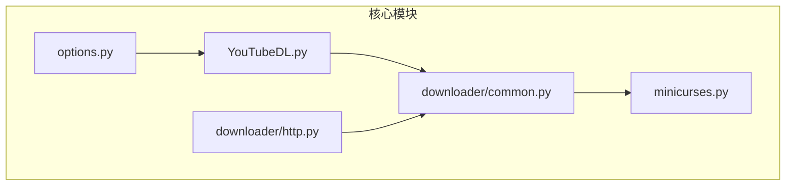
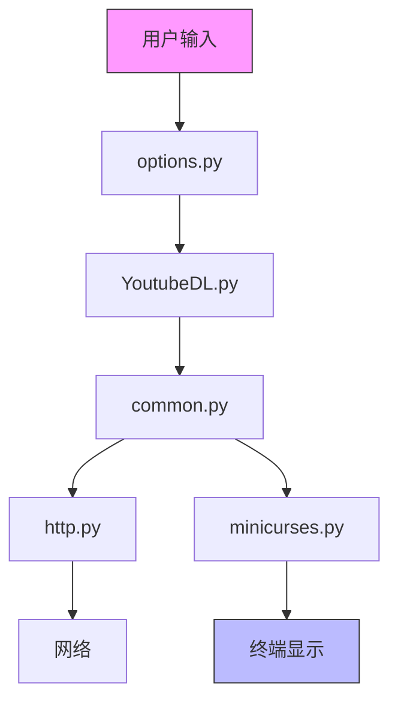
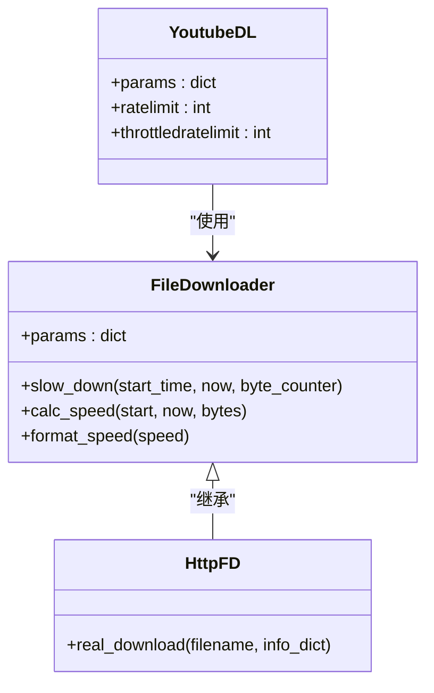
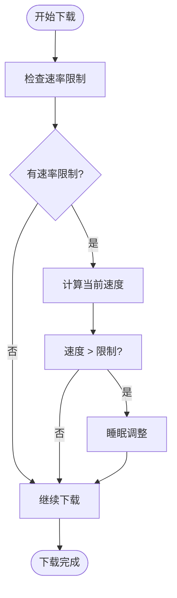
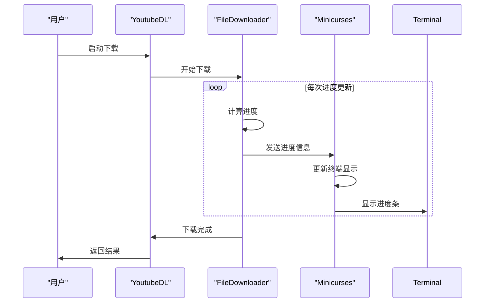
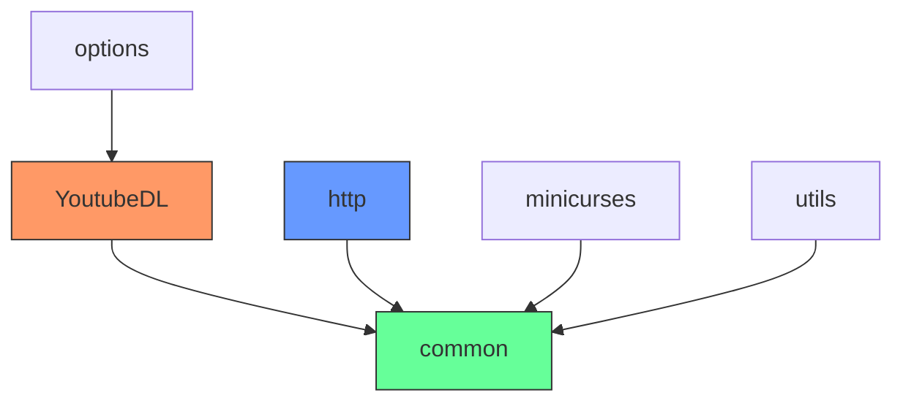

# 下载速度控制

<cite>
**本文档引用的文件**
- [YoutubeDL.py](file://yt_dlp/YoutubeDL.py)
- [common.py](file://yt_dlp/downloader/common.py)
- [minicurses.py](file://yt_dlp/minicurses.py)
- [options.py](file://yt_dlp/options.py)
- [http.py](file://yt_dlp/downloader/http.py)
</cite>

## 目录
1. [简介](#简介)
2. [项目结构](#项目结构)
3. [核心组件](#核心组件)
4. [架构概述](#架构概述)
5. [详细组件分析](#详细组件分析)
6. [依赖分析](#依赖分析)
7. [性能考虑](#性能考虑)
8. [故障排除指南](#故障排除指南)
9. [结论](#结论)

## 简介
yt-dlp 是一个功能强大的命令行程序，用于从 YouTube 和其他网站下载视频。本文档重点介绍其下载速度控制功能，包括带宽限制、速率调节和实时进度显示。通过分析核心组件，我们将深入了解全局和局部速率限制的实现机制、流量整形算法以及在 TTY 交互模式下实时显示下载速度和进度信息的方法。

## 项目结构
yt-dlp 的项目结构清晰，主要组件分布在不同的模块中。下载速度控制功能主要涉及以下几个核心文件：

**Diagram sources**
- [YoutubeDL.py](file://yt_dlp/YoutubeDL.py)
- [common.py](file://yt_dlp/downloader/common.py)
- [minicurses.py](file://yt_dlp/minicurses.py)
- [options.py](file://yt_dlp/options.py)
- [http.py](file://yt_dlp/downloader/http.py)

**Section sources**
- [YoutubeDL.py](file://yt_dlp/YoutubeDL.py)
- [common.py](file://yt_dlp/downloader/common.py)
- [minicurses.py](file://yt_dlp/minicurses.py)
- [options.py](file://yt_dlp/options.py)
- [http.py](file://yt_dlp/downloader/http.py)

## 核心组件
yt-dlp 的下载速度控制功能由多个核心组件协同工作。主要组件包括：

- **YoutubeDL.py**: 主控制器，负责协调下载过程和参数管理
- **common.py**: 下载器基类，包含流量整形算法和速度监控逻辑
- **minicurses.py**: TTY 交互界面，负责实时显示下载进度和速度
- **options.py**: 命令行选项解析，处理用户输入的速率限制参数
- **http.py**: HTTP 下载器实现，具体执行下载和速率控制

**Section sources**
- [YoutubeDL.py](file://yt_dlp/YoutubeDL.py#L1-L100)
- [common.py](file://yt_dlp/downloader/common.py#L1-L50)
- [minicurses.py](file://yt_dlp/minicurses.py#L1-L30)
- [options.py](file://yt_dlp/options.py#L961-L985)
- [http.py](file://yt_dlp/downloader/http.py#L1-L50)

## 架构概述
yt-dlp 的下载速度控制架构采用分层设计，从用户输入到实际下载执行，各组件协同工作。

**Diagram sources**
- [options.py](file://yt_dlp/options.py#L961-L985)
- [YoutubeDL.py](file://yt_dlp/YoutubeDL.py#L510-L511)
- [common.py](file://yt_dlp/downloader/common.py#L50-L51)
- [http.py](file://yt_dlp/downloader/http.py#L200-L211)
- [minicurses.py](file://yt_dlp/minicurses.py#L1-L183)

## 详细组件分析

### 全局与局部速率限制机制
yt-dlp 提供了灵活的速率限制机制，支持全局和局部两种模式。全局速率限制通过 `ratelimit` 参数设置，而局部限制则可以在特定下载任务中覆盖全局设置。

**Diagram sources**
- [YoutubeDL.py](file://yt_dlp/YoutubeDL.py#L510-L511)
- [common.py](file://yt_dlp/downloader/common.py#L200-L211)
- [http.py](file://yt_dlp/downloader/http.py#L272-L274)

#### 流量整形算法
yt-dlp 的流量整形算法基于时间控制，通过动态调整下载间隔来实现速率限制。算法核心是 `slow_down` 方法，它计算当前下载速度并与限制值比较，必要时进行睡眠以控制速率。

**Diagram sources**
- [common.py](file://yt_dlp/downloader/common.py#L200-L219)

#### 速度监控与进度显示
yt-dlp 使用 `minicurses.py` 模块实现在 TTY 交互模式下的实时进度显示。该模块通过控制终端光标位置和覆盖输出来实现动态更新的进度条。

**Diagram sources**
- [common.py](file://yt_dlp/downloader/common.py#L311-L356)
- [minicurses.py](file://yt_dlp/minicurses.py#L146-L181)

## 依赖分析
yt-dlp 的下载速度控制功能依赖于多个内部组件的协同工作。以下是主要依赖关系：

**Diagram sources**
- [YoutubeDL.py](file://yt_dlp/YoutubeDL.py)
- [common.py](file://yt_dlp/downloader/common.py)
- [http.py](file://yt_dlp/downloader/http.py)
- [minicurses.py](file://yt_dlp/minicurses.py)
- [options.py](file://yt_dlp/options.py)

## 性能考虑
下载速度控制对系统资源消耗和用户体验有重要影响。yt-dlp 在设计时考虑了以下性能因素：

- **CPU 使用率**: 通过合理的睡眠间隔减少 CPU 占用
- **内存使用**: 动态调整缓冲区大小以优化内存使用
- **网络效率**: 智能的重试机制和连接管理
- **用户体验**: 实时进度显示和友好的错误提示

这些考虑确保了在限制下载速度的同时，保持良好的系统性能和用户体验。

## 故障排除指南
在使用下载速度控制功能时，可能会遇到以下常见问题：

- **速率限制不生效**: 检查参数是否正确设置，确认没有被其他设置覆盖
- **进度显示异常**: 确认终端支持 ANSI 转义序列
- **下载速度不稳定**: 检查网络连接，考虑调整缓冲区大小
- **内存占用过高**: 尝试禁用缓冲区自动调整功能

通过合理配置参数和理解系统行为，可以有效解决这些问题。

## 结论
yt-dlp 的下载速度控制功能通过精心设计的架构和算法，提供了灵活而强大的带宽管理能力。从全局速率限制到局部调整，从流量整形到实时显示，各组件协同工作，为用户提供了优秀的下载体验。理解这些机制有助于更好地利用 yt-dlp 的功能，优化下载策略，平衡系统资源消耗和用户体验。