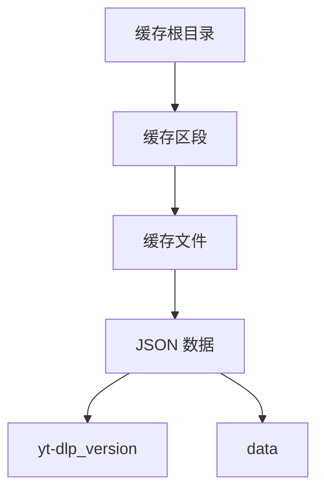
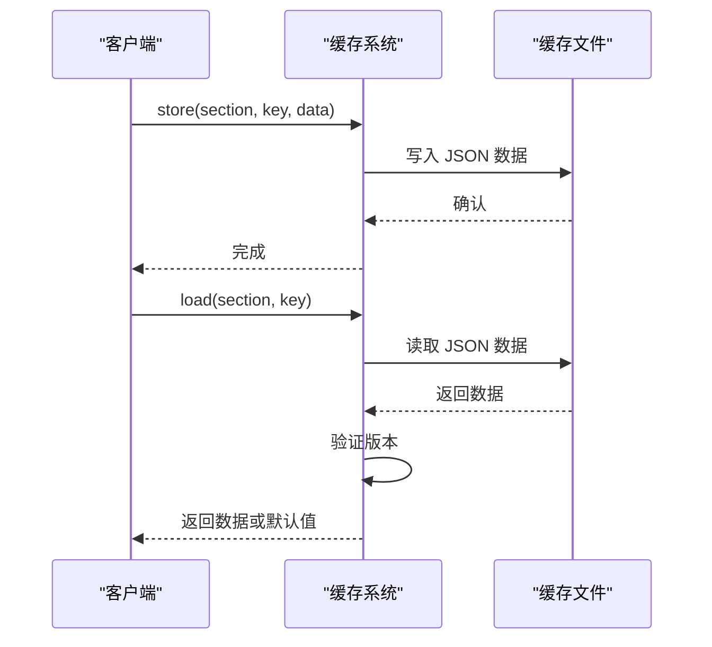
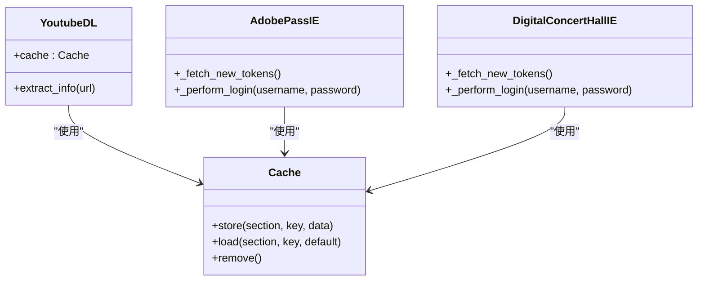
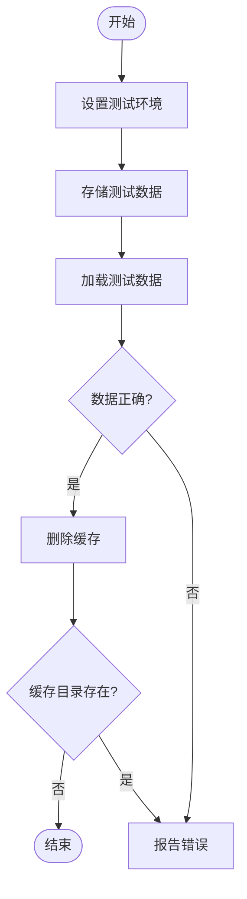
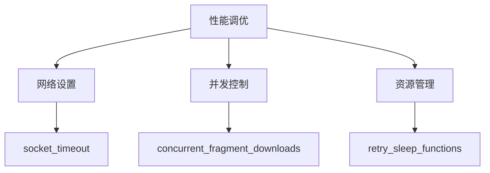

# 性能与缓存

<cite>
**本文档中引用的文件**  
- [cache.py](file://yt_dlp/cache.py#L1-L91)
- [YoutubeDL.py](file://yt_dlp/YoutubeDL.py#L1-L799)
- [test_cache.py](file://test/test_cache.py#L1-L57)
- [adobepass.py](file://yt_dlp/extractor/adobepass.py#L1460-L1659)
- [brightcove.py](file://yt_dlp/extractor/brightcove.py#L850-L948)
- [abematv.py](file://yt_dlp/extractor/abematv.py#L130-L329)
- [digitalconcerthall.py](file://yt_dlp/extractor/digitalconcerthall.py#L95-L285)
- [options.py](file://yt_dlp/options.py#L1-L200)
- [fragment.py](file://yt_dlp/downloader/fragment.py#L364-L525)
</cite>

## 目录
1. [简介](#简介)
2. [缓存存储结构](#缓存存储结构)
3. [过期策略与访问模式](#过期策略与访问模式)
4. [缓存集成与调用逻辑](#缓存集成与调用逻辑)
5. [缓存机制验证](#缓存机制验证)
6. [性能调优建议](#性能调优建议)
7. [结论](#结论)

## 简介
yt-dlp 是一个功能强大的视频下载工具，其性能优化与缓存机制在提升下载效率和减少服务器请求方面发挥着关键作用。本文档深入探讨了 yt-dlp 的缓存系统，重点分析了 `cache.py` 的实现细节，包括缓存的存储结构、过期策略和访问模式。通过 `test/test_cache.py` 中的测试用例，验证了缓存机制的正确性和可靠性。同时，结合 `YoutubeDL.py` 中的调用逻辑，展示了缓存与其他组件的集成方式，并提供了网络设置、并发控制和资源管理方面的性能调优建议。

## 缓存存储结构
yt-dlp 的缓存系统通过 `Cache` 类实现，其存储结构设计合理，能够高效地管理缓存数据。缓存数据以 JSON 格式存储在文件系统中，文件路径由 `_get_cache_fn` 方法生成。该方法结合了缓存根目录、缓存区段（section）和键（key）来构建唯一的文件路径。缓存根目录默认位于 `~/.cache/yt-dlp`，也可以通过 `cachedir` 参数自定义。缓存文件的命名规则为 `{key}.{dtype}`，其中 `dtype` 默认为 `json`。

**图源**  
- [cache.py](file://yt_dlp/cache.py#L1-L91)

**本节来源**  
- [cache.py](file://yt_dlp/cache.py#L1-L91)

## 过期策略与访问模式
缓存的过期策略通过 `min_ver` 参数实现，确保缓存数据与 yt-dlp 版本兼容。当加载缓存数据时，`_validate` 方法会检查缓存数据中的 `yt-dlp_version`，如果版本过旧，则丢弃该缓存数据。访问模式方面，`Cache` 类提供了 `store` 和 `load` 方法，分别用于存储和加载缓存数据。`store` 方法将数据以 JSON 格式写入文件，`load` 方法则从文件中读取并解析 JSON 数据。如果缓存文件不存在或读取失败，则返回默认值。

**图源**  
- [cache.py](file://yt_dlp/cache.py#L1-L91)

**本节来源**  
- [cache.py](file://yt_dlp/cache.py#L1-L91)

## 缓存集成与调用逻辑
缓存系统在 `YoutubeDL` 类中被实例化，并通过 `self.cache` 属性提供给其他组件使用。多个提取器（extractor）利用缓存来存储和获取认证令牌、策略密钥等信息，从而避免重复的网络请求。例如，`adobepass.py` 中的 `requestor_info` 和 `digitalconcerthall.py` 中的 `tokens` 都通过缓存进行管理。`brightcove.py` 中的 `policy_key` 也通过缓存存储，以减少对 Brightcove API 的调用次数。

**图源**  
- [YoutubeDL.py](file://yt_dlp/YoutubeDL.py#L1-L799)
- [adobepass.py](file://yt_dlp/extractor/adobepass.py#L1460-L1659)
- [digitalconcerthall.py](file://yt_dlp/extractor/digitalconcerthall.py#L95-L285)

**本节来源**  
- [YoutubeDL.py](file://yt_dlp/YoutubeDL.py#L1-L799)
- [adobepass.py](file://yt_dlp/extractor/adobepass.py#L1460-L1659)
- [digitalconcerthall.py](file://yt_dlp/extractor/digitalconcerthall.py#L95-L285)

## 缓存机制验证
`test/test_cache.py` 中的测试用例验证了缓存机制的正确性和可靠性。测试用例 `test_cache` 创建了一个 `FakeYDL` 实例，并使用该实例初始化 `Cache` 对象。通过存储和加载一个简单的字典对象，验证了缓存的读写功能。此外，测试用例还验证了缓存的删除功能，确保缓存目录在调用 `remove` 方法后被正确删除。

**图源**  
- [test_cache.py](file://test/test_cache.py#L1-L57)

**本节来源**  
- [test_cache.py](file://test/test_cache.py#L1-L57)

## 性能调优建议
为了优化 yt-dlp 的性能，可以调整以下配置选项：
- **网络设置**：通过 `socket_timeout` 参数设置套接字超时时间，避免因网络延迟导致的长时间等待。
- **并发控制**：通过 `concurrent_fragment_downloads` 参数设置并发片段下载的数量，提高下载速度。
- **资源管理**：通过 `retry_sleep_functions` 参数设置重试睡眠函数，避免因频繁重试导致的资源浪费。

**图源**  
- [options.py](file://yt_dlp/options.py#L1-L200)
- [fragment.py](file://yt_dlp/downloader/fragment.py#L364-L525)

**本节来源**  
- [options.py](file://yt_dlp/options.py#L1-L200)
- [fragment.py](file://yt_dlp/downloader/fragment.py#L364-L525)

## 结论
yt-dlp 的缓存机制通过合理的存储结构、有效的过期策略和高效的访问模式，显著提升了下载性能并减少了服务器请求。通过 `test/test_cache.py` 中的测试用例，验证了缓存机制的正确性和可靠性。结合 `YoutubeDL.py` 中的调用逻辑，展示了缓存与其他组件的紧密集成。通过调整网络设置、并发控制和资源管理方面的配置选项，可以进一步优化 yt-dlp 的性能。