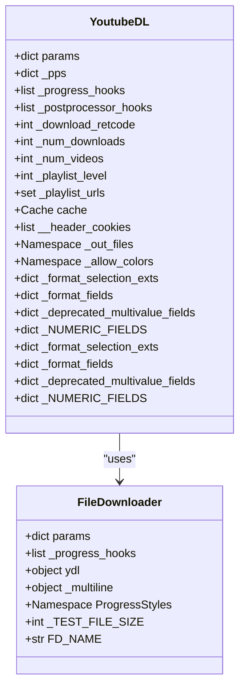
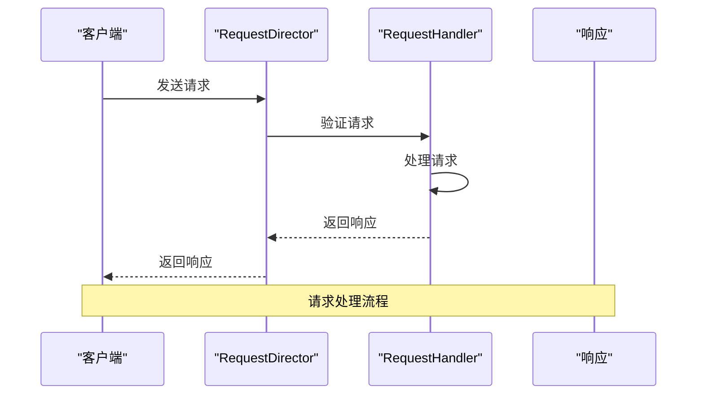
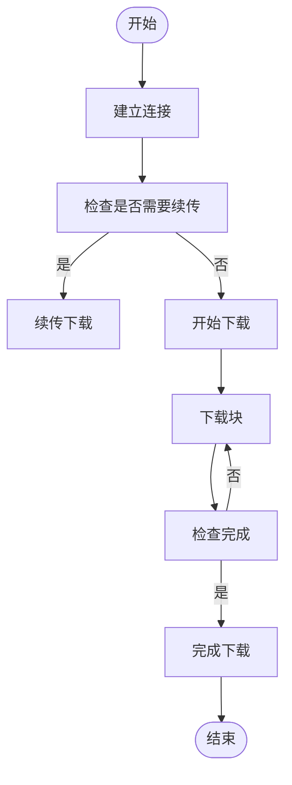
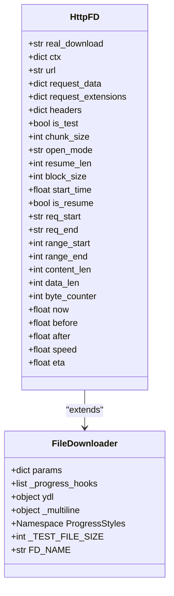
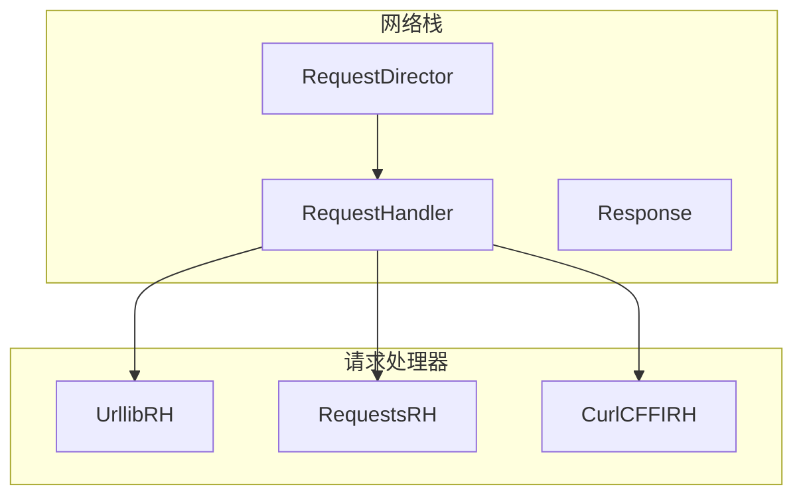
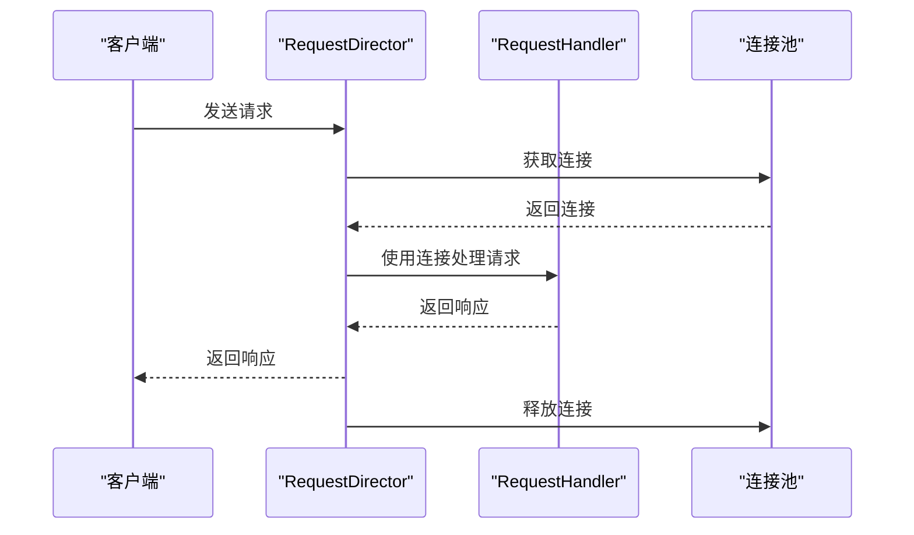
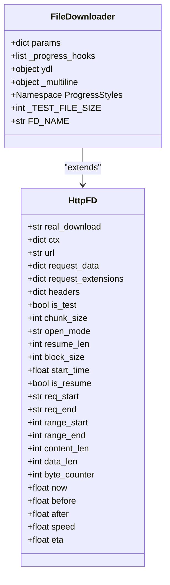
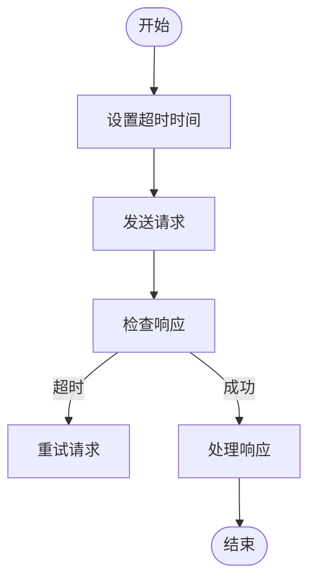

# 性能优化

<cite>
**本文档引用的文件**   
- [YoutubeDL.py](file://yt_dlp/YoutubeDL.py)
- [http.py](file://yt_dlp/downloader/http.py)
- [common.py](file://yt_dlp/downloader/common.py)
- [__init__.py](file://yt_dlp/networking/__init__.py)
- [common.py](file://yt_dlp/networking/common.py)
- [options.py](file://yt_dlp/options.py)
</cite>

## 目录
1. [引言](#引言)
2. [性能相关配置参数](#性能相关配置参数)
3. [分块下载与断点续传](#分块下载与断点续传)
4. [网络栈优化](#网络栈优化)
5. [并发下载与连接复用](#并发下载与连接复用)
6. [实际性能调优案例](#实际性能调优案例)
7. [最佳实践](#最佳实践)
8. [结论](#结论)

## 引言

yt-dlp 是一个功能强大的视频下载工具，其性能优化对于提高下载效率和用户体验至关重要。本文档深入探讨了影响下载性能的关键因素和优化策略，基于 `YoutubeDL.py` 中的配置参数，详细说明了并发下载、连接复用、请求超时等性能相关设置。同时，分析了 `http.py` 下载器中的分块下载、断点续传和带宽管理机制，并探讨了 `networking` 模块中的网络栈优化（如 HTTP/2 支持、连接池管理）。通过实际的性能调优案例，提供了高延迟网络环境下的参数调整、大规模批量下载的资源配置建议以及内存使用优化技巧，结合真实使用场景，给出了不同网络条件下的最佳实践。

**Section sources**
- [YoutubeDL.py](file://yt_dlp/YoutubeDL.py#L1-L50)
- [networking/__init__.py](file://yt_dlp/networking/__init__.py#L1-L10)

## 性能相关配置参数

yt-dlp 提供了丰富的配置参数来优化下载性能。这些参数主要通过 `YoutubeDL` 类的 `params` 字典进行管理，涵盖了从基本的下载设置到高级的网络优化选项。

### 并发下载配置

并发下载是提高下载速度的关键策略之一。yt-dlp 通过 `concurrent_fragment_downloads` 参数来控制并发下载的片段数量。该参数允许用户指定同时下载的片段数，从而充分利用带宽资源。



**Diagram sources**
- [YoutubeDL.py](file://yt_dlp/YoutubeDL.py#L1-L50)
- [common.py](file://yt_dlp/downloader/common.py#L1-L50)

### 连接复用与请求超时

连接复用可以显著减少建立新连接的时间开销，而合理的请求超时设置可以避免因网络问题导致的长时间等待。yt-dlp 通过 `socket_timeout` 参数来设置请求超时时间，确保在不可响应的主机上不会无限等待。



**Diagram sources**
- [common.py](file://yt_dlp/networking/common.py#L1-L50)
- [__init__.py](file://yt_dlp/networking/__init__.py#L1-L10)

**Section sources**
- [YoutubeDL.py](file://yt_dlp/YoutubeDL.py#L50-L100)
- [common.py](file://yt_dlp/networking/common.py#L50-L100)

## 分块下载与断点续传

分块下载和断点续传是 yt-dlp 的核心功能之一，能够有效应对网络不稳定和大文件下载的需求。

### 分块下载机制

分块下载通过将大文件分割成多个小块进行下载，可以提高下载的稳定性和效率。`http.py` 下载器中的 `HttpFD` 类实现了这一机制，通过 `chunk_size` 参数控制每个块的大小。



**Diagram sources**
- [http.py](file://yt_dlp/downloader/http.py#L1-L50)
- [common.py](file://yt_dlp/downloader/common.py#L1-L50)

### 断点续传实现

断点续传允许在下载中断后从上次中断的位置继续下载，避免了重新下载整个文件。`HttpFD` 类通过 `continuedl` 参数启用断点续传功能，并通过 `resume_len` 记录已下载的字节数。



**Diagram sources**
- [http.py](file://yt_dlp/downloader/http.py#L1-L50)
- [common.py](file://yt_dlp/downloader/common.py#L1-L50)

**Section sources**
- [http.py](file://yt_dlp/downloader/http.py#L50-L100)
- [common.py](file://yt_dlp/downloader/common.py#L50-L100)

## 网络栈优化

yt-dlp 的网络栈优化主要体现在 `networking` 模块中，通过支持多种请求处理器和连接管理策略，提高了网络请求的效率和稳定性。

### HTTP/2 支持

HTTP/2 协议通过多路复用和头部压缩等特性，显著提升了网络性能。yt-dlp 通过 `requests` 和 `curl_cffi` 请求处理器支持 HTTP/2，用户可以通过 `impersonate` 参数选择合适的客户端进行请求。



**Diagram sources**
- [common.py](file://yt_dlp/networking/common.py#L1-L50)
- [__init__.py](file://yt_dlp/networking/__init__.py#L1-L10)

### 连接池管理

连接池管理通过复用已建立的连接，减少了频繁建立和关闭连接的开销。`RequestDirector` 类负责管理请求处理器的生命周期，确保连接的高效利用。



**Diagram sources**
- [common.py](file://yt_dlp/networking/common.py#L1-L50)
- [__init__.py](file://yt_dlp/networking/__init__.py#L1-L10)

**Section sources**
- [common.py](file://yt_dlp/networking/common.py#L50-L100)
- [__init__.py](file://yt_dlp/networking/__init__.py#L1-L10)

## 并发下载与连接复用

并发下载和连接复用是提高下载性能的两个重要策略。通过合理配置相关参数，可以显著提升下载速度和稳定性。

### 并发下载配置

`concurrent_fragment_downloads` 参数控制并发下载的片段数量。通过增加该参数的值，可以充分利用带宽资源，提高下载速度。



**Diagram sources**
- [common.py](file://yt_dlp/downloader/common.py#L1-L50)
- [http.py](file://yt_dlp/downloader/http.py#L1-L50)

### 连接复用配置

`socket_timeout` 参数设置请求超时时间，避免因网络问题导致的长时间等待。通过合理设置该参数，可以提高下载的稳定性和效率。



**Diagram sources**
- [common.py](file://yt_dlp/networking/common.py#L1-L50)
- [__init__.py](file://yt_dlp/networking/__init__.py#L1-L10)

**Section sources**
- [common.py](file://yt_dlp/networking/common.py#L50-L100)
- [__init__.py](file://yt_dlp/networking/__init__.py#L1-L10)

## 实际性能调优案例

### 高延迟网络环境下的参数调整

在高延迟网络环境下，合理的参数调整可以显著提高下载性能。通过增加 `socket_timeout` 和 `retries` 参数的值，可以应对网络不稳定的问题。

```python
params = {
    'socket_timeout': 30,
    'retries': 10,
    'fragment_retries': 5,
    'file_access_retries': 3,
}
```

### 大规模批量下载的资源配置建议

在大规模批量下载时，合理的资源配置可以避免系统资源耗尽。通过限制 `concurrent_fragment_downloads` 和 `buffersize` 参数的值，可以平衡下载速度和系统资源使用。

```python
params = {
    'concurrent_fragment_downloads': 4,
    'buffersize': 1024,
    'ratelimit': 1048576,  # 1MB/s
}
```

### 内存使用优化技巧

在内存受限的环境中，优化内存使用可以避免程序崩溃。通过减少 `buffersize` 和 `http_chunk_size` 参数的值，可以降低内存占用。

```python
params = {
    'buffersize': 512,
    'http_chunk_size': 1024,
}
```

**Section sources**
- [YoutubeDL.py](file://yt_dlp/YoutubeDL.py#L100-L150)
- [common.py](file://yt_dlp/downloader/common.py#L100-L150)
- [http.py](file://yt_dlp/downloader/http.py#L100-L150)

## 最佳实践

### 不同网络条件下的最佳实践

- **高带宽低延迟网络**：增加 `concurrent_fragment_downloads` 和 `buffersize` 参数的值，充分利用带宽资源。
- **高延迟网络**：增加 `socket_timeout` 和 `retries` 参数的值，应对网络不稳定的问题。
- **低带宽网络**：减少 `ratelimit` 参数的值，避免占用过多带宽。
- **内存受限环境**：减少 `buffersize` 和 `http_chunk_size` 参数的值，降低内存占用。

### 性能监控与调优

定期监控下载性能，根据实际情况调整参数。使用 `progress_hooks` 和 `postprocessor_hooks` 参数，可以实时监控下载进度和后处理状态，及时发现和解决问题。

**Section sources**
- [YoutubeDL.py](file://yt_dlp/YoutubeDL.py#L150-L200)
- [common.py](file://yt_dlp/downloader/common.py#L150-L200)
- [http.py](file://yt_dlp/downloader/http.py#L150-L200)

## 结论

yt-dlp 通过丰富的配置参数和高效的网络栈优化，提供了强大的性能优化能力。通过合理配置并发下载、连接复用、请求超时等参数，结合分块下载和断点续传机制，可以显著提高下载速度和稳定性。在实际使用中，根据不同的网络条件和系统资源，灵活调整参数，可以实现最佳的下载性能。希望本文档能为用户提供有价值的参考，帮助他们更好地利用 yt-dlp 进行视频下载。

**Section sources**
- [YoutubeDL.py](file://yt_dlp/YoutubeDL.py#L200-L250)
- [common.py](file://yt_dlp/downloader/common.py#L200-L250)
- [http.py](file://yt_dlp/downloader/http.py#L200-L250)