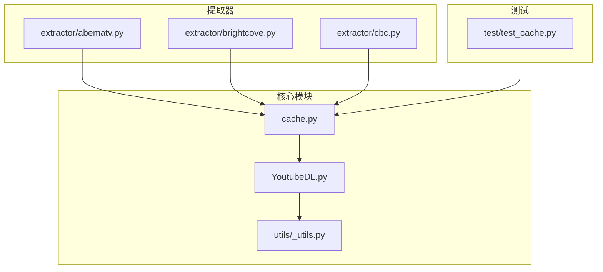
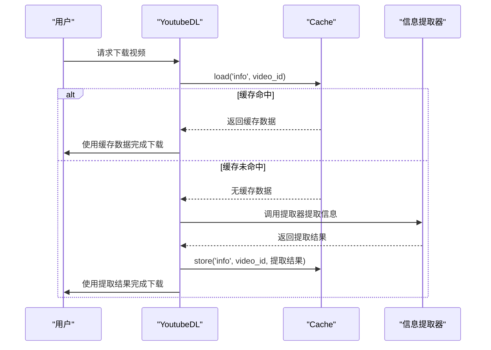
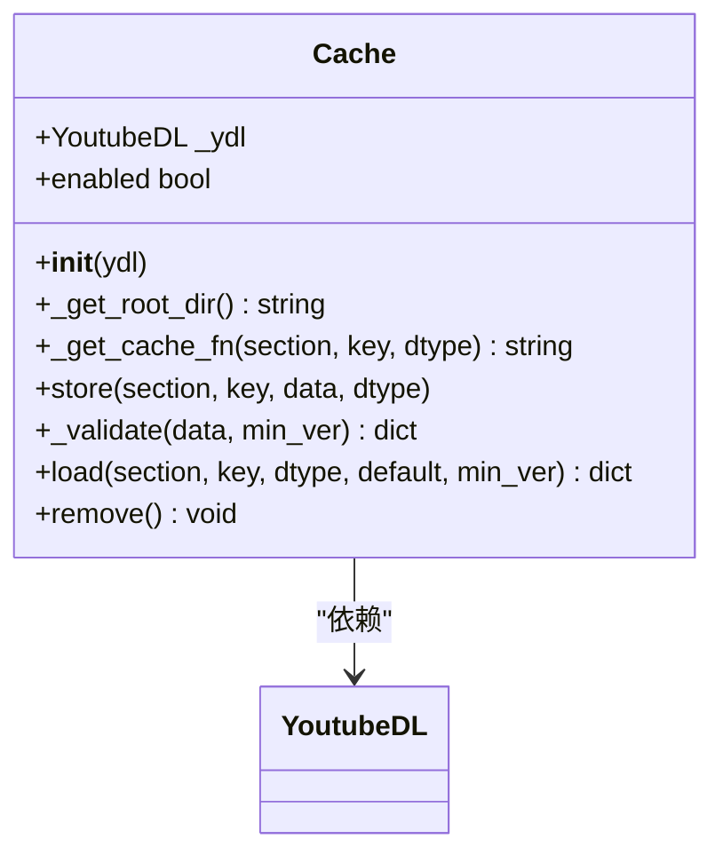
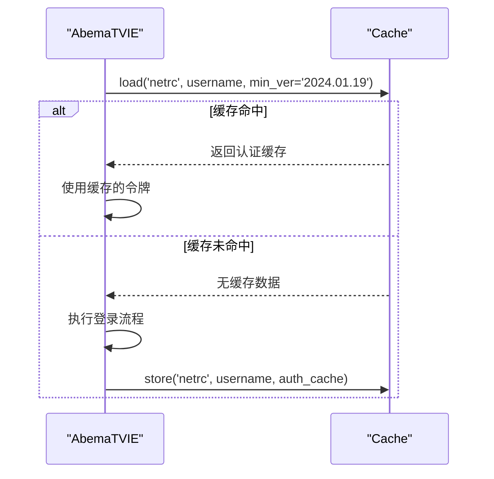
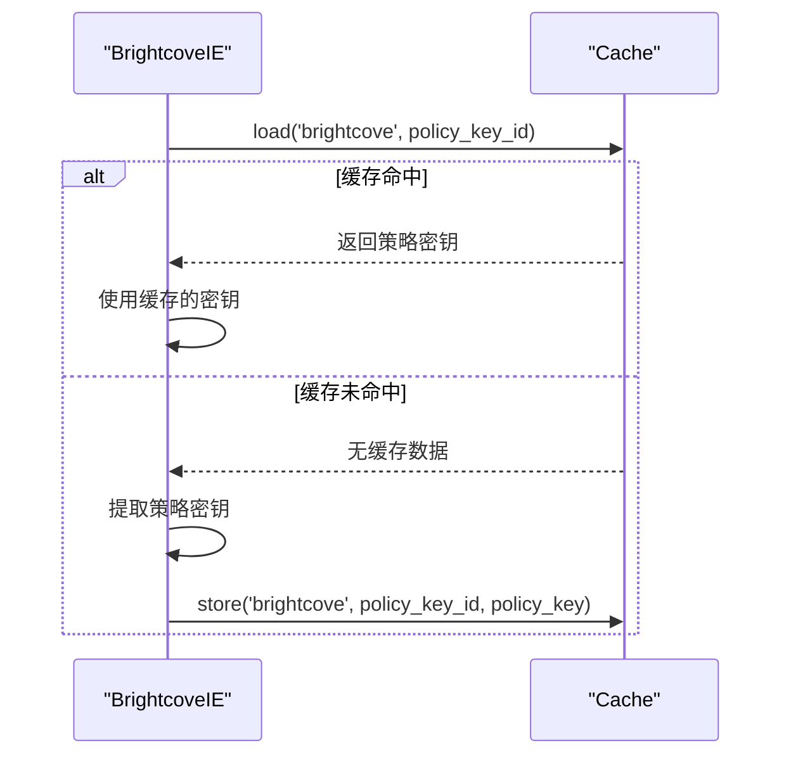
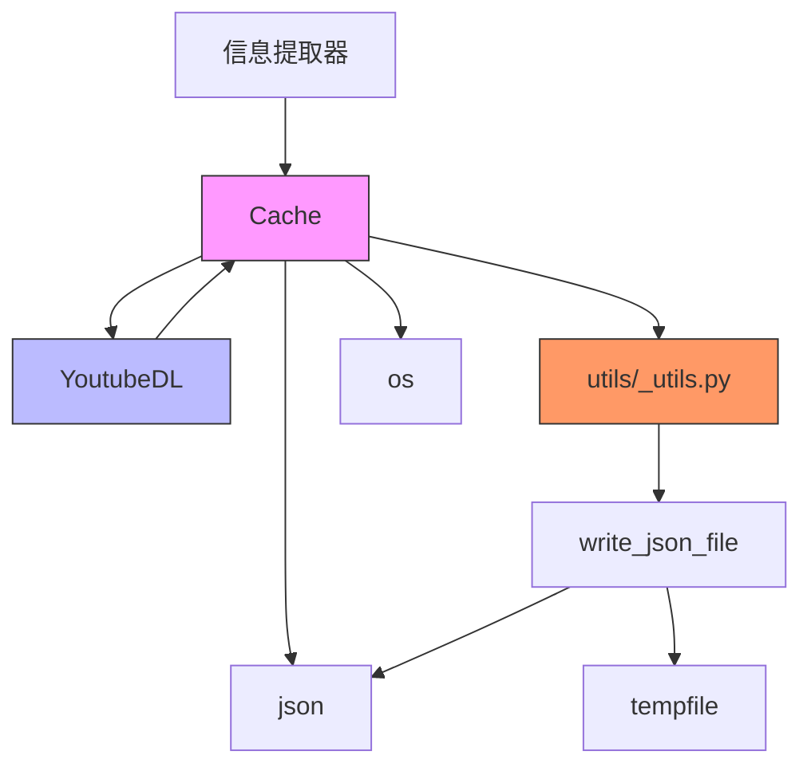

# 缓存机制

<cite>
**本文档中引用的文件**  
- [cache.py](file://yt_dlp/cache.py)
- [YoutubeDL.py](file://yt_dlp/YoutubeDL.py)
- [test_cache.py](file://test/test_cache.py)
- [options.py](file://yt_dlp/options.py)
- [utils/_utils.py](file://yt_dlp/utils/_utils.py)
- [extractor/abematv.py](file://yt_dlp/extractor/abematv.py)
- [extractor/brightcove.py](file://yt_dlp/extractor/brightcove.py)
- [extractor/cbc.py](file://yt_dlp/extractor/cbc.py)
</cite>

## 目录
1. [简介](#简介)
2. [项目结构](#项目结构)
3. [核心组件](#核心组件)
4. [架构概述](#架构概述)
5. [详细组件分析](#详细组件分析)
6. [依赖分析](#依赖分析)
7. [性能考虑](#性能考虑)
8. [故障排除指南](#故障排除指南)
9. [结论](#结论)

## 简介
yt-dlp 是一个功能强大的命令行程序，用于从 YouTube 和其他网站下载视频。其缓存机制是提高性能和减少对源网站请求压力的关键组件。本文档详细介绍了 yt-dlp 的缓存机制，重点分析了 `cache.py` 文件中的实现原理，包括缓存数据的存储结构、过期策略、读写访问模式以及在信息提取流程中的集成点。

## 项目结构
yt-dlp 项目的目录结构清晰地组织了其各个组件。核心功能位于 `yt_dlp` 目录下，其中 `cache.py` 文件实现了缓存机制，`YoutubeDL.py` 文件是主下载器类，负责协调整个下载过程。测试文件位于 `test` 目录下，包括针对缓存机制的单元测试 `test_cache.py`。

**图示来源**
- [cache.py](file://yt_dlp/cache.py)
- [YoutubeDL.py](file://yt_dlp/YoutubeDL.py)
- [test_cache.py](file://test/test_cache.py)

**本节来源**
- [cache.py](file://yt_dlp/cache.py)
- [YoutubeDL.py](file://yt_dlp/YoutubeDL.py)
- [test/test_cache.py](file://test/test_cache.py)

## 核心组件
yt-dlp 的缓存机制主要由 `Cache` 类实现，该类位于 `yt_dlp/cache.py` 文件中。`Cache` 类提供了存储、加载和删除缓存数据的方法。`YoutubeDL` 类在初始化时创建 `Cache` 实例，并通过 `cache` 属性访问缓存功能。缓存机制通过存储提取的视频信息来加速重复下载任务，并减少对源网站的请求压力。

**本节来源**
- [cache.py](file://yt_dlp/cache.py#L1-L91)
- [YoutubeDL.py](file://yt_dlp/YoutubeDL.py#L1-L799)

## 架构概述
yt-dlp 的缓存系统在信息提取流程中扮演着重要角色。当用户请求下载视频时，`YoutubeDL` 类会首先尝试从缓存中加载已提取的信息。如果缓存中存在有效数据，则直接使用缓存数据，避免了重新提取的开销。如果缓存中没有数据或数据已过期，则进行正常的提取流程，并将提取结果存储到缓存中供后续使用。

**图示来源**
- [cache.py](file://yt_dlp/cache.py#L1-L91)
- [YoutubeDL.py](file://yt_dlp/YoutubeDL.py#L1-L799)

## 详细组件分析

### Cache 类分析
`Cache` 类是 yt-dlp 缓存机制的核心，提供了存储、加载和删除缓存数据的方法。

#### 类图

**图示来源**
- [cache.py](file://yt_dlp/cache.py#L1-L91)

#### 方法说明
- **`__init__(self, ydl)`**: 初始化 `Cache` 实例，接收 `YoutubeDL` 对象作为参数。
- **`_get_root_dir(self)`**: 获取缓存根目录，优先使用 `cachedir` 参数，否则使用默认路径 `~/.cache/yt-dlp`。
- **`_get_cache_fn(self, section, key, dtype)`**: 根据给定的节、键和数据类型生成缓存文件名。
- **`enabled`**: 属性，判断缓存是否启用。
- **`store(self, section, key, data, dtype='json')`**: 将数据存储到缓存中，数据以 JSON 格式保存。
- **`_validate(self, data, min_ver)`**: 验证缓存数据的有效性，检查版本兼容性。
- **`load(self, section, key, dtype='json', default=None, *, min_ver=None)`**: 从缓存中加载数据，如果数据无效则返回默认值。
- **`remove(self)`**: 删除整个缓存目录。

**本节来源**
- [cache.py](file://yt_dlp/cache.py#L1-L91)

### 缓存使用模式分析
多个提取器在实现中使用了缓存机制来优化性能和用户体验。

#### AbemaTV 提取器中的缓存使用
AbemaTV 提取器使用缓存来存储用户认证令牌，避免每次下载都需要重新登录。

**图示来源**
- [extractor/abematv.py](file://yt_dlp/extractor/abematv.py#L120-L319)

#### Brightcove 提取器中的缓存使用
Brightcove 提取器使用缓存来存储策略密钥，避免重复提取。

**图示来源**
- [extractor/brightcove.py](file://yt_dlp/extractor/brightcove.py#L850-L948)

**本节来源**
- [extractor/abematv.py](file://yt_dlp/extractor/abematv.py#L120-L319)
- [extractor/brightcove.py](file://yt_dlp/extractor/brightcove.py#L850-L948)
- [extractor/cbc.py](file://yt_dlp/extractor/cbc.py#L620-L819)

## 依赖分析
yt-dlp 的缓存机制依赖于多个核心组件和工具函数。

**图示来源**
- [cache.py](file://yt_dlp/cache.py)
- [YoutubeDL.py](file://yt_dlp/YoutubeDL.py)
- [utils/_utils.py](file://yt_dlp/utils/_utils.py)

**本节来源**
- [cache.py](file://yt_dlp/cache.py)
- [YoutubeDL.py](file://yt_dlp/YoutubeDL.py)
- [utils/_utils.py](file://yt_dlp/utils/_utils.py)

## 性能考虑
yt-dlp 的缓存机制通过以下方式提高性能：
1. **减少网络请求**：缓存提取的视频信息，避免重复向源网站发送请求。
2. **加速下载流程**：对于已缓存的视频，可以直接使用缓存数据，跳过信息提取步骤。
3. **降低服务器负载**：减少对源网站的请求压力，有助于维护良好的网络生态。

然而，缓存机制也可能带来一些性能影响：
1. **磁盘空间占用**：缓存数据会占用本地磁盘空间，需要定期清理。
2. **缓存一致性**：如果源网站上的视频信息发生变化，缓存数据可能变得过时。

## 故障排除指南
在使用 yt-dlp 缓存机制时，可能会遇到以下常见问题：

### 缓存未生效
- **检查 `cachedir` 参数**：确保 `cachedir` 参数正确设置，且目录可写。
- **检查缓存文件**：手动检查缓存目录，确认缓存文件是否正确生成。
- **查看调试信息**：启用 `--verbose` 参数，查看详细的调试信息，确认缓存操作是否被正确执行。

### 缓存数据过期
- **检查版本兼容性**：`_validate` 方法会检查缓存数据的版本，确保与当前 yt-dlp 版本兼容。
- **手动清理缓存**：使用 `--rm-cache-dir` 参数手动清理缓存目录，强制重新提取信息。

### 缓存目录管理
- **默认缓存目录**：`~/.cache/yt-dlp`
- **自定义缓存目录**：通过 `--cachedir` 参数指定自定义缓存目录。
- **清理缓存**：使用 `--rm-cache-dir` 参数清理缓存目录。

**本节来源**
- [cache.py](file://yt_dlp/cache.py#L1-L91)
- [options.py](file://yt_dlp/options.py#L1-L200)

## 结论
yt-dlp 的缓存机制是一个高效且实用的功能，通过存储提取的视频信息来加速重复下载任务，并减少对源网站的请求压力。`Cache` 类提供了完整的缓存管理功能，包括存储、加载和删除操作。多个提取器在实现中充分利用了缓存机制，优化了性能和用户体验。通过合理配置和管理缓存目录，用户可以最大限度地发挥缓存机制的优势，提高下载效率。