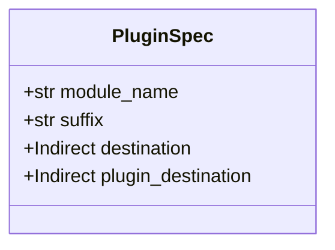
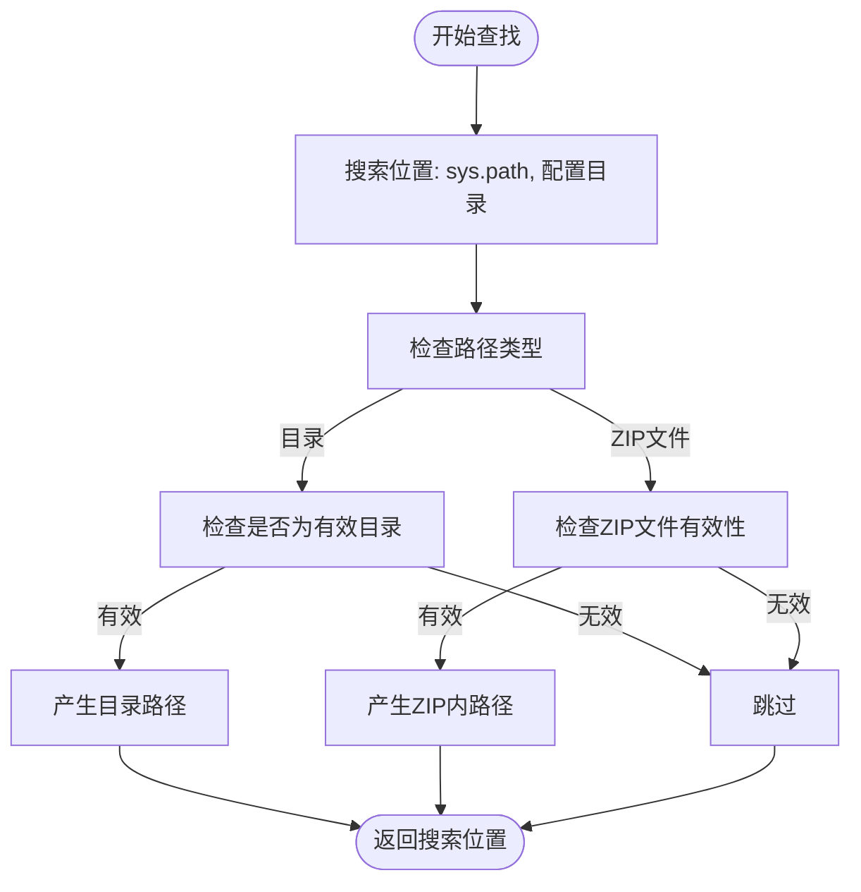
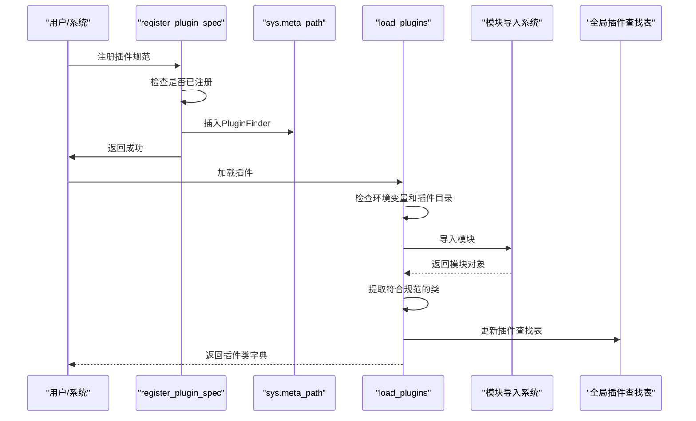
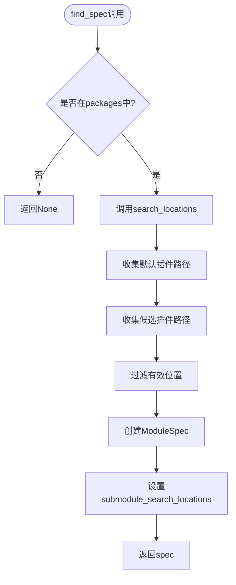
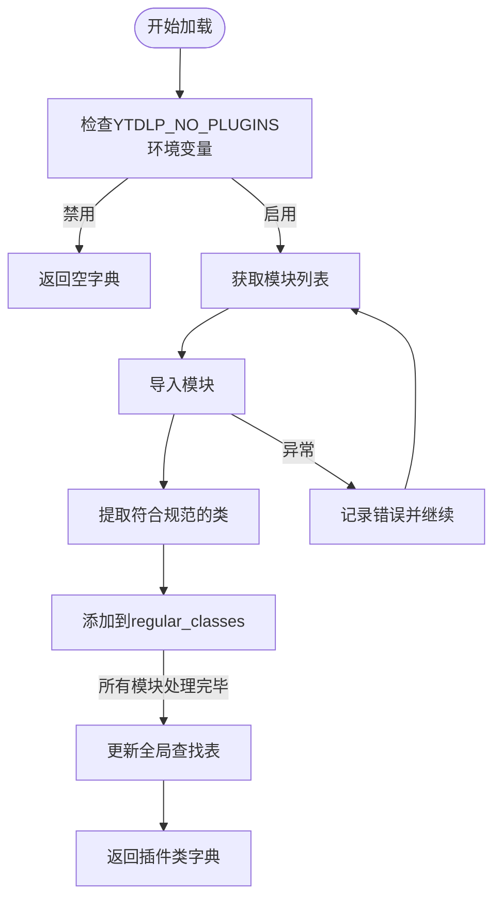
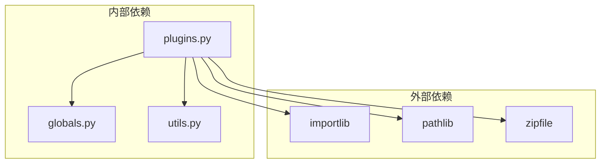

# 插件机制

<cite>
**本文档中引用的文件**   
- [plugins.py](file://yt_dlp/plugins.py)
- [globals.py](file://yt_dlp/globals.py)
- [test_plugins.py](file://test/test_plugins.py)
- [yt_dlp_plugins/extractor/normal.py](file://test/testdata/yt_dlp_plugins/extractor/normal.py)
- [yt_dlp_plugins/postprocessor/normal.py](file://test/testdata/yt_dlp_plugins/postprocessor/normal.py)
- [yt_dlp_plugins/extractor/zipped.py](file://test/testdata/zipped_plugins/yt_dlp_plugins/extractor/zipped.py)
- [yt_dlp_plugins/extractor/override.py](file://test/testdata/yt_dlp_plugins/extractor/override.py)
- [yt_dlp_plugins/extractor/_ignore.py](file://test/testdata/yt_dlp_plugins/extractor/_ignore.py)
- [postprocessor/__init__.py](file://yt_dlp/postprocessor/__init__.py)
</cite>

## 目录
1. [引言](#引言)
2. [核心组件](#核心组件)
3. [插件规范定义](#插件规范定义)
4. [插件查找机制](#插件查找机制)
5. [插件加载与注册流程](#插件加载与注册流程)
6. [详细组件分析](#详细组件分析)
7. [依赖分析](#依赖分析)
8. [性能考虑](#性能考虑)
9. [故障排除指南](#故障排除指南)
10. [结论](#结论)

## 引言
yt-dlp的插件机制提供了一套灵活的系统，允许用户扩展和自定义功能。该机制基于`plugins.py`实现，支持从多个位置加载插件，包括配置目录、PYTHONPATH以及zip压缩包。通过`PluginSpec`数据类定义插件规范，`PluginFinder`作为元路径查找器搜索插件位置，并通过`load_plugins`函数导入模块并提取符合命名规范的插件类。本文档将深入分析这一机制的实现细节。

**Section sources**
- [plugins.py](file://yt_dlp/plugins.py#L1-L50)
- [globals.py](file://yt_dlp/globals.py#L1-L10)

## 核心组件
yt-dlp插件系统的核心组件包括`PluginSpec`数据类、`PluginFinder`元路径查找器、`PluginLoader`加载器以及相关的全局变量。这些组件协同工作，实现了插件的发现、加载、注册和执行。系统通过`Indirect`包装器管理全局状态，确保线程安全和可变性控制。

**Section sources**
- [plugins.py](file://yt_dlp/plugins.py#L50-L100)
- [globals.py](file://yt_dlp/globals.py#L15-L30)

## 插件规范定义
`PluginSpec`数据类定义了插件的规范，包括模块名称、后缀和目标位置。这个数据类使用Python的`dataclasses`模块实现，包含四个关键字段：`module_name`指定插件模块的名称，`suffix`定义插件类名的后缀，`destination`指向主插件查找表，`plugin_destination`指向插件类型的特定查找表。

**Diagram sources**
- [plugins.py](file://yt_dlp/plugins.py#L40-L45)

**Section sources**
- [plugins.py](file://yt_dlp/plugins.py#L40-L45)

## 插件查找机制
`PluginFinder`类作为元路径查找器，在`sys.path`和配置目录中搜索插件位置。它实现了`importlib.abc.MetaPathFinder`接口，通过`find_spec`方法创建模块规范。查找器支持普通目录和zip压缩包中的插件，使用`dirs_in_zip`函数解析zip文件中的目录结构。

**Diagram sources**
- [plugins.py](file://yt_dlp/plugins.py#L100-L150)

**Section sources**
- [plugins.py](file://yt_dlp/plugins.py#L100-L150)

## 插件加载与注册流程
插件加载与注册流程由`register_plugin_spec`和`load_plugins`函数协同完成。注册过程将插件规范添加到`plugin_specs`并插入`PluginFinder`到`sys.meta_path`的开头。加载过程则导入模块并提取符合命名规范的插件类，将其添加到全局查找表中。

**Diagram sources**
- [plugins.py](file://yt_dlp/plugins.py#L200-L247)

**Section sources**
- [plugins.py](file://yt_dlp/plugins.py#L200-L247)

## 详细组件分析

### PluginSpec分析
`PluginSpec`是插件系统的核心数据结构，它定义了插件的完整规范。每个实例都包含模块名称、类名后缀以及两个目标位置引用。这种设计允许系统灵活地管理不同类型的插件，如提取器和后处理器。

**Section sources**
- [plugins.py](file://yt_dlp/plugins.py#L40-L45)

### PluginFinder分析
`PluginFinder`实现了Python的导入协议，作为元路径查找器工作。它通过`search_locations`方法收集所有可能的插件位置，包括用户配置目录、系统配置目录和PYTHONPATH中的目录。对于ZIP文件，它使用`dirs_in_zip`函数解析内部目录结构。

#### 查找流程图

**Diagram sources**
- [plugins.py](file://yt_dlp/plugins.py#L120-L150)

**Section sources**
- [plugins.py](file://yt_dlp/plugins.py#L120-L150)

### load_plugins函数分析
`load_plugins`函数负责实际的插件加载工作。它遍历指定模块中的所有子模块，导入它们，并提取符合命名规范的类。函数还处理兼容性模式，支持旧的插件系统通过`__init__.py`文件加载。

#### 加载流程

**Diagram sources**
- [plugins.py](file://yt_dlp/plugins.py#L180-L227)

**Section sources**
- [plugins.py](file://yt_dlp/plugins.py#L180-L227)

## 依赖分析
yt-dlp插件系统依赖于Python的标准库模块如`importlib`、`pathlib`和`zipfile`，以及项目内部的`globals`和`utils`模块。`Indirect`类提供了对全局状态的安全访问，而各种工具函数如`get_user_config_dirs`和`get_system_config_dirs`帮助确定插件的搜索路径。

**Diagram sources**
- [plugins.py](file://yt_dlp/plugins.py#L1-L30)
- [globals.py](file://yt_dlp/globals.py#L1-L30)

**Section sources**
- [plugins.py](file://yt_dlp/plugins.py#L1-L30)
- [globals.py](file://yt_dlp/globals.py#L1-L30)

## 性能考虑
插件系统的性能主要受插件目录数量和模块导入开销的影响。`dirs_in_zip`函数使用缓存来避免重复读取ZIP文件，`load_plugins`函数在遇到导入错误时会继续处理其他模块而不是中断。系统还通过环境变量`YTDLP_NO_PLUGINS`提供禁用插件的选项，以优化启动性能。

## 故障排除指南
当插件系统出现问题时，可以检查以下几个方面：确保插件目录在`plugin_dirs`中正确配置，验证插件类名是否符合命名规范（以指定后缀结尾且不以下划线开头），确认插件模块是否在Python路径中可访问。测试用例`test_plugins.py`提供了各种场景的验证方法。

**Section sources**
- [test_plugins.py](file://test/test_plugins.py#L50-L100)
- [plugins.py](file://yt_dlp/plugins.py#L200-L247)

## 结论
yt-dlp的插件机制通过`PluginSpec`、`PluginFinder`和`load_plugins`等组件的协同工作，实现了灵活可靠的插件管理。系统支持从多种位置加载插件，包括普通目录和ZIP压缩包，并通过严格的命名规范确保插件的质量。测试用例验证了系统的各种行为，包括目录发现、类过滤、ZIP包导入、重载机制和覆盖插件功能。