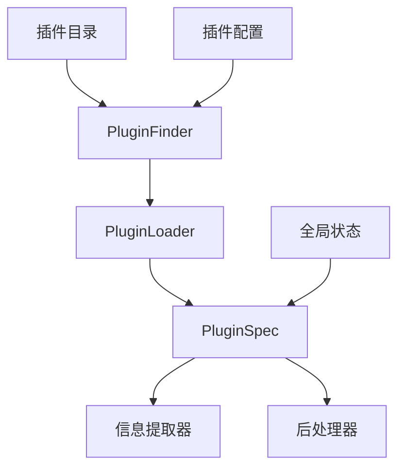
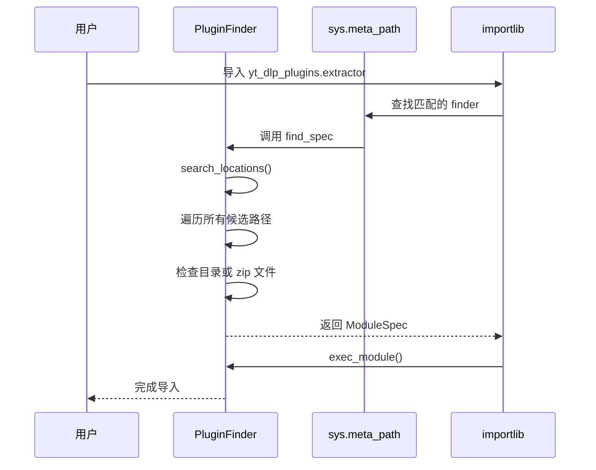
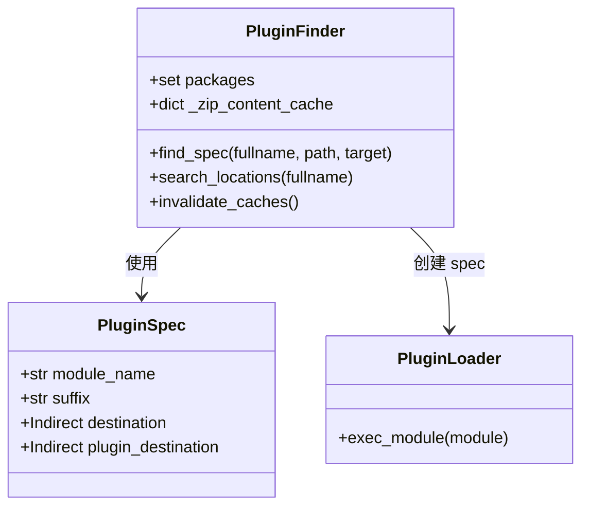
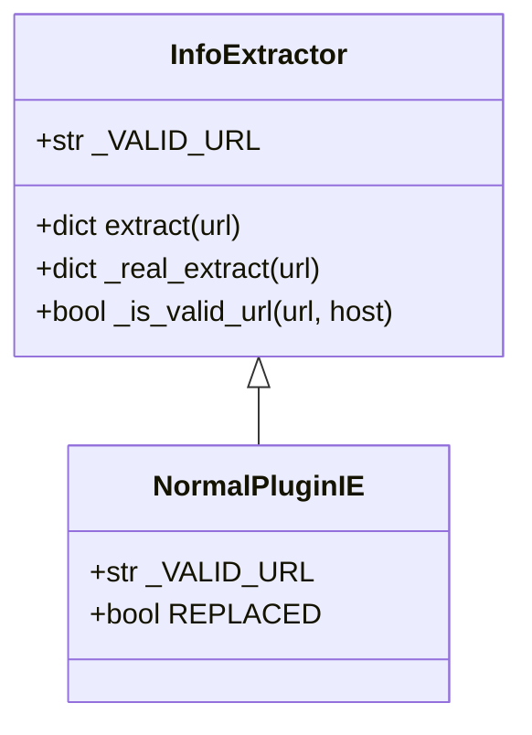
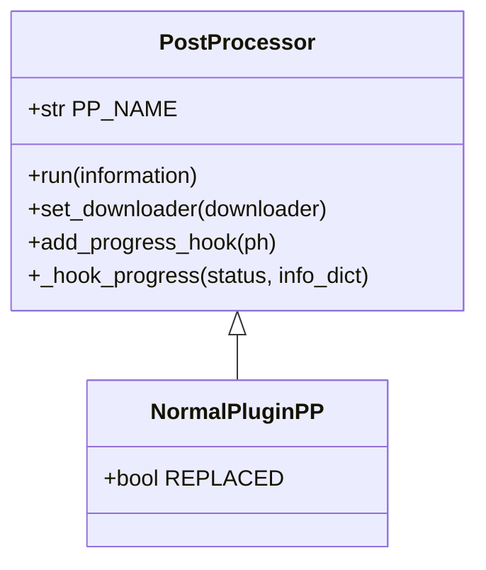
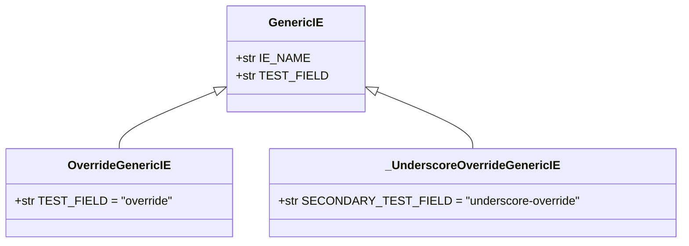
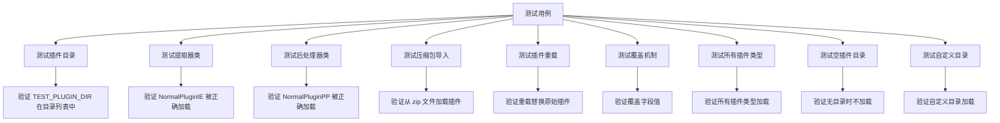
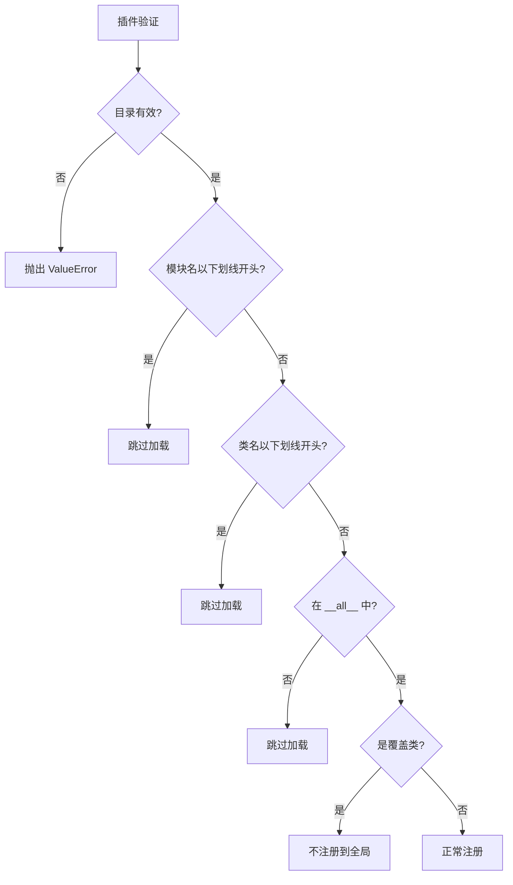

# 插件系统与可扩展性

<cite>
**本文档中引用的文件**  
- [yt_dlp/plugins.py](file://yt_dlp/plugins.py)
- [yt_dlp/globals.py](file://yt_dlp/globals.py)
- [yt_dlp/extractor/common.py](file://yt_dlp/extractor/common.py)
- [yt_dlp/postprocessor/common.py](file://yt_dlp/postprocessor/common.py)
- [yt_dlp/postprocessor/__init__.py](file://yt_dlp/postprocessor/__init__.py)
- [test/test_plugins.py](file://test/test_plugins.py)
- [test/testdata/yt_dlp_plugins/extractor/normal.py](file://test/testdata/yt_dlp_plugins/extractor/normal.py)
- [test/testdata/yt_dlp_plugins/postprocessor/normal.py](file://test/testdata/yt_dlp_plugins/postprocessor/normal.py)
- [test/testdata/yt_dlp_plugins/extractor/override.py](file://test/testdata/yt_dlp_plugins/extractor/override.py)
- [test/testdata/yt_dlp_plugins/extractor/overridetwo.py](file://test/testdata/yt_dlp_plugins/extractor/overridetwo.py)
</cite>

## 目录
1. [简介](#简介)
2. [插件系统架构](#插件系统架构)
3. [插件加载机制](#插件加载机制)
4. [信息提取器开发](#信息提取器开发)
5. [后处理器开发](#后处理器开发)
6. [插件覆盖机制](#插件覆盖机制)
7. [测试与验证](#测试与验证)
8. [最佳实践](#最佳实践)

## 简介
yt-dlp 提供了一个灵活的插件系统，允许开发者扩展其核心功能。该系统支持两种主要类型的插件：信息提取器（extractor）和后处理器（postprocessor）。信息提取器负责从特定网站或服务中提取视频信息，而后处理器则在下载完成后对文件进行处理。本文档详细解释了插件系统的可扩展架构，包括插件的加载、注册和执行流程，并提供开发自定义插件的完整指导。

## 插件系统架构

yt-dlp 的插件系统基于 Python 的模块导入机制和命名空间包（namespace package）概念构建。系统通过 `yt_dlp.plugins` 模块管理插件的发现、加载和注册过程。



**图示来源**  
- [yt_dlp/plugins.py](file://yt_dlp/plugins.py#L1-L247)
- [yt_dlp/globals.py](file://yt_dlp/globals.py#L1-L32)

**本节来源**  
- [yt_dlp/plugins.py](file://yt_dlp/plugins.py#L1-L247)
- [yt_dlp/globals.py](file://yt_dlp/globals.py#L1-L32)

## 插件加载机制

### 插件发现流程
yt-dlp 通过 `PluginFinder` 类实现插件发现机制。该类作为元路径查找器（meta path finder）插入到 `sys.meta_path` 中，负责在指定路径中搜索插件模块。

插件搜索路径包括：
- yt-dlp 配置目录下的 `plugins` 子目录
- `yt-dlp-plugins` 文件夹
- PYTHONPATH 中的目录



**图示来源**  
- [yt_dlp/plugins.py](file://yt_dlp/plugins.py#L100-L150)
- [yt_dlp/globals.py](file://yt_dlp/globals.py#L15-L20)

### 插件注册与加载
插件系统使用 `PluginSpec` 数据类定义插件规范，包含以下关键属性：
- `module_name`: 模块名称（如 "extractor"）
- `suffix`: 类名后缀（如 "IE" 表示信息提取器）
- `destination`: 全局插件查找表
- `plugin_destination`: 插件类型特定的查找表



**图示来源**  
- [yt_dlp/plugins.py](file://yt_dlp/plugins.py#L50-L90)
- [yt_dlp/globals.py](file://yt_dlp/globals.py#L10-L15)

**本节来源**  
- [yt_dlp/plugins.py](file://yt_dlp/plugins.py#L1-L247)
- [yt_dlp/globals.py](file://yt_dlp/globals.py#L1-L32)

## 信息提取器开发

### 基础接口
信息提取器必须继承 `InfoExtractor` 基类，并实现必要的方法和属性。核心要求包括：

- `id`: 视频标识符
- `title`: 视频标题
- 必须包含 `formats` 列表或 `url` 字段



**图示来源**  
- [yt_dlp/extractor/common.py](file://yt_dlp/extractor/common.py#L1-L200)
- [test/testdata/yt_dlp_plugins/extractor/normal.py](file://test/testdata/yt_dlp_plugins/extractor/normal.py#L1-L12)

### 开发步骤
1. **创建插件文件**: 在 `yt_dlp_plugins/extractor/` 目录下创建 Python 文件
2. **定义提取器类**: 继承 `InfoExtractor` 并以 "IE" 结尾命名
3. **实现验证URL**: 设置 `_VALID_URL` 正则表达式
4. **实现提取逻辑**: 重写 `extract` 方法

```python
# 示例结构（不输出具体代码内容）
# from yt_dlp.extractor.common import InfoExtractor
# 
# class MyCustomIE(InfoExtractor):
#     _VALID_URL = r'mywebsite\.com/watch\?v=(?P<id>[^&]+)'
#     
#     def _real_extract(self, url):
#         # 提取逻辑实现
#         pass
```

**本节来源**  
- [yt_dlp/extractor/common.py](file://yt_dlp/extractor/common.py#L1-L200)
- [test/testdata/yt_dlp_plugins/extractor/normal.py](file://test/testdata/yt_dlp_plugins/extractor/normal.py#L1-L12)

## 后处理器开发

### 基础接口
后处理器必须继承 `PostProcessor` 基类，该类使用元类 `PostProcessorMetaClass` 提供运行包装功能。



**图示来源**  
- [yt_dlp/postprocessor/common.py](file://yt_dlp/postprocessor/common.py#L1-L200)
- [test/testdata/yt_dlp_plugins/postprocessor/normal.py](file://test/testdata/yt_dlp_plugins/postprocessor/normal.py#L1-L6)

### 开发步骤
1. **创建插件文件**: 在 `yt_dlp_plugins/postprocessor/` 目录下创建 Python 文件
2. **定义处理器类**: 继承 `PostProcessor` 并以 "PP" 结尾命名
3. **实现处理逻辑**: 重写 `run` 方法

```python
# 示例结构（不输出具体代码内容）
# from yt_dlp.postprocessor.common import PostProcessor
# 
# class MyCustomPP(PostProcessor):
#     def run(self, info):
#         # 处理逻辑实现
#         return [], info
```

**本节来源**  
- [yt_dlp/postprocessor/common.py](file://yt_dlp/postprocessor/common.py#L1-L200)
- [test/testdata/yt_dlp_plugins/postprocessor/normal.py](file://test/testdata/yt_dlp_plugins/postprocessor/normal.py#L1-L6)

## 插件覆盖机制

yt-dlp 支持插件覆盖功能，允许修改现有提取器的行为。覆盖机制通过多重继承实现，新类继承自目标提取器并添加 `plugin_name` 参数。



**图示来源**  
- [test/testdata/yt_dlp_plugins/extractor/override.py](file://test/testdata/yt_dlp_plugins/extractor/override.py#L1-L6)
- [test/testdata/yt_dlp_plugins/extractor/overridetwo.py](file://test/testdata/yt_dlp_plugins/extractor/overridetwo.py#L1-L6)

### 覆盖规则
- 覆盖类必须继承自目标提取器
- 使用 `plugin_name` 参数标识插件名称
- 多个覆盖会按顺序应用
- 重复加载不会导致重复包装

```mermaid
flowchart TD
A[原始 GenericIE] --> B[加载 OverrideGenericIE]
B --> C[更新 TEST_FIELD]
C --> D[加载 _UnderscoreOverrideGenericIE]
D --> E[更新 SECONDARY_TEST_FIELD]
E --> F[最终 IE_NAME = "generic+override+underscore-override"]
```

**图示来源**  
- [test/test_plugins.py](file://test/test_plugins.py#L155-L186)
- [test/testdata/yt_dlp_plugins/extractor/override.py](file://test/testdata/yt_dlp_plugins/extractor/override.py#L1-L6)

**本节来源**  
- [test/test_plugins.py](file://test/test_plugins.py#L155-L186)
- [test/testdata/yt_dlp_plugins/extractor/override.py](file://test/testdata/yt_dlp_plugins/extractor/override.py#L1-L6)
- [test/testdata/yt_dlp_plugins/extractor/overridetwo.py](file://test/testdata/yt_dlp_plugins/extractor/overridetwo.py#L1-L6)

## 测试与验证

### 测试框架
yt-dlp 提供了完整的插件系统测试用例，验证各种场景下的行为：



**图示来源**  
- [test/test_plugins.py](file://test/test_plugins.py#L1-L247)

### 兼容性要求
插件系统需要满足以下兼容性要求：
- 插件目录必须存在且可访问
- 插件文件不能以下划线开头
- 类名必须以指定后缀结尾
- 类必须在 `__all__` 中声明（如果存在）



**图示来源**  
- [yt_dlp/plugins.py](file://yt_dlp/plugins.py#L200-L247)
- [test/test_plugins.py](file://test/test_plugins.py#L50-L98)

**本节来源**  
- [test/test_plugins.py](file://test/test_plugins.py#L1-L247)
- [yt_dlp/plugins.py](file://yt_dlp/plugins.py#L1-L247)

## 最佳实践

### 目录结构
推荐的插件目录结构如下：
```
~/.yt-dlp/
├── plugins/
│   ├── extractor/
│   │   └── mysite.py
│   └── postprocessor/
│       └── myprocessor.py
└── yt-dlp-plugins/
    ├── extractor/
    │   └── anothersite.py
    └── postprocessor/
        └── anotherprocessor.py
```

### 开发建议
1. **命名规范**: 提取器以 "IE" 结尾，后处理器以 "PP" 结尾
2. **错误处理**: 使用 `ExtractorError` 和 `PostProcessingError` 异常
3. **日志记录**: 使用 `to_screen`、`report_warning` 等方法
4. **配置参数**: 通过 `get_param` 方法获取用户配置
5. **进度报告**: 实现进度钩子以提供反馈

### 性能考虑
- 避免在 `__init__` 中执行耗时操作
- 使用缓存机制减少重复计算
- 合理使用网络请求，添加适当的重试机制
- 考虑模拟模式下的行为（`simulate` 参数）

**本节来源**  
- [yt_dlp/extractor/common.py](file://yt_dlp/extractor/common.py#L1-L200)
- [yt_dlp/postprocessor/common.py](file://yt_dlp/postprocessor/common.py#L1-L200)
- [yt_dlp/plugins.py](file://yt_dlp/plugins.py#L1-L247)