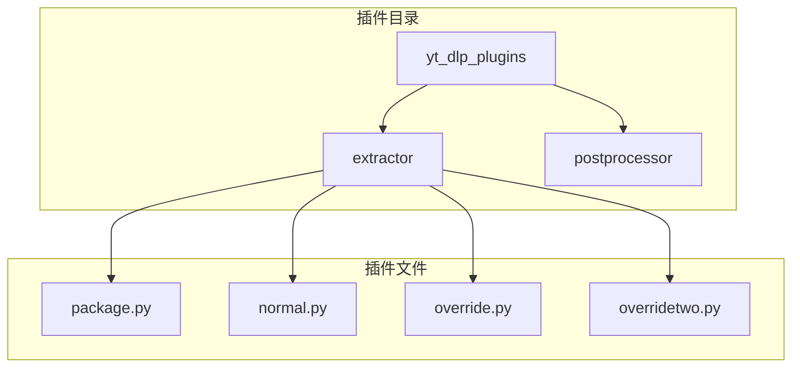
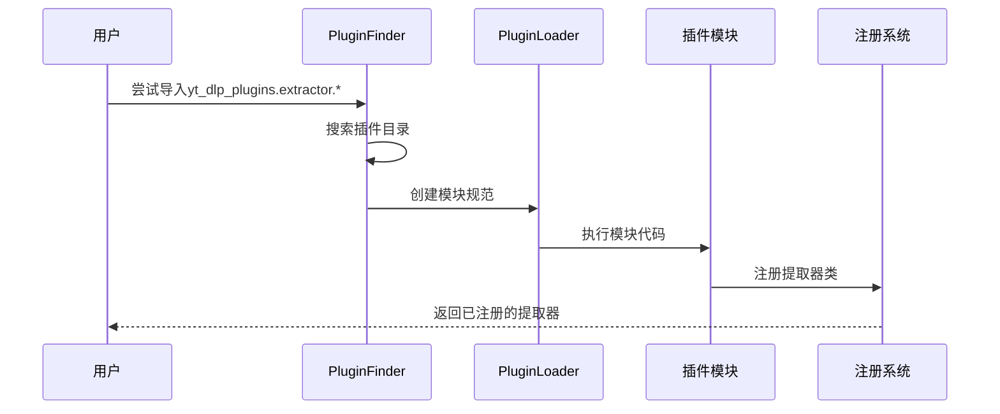
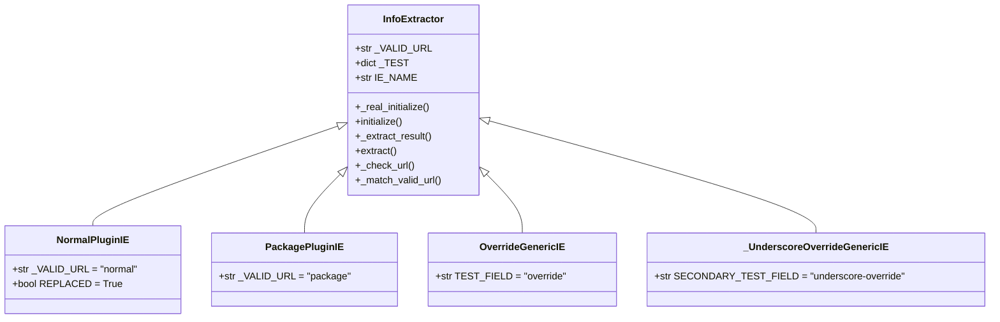
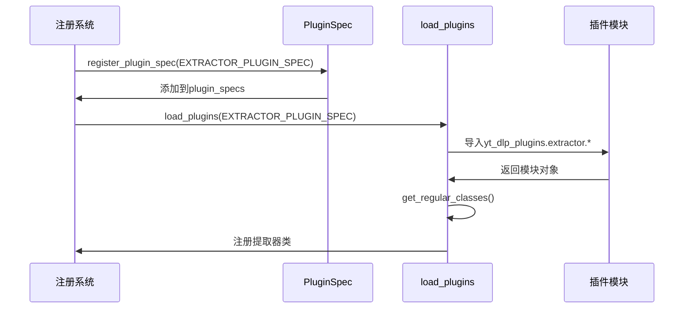
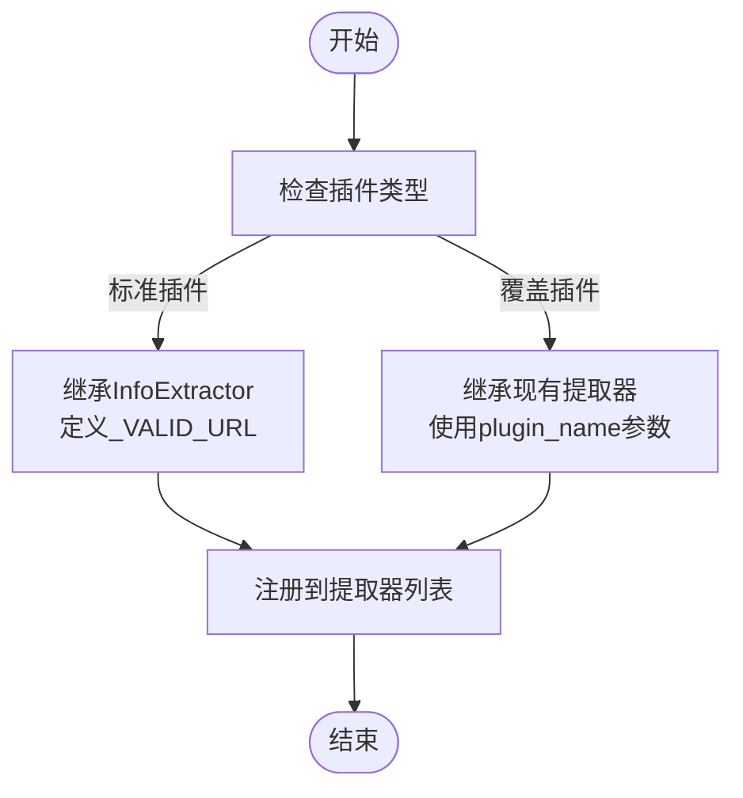
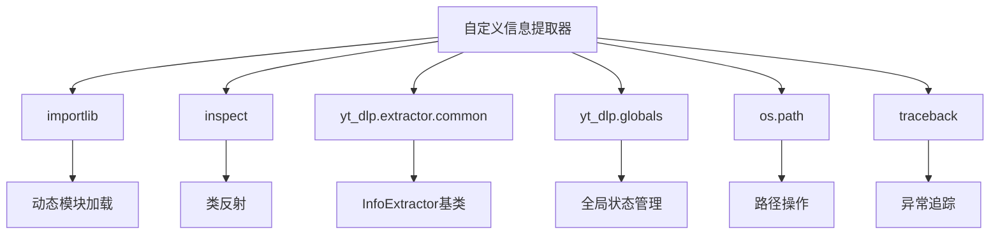

# 自定义信息提取器

<cite>
**本文档中引用的文件**  
- [plugins.py](file://yt_dlp/plugins.py#L1-L248)
- [test_plugins.py](file://test/test_plugins.py#L1-L247)
- [common.py](file://yt_dlp/extractor/common.py#L1-L4183)
- [override.py](file://test/testdata/yt_dlp_plugins/extractor/override.py#L1-L6)
- [overridetwo.py](file://test/testdata/yt_dlp_plugins/extractor/overridetwo.py#L1-L6)
- [package.py](file://test/testdata/plugin_packages/testpackage/yt_dlp_plugins/extractor/package.py#L1-L7)
- [normal.py](file://test/testdata/reload_plugins/yt_dlp_plugins/extractor/normal.py#L1-L11)
</cite>

## 目录
1. [简介](#简介)
2. [项目结构](#项目结构)
3. [核心组件](#核心组件)
4. [架构概述](#架构概述)
5. [详细组件分析](#详细组件分析)
6. [依赖分析](#依赖分析)
7. [性能考虑](#性能考虑)
8. [故障排除指南](#故障排除指南)
9. [结论](#结论)

## 简介
本文档详细介绍了如何在yt-dlp项目中创建自定义信息提取器。基于yt_dlp/extractor/目录中的实际代码示例，文档将展示如何定义一个新的信息提取器类，该类必须以'IE'结尾并位于yt_dlp_plugins.extractor命名空间下。文档还将解释如何利用PluginSpec(EXTRACTOR_PLUGIN_SPEC)机制注册提取器插件，以及插件类如何遵循通用接口，包括必需的属性如IE_NAME和关键方法如_work。通过test/test_plugins.py中的NormalPluginIE和OverrideGenericIE示例，演示标准插件与覆盖现有提取器的插件之间的区别。提供完整的代码示例，展示从文件结构到类实现的全过程，并说明__all__变量在控制可导出插件类中的作用。

## 项目结构
yt-dlp项目的插件系统基于Python的模块导入机制和命名空间包。插件必须位于yt_dlp_plugins命名空间下，具体路径为yt_dlp_plugins/extractor/。每个插件文件包含一个或多个以'IE'结尾的类，这些类继承自InfoExtractor。插件系统通过PluginFinder和PluginLoader类实现动态加载，允许从多个位置（如配置目录、PYTHONPATH等）加载插件。

**Diagram sources**
- [plugins.py](file://yt_dlp/plugins.py#L1-L248)
- [test_plugins.py](file://test/test_plugins.py#L1-L247)

**Section sources**
- [plugins.py](file://yt_dlp/plugins.py#L1-L248)
- [test_plugins.py](file://test/test_plugins.py#L1-L247)

## 核心组件
自定义信息提取器的核心组件包括插件规范(PluginSpec)、插件查找器(PluginFinder)、插件加载器(PluginLoader)和信息提取器基类(InfoExtractor)。这些组件共同工作，实现插件的动态发现、加载和注册。插件规范定义了插件的模块名称、后缀、目标位置等属性；插件查找器负责在系统路径中搜索插件；插件加载器负责执行插件模块；信息提取器基类提供了所有提取器必须实现的接口。

**Section sources**
- [plugins.py](file://yt_dlp/plugins.py#L1-L248)
- [common.py](file://yt_dlp/extractor/common.py#L1-L4183)

## 架构概述
yt-dlp的插件架构基于Python的导入系统扩展，使用元路径查找器(meta path finder)机制。当尝试导入yt_dlp_plugins命名空间下的模块时，PluginFinder会被调用，它会在预定义的搜索路径中查找插件目录。一旦找到匹配的目录，PluginLoader会创建一个虚拟模块并执行它。插件类通过inspect模块被识别，并根据其名称后缀和模块位置进行过滤和注册。

**Diagram sources**
- [plugins.py](file://yt_dlp/plugins.py#L1-L248)
- [test_plugins.py](file://test/test_plugins.py#L1-L247)

## 详细组件分析

### 信息提取器类分析
信息提取器类必须继承自InfoExtractor，并以'IE'结尾。类中必须定义_VALID_URL属性来指定支持的URL模式。插件系统会自动识别这些类并将其注册到全局提取器列表中。

#### 类图

**Diagram sources**
- [common.py](file://yt_dlp/extractor/common.py#L1-L4183)
- [normal.py](file://test/testdata/reload_plugins/yt_dlp_plugins/extractor/normal.py#L1-L11)
- [package.py](file://test/testdata/plugin_packages/testpackage/yt_dlp_plugins/extractor/package.py#L1-L7)
- [override.py](file://test/testdata/yt_dlp_plugins/extractor/override.py#L1-L6)
- [overridetwo.py](file://test/testdata/yt_dlp_plugins/extractor/overridetwo.py#L1-L6)

**Section sources**
- [common.py](file://yt_dlp/extractor/common.py#L1-L4183)
- [normal.py](file://test/testdata/reload_plugins/yt_dlp_plugins/extractor/normal.py#L1-L11)
- [package.py](file://test/testdata/plugin_packages/testpackage/yt_dlp_plugins/extractor/package.py#L1-L7)

### 插件注册机制分析
插件注册机制通过PluginSpec类实现，该类定义了插件的模块名称、类后缀、目标注册表等属性。EXTRACTOR_PLUGIN_SPEC是为信息提取器定义的特定插件规范，它指定了模块名为'extractor'，类后缀为'IE'，并将插件注册到全局提取器列表中。

#### 序列图

**Diagram sources**
- [plugins.py](file://yt_dlp/plugins.py#L1-L248)
- [test_plugins.py](file://test/test_plugins.py#L1-L247)

**Section sources**
- [plugins.py](file://yt_dlp/plugins.py#L1-L248)
- [test_plugins.py](file://test/test_plugins.py#L1-L247)

### 标准插件与覆盖插件分析
标准插件和覆盖插件的主要区别在于它们的继承方式和用途。标准插件直接继承自InfoExtractor，用于添加新的提取功能；而覆盖插件继承自现有的提取器类，用于修改或扩展现有提取器的行为。覆盖插件通过多重继承和plugin_name参数实现对基类的覆盖。

#### 流程图

**Diagram sources**
- [override.py](file://test/testdata/yt_dlp_plugins/extractor/override.py#L1-L6)
- [overridetwo.py](file://test/testdata/yt_dlp_plugins/extractor/overridetwo.py#L1-L6)
- [test_plugins.py](file://test/test_plugins.py#L1-L247)

**Section sources**
- [override.py](file://test/testdata/yt_dlp_plugins/extractor/override.py#L1-L6)
- [overridetwo.py](file://test/testdata/yt_dlp_plugins/extractor/overridetwo.py#L1-L6)
- [test_plugins.py](file://test/test_plugins.py#L1-L247)

## 依赖分析
自定义信息提取器系统依赖于多个核心组件和外部库。主要依赖包括Python的importlib系统用于动态模块加载，inspect模块用于类反射，以及yt-dlp自身的extractors和globals模块。插件系统还依赖于路径操作和异常处理机制来确保稳定运行。

**Diagram sources**
- [plugins.py](file://yt_dlp/plugins.py#L1-L248)
- [common.py](file://yt_dlp/extractor/common.py#L1-L4183)
- [globals.py](file://yt_dlp/globals.py#L1-L31)

**Section sources**
- [plugins.py](file://yt_dlp/plugins.py#L1-L248)
- [common.py](file://yt_dlp/extractor/common.py#L1-L4183)
- [globals.py](file://yt_dlp/globals.py#L1-L31)

## 性能考虑
插件系统的性能主要受模块导入和类发现过程的影响。由于插件是在运行时动态加载的，首次导入可能会有轻微的延迟。系统通过缓存机制(dirs_in_zip.cache_clear)来优化重复操作的性能。此外，插件查找过程会遍历多个搜索路径，因此建议将常用插件放在优先级较高的目录中以提高加载速度。

## 故障排除指南
在开发自定义信息提取器时，常见的问题包括插件未被发现、类未正确注册、URL匹配失败等。确保插件文件位于正确的目录结构中(yt_dlp_plugins/extractor/)，类名以'IE'结尾，且模块名称符合规范。使用test_plugins.py中的测试用例可以验证插件的正确性。如果插件未被加载，检查plugin_dirs配置和PYTHONPATH设置。

**Section sources**
- [test_plugins.py](file://test/test_plugins.py#L1-L247)
- [plugins.py](file://yt_dlp/plugins.py#L1-L248)

## 结论
yt-dlp的自定义信息提取器系统提供了一个灵活且强大的扩展机制，允许开发者通过简单的类定义来添加新的视频提取功能。通过遵循命名规范和接口要求，开发者可以轻松创建标准插件或覆盖现有提取器。插件系统的设计充分考虑了可扩展性和兼容性，使得yt-dlp能够持续支持新的视频网站和服务。