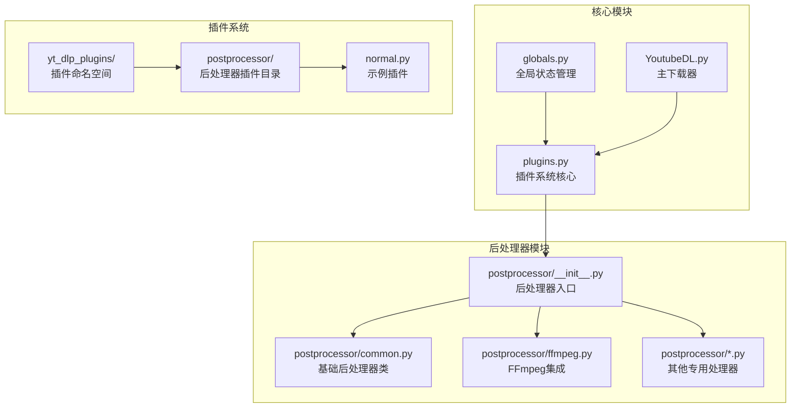
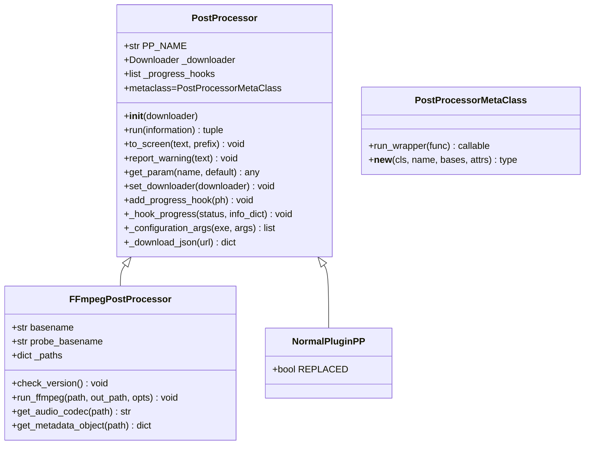
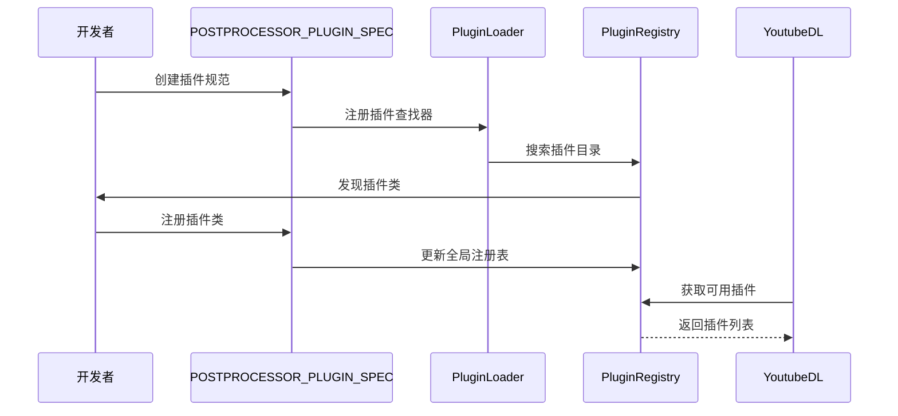
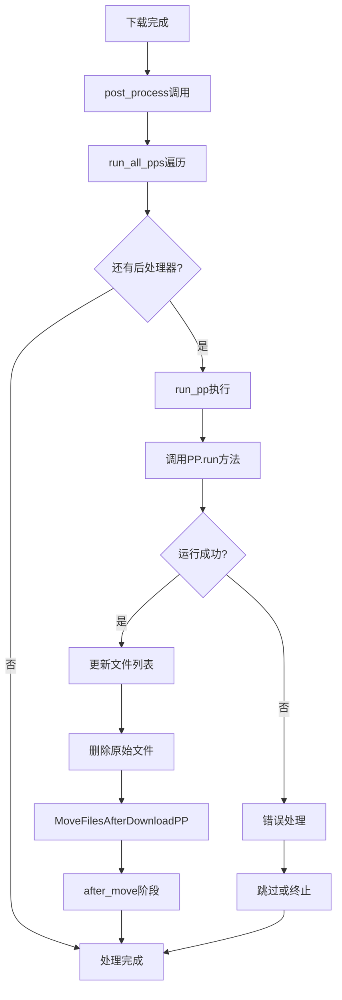
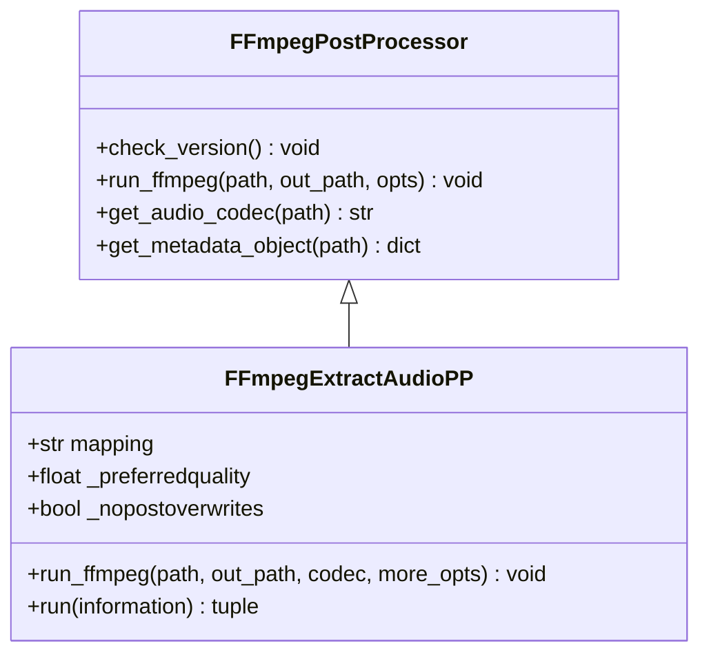
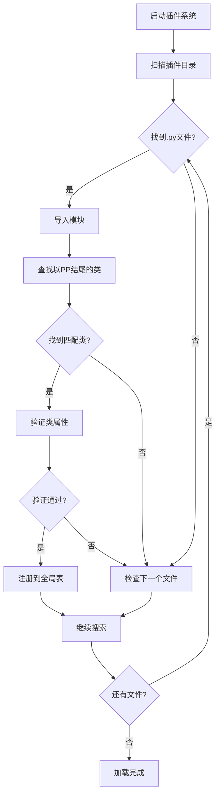
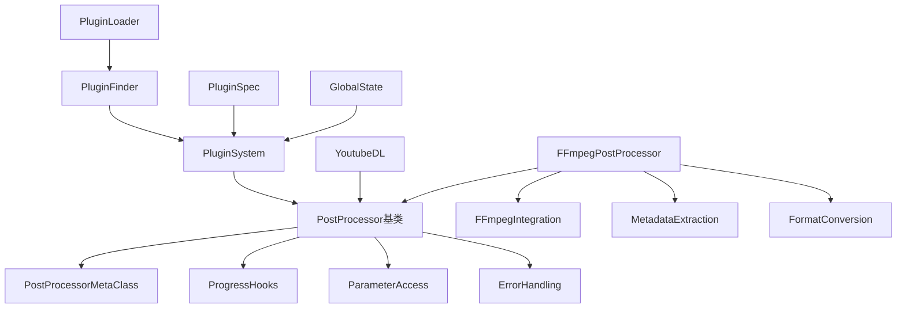

# 自定义后处理器开发指南

<cite>
**本文档引用的文件**
- [yt_dlp/plugins.py](file://yt_dlp/plugins.py)
- [yt_dlp/postprocessor/common.py](file://yt_dlp/postprocessor/common.py)
- [yt_dlp/postprocessor/ffmpeg.py](file://yt_dlp/postprocessor/ffmpeg.py)
- [yt_dlp/postprocessor/__init__.py](file://yt_dlp/postprocessor/__init__.py)
- [yt_dlp/globals.py](file://yt_dlp/globals.py)
- [test/test_plugins.py](file://test/test_plugins.py)
- [test/testdata/yt_dlp_plugins/postprocessor/normal.py](file://test/testdata/yt_dlp_plugins/postprocessor/normal.py)
- [yt_dlp/YoutubeDL.py](file://yt_dlp/YoutubeDL.py)
</cite>

## 目录
1. [简介](#简介)
2. [项目结构](#项目结构)
3. [核心组件](#核心组件)
4. [架构概览](#架构概览)
5. [详细组件分析](#详细组件分析)
6. [依赖关系分析](#依赖关系分析)
7. [性能考虑](#性能考虑)
8. [故障排除指南](#故障排除指南)
9. [结论](#结论)

## 简介

yt_dlp的后处理器系统是一个强大且灵活的插件架构，允许开发者创建自定义的视频文件处理功能。通过遵循特定的模式和规范，开发者可以轻松地扩展yt_dlp的功能，实现诸如元数据修改、文件转换、章节调整等高级处理任务。

本指南将详细介绍如何开发自定义后处理器，包括插件注册机制、核心接口实现、与外部工具（如FFmpeg）的集成方式，以及最佳实践建议。

## 项目结构

yt_dlp的后处理器系统采用模块化设计，主要包含以下关键目录和文件：



**图表来源**
- [yt_dlp/plugins.py](file://yt_dlp/plugins.py#L1-L50)
- [yt_dlp/postprocessor/__init__.py](file://yt_dlp/postprocessor/__init__.py#L1-L50)

**节来源**
- [yt_dlp/plugins.py](file://yt_dlp/plugins.py#L1-L248)
- [yt_dlp/postprocessor/__init__.py](file://yt_dlp/postprocessor/__init__.py#L1-L68)

## 核心组件

### 插件系统架构

yt_dlp的插件系统基于Python的命名空间包机制，通过`yt_dlp_plugins`命名空间组织各种类型的插件。后处理器插件位于`yt_dlp_plugins.postprocessor`子模块中。

### 后处理器基类

所有后处理器都继承自`PostProcessor`基类，该类提供了统一的接口和通用功能：



**图表来源**
- [yt_dlp/postprocessor/common.py](file://yt_dlp/postprocessor/common.py#L25-L215)
- [yt_dlp/postprocessor/ffmpeg.py](file://yt_dlp/postprocessor/ffmpeg.py#L75-L200)
- [test/testdata/yt_dlp_plugins/postprocessor/normal.py](file://test/testdata/yt_dlp_plugins/postprocessor/normal.py#L1-L6)

**节来源**
- [yt_dlp/postprocessor/common.py](file://yt_dlp/postprocessor/common.py#L25-L215)
- [yt_dlp/postprocessor/ffmpeg.py](file://yt_dlp/postprocessor/ffmpeg.py#L75-L200)

## 架构概览

### 插件注册机制

后处理器插件通过`POSTPROCESSOR_PLUGIN_SPEC`进行注册，该规范定义了插件的基本属性和注册方式：



**图表来源**
- [yt_dlp/plugins.py](file://yt_dlp/plugins.py#L240-L248)
- [test/test_plugins.py](file://test/test_plugins.py#L35-L42)

### 后处理器执行流程

后处理器在下载完成后按顺序执行，形成处理链：



**图表来源**
- [yt_dlp/YoutubeDL.py](file://yt_dlp/YoutubeDL.py#L3733-L3751)
- [yt_dlp/YoutubeDL.py](file://yt_dlp/YoutubeDL.py#L3701-L3731)

**节来源**
- [yt_dlp/YoutubeDL.py](file://yt_dlp/YoutubeDL.py#L3701-L3760)

## 详细组件分析

### 后处理器基类实现

#### 核心方法：run方法

`run`方法是后处理器的核心，必须返回一个包含两个元素的元组：
- 第一个元素：需要删除的文件路径列表
- 第二个元素：更新后的信息字典

```python
def run(self, information):
    """运行后处理器
    
    参数:
        information: 包含下载文件信息的字典，包含'filepath'字段
    
    返回:
        tuple: (files_to_delete, updated_information)
    """
    return [], information  # 默认行为：保持原文件不做任何修改
```

#### 描述方法：description

虽然不是强制要求，但推荐为每个后处理器实现描述方法：

```python
def description(self):
    """返回后处理器的简短描述"""
    return f"处理{self.PP_NAME}格式的文件"
```

### 插件开发模板

#### 基础后处理器模板

```python
from yt_dlp.postprocessor.common import PostProcessor

class CustomPostProcessor(PostProcessor):
    """自定义后处理器示例"""
    
    def run(self, information):
        """执行后处理逻辑"""
        filepath = information['filepath']
        
        # 执行处理逻辑...
        # 修改文件、添加元数据、重命名等
        
        # 返回需要删除的文件和更新的信息
        return [], information
```

#### 高级后处理器模板（带进度跟踪）

```python
from yt_dlp.postprocessor.common import PostProcessor

class AdvancedPostProcessor(PostProcessor):
    """带有进度跟踪的高级后处理器"""
    
    def run(self, information):
        """执行复杂的后处理任务"""
        filepath = information['filepath']
        
        # 报告开始
        self._hook_progress({'status': 'started'}, information)
        
        try:
            # 执行处理逻辑
            result = self.process_file(filepath)
            
            # 报告完成
            self._hook_progress({'status': 'finished'}, information)
            
            return [filepath], information
            
        except Exception as e:
            self.report_error(f"处理失败: {e}")
            self._hook_progress({'status': 'failed'}, information)
            raise
```

### FFmpeg集成示例

#### 音频提取后处理器

以下是FFmpeg音频提取后处理器的实现模式：



**图表来源**
- [yt_dlp/postprocessor/ffmpeg.py](file://yt_dlp/postprocessor/ffmpeg.py#L415-L531)

#### 视频转换后处理器

```python
from yt_dlp.postprocessor.ffmpeg import FFmpegPostProcessor

class VideoConverterPP(FFmpegPostProcessor):
    """视频格式转换后处理器"""
    
    def __init__(self, downloader=None, target_format='mp4'):
        super().__init__(downloader)
        self.target_format = target_format
    
    def run(self, information):
        """转换视频格式"""
        filepath = information['filepath']
        ext = information['ext']
        
        if ext == self.target_format:
            self.to_screen(f"文件已经是{self.target_format}格式，跳过转换")
            return [], information
        
        output_path = filepath.rsplit('.', 1)[0] + '.' + self.target_format
        
        # 设置FFmpeg参数
        opts = [
            '-c:v', 'libx264',
            '-crf', '23',
            '-c:a', 'aac',
            '-b:a', '128k'
        ]
        
        try:
            self.run_ffmpeg(filepath, output_path, opts)
            return [filepath], information
        except Exception as e:
            raise PostProcessingError(f"转换失败: {e}")
```

**节来源**
- [yt_dlp/postprocessor/ffmpeg.py](file://yt_dlp/postprocessor/ffmpeg.py#L415-L531)

### 插件加载和执行过程

#### 插件发现机制

插件系统通过以下步骤发现和加载后处理器：



**图表来源**
- [yt_dlp/plugins.py](file://yt_dlp/plugins.py#L170-L200)

#### 测试插件示例

基于测试代码中的NormalPluginPP示例：

```python
# 文件位置: test/testdata/yt_dlp_plugins/postprocessor/normal.py
from yt_dlp.postprocessor.common import PostProcessor

class NormalPluginPP(PostProcessor):
    """测试用的普通插件"""
    REPLACED = False
```

**节来源**
- [test/testdata/yt_dlp_plugins/postprocessor/normal.py](file://test/testdata/yt_dlp_plugins/postprocessor/normal.py#L1-L6)
- [test/test_plugins.py](file://test/test_plugins.py#L155-L165)

## 依赖关系分析

### 核心依赖图



**图表来源**
- [yt_dlp/postprocessor/common.py](file://yt_dlp/postprocessor/common.py#L1-L25)
- [yt_dlp/plugins.py](file://yt_dlp/plugins.py#L1-L50)

### 插件系统依赖

插件系统的各个组件之间存在清晰的依赖关系：

| 组件 | 依赖项 | 作用 |
|------|--------|------|
| PluginSpec | Indirect, plugin_dirs | 定义插件规范和搜索路径 |
| PluginFinder | PluginLoader, default_plugin_paths | 查找和加载插件模块 |
| PluginLoader | importlib.abc | 虚拟模块加载器 |
| PostProcessor | PostProcessorMetaClass | 提供元类和装饰器支持 |
| YoutubeDL | postprocessors | 访问可用的后处理器 |

**节来源**
- [yt_dlp/plugins.py](file://yt_dlp/plugins.py#L40-L248)
- [yt_dlp/globals.py](file://yt_dlp/globals.py#L1-L33)

## 性能考虑

### 后处理器性能优化

1. **延迟加载**: 只在需要时加载后处理器
2. **缓存机制**: 缓存FFmpeg版本和特性检测结果
3. **并发处理**: 对于独立的处理任务，考虑并行执行
4. **内存管理**: 及时释放大文件句柄和临时文件

### 内存使用优化

```python
class MemoryEfficientPP(PostProcessor):
    """内存高效的后处理器示例"""
    
    def run(self, information):
        filepath = information['filepath']
        
        # 使用生成器避免大量数据加载到内存
        for chunk in self.process_large_file(filepath):
            # 处理每个数据块
            pass
        
        # 清理临时资源
        self.cleanup_temp_files()
        
        return [], information
```

### 错误处理策略

```python
class RobustPostProcessor(PostProcessor):
    """健壮的后处理器实现"""
    
    def run(self, information):
        try:
            # 主要处理逻辑
            return self.process_with_retry(information)
        except PostProcessingError as e:
            # 记录错误但不中断整个流程
            self.report_warning(f"处理失败但继续: {e}")
            return [], information
        except Exception as e:
            # 未知错误，记录详细信息
            self.report_error(f"严重错误: {e}", tb=True)
            raise
```

## 故障排除指南

### 常见问题和解决方案

#### 插件加载失败

**问题**: 自定义后处理器无法被识别

**解决方案**:
1. 确保类名以'PP'结尾
2. 检查模块是否在`yt_dlp_plugins.postprocessor`命名空间下
3. 验证插件目录是否正确配置

```python
# 正确的插件结构
# yt_dlp_plugins/postprocessor/myplugin.py
from yt_dlp.postprocessor.common import PostProcessor

class MyCustomPP(PostProcessor):
    """正确的插件类名格式"""
```

#### FFmpeg集成问题

**问题**: FFmpeg命令执行失败

**解决方案**:
1. 检查FFmpeg安装路径配置
2. 验证输入文件格式支持
3. 检查输出路径权限

```python
# 错误处理示例
def run(self, information):
    try:
        self.check_version()  # 确保FFmpeg可用
        return self.process_file(information)
    except FFmpegPostProcessorError as e:
        self.report_error(f"FFmpeg错误: {e}")
        raise
```

#### 性能问题诊断

**问题**: 后处理器执行时间过长

**诊断步骤**:
1. 启用调试日志查看详细执行信息
2. 分析处理逻辑中的瓶颈点
3. 考虑使用异步处理或并行化

**节来源**
- [yt_dlp/postprocessor/common.py](file://yt_dlp/postprocessor/common.py#L190-L215)

### 调试技巧

#### 启用详细日志

```python
# 在后处理器中启用调试信息
def run(self, information):
    self.write_debug(f"开始处理文件: {information['filepath']}")
    
    # 处理逻辑
    
    self.write_debug(f"处理完成，输出文件: {output_path}")
    return [], information
```

#### 进度跟踪

```python
def run(self, information):
    self._hook_progress({'status': 'processing', 'percentage': 0}, information)
    
    # 处理第一阶段
    self._hook_progress({'status': 'processing', 'percentage': 30}, information)
    
    # 处理第二阶段
    self._hook_progress({'status': 'processing', 'percentage': 70}, information)
    
    self._hook_progress({'status': 'completed', 'percentage': 100}, information)
    return [], information
```

## 结论

yt_dlp的后处理器系统提供了一个强大而灵活的框架，用于扩展视频文件处理功能。通过遵循本指南中的最佳实践，开发者可以：

1. **创建高质量的插件**: 遵循标准的接口和命名约定
2. **实现复杂处理逻辑**: 利用FFmpeg等外部工具的强大功能
3. **确保系统稳定性**: 实现适当的错误处理和资源管理
4. **优化性能表现**: 采用最佳的编程实践和优化技术

关键要点：
- 所有后处理器类必须以'PP'结尾
- 必须继承自PostProcessor基类
- 实现run方法并返回正确的元组格式
- 利用插件系统提供的注册机制
- 遵循错误处理和进度跟踪的最佳实践

通过这些指导原则，开发者可以创建出既功能强大又易于维护的自定义后处理器，从而充分利用yt_dlp的扩展能力。