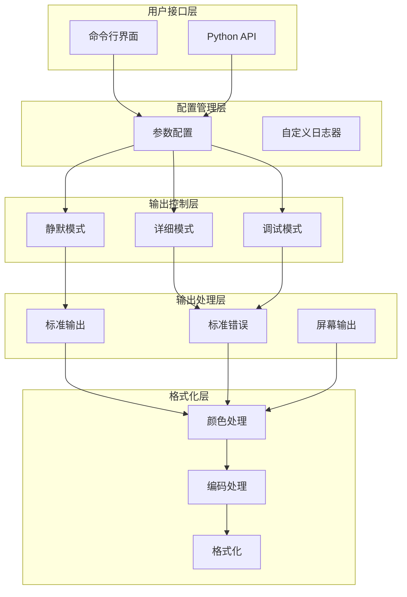
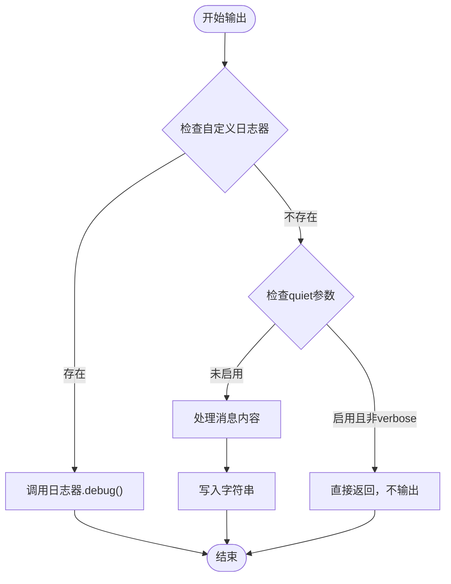
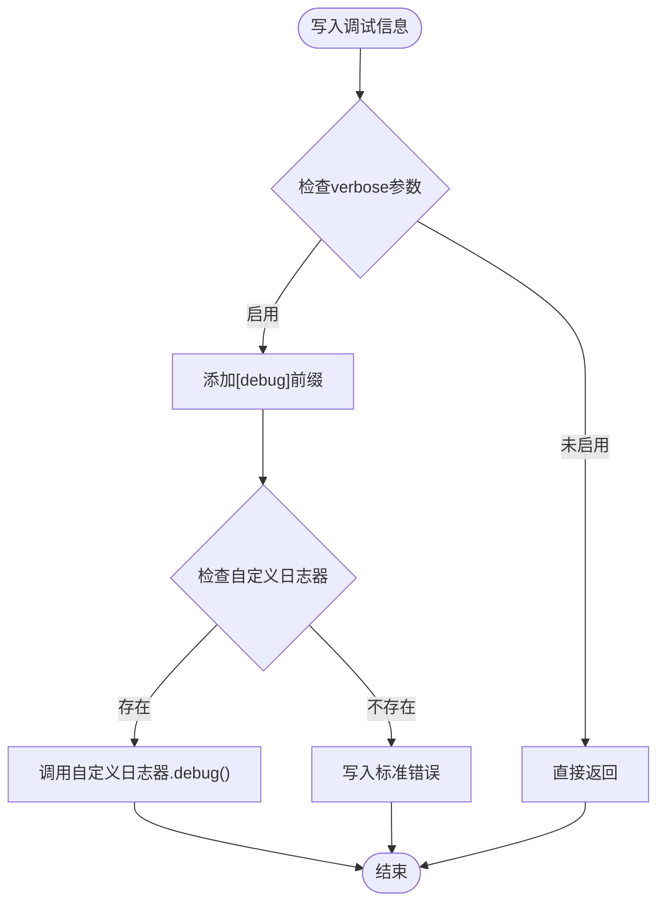
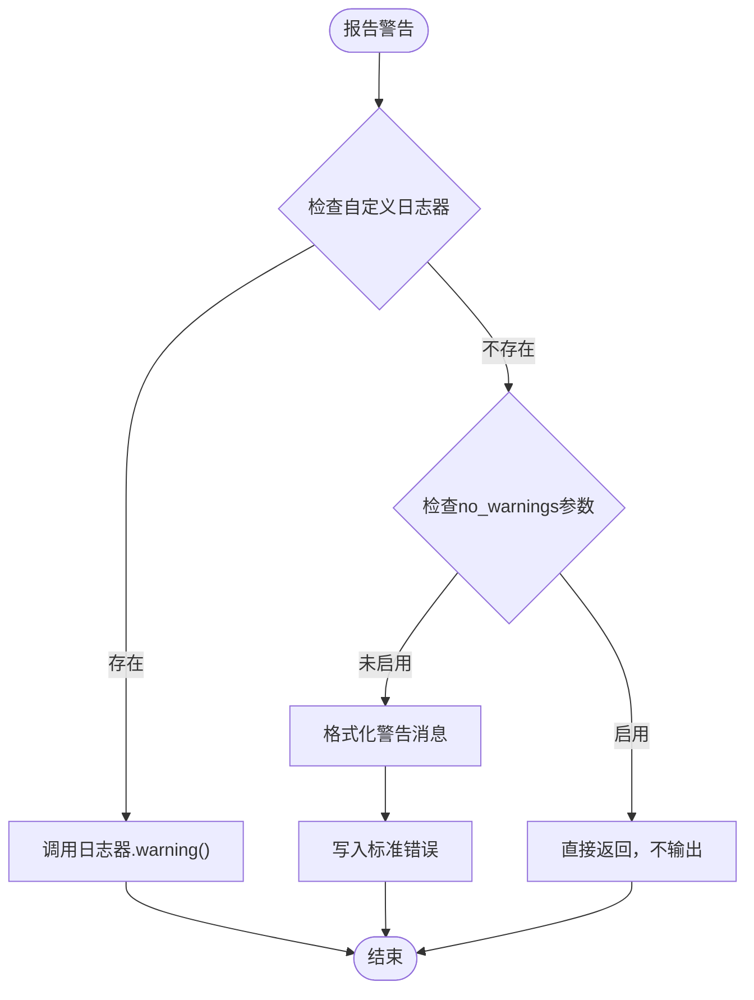
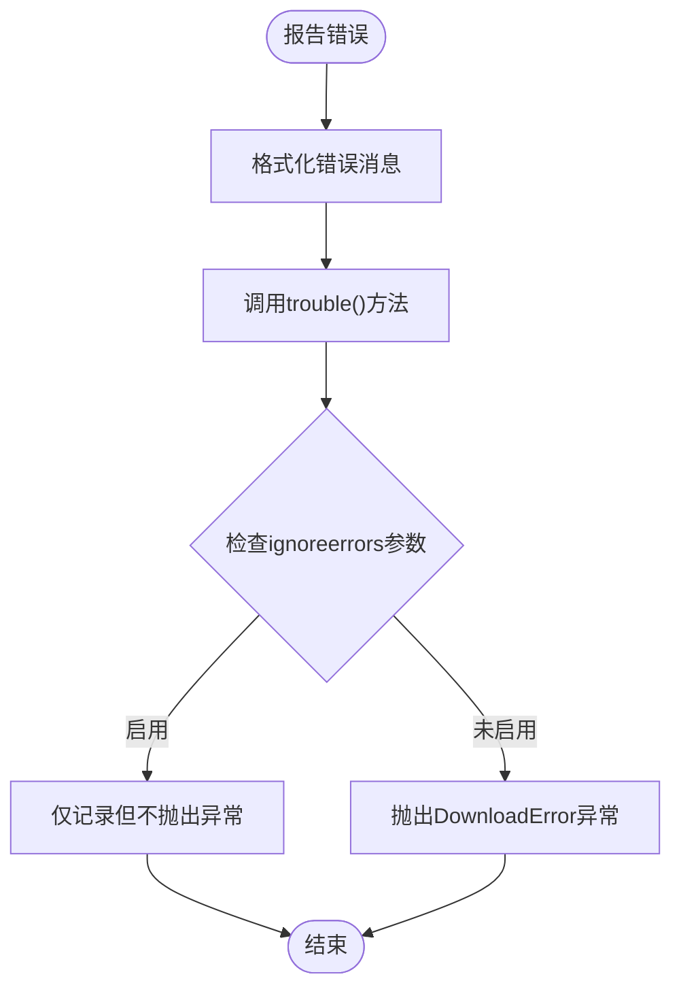
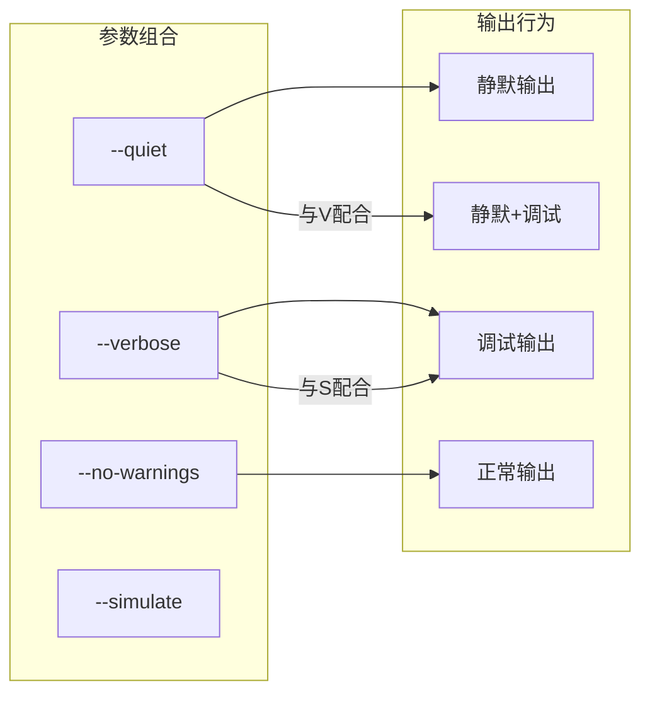
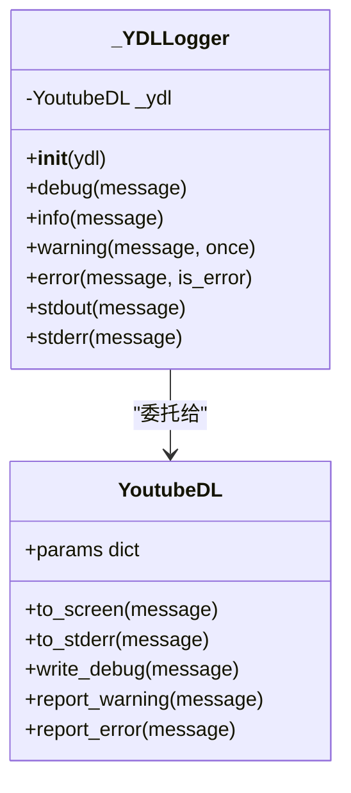
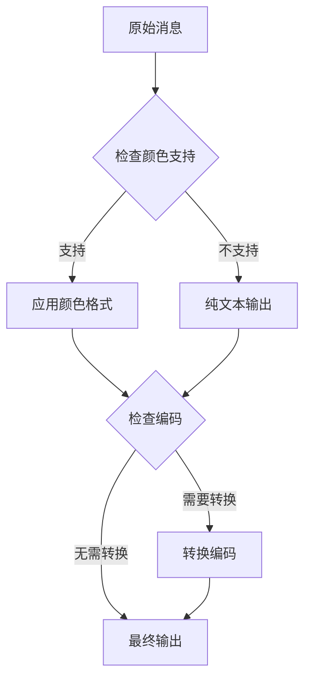
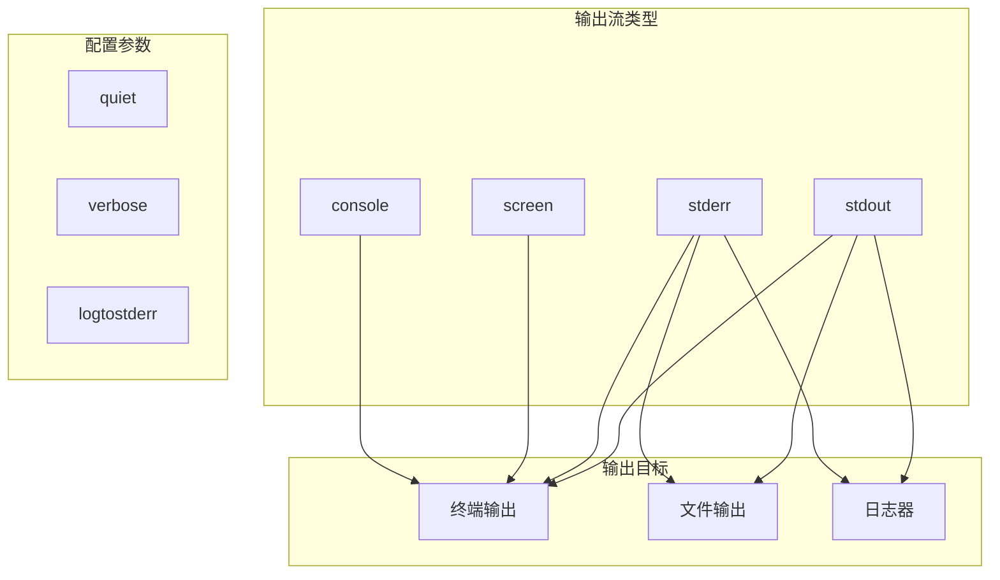

# 日志级别与输出控制

<cite>
**本文档引用的文件**
- [YoutubeDL.py](file://yt_dlp/YoutubeDL.py)
- [options.py](file://yt_dlp/options.py)
- [_utils.py](file://yt_dlp/utils/_utils.py)
- [minicurses.py](file://yt_dlp/minicurses.py)
- [test_verbose_output.py](file://test/test_verbose_output.py)
</cite>

## 目录
1. [简介](#简介)
2. [日志系统架构](#日志系统架构)
3. [日志级别详解](#日志级别详解)
4. [命令行参数控制](#命令行参数控制)
5. [内部日志处理机制](#内部日志处理机制)
6. [输出流管理](#输出流管理)
7. [实际使用示例](#实际使用示例)
8. [故障排除指南](#故障排除指南)
9. [总结](#总结)

## 简介

yt-dlp的日志系统是一个精心设计的多层次输出控制系统，提供了从静默模式到详细调试信息的完整覆盖范围。该系统通过不同的日志级别和输出控制选项，为用户提供了灵活的调试和监控能力，同时确保在生产环境中保持简洁的输出。

## 日志系统架构

yt-dlp的日志系统采用分层架构设计，包含以下核心组件：



**图表来源**
- [YoutubeDL.py](file://yt_dlp/YoutubeDL.py#L650-L678)
- [options.py](file://yt_dlp/options.py#L1170-L1220)

**章节来源**
- [YoutubeDL.py](file://yt_dlp/YoutubeDL.py#L650-L678)
- [options.py](file://yt_dlp/options.py#L1170-L1220)

## 日志级别详解

### 静默模式 (Quiet Mode)

静默模式是yt-dlp的默认输出控制机制，它通过`--quiet`或`-q`参数激活。

#### 实现机制

静默模式的核心实现在`to_screen`方法中：



**图表来源**
- [YoutubeDL.py](file://yt_dlp/YoutubeDL.py#L940-L957)

#### 特性描述

- **完全静默**：在静默模式下，只有错误信息会输出到标准错误
- **条件输出**：仅当`quiet`参数启用且`verbose`参数未启用时才阻止输出
- **兼容性**：支持与`--verbose`参数配合使用，此时日志输出到标准错误

### 详细模式 (Verbose Mode)

详细模式通过`--verbose`或`-v`参数激活，提供详细的调试信息。

#### 实现机制

详细模式的核心逻辑在`write_debug`方法中：



**图表来源**
- [YoutubeDL.py](file://yt_dlp/YoutubeDL.py#L1104-L1112)

#### 输出内容

详细模式会输出以下信息：
- 程序版本和构建信息
- 编码设置和环境信息
- 加载的提取器列表
- 兼容性选项状态
- 外部程序版本信息
- 可选库依赖状态
- 代理配置和请求处理器信息

### 警告模式 (Warning Mode)

警告模式通过`--no-warnings`参数控制，用于过滤警告信息。

#### 实现机制

警告过滤在`report_warning`方法中实现：



**图表来源**
- [YoutubeDL.py](file://yt_dlp/YoutubeDL.py#L1076-L1086)

### 错误模式 (Error Mode)

错误模式是最严格的输出控制，只显示错误信息。

#### 实现机制

错误信息通过`report_error`方法处理：



**图表来源**
- [YoutubeDL.py](file://yt_dlp/YoutubeDL.py#L1097-L1102)

**章节来源**
- [YoutubeDL.py](file://yt_dlp/YoutubeDL.py#L940-L957)
- [YoutubeDL.py](file://yt_dlp/YoutubeDL.py#L1104-L1112)
- [YoutubeDL.py](file://yt_dlp/YoutubeDL.py#L1076-L1086)
- [YoutubeDL.py](file://yt_dlp/YoutubeDL.py#L1097-L1102)

## 命令行参数控制

### 核心参数定义

yt-dlp通过options.py中的OptionParser定义了完整的日志控制参数：

| 参数 | 别名 | 默认值 | 描述 |
|------|------|--------|------|
| `--quiet` | `-q` | `False` | 激活静默模式 |
| `--verbose` | `-v` | `False` | 打印调试信息 |
| `--no-warnings` | 无 | `False` | 忽略警告信息 |
| `--no-quiet` | 无 | `False` | 取消静默模式 |

### 参数组合行为

不同参数的组合会产生特定的行为模式：



**图表来源**
- [options.py](file://yt_dlp/options.py#L1177-L1220)

### 高级输出控制

除了基本的日志级别控制，yt-dlp还提供了多种高级输出选项：

| 参数 | 功能 | 使用场景 |
|------|------|----------|
| `--dump-json` | JSON格式输出 | 数据处理脚本 |
| `--dump-single-json` | 单行JSON输出 | 批量处理 |
| `--print` | 自定义模板输出 | 特定字段提取 |
| `--progress` | 进度条显示 | 下载监控 |

**章节来源**
- [options.py](file://yt_dlp/options.py#L1177-L1220)

## 内部日志处理机制

### 日志器类 (_YDLLogger)

yt-dlp实现了专门的日志器类来统一处理各种日志级别：



**图表来源**
- [_utils.py](file://yt_dlp/utils/_utils.py#L5658-L5684)

### 消息格式化系统

yt-dlp使用复杂的格式化系统来处理不同类型的输出消息：



**图表来源**
- [YoutubeDL.py](file://yt_dlp/YoutubeDL.py#L1000-L1030)

### 编码和终端处理

系统自动检测和处理不同的输出环境：

- **终端序列支持检测**：自动检测是否支持ANSI转义序列
- **编码处理**：根据系统编码自动调整输出编码
- **双向文本处理**：支持从右到左的语言显示

**章节来源**
- [_utils.py](file://yt_dlp/utils/_utils.py#L5658-L5684)
- [YoutubeDL.py](file://yt_dlp/YoutubeDL.py#L1000-L1030)

## 输出流管理

### 流分配策略

yt-dlp采用智能的流分配策略来优化输出性能：



**图表来源**
- [YoutubeDL.py](file://yt_dlp/YoutubeDL.py#L650-L678)

### 多线程安全

输出系统实现了多线程安全机制：

- **锁机制**：使用`Lock()`确保并发安全
- **缓冲区管理**：智能缓冲区分配和释放
- **异常处理**：完善的异常捕获和恢复机制

**章节来源**
- [YoutubeDL.py](file://yt_dlp/YoutubeDL.py#L650-L678)

## 实际使用示例

### 基础使用场景

#### 1. 静默下载
```bash
# 完全静默，仅在出错时显示
yt-dlp --quiet https://example.com/video
```

#### 2. 调试模式
```bash
# 显示所有调试信息
yt-dlp --verbose https://example.com/video
```

#### 3. 条件静默
```bash
# 结合verbose使用，将日志输出到stderr
yt-dlp --verbose --quiet https://example.com/video
```

### 高级使用场景

#### 1. JSON数据提取
```bash
# 提取视频信息而不下载
yt-dlp --dump-json --quiet https://example.com/video
```

#### 2. 自定义输出格式
```bash
# 使用自定义模板输出特定字段
yt-dlp --print "%(title)s" --quiet https://example.com/video
```

#### 3. 批量处理
```bash
# 在脚本中使用，避免干扰输出
yt-dlp --quiet --no-warnings -o "%(title)s.%(ext)s" urls.txt
```

### 开发和调试场景

#### 1. 问题诊断
```bash
# 启用详细调试信息
yt-dlp --verbose --dump-pages --print-traffic https://problematic-site.com/video
```

#### 2. 性能分析
```bash
# 记录HTTP流量进行分析
yt-dlp --print-traffic --verbose https://example.com/video
```

#### 3. 配置验证
```bash
# 验证配置文件和参数
yt-dlp --verbose --ignore-config --quiet https://example.com/video
```

**章节来源**
- [test_verbose_output.py](file://test/test_verbose_output.py#L10-L75)

## 故障排除指南

### 常见问题及解决方案

#### 1. 日志输出不显示

**问题症状**：使用`--verbose`后没有看到预期的调试信息

**可能原因**：
- `--quiet`参数被意外启用
- 终端不支持颜色输出
- 日志级别设置不正确

**解决方案**：
```bash
# 检查当前设置
yt-dlp --help | grep -E "(quiet|verbose)"

# 强制启用详细输出
yt-dlp --verbose --no-quiet https://example.com/video
```

#### 2. 编码问题

**问题症状**：特殊字符显示异常或乱码

**解决方案**：
```bash
# 检查编码设置
yt-dlp --verbose https://example.com/video 2>&1 | head -n 10

# 强制指定编码
export PYTHONIOENCODING=utf-8
yt-dlp https://example.com/video
```

#### 3. 输出重定向问题

**问题症状**：将输出重定向到文件后丢失颜色信息

**解决方案**：
```bash
# 保存原始输出
yt-dlp --verbose https://example.com/video 2>&1 | tee output.log

# 或者使用日志文件功能
yt-dlp --verbose --log-file debug.log https://example.com/video
```

### 性能优化建议

#### 1. 减少不必要的输出
```bash
# 对于批量操作，使用静默模式
yt-dlp --quiet --no-warnings -a urls.txt
```

#### 2. 选择合适的日志级别
```bash
# 开发阶段使用详细模式
yt-dlp --verbose https://example.com/video

# 生产环境使用静默模式
yt-dlp --quiet https://example.com/video
```

#### 3. 避免过度调试
```bash
# 避免同时使用多个调试选项
yt-dlp --verbose --dump-pages --print-traffic  # 可能产生大量输出
```

## 总结

yt-dlp的日志系统通过精心设计的多层架构，提供了从基础静默模式到详细调试信息的完整覆盖。其主要特点包括：

### 核心优势

1. **灵活的级别控制**：支持静默、正常、详细和调试四种主要模式
2. **智能输出管理**：根据终端能力和用户偏好自动调整输出格式
3. **丰富的调试选项**：提供页面转储、流量监控等高级调试功能
4. **API友好设计**：支持自定义日志器，便于集成到第三方应用

### 最佳实践建议

1. **开发阶段**：使用`--verbose`获取完整调试信息
2. **生产环境**：优先使用`--quiet`确保简洁输出
3. **问题诊断**：结合`--dump-pages`和`--print-traffic`进行深入分析
4. **自动化脚本**：使用`--no-warnings`减少干扰信息

通过合理使用这些日志控制功能，用户可以有效地平衡输出信息量和调试需求，在不同场景下获得最佳的使用体验。