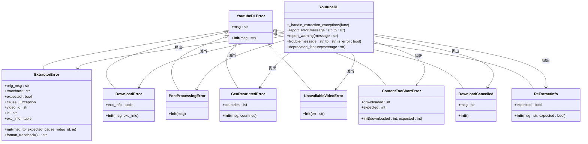
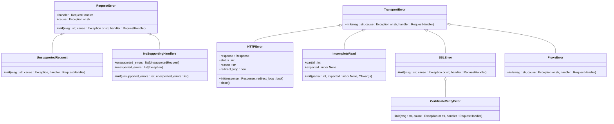
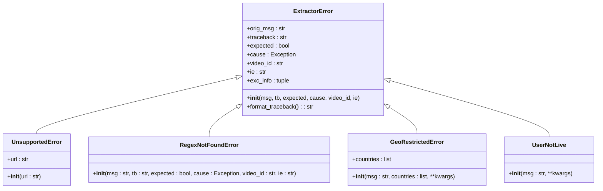
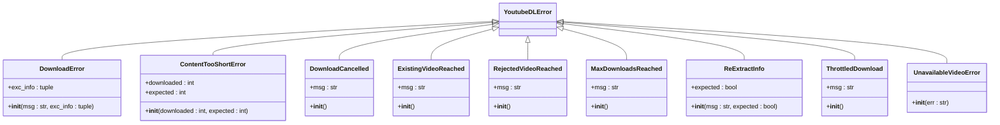
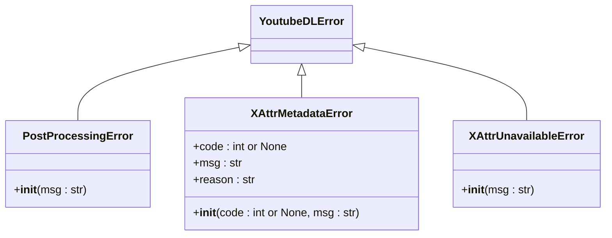
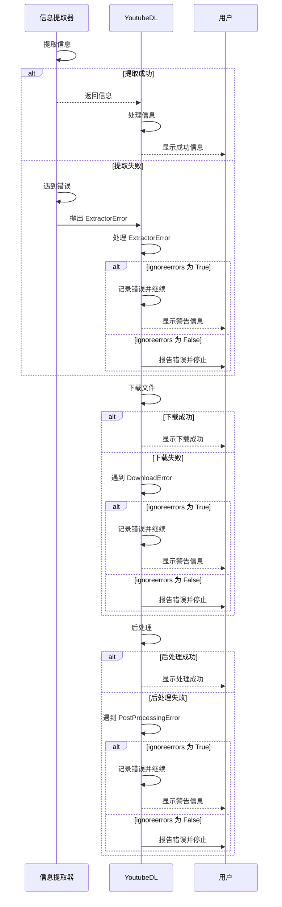
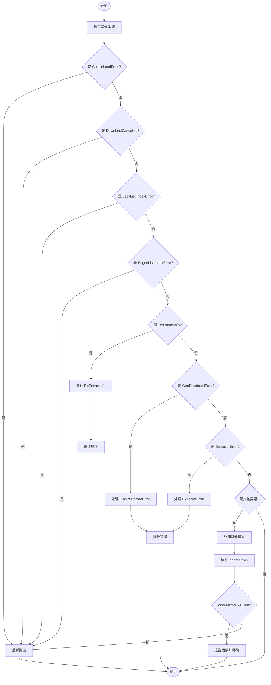
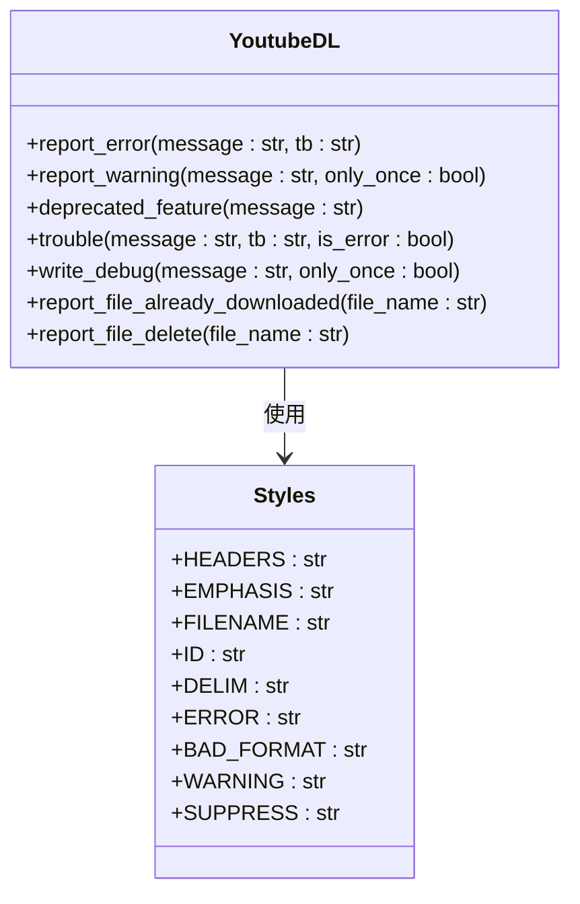
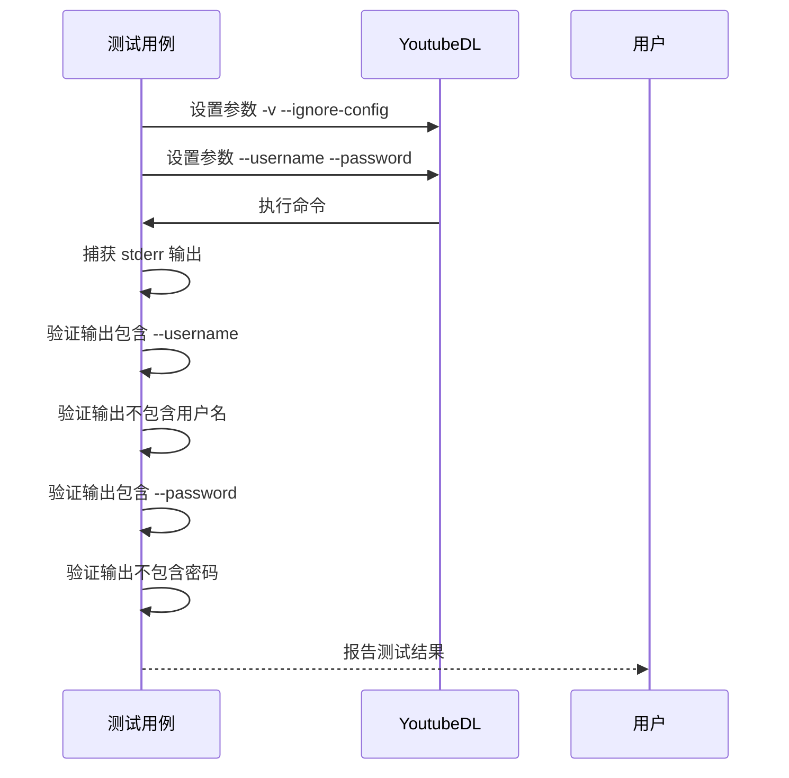

# 错误类型与异常处理

<cite>
**本文档中引用的文件**  
- [YoutubeDL.py](file://yt_dlp/YoutubeDL.py)
- [extractor/common.py](file://yt_dlp/extractor/common.py)
- [test/test_verbose_output.py](file://test/test_verbose_output.py)
- [utils/_utils.py](file://yt_dlp/utils/_utils.py)
- [networking/exceptions.py](file://yt_dlp/networking/exceptions.py)
</cite>

## 目录
1. [引言](#引言)
2. [错误处理架构](#错误处理架构)
3. [错误类型分类](#错误类型分类)
4. [错误传播机制](#错误传播机制)
5. [异常处理策略](#异常处理策略)
6. [测试验证](#测试验证)
7. [常见错误代码](#常见错误代码)
8. [故障排查指南](#故障排查指南)
9. [解决方案建议](#解决方案建议)
10. [结论](#结论)

## 引言
yt-dlp 是一个功能强大的视频下载工具，其错误处理系统设计精巧，能够有效应对各种网络、提取、下载和后处理过程中的异常情况。本文档深入分析 yt-dlp 的异常处理架构，系统性地分类和解释各种错误类型，包括网络错误、提取错误、下载错误和后处理错误。通过分析核心文件中的错误处理逻辑，说明错误传播机制和处理策略，并通过测试用例验证不同错误场景下的异常处理行为和用户提示。

## 错误处理架构
yt-dlp 的错误处理架构基于分层异常处理机制，从底层网络请求到高层业务逻辑，每个层次都有相应的异常处理策略。核心组件包括异常基类、特定异常类、异常处理装饰器和用户反馈机制。

**Diagram sources**
- [utils/_utils.py](file://yt_dlp/utils/_utils.py#L953-L1159)
- [YoutubeDL.py](file://yt_dlp/YoutubeDL.py#L1639-L1669)

**Section sources**
- [utils/_utils.py](file://yt_dlp/utils/_utils.py#L953-L1159)
- [YoutubeDL.py](file://yt_dlp/YoutubeDL.py#L1639-L1669)

## 错误类型分类
yt-dlp 将错误分为多个类别，每个类别都有特定的异常类来表示。这些错误类型涵盖了从网络连接到内容处理的各个方面。

### 网络错误
网络错误主要由网络连接问题引起，包括 HTTP 错误、SSL 错误和代理错误。

**Diagram sources**
- [networking/exceptions.py](file://yt_dlp/networking/exceptions.py#L45-L102)

**Section sources**
- [networking/exceptions.py](file://yt_dlp/networking/exceptions.py#L45-L102)

### 提取错误
提取错误发生在信息提取过程中，当无法从网页或 API 中提取所需信息时抛出。

**Diagram sources**
- [extractor/common.py](file://yt_dlp/extractor/common.py#L953-L1030)

**Section sources**
- [extractor/common.py](file://yt_dlp/extractor/common.py#L953-L1030)

### 下载错误
下载错误发生在文件下载过程中，包括内容过短、下载取消等异常情况。

**Diagram sources**
- [utils/_utils.py](file://yt_dlp/utils/_utils.py#L1031-L1159)

**Section sources**
- [utils/_utils.py](file://yt_dlp/utils/_utils.py#L1031-L1159)

### 后处理错误
后处理错误发生在下载完成后的处理过程中，如格式转换、元数据写入等。

**Diagram sources**
- [utils/_utils.py](file://yt_dlp/utils/_utils.py#L1118-L1159)

**Section sources**
- [utils/_utils.py](file://yt_dlp/utils/_utils.py#L1118-L1159)

## 错误传播机制
yt-dlp 的错误传播机制通过异常链和上下文信息传递来实现，确保错误信息能够准确地从底层传播到用户界面。

**Diagram sources**
- [YoutubeDL.py](file://yt_dlp/YoutubeDL.py#L1639-L1669)
- [utils/_utils.py](file://yt_dlp/utils/_utils.py#L953-L1159)

**Section sources**
- [YoutubeDL.py](file://yt_dlp/YoutubeDL.py#L1639-L1669)
- [utils/_utils.py](file://yt_dlp/utils/_utils.py#L953-L1159)

## 异常处理策略
yt-dlp 采用多种异常处理策略来确保程序的稳定性和用户体验。

### 异常处理装饰器
`_handle_extraction_exceptions` 装饰器是 yt-dlp 核心的异常处理机制，它统一处理各种类型的异常。

**Diagram sources**
- [YoutubeDL.py](file://yt_dlp/YoutubeDL.py#L1639-L1669)

**Section sources**
- [YoutubeDL.py](file://yt_dlp/YoutubeDL.py#L1639-L1669)

### 用户反馈机制
yt-dlp 提供了多种用户反馈机制，包括错误报告、警告提示和调试信息。

**Diagram sources**
- [YoutubeDL.py](file://yt_dlp/YoutubeDL.py#L1073-L1102)

**Section sources**
- [YoutubeDL.py](file://yt_dlp/YoutubeDL.py#L1073-L1102)

## 测试验证
通过测试用例验证不同错误场景下的异常处理行为和用户提示。

**Diagram sources**
- [test/test_verbose_output.py](file://test/test_verbose_output.py#L0-L75)

**Section sources**
- [test/test_verbose_output.py](file://test/test_verbose_output.py#L0-L75)

## 常见错误代码
以下是 yt-dlp 中常见的错误代码及其含义：

| 错误代码 | 含义 | 解决方案 |
|---------|------|---------|
| ERROR: Unsupported URL | 不支持的 URL | 检查 URL 是否正确，确认网站是否受支持 |
| ERROR: This video is unavailable | 视频不可用 | 视频可能已被删除或设置为私有 |
| ERROR: HTTP Error 403: Forbidden | HTTP 403 错误 | 可能需要登录或使用代理 |
| ERROR: HTTP Error 404: Not Found | HTTP 404 错误 | 视频不存在或 URL 错误 |
| ERROR: Unable to download video | 无法下载视频 | 检查网络连接，确认格式是否可用 |
| WARNING: The channel is not currently live | 频道当前不直播 | 等待频道开始直播 |
| ERROR: Content Too Short | 内容过短 | 网络连接中断，尝试重新下载 |
| ERROR: Download failed | 下载失败 | 检查磁盘空间，确认网络连接 |

**Section sources**
- [utils/_utils.py](file://yt_dlp/utils/_utils.py#L953-L1159)
- [YoutubeDL.py](file://yt_dlp/YoutubeDL.py#L1639-L1669)

## 故障排查指南
当遇到错误时，可以按照以下步骤进行排查：

1. **检查基本配置**
   - 确认 yt-dlp 已正确安装
   - 检查命令行参数是否正确
   - 确认网络连接正常

2. **分析错误信息**
   - 仔细阅读错误消息
   - 确定错误类型（网络、提取、下载、后处理）
   - 查找具体的错误代码

3. **尝试解决方案**
   - 对于网络错误，尝试使用代理或更换网络
   - 对于提取错误，检查 URL 是否正确
   - 对于下载错误，检查磁盘空间和网络连接
   - 对于后处理错误，检查相关工具（如 ffmpeg）是否安装

4. **使用调试模式**
   - 添加 `-v` 参数获取详细日志
   - 分析日志中的关键信息
   - 根据日志调整解决方案

**Section sources**
- [YoutubeDL.py](file://yt_dlp/YoutubeDL.py#L1073-L1102)
- [utils/_utils.py](file://yt_dlp/utils/_utils.py#L953-L1159)

## 解决方案建议
根据不同的错误类型，提供相应的解决方案建议：

### 网络相关问题
- **使用代理**: `--proxy http://proxy-server:port`
- **忽略证书验证**: `--no-check-certificate`
- **设置超时时间**: `--socket-timeout 30`

### 提取相关问题
- **更新 yt-dlp**: `yt-dlp -U`
- **使用特定提取器**: `--extractor-retries 5`
- **启用通用提取器**: `--force-generic-extractor`

### 下载相关问题
- **限制下载速度**: `--throttled-rate 100K`
- **设置重试次数**: `--retries 10`
- **跳过已下载文件**: `--no-overwrites`

### 后处理相关问题
- **指定 ffmpeg 路径**: `--ffmpeg-location /path/to/ffmpeg`
- **忽略后处理错误**: `--ignore-errors`
- **保留原始文件**: `--keep-video`

**Section sources**
- [YoutubeDL.py](file://yt_dlp/YoutubeDL.py#L1639-L1669)
- [utils/_utils.py](file://yt_dlp/utils/_utils.py#L953-L1159)

## 结论
yt-dlp 的错误处理系统设计完善，通过分层异常处理机制、详细的错误分类和用户友好的反馈方式，为用户提供了一个稳定可靠的视频下载体验。理解这些错误处理机制不仅有助于更好地使用 yt-dlp，还能在遇到问题时快速定位和解决。通过合理配置参数和使用适当的解决方案，大多数错误都可以得到有效处理。