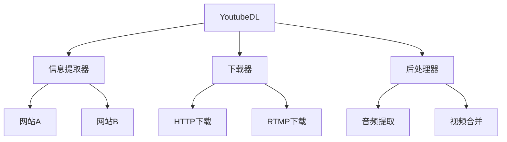
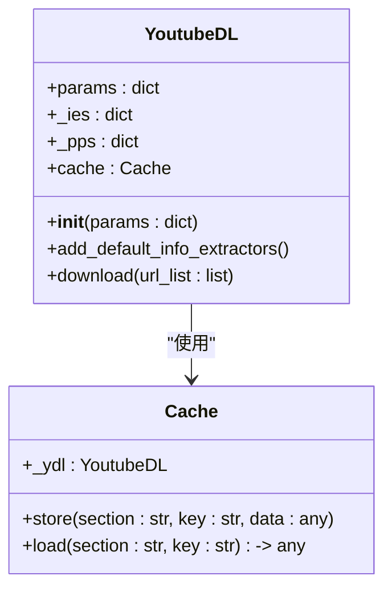
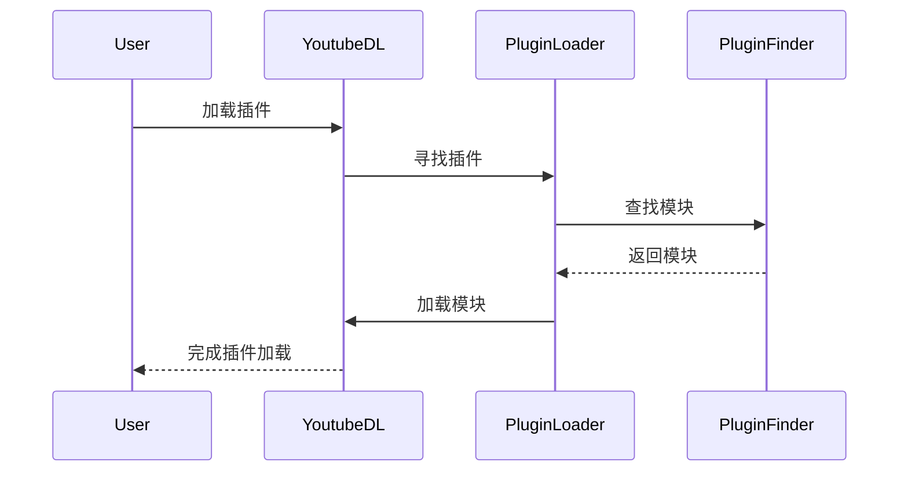
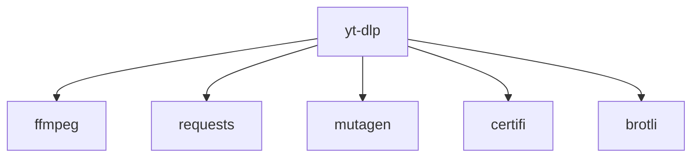

# 架构文档体系

<cite>
**本文档中引用的文件**   
- [README.md](file://README.md)
- [CONTRIBUTING.md](file://CONTRIBUTING.md)
- [yt_dlp/__init__.py](file://yt_dlp/__init__.py)
- [yt_dlp/YoutubeDL.py](file://yt_dlp/YoutubeDL.py)
- [yt_dlp/options.py](file://yt_dlp/options.py)
- [yt_dlp/globals.py](file://yt_dlp/globals.py)
- [yt_dlp/plugins.py](file://yt_dlp/plugins.py)
- [yt_dlp/cache.py](file://yt_dlp/cache.py)
- [yt_dlp/update.py](file://yt_dlp/update.py)
- [yt_dlp/version.py](file://yt_dlp/version.py)
</cite>

## 目录
1. [简介](#简介)
2. [项目结构](#项目结构)
3. [核心组件](#核心组件)
4. [架构概述](#架构概述)
5. [详细组件分析](#详细组件分析)
6. [依赖分析](#依赖分析)
7. [性能考虑](#性能考虑)
8. [故障排除指南](#故障排除指南)
9. [结论](#结论)

## 简介
yt-dlp 是一个功能丰富的命令行音视频下载器，支持数千个网站。该项目是 youtube-dl 的一个分支，基于已不再活跃的 youtube-dlc 项目。本项目旨在提供一个稳定、高效且功能强大的媒体下载解决方案。

**Section sources**
- [README.md](file://README.md#L1-L800)

## 项目结构
yt-dlp 项目的目录结构清晰，主要分为以下几个部分：
- `bundle/`: 包含用于构建可执行文件的脚本。
- `devscripts/`: 开发脚本，用于自动化任务如依赖安装、版本更新等。
- `test/`: 测试文件和测试数据。
- `yt_dlp/`: 核心代码库，包含下载器、提取器、后处理器等模块。
- 其他根目录文件如 `README.md`, `CONTRIBUTING.md` 等提供项目文档和贡献指南。

**Section sources**
- [README.md](file://README.md#L1-L800)

## 核心组件
yt-dlp 的核心组件包括 `YoutubeDL` 类、信息提取器（InfoExtractors）、下载器（Downloaders）和后处理器（PostProcessors）。这些组件协同工作，实现从网页中提取媒体信息并下载到本地的功能。

**Section sources**
- [yt_dlp/YoutubeDL.py](file://yt_dlp/YoutubeDL.py#L1-L800)
- [yt_dlp/__init__.py](file://yt_dlp/__init__.py#L1-L800)

## 架构概述
yt-dlp 的架构设计遵循模块化原则，各组件职责分明。`YoutubeDL` 类作为主控制器，负责协调信息提取、下载和后处理过程。信息提取器负责从特定网站提取媒体信息，下载器负责实际的文件下载，后处理器则对下载后的文件进行进一步处理。

**Diagram sources**
- [yt_dlp/YoutubeDL.py](file://yt_dlp/YoutubeDL.py#L1-L800)

**Section sources**
- [yt_dlp/YoutubeDL.py](file://yt_dlp/YoutubeDL.py#L1-L800)

## 详细组件分析
### YoutubeDL 类分析
`YoutubeDL` 类是 yt-dlp 的核心，负责管理整个下载流程。它通过参数配置来控制行为，并与信息提取器、下载器和后处理器交互。

#### 类图

**Diagram sources**
- [yt_dlp/YoutubeDL.py](file://yt_dlp/YoutubeDL.py#L1-L800)
- [yt_dlp/cache.py](file://yt_dlp/cache.py#L1-L92)

**Section sources**
- [yt_dlp/YoutubeDL.py](file://yt_dlp/YoutubeDL.py#L1-L800)
- [yt_dlp/cache.py](file://yt_dlp/cache.py#L1-L92)

### 插件系统分析
yt-dlp 支持插件系统，允许用户扩展功能。插件通过 `plugins.py` 文件加载和管理。

#### 序列图

**Diagram sources**
- [yt_dlp/plugins.py](file://yt_dlp/plugins.py#L1-L248)

**Section sources**
- [yt_dlp/plugins.py](file://yt_dlp/plugins.py#L1-L248)

## 依赖分析
yt-dlp 依赖于多个外部库和工具，如 `ffmpeg` 用于音视频处理，`requests` 用于网络请求。这些依赖在 `README.md` 中有详细说明。

**Diagram sources**
- [README.md](file://README.md#L1-L800)

**Section sources**
- [README.md](file://README.md#L1-L800)

## 性能考虑
yt-dlp 在设计时考虑了性能优化，例如通过缓存机制减少重复请求，使用多线程下载分段媒体文件等。

## 故障排除指南
当遇到问题时，建议首先检查是否使用了最新版本。可以通过 `yt-dlp -U` 命令更新。如果问题仍然存在，可以查看详细的日志输出以获取更多信息。

**Section sources**
- [CONTRIBUTING.md](file://CONTRIBUTING.md#L1-L790)

## 结论
yt-dlp 是一个功能强大且灵活的媒体下载工具，其模块化设计使得扩展和维护变得容易。通过深入了解其架构和组件，开发者可以更好地利用和贡献于该项目。