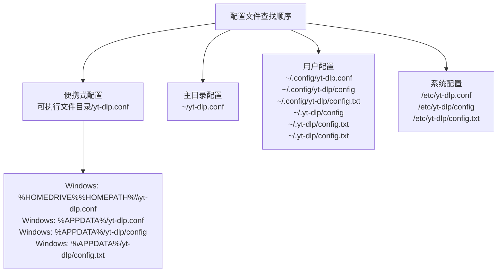

# 示例配置

<cite>
**本文档中引用的文件**
- [YoutubeDL.py](file://yt_dlp/YoutubeDL.py)
- [options.py](file://yt_dlp/options.py)
- [test_config.py](file://test/test_config.py)
- [utils/_utils.py](file://yt_dlp/utils/_utils.py)
- [ffmpeg.py](file://yt_dlp/postprocessor/ffmpeg.py)
- [README.md](file://README.md)
</cite>

## 目录
1. [简介](#简介)
2. [配置文件位置](#配置文件位置)
3. [基础配置示例](#基础配置示例)
4. [高级配置场景](#高级配置场景)
5. [批量下载自动化配置](#批量下载自动化配置)
6. [高质量媒体归档配置](#高质量媒体归档配置)
7. [隐私保护模式配置](#隐私保护模式配置)
8. [离线观看优化配置](#离线观看优化配置)
9. [复杂配置组合](#复杂配置组合)
10. [配置文件模板](#配置文件模板)
11. [故障排除指南](#故障排除指南)

## 简介

yt-dlp 提供了灵活的配置系统，支持通过配置文件、命令行参数和环境变量进行设置。本文档提供了针对不同使用场景的完整配置文件范例，帮助用户快速上手并充分利用 yt-dlp 的功能。

配置系统采用层次化结构，优先级从高到低为：命令行参数 > 用户配置文件 > 系统配置文件 > 默认值。配置文件支持多种格式，包括纯文本格式和注释支持。

## 配置文件位置

yt-dlp 按以下顺序查找配置文件（优先级递减）：



**图表来源**
- [test_config.py](file://test/test_config.py#L38-L85)
- [utils/_utils.py](file://yt_dlp/utils/_utils.py#L4713-L4727)

**节来源**
- [test_config.py](file://test/test_config.py#L38-L85)
- [utils/_utils.py](file://yt_dlp/utils/_utils.py#L4713-L4727)

## 基础配置示例

### 最小化配置

适用于基本下载需求的基础配置：

```bash
# 基础输出设置
-o "%(uploader)s/%(title)s.%(ext)s"

# 格式选择
-f "bestvideo[height<=1080]+bestaudio/best"

# 后处理设置
-x --audio-format mp3 --audio-quality 0
```

### 中等复杂度配置

包含更多选项的综合配置：

```bash
# 输出模板
-o "%(uploader)s/%(upload_date)s-%(title)s.%(ext)s"

# 格式选择
-f "bestvideo[height<=1440]+bestaudio/best"
-S "res:1440"

# 质量控制
-r 50M --retries 5

# 后处理
-x --audio-format mp3 --audio-quality 0
--embed-thumbnail --add-metadata

# 文件管理
--write-description --write-info-json --write-thumbnail
--no-overwrites
```

## 高级配置场景

### 多格式输出配置

```bash
# 主要格式
-o "%(title)s.%(ext)s"
-f "bestvideo[height<=1080]+bestaudio/best"

# 额外格式备份
--merge-output-format mp4
--recode-video mp4,mkv
--remux-video mp4,mkv

# 分辨率选择
-S "res:1080,res:720,res:480"

# 音频质量
--audio-format mp3 --audio-quality 0
--extract-audio
```

### 批量处理配置

```bash
# 批量下载设置
-i --no-abort-on-error
--continue --no-overwrites

# 输出组织
-o "%(uploader)s/%(playlist)s/%(title)s.%(ext)s"
--parse-metadata "%(title)s:%(title)s [%(uploader)s]"

# 进度控制
--sleep-interval 10 --max-sleep-interval 60
--wait-for-video 300-600

# 错误处理
--retry-sleep 5 --fragment-retries 10
```

## 批量下载自动化配置

### 完整自动化配置

```bash
# 自动化设置
-i --no-abort-on-error
--continue --no-overwrites
--no-check-certificate

# 输出模板
-o "%(uploader)s/%(upload_date)s-%(title)s.%(ext)s"
--output-na-placeholder "unknown"

# 格式选择
-f "bestvideo[height<=1080]+bestaudio/best"
-S "res:1080,res:720,res:480"

# 质量控制
-r 50M --retries 5
--fragment-retries 3
--buffer-size 1024K

# 后处理
-x --audio-format mp3 --audio-quality 0
--embed-thumbnail --add-metadata
--write-description --write-info-json

# 文件管理
--write-thumbnail --write-all-thumbnails
--write-link --write-url-link
--write-webloc-link --write-desktop-link

# 网络优化
--socket-timeout 30
--source-address 0.0.0.0
--user-agent "Mozilla/5.0 (compatible; yt-dlp)"

# 进度控制
--sleep-interval 10 --max-sleep-interval 60
--progress-template "download:%(progress._percent_str)s %(info.speed)s"

# 日志记录
--verbose --no-warnings
--logger-name "yt-dlp-automation"
```

### 企业级批量配置

```bash
# 企业环境设置
--no-check-certificate
--no-warnings
--no-progress

# 输出组织
-o "/data/downloads/%(uploader)s/%(upload_date)s-%(title)s.%(ext)s"
--paths "/data/downloads"

# 并发控制
--concurrent-fragments 3
--hls-use-mpegts

# 存储优化
--no-part --no-resize-buffer
--http-chunk-size 1024K

# 监控集成
--progress-template "download:%(progress._percent_str)s %(info.speed)s"
--progress-display percentage

# 错误恢复
--retry-sleep 10 --fragment-retries 5
--retries 3 --file-access-retries 3

# 性能调优
--buffer-size 2048K
--http-chunk-size 2048K
--concurrent-fragments 4
```

**节来源**
- [YoutubeDL.py](file://yt_dlp/YoutubeDL.py#L150-L400)
- [options.py](file://yt_dlp/options.py#L81-L110)

## 高质量媒体归档配置

### 无损质量配置

```bash
# 无损格式选择
-o "%(title)s [%(id)s].%(ext)s"
-f "bestvideo[height<=4320]+bestaudio/best"

# 高质量音频
--audio-format flac --audio-quality 0
--extract-audio

# 视频质量保持
--remux-video mkv
--merge-output-format mkv

# 元数据保留
--embed-thumbnail --add-metadata
--write-description --write-info-json
--write-all-thumbnails

# 完整字幕
--write-subtitles --all-subs
--write-automatic-subs
--subtitles-lang en,zh-CN

# 文件完整性检查
--check-formats
--no-check-certificates
```

### 专业媒体库配置

```bash
# 专业输出模板
-o "/media/library/%(uploader)s/%(upload_date)s-%(title)s.%(ext)s"
--paths "/media/library"

# 多格式兼容
-f "bestvideo[height<=2160]+bestaudio/best"
-S "res:2160,res:1440,res:1080,res:720"

# 高质量编码
--remux-video mkv --merge-output-format mkv
--recode-video mkv,mp4
--audio-format flac --audio-quality 0

# 完整元数据
--embed-thumbnail --add-metadata
--write-description --write-info-json
--write-all-thumbnails
--write-link

# 字幕完整性
--write-subtitles --all-subs
--write-automatic-subs
--subtitles-lang all
--convert-subs ass,srt

# 质量保证
--check-formats --skip-unavailable-fragments
--abort-on-error
```

## 隐私保护模式配置

### 匿名下载配置

```bash
# 隐私保护设置
--no-warn-self-signed
--no-check-certificates
--no-cache-dir

# 地理位置隐藏
--geo-bypass
--geo-bypass-country US
--geo-verification-proxy http://proxy.example.com:8080

# 网络匿名化
--proxy socks5://127.0.0.1:1080
--source-address 0.0.0.0

# 用户体验保护
--no-playlist
--flat-playlist
--no-wait-for-video

# 数据最小化
--no-write-description
--no-write-info-json
--no-write-thumbnail
--no-write-link
```

### 安全审计配置

```bash
# 安全设置
--no-check-certificates
--no-cache-dir
--no-warnings

# 网络安全
--proxy ""
--source-address 0.0.0.0
--user-agent "Mozilla/5.0 (compatible; SecurityAudit)"

# 记录详细
--verbose
--logger-name "security-audit"
--progress-template "audit:%(progress._percent_str)s %(info.speed)s"

# 数据保护
--no-overwrites
--continue
--no-part

# 审计跟踪
--write-description --write-info-json
--write-thumbnail
--write-link
```

## 离线观看优化配置

### 移动设备优化配置

```bash
# 移动设备友好设置
-o "%(title)s.%(ext)s"
-f "bestvideo[height<=720]+bestaudio/best"

# 移动端优化
--remux-video mp4
--merge-output-format mp4
--audio-format mp3 --audio-quality 2

# 文件大小控制
-r 50M --retries 3
--buffer-size 512K

# 移动端特性
--write-subtitles --subtitles-lang en
--write-automatic-subs
--embed-thumbnail

# 下载效率
--concurrent-fragments 2
--hls-use-mpegts
--no-check-certificates
```

### 流媒体优化配置

```bash
# 流媒体优化
-o "%(title)s.%(ext)s"
-f "bestvideo[height<=1080][fps<=60]+bestaudio/best"

# 编码优化
--remux-video mp4
--merge-output-format mp4
--audio-format aac --audio-quality 2

# 网络适应
--rate-limit 1M
--retries 3
--fragment-retries 5

# 质量平衡
-S "res:1080,fps:60,res:720,fps:30"
--adapt-single-streams

# 下载控制
--concurrent-fragments 1
--hls-use-mpegts
--no-check-certificates
```

**节来源**
- [options.py](file://yt_dlp/options.py#L1565-L1588)
- [ffmpeg.py](file://yt_dlp/postprocessor/ffmpeg.py#L445-L470)

## 复杂配置组合

### 格式选择与后处理协同配置

```bash
# 组合配置：高质量视频 + 音频转换
-o "%(title)s [%(id)s].%(ext)s"
-f "bestvideo[height<=2160]+bestaudio/best"

# 视频处理
--remux-video mkv --merge-output-format mkv
--recode-video mkv,mp4
--fixup detect_or_warn

# 音频处理
-x --audio-format mp3 --audio-quality 0
--extract-audio
--embed-metadata

# 质量保证
--check-formats
--skip-unavailable-fragments
--prefer-free-formats

# 输出优化
--write-description --write-info-json
--write-thumbnail --write-all-thumbnails
--write-subtitles --all-subs
```

### 多源下载网络优化配置

```bash
# 多源优化配置
-o "%(title)s.%(ext)s"
-f "bestvideo[height<=1440]+bestaudio/best"

# 网络优化
--socket-timeout 30
--source-address 0.0.0.0
--user-agent "Mozilla/5.0 (compatible; MultiSourceOpt)"

# 并发控制
--concurrent-fragments 4
--hls-use-mpegts
--http-chunk-size 1024K

# 错误恢复
--retry-sleep 5 --fragment-retries 10
--retries 5 --file-access-retries 3

# 质量监控
--check-formats
--min-filesize 1M
--max-filesize 5G

# 输出管理
--write-description --write-info-json
--write-thumbnail
--write-link
```

### 条件过滤与格式选择配置

```bash
# 条件过滤配置
-o "%(title)s.%(ext)s"
-f "bestvideo[height<=1080]+bestaudio/best"

# 时间范围过滤
--dateafter now-7days
--datebefore now

# 质量过滤
--min-views 100
--max-views 1000000
--age-limit 18

# 内容过滤
--match-filters "like_count>?100 & comment_count>?10"
--reject-title "(广告|教程|免费|试看)"

# 格式偏好
-S "res:1080,res:720,res:480"
--prefer-free-formats
```

## 配置文件模板

### 通用工作区配置

```bash
# ==============================
# yt-dlp 通用工作区配置
# ==============================

# 基础设置
--no-warnings
--no-check-certificate
--no-cache-dir

# 输出模板
-o "%(uploader)s/%(upload_date)s-%(title)s.%(ext)s"
--output-na-placeholder "unknown"

# 格式选择
-f "bestvideo[height<=1440]+bestaudio/best"
-S "res:1440,res:1080,res:720,res:480"

# 质量控制
-r 100M --retries 5
--fragment-retries 3
--buffer-size 1024K

# 后处理
-x --audio-format mp3 --audio-quality 0
--embed-thumbnail --add-metadata

# 文件管理
--write-description --write-info-json
--write-thumbnail --write-all-thumbnails
--write-link

# 网络设置
--socket-timeout 30
--source-address 0.0.0.0
--user-agent "Mozilla/5.0 (compatible; yt-dlp)"

# 进度控制
--sleep-interval 10 --max-sleep-interval 60
--progress-template "download:%(progress._percent_str)s %(info.speed)s"

# 错误处理
--retry-sleep 5 --fragment-retries 10
--ignore-errors
```

### 专业媒体库配置

```bash
# ==============================
# yt-dlp 专业媒体库配置
# ==============================

# 企业级设置
--no-check-certificates
--no-warnings
--no-progress

# 输出路径
-o "/media/library/%(uploader)s/%(upload_date)s-%(title)s.%(ext)s"
--paths "/media/library"

# 格式要求
-f "bestvideo[height<=2160]+bestaudio/best"
-S "res:2160,res:1440,res:1080,res:720"

# 音频质量
--audio-format flac --audio-quality 0
--extract-audio

# 视频质量
--remux-video mkv --merge-output-format mkv
--recode-video mkv,mp4

# 元数据
--embed-thumbnail --add-metadata
--write-description --write-info-json
--write-all-thumbnails
--write-link

# 质量保证
--check-formats --skip-unavailable-fragments
--abort-on-error

# 错误恢复
--retry-sleep 10 --fragment-retries 5
--retries 3 --file-access-retries 3

# 性能优化
--buffer-size 2048K
--http-chunk-size 2048K
--concurrent-fragments 4
```

### 个人学习配置

```bash
# ==============================
# yt-dlp 个人学习配置
# ==============================

# 学习友好设置
--no-abort-on-error
--continue --no-overwrites

# 输出组织
-o "%(uploader)s/%(upload_date)s-%(title)s.%(ext)s"
--output-na-placeholder "unknown"

# 格式选择
-f "bestvideo[height<=1080]+bestaudio/best"
-S "res:1080,res:720,res:480"

# 学习辅助
-x --audio-format mp3 --audio-quality 2
--write-subtitles --all-subs
--write-automatic-subs
--subtitles-lang en,zh-CN

# 文件完整性
--write-description --write-info-json
--write-thumbnail --write-all-thumbnails

# 效率优化
--concurrent-fragments 2
--hls-use-mpegts
--sleep-interval 5 --max-sleep-interval 30

# 错误处理
--retry-sleep 3 --fragment-retries 5
--retries 3
```

## 故障排除指南

### 常见配置问题

#### 1. 格式选择冲突

**问题症状：**
```
ERROR: No video formats found
```

**解决方案：**
```bash
# 使用更宽松的格式选择
-f "bestvideo+bestaudio/best"

# 或者指定具体格式
-f "mp4/720p/mp3"
```

#### 2. 网络连接问题

**问题症状：**
```
ERROR: Unable to download webpage
```

**解决方案：**
```bash
# 添加代理设置
--proxy http://proxy.example.com:8080

# 增加超时时间
--socket-timeout 60

# 使用备用用户代理
--user-agent "Mozilla/5.0 (Windows NT 10.0; Win64; x64)"
```

#### 3. 存储空间不足

**问题症状：**
```
ERROR: [Errno 28] No space left on device
```

**解决方案：**
```bash
# 限制并发下载
--concurrent-fragments 1

# 减少缓冲区大小
--buffer-size 512K

# 设置最大文件大小
--max-filesize 1G
```

#### 4. 权限问题

**问题症状：**
```
ERROR: [Errno 13] Permission denied
```

**解决方案：**
```bash
# 检查输出路径权限
--paths "/tmp/yt-dlp"

# 使用相对路径
-o "./downloads/%(title)s.%(ext)s"

# 禁用写入操作
--skip-download
```

### 配置验证工具

```bash
# 验证配置语法
yt-dlp --ignore-config --print-json URL

# 测试格式选择
yt-dlp --list-formats URL

# 检查网络连接
yt-dlp --simulate URL

# 验证输出模板
yt-dlp --simulate --print filename URL
```

### 性能调优建议

#### 1. 网络优化

```bash
# TCP窗口缩放
--source-address 0.0.0.0

# 并发控制
--concurrent-fragments 4

# 缓冲区优化
--buffer-size 2048K
--http-chunk-size 1024K
```

#### 2. 存储优化

```bash
# 文件系统优化
--no-part --no-resize-buffer

# 压缩设置
--remux-video mp4 --merge-output-format mp4
```

#### 3. 内存优化

```bash
# 内存使用控制
--no-mtime --no-part

# 缓存策略
--no-cache-dir
```

**节来源**
- [YoutubeDL.py](file://yt_dlp/YoutubeDL.py#L150-L400)
- [options.py](file://yt_dlp/options.py#L81-L110)
- [utils/_utils.py](file://yt_dlp/utils/_utils.py#L4920-L4945)