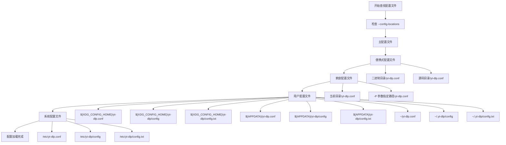
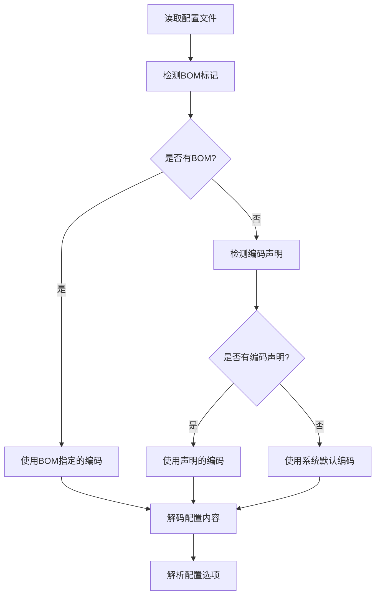
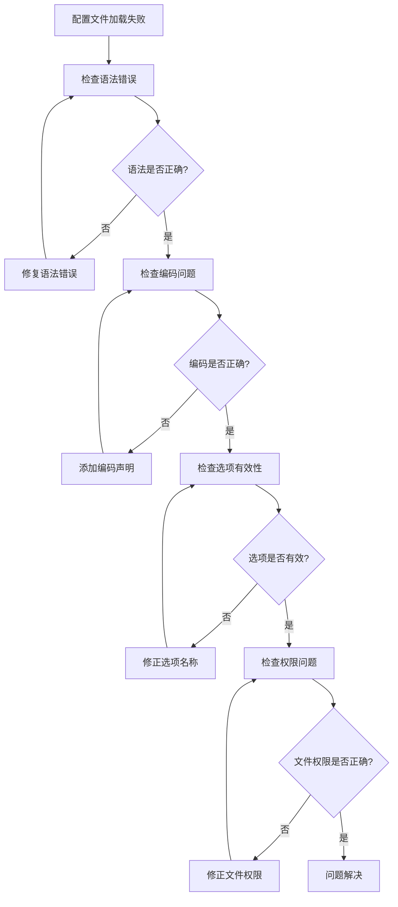

# 配置文件语法

<cite>
**本文档中引用的文件**
- [YoutubeDL.py](file://yt_dlp/YoutubeDL.py)
- [options.py](file://yt_dlp/options.py)
- [utils/_utils.py](file://yt_dlp/utils/_utils.py)
- [test_config.py](file://test/test_config.py)
- [README.md](file://README.md)
</cite>

## 目录
1. [简介](#简介)
2. [配置文件格式](#配置文件格式)
3. [配置文件查找路径](#配置文件查找路径)
4. [配置项语法](#配置项语法)
5. [数据类型和结构](#数据类型和结构)
6. [配置文件编码](#配置文件编码)
7. [配置文件示例](#配置文件示例)
8. [语法错误和调试](#语法错误和调试)
9. [最佳实践](#最佳实践)

## 简介

yt-dlp 支持多种配置文件格式，允许用户通过配置文件持久化设置，避免每次运行时重复输入相同的命令行选项。配置文件系统采用分层架构，支持系统级、用户级和项目级配置，具有灵活的优先级机制。

## 配置文件格式

### 支持的文件格式

yt-dlp 主要支持以下配置文件格式：

| 格式 | 文件扩展名 | 描述 |
|------|------------|------|
| 文本格式 | `.conf` | 最常用的纯文本配置格式 |
| 文本格式 | `.conf.txt` | 带有.txt后缀的配置文件 |
| JSON格式 | `.json` | 结构化的JSON配置文件 |
| YAML格式 | `.yaml`, `.yml` | 结构化的YAML配置文件 |

### 文本格式配置文件

最常用的配置文件格式是纯文本格式，使用简单的键值对或命令行选项格式：

```bash
# 注释行以 # 开头
# 基本选项
-o ~/Downloads/%(title)s.%(ext)s
-x
--audio-format mp3
--proxy 127.0.0.1:3128

# 复杂选项
--match-filters "like_count>?100 & description~=\'(?i)\\bcats \\& dogs\\b\'"
--postprocessor-args "ffmpeg:-c:v libx264 -crf 23"
```

### JSON格式配置文件

支持标准的JSON格式配置：

```json
{
    "output": "~/Downloads/%(title)s.%(ext)s",
    "extract-audio": true,
    "audio-format": "mp3",
    "proxy": "127.0.0.1:3128",
    "match-filters": "like_count>?100 & description~=\'(?i)\\bcats \\& dogs\\b\'"
}
```

### YAML格式配置文件

支持YAML格式配置：

```yaml
output: ~/Downloads/%(title)s.%(ext)s
extract-audio: true
audio-format: mp3
proxy: 127.0.0.1:3128
match-filters: "like_count>?100 & description~=\'(?i)\\bcats \\& dogs\\b\'"
```

**节来源**
- [utils/_utils.py](file://yt_dlp/utils/_utils.py#L4878-L4918)
- [options.py](file://yt_dlp/options.py#L55-L79)

## 配置文件查找路径

yt-dlp 按照特定的优先级顺序查找配置文件：



**图表来源**
- [options.py](file://yt_dlp/options.py#L81-L110)
- [test_config.py](file://test/test_config.py#L38-L85)

### 配置文件优先级

配置文件按以下优先级加载（高优先级覆盖低优先级）：

1. **命令行参数** (`Override`)
2. **主配置文件** (`Main`)
3. **便携式配置文件** (`Portable`)
4. **家庭配置文件** (`Home`)
5. **用户配置文件** (`User`)
6. **系统配置文件** (`System`)

### 环境变量影响

配置文件路径受以下环境变量影响：

| 环境变量 | 默认值 | 描述 |
|----------|--------|------|
| `XDG_CONFIG_HOME` | `~/.config` | XDG配置目录 |
| `APPDATA` | Windows应用数据目录 | Windows应用程序数据 |
| `HOME` | 用户主目录 | Unix/Linux用户主目录 |

**节来源**
- [options.py](file://yt_dlp/options.py#L81-L110)
- [utils/_utils.py](file://yt_dlp/utils/_utils.py#L4713-L4729)

## 配置项语法

### 命令行选项映射

配置文件中的选项必须与命令行选项完全匹配，遵循以下规则：

#### 基本语法规则

| 规则 | 示例 | 说明 |
|------|------|------|
| 无空格 | `-o` | 选项之间不能有空格 |
| 正确格式 | `--proxy 127.0.0.1:3128` | 选项和值之间用空格分隔 |
| 引号处理 | `"--match-filters title~=\'video\'"` | 特殊字符需要引号 |
| 注释 | `# 这是一个注释` | 以 # 开头的行被忽略 |

#### 选项命名规范

配置文件中的选项名称必须与命令行选项完全一致：

```bash
# 正确的选项格式
-o ~/Downloads/%(title)s.%(ext)s
--extract-audio
--audio-format mp3
--proxy 127.0.0.1:3128
--match-filters "like_count>?100"
--postprocessor-args "ffmpeg:-c:v libx264 -crf 23"
```

### 特殊选项处理

#### 忽略配置文件

```bash
# 禁用所有配置文件
--ignore-config
```

#### 配置文件位置

```bash
# 指定配置文件位置
--config-locations /path/to/config.conf
--config-locations ~/.config/yt-dlp/config
```

#### 输出模板

```bash
# 输出模板配置
-o ~/Downloads/%(title)s.%(ext)s
-o "Playlist/%(playlist_title)s/%(title)s.%(ext)s"
```

**节来源**
- [options.py](file://yt_dlp/options.py#L55-L79)
- [README.md](file://README.md#L1145-L1200)

## 数据类型和结构

### 基本数据类型

| 类型 | 描述 | 示例 |
|------|------|------|
| 字符串 | 文本值 | `-o ~/Downloads/%(title)s.%(ext)s` |
| 数字 | 整数或浮点数 | `--max-filesize 50M` |
| 布尔值 | 真假值 | `--extract-audio` (默认为true) |
| 数组 | 列表值 | `--postprocessor-args "ffmpeg:-c:v libx264"` |

### 嵌套结构支持

#### 字典结构

```bash
# JSON格式的字典配置
{
    "format-sort": ["res:1080", "fps:60", "br"],
    "paths": {
        "home": "~/Downloads",
        "temp": "/tmp"
    },
    "merge-output-format": "mp4"
}
```

#### 数组结构

```bash
# JSON格式的数组配置
{
    "postprocessor-args": {
        "ffmpeg": ["-c:v", "libx264", "-crf", "23"],
        "avconv": ["-c:v", "libx264"]
    }
}
```

### 配置项验证

yt-dlp 会验证配置项的有效性，并在遇到无效选项时报告错误：

```bash
# 错误示例：无效选项
--invalid-option value

# 正确示例：有效选项
--extract-audio
```

**节来源**
- [utils/_utils.py](file://yt_dlp/utils/_utils.py#L4878-L4918)

## 配置文件编码

### 编码检测机制

yt-dlp 使用智能编码检测机制来处理不同编码的配置文件：



**图表来源**
- [utils/_utils.py](file://yt_dlp/utils/_utils.py#L4878-L4918)

### 编码声明语法

在配置文件开头添加编码声明：

```bash
# coding: utf-8
# 或
# coding: shift-jis
# 或
# coding: gb2312

# 配置选项
-o ~/Downloads/%(title)s.%(ext)s
--extract-audio
```

### 支持的编码格式

| 编码 | 描述 | 用途 |
|------|------|------|
| UTF-8 | Unicode编码 | 推荐用于大多数情况 |
| UTF-16 | 双字节Unicode | 支持但不推荐 |
| UTF-32 | 四字节Unicode | 支持但不推荐 |
| GB2312 | 中文编码 | 适用于中文配置文件 |
| Shift-JIS | 日文编码 | 适用于日文配置文件 |

**节来源**
- [utils/_utils.py](file://yt_dlp/utils/_utils.py#L4878-L4918)

## 配置文件示例

### 基础配置文件

```bash
# yt-dlp基础配置文件
# 保存为 ~/.config/yt-dlp/config

# 输出设置
-o ~/Downloads/%(uploader)s/%(upload_date)s - %(title)s.%(ext)s
--restrict-filenames
--merge-output-format mp4

# 音频提取
-x
--audio-format mp3
--audio-quality 0

# 网络设置
--proxy 127.0.0.1:3128
--socket-timeout 30

# 下载行为
--continue
--no-overwrites
--retries 5
--buffer-size 1024K

# 格式选择
--format bestvideo[height<=1080]+bestaudio/best
--merge-output-format mp4

# 元数据
--write-description
--write-info-json
--write-thumbnail
--embed-thumbnail
```

### 高级配置文件

```bash
# yt-dlp高级配置文件
# 保存为 ~/.config/yt-dlp/config

# 路径配置
-p ~/Downloads
--paths temp:/tmp/yt-dlp

# 输出模板
-o "Videos/%(upload_date)s - %(title)s.%(ext)s"
--output-na-placeholder NA

# 批量下载控制
--max-downloads 100
--break-on-existing
--skip-playlist-after-errors 5

# 条件过滤
--match-filters "like_count>?100 & view_count>?1000"
--dateafter now-7days
--age-limit 13

# 后处理器配置
--postprocessor-args "ffmpeg:-c:v libx264 -crf 23 -preset veryfast"
--postprocessor-args "embedthumbnail:"
--add-metadata

# 认证配置
-u username
-p password
--netrc

# 并发控制
--concurrent-fragments 3
--hls-split-discontinuity
```

### JSON格式配置文件

```json
{
    "output": "~/Downloads/%(uploader)s/%(upload_date)s - %(title)s.%(ext)s",
    "restrict_filenames": true,
    "merge_output_format": "mp4",
    "extract_audio": true,
    "audio_format": "mp3",
    "audio_quality": 0,
    "proxy": "127.0.0.1:3128",
    "socket_timeout": 30,
    "continue_dl": true,
    "no_overwrites": true,
    "retries": 5,
    "buffersize": "1024K",
    "format": "bestvideo[height<=1080]+bestaudio/best",
    "write_description": true,
    "write_info_json": true,
    "write_thumbnail": true,
    "embed_thumbnail": true,
    "match_filters": [
        "like_count>?100",
        "view_count>?1000"
    ],
    "dateafter": "now-7days",
    "age_limit": 13,
    "postprocessor_args": {
        "ffmpeg": ["-c:v", "libx264", "-crf", "23", "-preset", "veryfast"],
        "embedthumbnail": []
    },
    "add_metadata": true
}
```

**节来源**
- [README.md](file://README.md#L1145-L1200)

## 语法错误和调试

### 常见语法错误

#### 1. 选项格式错误

```bash
# 错误：选项之间有空格
-o ~/Downloads/%(title)s.%(ext)s  # 错误

# 正确：选项之间没有空格
-o ~/Downloads/%(title)s.%(ext)s  # 正确
```

#### 2. 引号使用错误

```bash
# 错误：引号不匹配
--match-filters 'like_count>?100"

# 正确：引号匹配
--match-filters "like_count>?100"
```

#### 3. 注释语法错误

```bash
# 错误：注释前有空格
 o ~/Downloads/%(title)s.%(ext)s  # 错误

# 正确：注释以 # 开头
# 输出模板
-o ~/Downloads/%(title)s.%(ext)s  # 正确
```

#### 4. 编码问题

```bash
# 错误：编码声明位置不正确
-o ~/Downloads/%(title)s.%(ext)s
# coding: utf-8  # 错误位置

# 正确：编码声明在文件开头
# coding: utf-8
-o ~/Downloads/%(title)s.%(ext)s
```

### 调试方法

#### 1. 启用详细输出

```bash
# 查看配置文件加载过程
yt-dlp --verbose --ignore-config
```

#### 2. 检查配置文件语法

```bash
# 测试配置文件语法
yt-dlp --config-locations /path/to/config.conf --simulate
```

#### 3. 分步调试

```bash
# 逐步启用配置项
# 1. 先测试基本功能
yt-dlp --simulate URL

# 2. 添加输出配置
yt-dlp --output ~/Downloads/%(title)s.%(ext)s --simulate URL

# 3. 添加其他配置项
```

### 错误诊断流程



**节来源**
- [utils/_utils.py](file://yt_dlp/utils/_utils.py#L4878-L4918)
- [options.py](file://yt_dlp/options.py#L55-L79)

## 最佳实践

### 配置文件组织

#### 1. 分层配置策略

```bash
# 系统级配置 (/etc/yt-dlp/config)
# 基础网络设置和安全限制

# 用户级配置 (~/.config/yt-dlp/config)
# 个人偏好设置

# 项目级配置 (项目根目录/yt-dlp.conf)
# 特定项目的下载需求
```

#### 2. 配置文件命名规范

```bash
# 推荐命名
~/.config/yt-dlp/config          # 主配置文件
~/.config/yt-dlp/config.txt      # 文本格式配置
~/.config/yt-dlp/config.json     # JSON格式配置
~/.config/yt-dlp/config.yaml     # YAML格式配置
```

#### 3. 配置文件版本控制

```bash
# 将配置文件纳入版本控制
git add ~/.config/yt-dlp/config
git commit -m "Update yt-dlp configuration"
```

### 性能优化建议

#### 1. 合理的并发设置

```bash
# 避免过高的并发设置
--concurrent-fragments 3
--max-fragments 5
```

#### 2. 网络优化

```bash
# 设置合理的超时时间
--socket-timeout 30
--retry-sleep 1

# 使用代理时的优化
--proxy 127.0.0.1:3128
--user-agent "Mozilla/5.0..."
```

#### 3. 存储优化

```bash
# 合理的缓冲区大小
--buffer-size 1024K

# 避免频繁的磁盘操作
--no-mtime
```

### 安全考虑

#### 1. 敏感信息保护

```bash
# 不要在配置文件中存储敏感信息
# 使用认证文件或环境变量
--netrc
--netrc-location ~/.netrc
```

#### 2. 文件权限设置

```bash
# 设置适当的文件权限
chmod 600 ~/.config/yt-dlp/config
chmod 700 ~/.config/yt-dlp/
```

#### 3. 配置文件备份

```bash
# 定期备份配置文件
cp ~/.config/yt-dlp/config ~/.config/yt-dlp/config.backup
```

### 维护和更新

#### 1. 配置文件检查清单

- [ ] 语法正确性检查
- [ ] 选项有效性验证  
- [ ] 编码格式确认
- [ ] 权限设置检查
- [ ] 备份完整性验证

#### 2. 版本兼容性

```bash
# 检查配置文件与新版本的兼容性
yt-dlp --version
yt-dlp --help | grep -i deprecated
```

#### 3. 配置文件迁移

```bash
# 从旧版本迁移配置
# 1. 备份现有配置
cp ~/.config/yt-dlp/config ~/.config/yt-dlp/config.old

# 2. 更新配置格式
# 3. 测试新配置
```

**节来源**
- [options.py](file://yt_dlp/options.py#L81-L110)
- [utils/_utils.py](file://yt_dlp/utils/_utils.py#L4878-L4918)