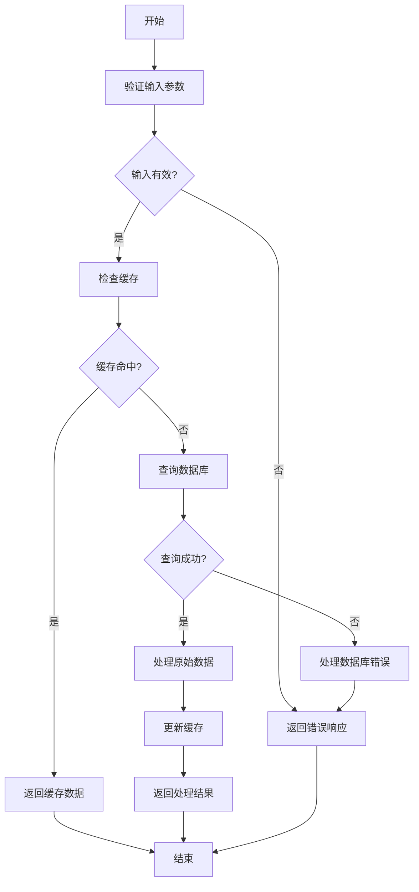
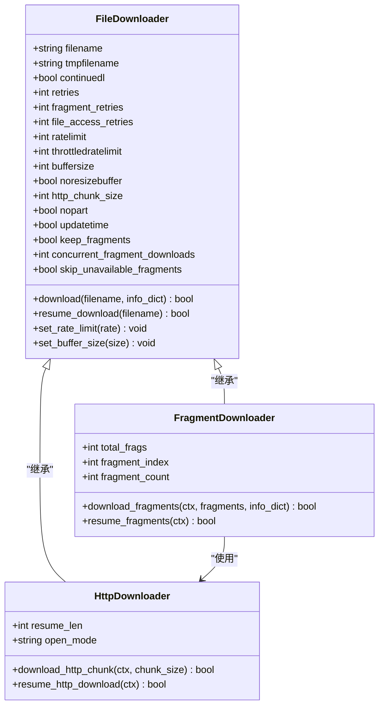
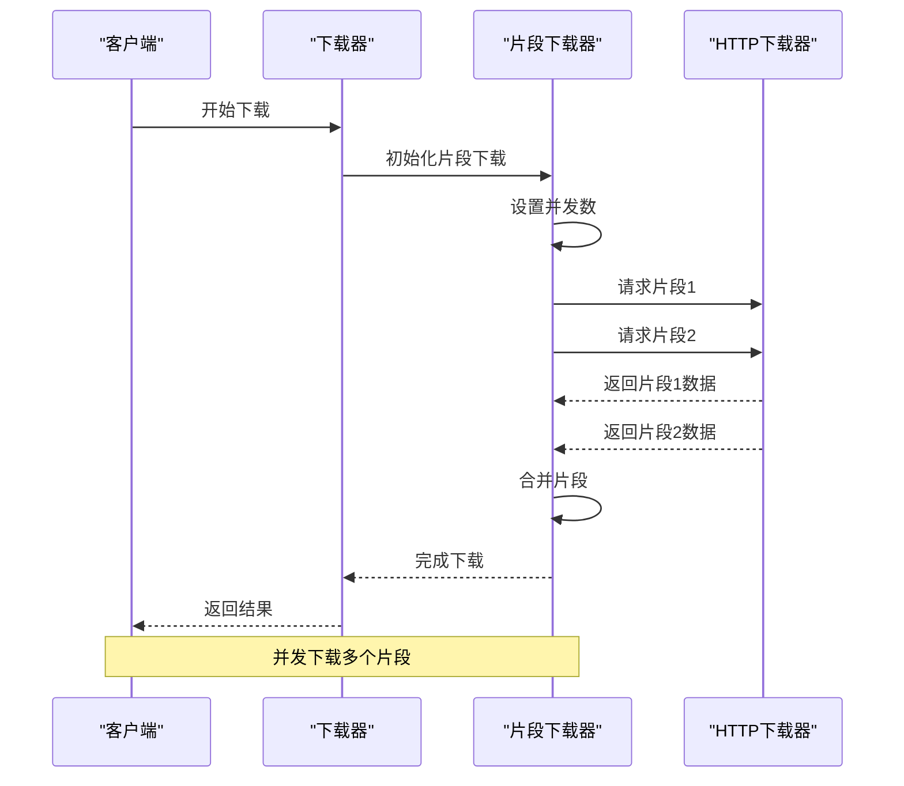
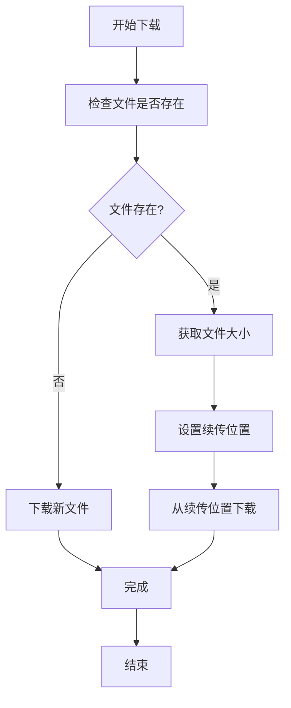

# 下载设置

<cite>
**本文档中引用的文件**   
- [options.py](file://yt_dlp/options.py)
- [YoutubeDL.py](file://yt_dlp/YoutubeDL.py)
- [common.py](file://yt_dlp/downloader/common.py)
- [http.py](file://yt_dlp/downloader/http.py)
- [fragment.py](file://yt_dlp/downloader/fragment.py)
</cite>

## 目录
1. [简介](#简介)
2. [路径管理](#路径管理)
3. [文件覆盖策略](#文件覆盖策略)
4. [分段下载](#分段下载)
5. [下载限速](#下载限速)
6. [断点续传](#断点续传)
7. [配置示例](#配置示例)

## 简介
本文档详细介绍了 yt-dlp 的下载配置选项，重点涵盖路径管理、文件覆盖策略、分段下载、下载限速和断点续传等核心功能。这些选项允许用户精确控制下载行为和文件系统操作，以满足不同的使用场景需求。

**Section sources**
- [YoutubeDL.py](file://yt_dlp/YoutubeDL.py#L214-L221)
- [options.py](file://yt_dlp/options.py#L546-L560)

## 路径管理
路径管理功能允许用户自定义下载文件的存储位置和命名规则。通过 `paths` 和 `outtmpl` 选项，可以灵活地组织下载内容。

### 输出模板 (outtmpl)
`outtmpl` 选项定义了下载文件的命名模板。模板支持多种元数据字段，如标题、ID、扩展名等。例如，`%(title)s [%(id)s].%(ext)s` 是默认的输出模板。



**Diagram sources **
- [YoutubeDL.py](file://yt_dlp/YoutubeDL.py#L1138-L1160)
- [YoutubeDL.py](file://yt_dlp/YoutubeDL.py#L1420-L1449)

### 路径配置 (paths)
`paths` 选项允许用户指定不同类型的文件存储路径。支持的类型包括 `home`（主路径）和 `temp`（临时路径）。所有中间文件首先下载到临时路径，下载完成后移动到主路径。

**Section sources**
- [options.py](file://yt_dlp/options.py#L1333-L1359)
- [YoutubeDL.py](file://yt_dlp/YoutubeDL.py#L1138-L1160)

## 文件覆盖策略
文件覆盖策略控制当目标文件已存在时的行为。通过 `overwrites` 选项，用户可以决定是否覆盖现有文件。

### 覆盖选项
- `--overwrites`: 覆盖所有视频和元数据文件
- `--no-overwrites`: 不覆盖任何文件
- `--no-force-overwrites`: 不覆盖视频文件，但覆盖相关文件（默认）



**Diagram sources **
- [options.py](file://yt_dlp/options.py#L1410-L1440)
- [YoutubeDL.py](file://yt_dlp/YoutubeDL.py#L804-L830)

## 分段下载
分段下载功能允许同时下载视频的多个片段，提高下载效率。这对于 DASH 和 HLS 流媒体特别有用。

### 并发片段下载
`concurrent_fragment_downloads` 选项控制同时下载的片段数量。默认值为 1，表示顺序下载。增加此值可以提高下载速度，但也会增加系统资源消耗。



**Diagram sources **
- [options.py](file://yt_dlp/options.py#L961-L985)
- [fragment.py](file://yt_dlp/downloader/fragment.py#L364-L389)

## 下载限速
下载限速功能允许用户控制下载速度，避免占用过多带宽。

### 速率限制
`ratelimit` 选项设置最大下载速率（字节/秒）。例如，`50K` 表示 50 KB/s，`4.2M` 表示 4.2 MB/s。这有助于在共享网络环境中平衡带宽使用。

### 节流检测
`throttledratelimit` 选项设置最低下载速率，低于此速率时认为发生了节流，需要重新提取视频数据。

**Section sources**
- [options.py](file://yt_dlp/options.py#L961-L985)
- [common.py](file://yt_dlp/downloader/common.py#L200-L229)

## 断点续传
断点续传功能允许从中断处继续下载，避免重新下载已下载的部分。

### 续传机制
`continuedl` 选项控制是否续传部分下载的文件。默认启用。当下载中断后，yt-dlp 会检查临时文件的大小，并从该位置继续下载。

### 片段续传
对于分段下载，yt-dlp 使用 `.ytdl` 文件记录下载进度。如果下载中断，可以从最后一个成功下载的片段继续。



**Diagram sources **
- [http.py](file://yt_dlp/downloader/http.py#L50-L73)
- [fragment.py](file://yt_dlp/downloader/fragment.py#L156-L186)

## 配置示例
以下是一些常见的配置示例，展示如何组合使用这些选项。

### 基本下载配置
```bash
yt-dlp -o "%(title)s.%(ext)s" --restrict-filenames https://example.com/video
```

### 高级下载配置
```bash
yt-dlp -o "videos/%(playlist)s/%(title)s.%(ext)s" \
       -P "home:/downloads" \
       --concurrent-fragments 3 \
       --limit-rate 1M \
       --continue \
       --no-overwrites \
       https://example.com/playlist
```

**Section sources**
- [README.md](file://README.md#L1423-L1431)
- [options.py](file://yt_dlp/options.py#L1359-L1385)