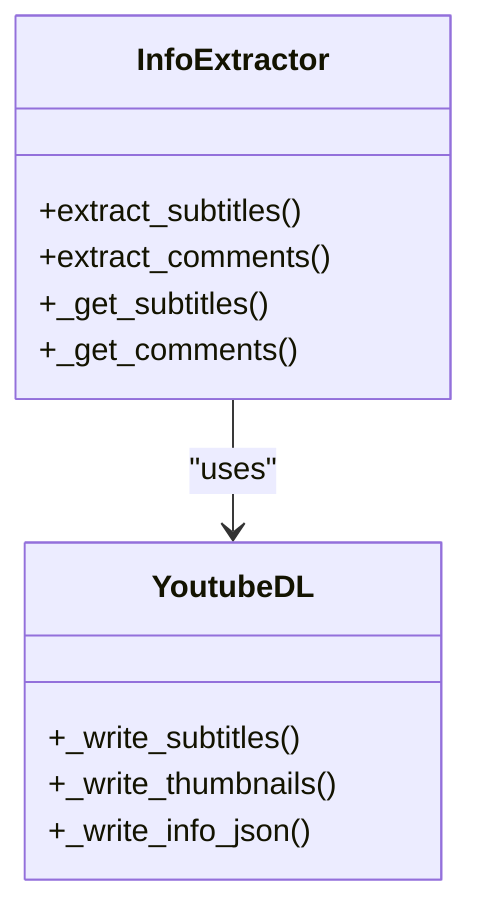

# 信息提取

<cite>
**本文档中引用的文件**  
- [options.py](file://yt_dlp/options.py)
- [YoutubeDL.py](file://yt_dlp/YoutubeDL.py)
- [common.py](file://yt_dlp/extractor/common.py)
</cite>

## 目录
1. [简介](#简介)
2. [元数据处理配置](#元数据处理配置)
3. [缩略图下载配置](#缩略图下载配置)
4. [字幕获取配置](#字幕获取配置)
5. [高级选项](#高级选项)
6. [提取器模块实现](#提取器模块实现)
7. [结论](#结论)

## 简介
本文档详细介绍了 yt-dlp 中的信息提取配置，涵盖了元数据处理、缩略图下载、字幕获取等选项。这些配置选项控制着从视频页面提取的附加信息的保存方式，并影响信息提取器的行为。通过理解这些配置，用户可以更好地控制下载过程和输出文件的内容。

**Section sources**
- [YoutubeDL.py](file://yt_dlp/YoutubeDL.py#L298-L317)

## 元数据处理配置
yt-dlp 提供了多种配置选项来处理视频的元数据。这些选项允许用户将视频描述、信息 JSON 文件等元数据写入磁盘。

### writedescription
此选项用于将视频描述写入一个 `.description` 文件。当启用此选项时，yt-dlp 会将视频的描述内容保存到与视频文件同名的 `.description` 文件中。

### writeinfojson
此选项用于将视频元数据写入一个 `.info.json` 文件。该文件包含视频的详细信息，如标题、作者、时长等。由于可能包含个人信息，使用此选项时需谨慎。

### clean_infojson
此选项用于从 `info.json` 文件中移除一些内部元数据，如文件名。默认情况下，yt-dlp 会清理这些内部元数据，以保持文件的简洁性。如果需要保留所有字段，可以使用 `--no-clean-info-json` 选项。

**Section sources**
- [options.py](file://yt_dlp/options.py#L1439-L1466)
- [YoutubeDL.py](file://yt_dlp/YoutubeDL.py#L4266-L4307)

## 缩略图下载配置
yt-dlp 支持下载视频的缩略图，并提供了多种配置选项来控制缩略图的下载行为。

### writethumbnail
此选项用于将视频缩略图写入文件。当启用此选项时，yt-dlp 会下载视频的缩略图并保存为与视频文件同名的图片文件。

### write_all_thumbnails
此选项用于下载所有格式的缩略图。某些视频可能提供多种分辨率的缩略图，使用此选项可以下载所有可用的缩略图。

**Section sources**
- [YoutubeDL.py](file://yt_dlp/YoutubeDL.py#L4374-L4398)

## 字幕获取配置
yt-dlp 提供了丰富的配置选项来获取和处理视频字幕。

### writesubtitles
此选项用于下载视频的字幕文件。用户可以通过 `subtitleslangs` 参数指定要下载的字幕语言。

### writeautomaticsub
此选项用于下载自动生成的字幕。与 `writesubtitles` 不同，此选项专门用于下载由平台自动生成的字幕。

### subtitleslangs
此参数用于指定要下载的字幕语言列表。用户可以使用正则表达式或特殊关键字（如 `all`）来匹配多种语言。例如，`['all', '-en']` 表示下载所有语言的字幕，但排除英语。

**Section sources**
- [test_YoutubeDL.py](file://yt_dlp/test/test_YoutubeDL.py#L554-L583)
- [common.py](file://yt_dlp/extractor/common.py#L3850-L3882)

## 高级选项
除了基本的元数据和字幕处理外，yt-dlp 还提供了一些高级选项来增强功能。

### getcomments
此选项用于提取视频评论并将其包含在 `info.json` 文件中。即使没有显式启用此选项，如果提取过程已知为快速，yt-dlp 也会自动获取评论。

### allow_playlist_files
此选项控制是否在使用 `--write-info-json`、`--write-description` 等选项时写入播放列表元数据。默认情况下，yt-dlp 会写入播放列表的元数据文件。

**Section sources**
- [options.py](file://yt_dlp/options.py#L1465-L1491)
- [YoutubeDL.py](file://yt_dlp/YoutubeDL.py#L2014-L2038)

## 提取器模块实现
yt-dlp 的提取器模块负责从各种网站提取视频信息。这些提取器通过实现特定的方法来处理不同的数据类型。

### extract_subtitles
此方法用于提取字幕。提取器会根据 `writesubtitles` 和 `listsubtitles` 参数决定是否调用 `_get_subtitles` 方法来获取字幕信息。

### extract_comments
此方法用于提取评论。提取器会根据 `getcomments` 参数决定是否调用 `_get_comments` 方法来获取评论信息。

**Diagram sources**
- [common.py](file://yt_dlp/extractor/common.py#L3881-L3917)
- [YoutubeDL.py](file://yt_dlp/YoutubeDL.py#L4333-L4347)

## 结论
通过合理配置 yt-dlp 的信息提取选项，用户可以精确控制下载过程中元数据、缩略图和字幕的处理方式。这些配置不仅提高了下载的灵活性，还确保了输出文件的完整性和可用性。了解这些选项的实现机制有助于用户更好地利用 yt-dlp 的强大功能。