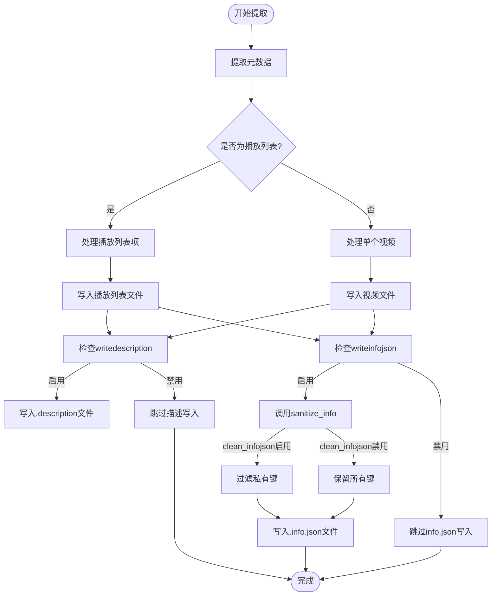
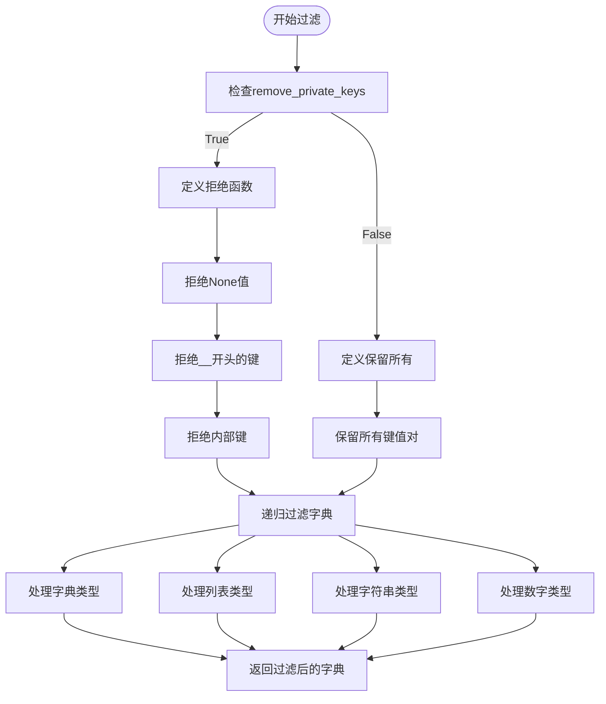

# 元数据提取

<cite>
**本文档引用的文件**
- [YoutubeDL.py](file://yt_dlp/YoutubeDL.py)
- [common.py](file://yt_dlp/extractor/common.py)
</cite>

## 目录
1. [简介](#简介)
2. [核心配置选项](#核心配置选项)
3. [元数据处理流程](#元数据处理流程)
4. [信息字典结构](#信息字典结构)
5. [自定义信息提取器](#自定义信息提取器)
6. [敏感信息过滤](#敏感信息过滤)

## 简介
本文档详细说明了yt-dlp项目中元数据提取的配置机制，重点介绍writedescription、writeinfojson和clean_infojson等配置选项的实现原理和使用方法。文档将结合YoutubeDL类中的实际调用逻辑，展示元数据从提取到输出的完整流程。

## 核心配置选项

### writedescription选项
writedescription配置选项控制是否将视频描述写入文件。当启用此选项时，系统会调用_write_description方法将视频描述内容写入以.description为扩展名的文件中。

该选项的处理逻辑如下：
- 检查writedescription参数是否启用
- 验证描述内容是否存在
- 确保输出目录存在
- 检查文件是否已存在（根据overwrites设置决定是否覆盖）
- 将描述内容写入文件

**Section sources**
- [YoutubeDL.py](file://yt_dlp/YoutubeDL.py#L4309-L4331)

### writeinfojson选项
writeinfojson配置选项控制是否将视频信息以JSON格式写入文件。当启用此选项时，系统会调用_write_info_json方法将信息字典（info_dict）序列化为JSON格式并写入.info.json文件。

该选项的处理流程包括：
- 检查writeinfojson参数是否启用
- 验证输出文件路径
- 确保输出目录存在
- 检查文件是否已存在（根据overwrites设置决定是否覆盖）
- 调用sanitize_info方法处理信息字典
- 将处理后的JSON数据写入文件

**Section sources**
- [YoutubeDL.py](file://yt_dlp/YoutubeDL.py#L4266-L4307)

### clean_infojson选项
clean_infojson配置选项控制是否在写入info.json文件时移除内部元数据。当启用此选项时，系统会在写入JSON文件前调用sanitize_info方法过滤敏感和内部信息。

**Section sources**
- [YoutubeDL.py](file://yt_dlp/YoutubeDL.py#L3637-L3672)

## 元数据处理流程

**Diagram sources**
- [YoutubeDL.py](file://yt_dlp/YoutubeDL.py#L1989-L2105)
- [YoutubeDL.py](file://yt_dlp/YoutubeDL.py#L4266-L4307)
- [YoutubeDL.py](file://yt_dlp/YoutubeDL.py#L4309-L4331)

### _process_playlist方法分析
_process_playlist方法是处理播放列表的核心方法，负责协调播放列表中每个条目的处理流程。该方法的主要功能包括：

1. **初始化处理**：验证播放列表类型，生成公共信息字典
2. **条目处理**：遍历播放列表中的每个条目，应用匹配过滤器
3. **文件写入**：根据配置选项写入描述、信息JSON和缩略图文件
4. **后处理**：执行所有后处理器，更新播放列表信息

该方法在处理播放列表时会根据allow_playlist_files配置决定是否允许写入播放列表相关的元数据文件。

**Section sources**
- [YoutubeDL.py](file://yt_dlp/YoutubeDL.py#L1989-L2105)

## 信息字典结构
信息字典（info_dict）是yt-dlp中存储视频元数据的核心数据结构。该字典包含视频的各种属性，如标题、描述、格式、缩略图等。

### 核心字段
- **id**: 视频唯一标识符
- **title**: 视频标题
- **description**: 视频描述
- **thumbnails**: 缩略图列表
- **formats**: 可用格式列表
- **subtitles**: 字幕信息
- **duration**: 视频时长
- **upload_date**: 上传日期

### 特殊字段处理
信息字典中的某些字段会经过特殊处理：
- **epoch**: 自动添加的时间戳
- **_version**: yt-dlp版本信息
- **_type**: 内容类型（视频、播放列表等）

**Section sources**
- [YoutubeDL.py](file://yt_dlp/YoutubeDL.py#L3637-L3672)

## 自定义信息提取器
自定义信息提取器可以通过实现__post_extractor方法来在元数据写入前添加额外信息。这种方法允许提取器在最后时刻添加耗时较长才能获取的信息。

### 实现要点
- __post_extractor方法必须返回一个字典
- 返回的字典将被合并到主信息字典中
- 目前仅允许添加"comments"和"comment_count"字段
- 添加的字段不会在输出模板和匹配过滤器中可用

**Section sources**
- [common.py](file://yt_dlp/extractor/common.py#L418-L426)

## 敏感信息过滤
clean_infojson选项通过sanitize_info方法实现敏感信息过滤，确保写入JSON文件时不包含内部和敏感数据。

### 过滤规则
当clean_infojson启用时，sanitize_info方法会移除以下类型的数据：
- 以双下划线开头的私有键
- 请求相关的下载信息（requested_downloads, requested_formats等）
- 文件路径信息（filepath, _filename等）
- 原始URL信息（original_url）
- 播放列表自动编号信息（playlist_autonumber）

### 过滤实现

**Diagram sources**
- [YoutubeDL.py](file://yt_dlp/YoutubeDL.py#L3637-L3672)

### 过滤字段列表
以下字段在clean_infojson启用时会被移除：

| 字段名称 | 说明 |
|---------|------|
| requested_downloads | 请求的下载项 |
| requested_formats | 请求的格式 |
| requested_subtitles | 请求的字幕 |
| requested_entries | 请求的条目 |
| entries | 条目列表 |
| filepath | 文件路径 |
| _filename | 内部文件名 |
| filename | 文件名 |
| infojson_filename | info.json文件名 |
| original_url | 原始URL |
| playlist_autonumber | 播放列表自动编号 |

**Section sources**
- [YoutubeDL.py](file://yt_dlp/YoutubeDL.py#L3637-L3672)