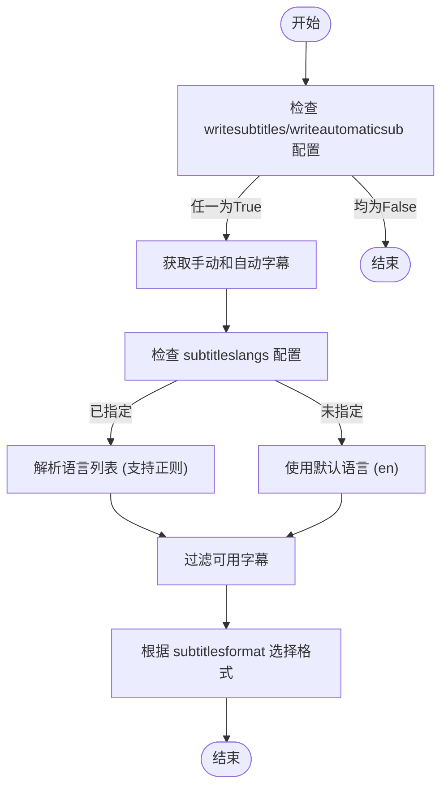
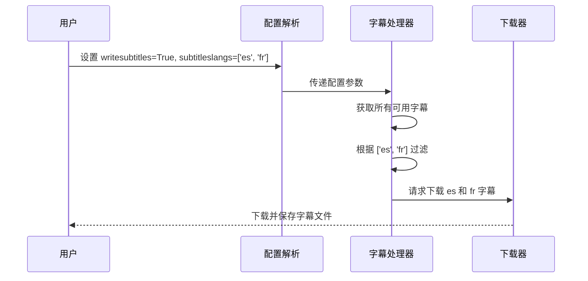
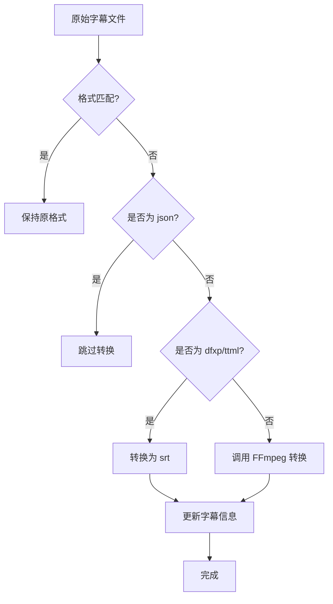

# 字幕提取

<cite>
**本文档引用的文件**
- [YoutubeDL.py](file://yt_dlp/YoutubeDL.py#L3078-L3120)
- [options.py](file://yt_dlp/options.py#L947-L959)
- [common.py](file://yt_dlp/extractor/common.py#L3850-L3945)
- [test_YoutubeDL.py](file://test/test_YoutubeDL.py#L554-L619)
- [test_subtitles.py](file://test/test_subtitles.py#L88-L108)
- [ffmpeg.py](file://yt_dlp/postprocessor/ffmpeg.py#L929-L999)
- [youtube/_video.py](file://yt_dlp/extractor/youtube/_video.py#L4026-L4139)
</cite>

## 目录
1. [简介](#简介)
2. [核心配置选项](#核心配置选项)
3. [字幕获取与处理流程](#字幕获取与处理流程)
4. [多语言字幕批量下载](#多语言字幕批量下载)
5. [自动字幕可用性与API限制](#自动字幕可用性与api限制)
6. [格式转换与后处理](#格式转换与后处理)
7. [结论](#结论)

## 简介
本文档系统阐述了yt-dlp中字幕提取的核心配置与技术实现。重点解析了`writesubtitles`、`writeautomaticsub`和`subtitleslangs`等关键配置选项如何控制手动字幕和自动生成字幕的下载行为。文档详细说明了字幕数据的获取、解析和本地化处理流程，包括语言过滤机制和格式转换（如vtt转srt）。通过分析extractor基类中的`_get_subtitles()`和`_translate_subs()`方法，揭示了字幕提取的底层机制。同时，提供了多语言字幕批量下载的配置示例，并解释了自动字幕的可用性判断条件和API调用限制。

## 核心配置选项
yt-dlp提供了三个核心配置选项来精确控制字幕的下载行为：`writesubtitles`、`writeautomaticsub`和`subtitleslangs`。这些选项共同决定了哪些字幕将被下载以及以何种格式下载。

`writesubtitles`选项用于控制是否下载手动创建的字幕。当此选项设置为`True`时，yt-dlp将尝试下载视频提供者上传的手动字幕。`writeautomaticsub`选项则用于控制是否下载自动生成的字幕（也称为自动字幕或ASR字幕）。当此选项设置为`True`时，yt-dlp将尝试下载由平台自动生成的字幕。

`subtitleslangs`选项是语言过滤的核心，它允许用户指定要下载的字幕语言。该选项接受一个语言代码列表，可以使用正则表达式进行模式匹配。例如，`['es', 'fr', 'it']`将下载西班牙语、法语和意大利语的字幕。用户还可以使用`'all'`关键字来下载所有可用语言的字幕，或使用`'-en'`这样的负向语法来排除特定语言。

**Section sources**
- [options.py](file://yt_dlp/options.py#L947-L959)
- [test_YoutubeDL.py](file://test/test_YoutubeDL.py#L554-L583)

## 字幕获取与处理流程
字幕的获取与处理流程始于extractor基类中的`extract_subtitles`和`extract_automatic_captions`方法。这些方法作为入口点，根据用户配置决定是否调用底层的`_get_subtitles`和`_get_automatic_captions`方法来获取字幕数据。

在`YoutubeDL.py`中，`process_subtitles`方法是字幕处理的核心。该方法首先根据`writesubtitles`和`writeautomaticsub`配置，将手动字幕和自动字幕合并到一个可用字幕字典中。然后，它根据`subtitleslangs`配置，通过`orderedSet_from_options`函数解析用户指定的语言列表。该函数支持正则表达式和`'all'`、`'-lang'`等特殊语法，实现了灵活的语言过滤。

**Diagram sources**
- [YoutubeDL.py](file://yt_dlp/YoutubeDL.py#L3078-L3096)
- [common.py](file://yt_dlp/extractor/common.py#L3850-L3882)

**Section sources**
- [YoutubeDL.py](file://yt_dlp/YoutubeDL.py#L3078-L3096)
- [common.py](file://yt_dlp/extractor/common.py#L3850-L3882)

## 多语言字幕批量下载
多语言字幕批量下载是通过`subtitleslangs`选项实现的。用户可以提供一个包含多种语言代码的列表，yt-dlp将根据该列表下载所有匹配的字幕。例如，配置`{'writesubtitles': True, 'subtitleslangs': ['es', 'fr', 'it']}`将下载西班牙语、法语和意大利语的手动字幕。

该功能的实现依赖于`orderedSet_from_options`函数，该函数能够处理复杂的语言列表，包括正则表达式匹配和排除语法。例如，`['all', '-en']`将下载除英语外的所有可用字幕，而`['en', 'fr', '-en']`将只下载法语字幕（因为英语被后续的`-en`排除）。

**Diagram sources**
- [test_YoutubeDL.py](file://test/test_YoutubeDL.py#L554-L583)
- [YoutubeDL.py](file://yt_dlp/YoutubeDL.py#L3078-L3096)

**Section sources**
- [test_YoutubeDL.py](file://test/test_YoutubeDL.py#L554-L583)

## 自动字幕可用性与API限制
自动字幕的可用性取决于视频平台是否提供了自动生成的字幕轨道。在yt-dlp中，`writeautomaticsub`选项控制着自动字幕的下载行为。当该选项为`True`时，yt-dlp会将自动字幕包含在可用字幕列表中，并根据`subtitleslangs`进行过滤。

对于YouTube等平台，自动字幕的获取受到API调用的限制。某些客户端（如web/mweb）才能提供翻译语言信息，因此需要特定的客户端上下文来获取完整的字幕列表。如果缺少必要的令牌（如PO token），部分字幕语言可能会缺失。此外，自动字幕的生成依赖于平台的语音识别技术，其准确性和可用性会因视频内容、口音和背景噪音等因素而异。

**Section sources**
- [youtube/_video.py](file://yt_dlp/extractor/youtube/_video.py#L4026-L4139)

## 格式转换与后处理
字幕的格式转换主要通过FFmpeg后处理器实现。`subtitlesformat`配置选项允许用户指定期望的字幕格式，支持格式偏好列表，如`'srt'`或`'ass/srt/best'`。当指定的格式不可用时，yt-dlp会使用最佳匹配格式并发出警告。

在`FFmpegSubtitlesConvertorPP`后处理器中，实现了从一种格式到另一种格式的转换。例如，可以将`dfxp`（TTML）格式转换为`srt`格式，尽管这会导致样式信息的丢失。对于`json`格式的字幕，目前不支持转换为其他格式。转换过程首先检查目标格式是否已存在，如果不存在，则调用FFmpeg进行转换，并更新字幕信息中的`ext`和`data`字段。

**Diagram sources**
- [ffmpeg.py](file://yt_dlp/postprocessor/ffmpeg.py#L929-L999)

**Section sources**
- [ffmpeg.py](file://yt_dlp/postprocessor/ffmpeg.py#L929-L999)
- [test_subtitles.py](file://test/test_subtitles.py#L88-L108)

## 结论
yt-dlp的字幕提取功能通过`writesubtitles`、`writeautomaticsub`和`subtitleslangs`等配置选项提供了高度灵活的控制。系统通过extractor基类的`_get_subtitles()`方法获取字幕数据，并利用`process_subtitles`方法进行语言过滤和格式选择。多语言字幕批量下载得益于强大的正则表达式支持和灵活的排除语法。自动字幕的可用性受平台API和客户端上下文的限制。最后，通过FFmpeg后处理器，实现了从vtt、dfxp等到srt等多种格式的转换，满足了不同用户的需求。这一系列功能共同构成了一个强大而完整的字幕提取解决方案。