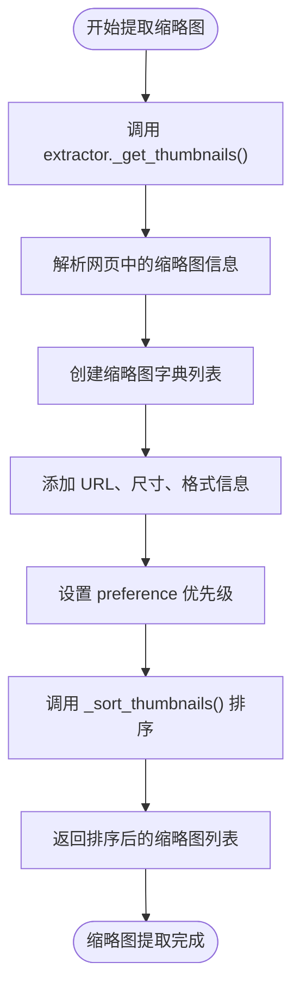
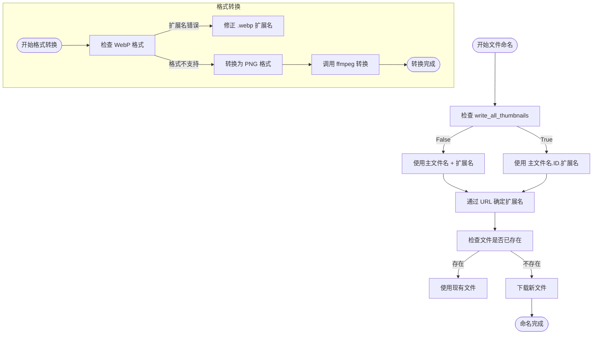
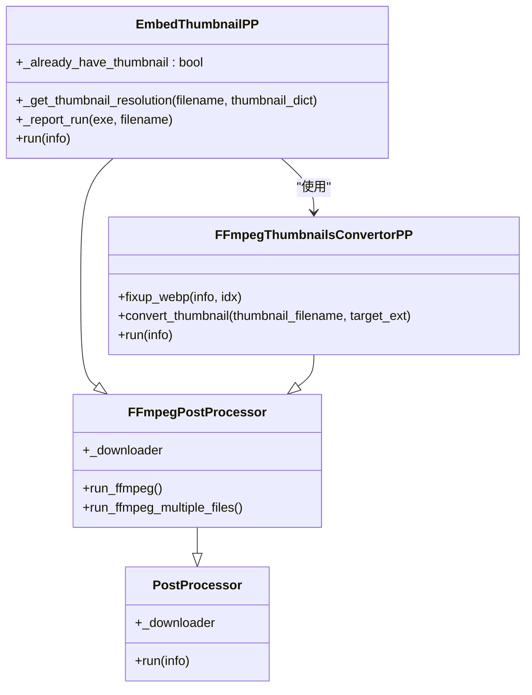

# 缩略图提取

<cite>
**本文档引用的文件**
- [YoutubeDL.py](file://yt_dlp/YoutubeDL.py)
- [embedthumbnail.py](file://yt_dlp/postprocessor/embedthumbnail.py)
- [ffmpeg.py](file://yt_dlp/postprocessor/ffmpeg.py)
- [common.py](file://yt_dlp/extractor/common.py)
- [options.py](file://yt_dlp/options.py)
</cite>

## 目录
1. [简介](#简介)
2. [配置项工作原理](#配置项工作原理)
3. [缩略图识别与提取机制](#缩略图识别与提取机制)
4. [文件命名与格式转换](#文件命名与格式转换)
5. [嵌入式缩略图后处理器](#嵌入式缩略图后处理器)
6. [多缩略图场景处理策略](#多缩略图场景处理策略)
7. [实际案例分析](#实际案例分析)
8. [结论](#结论)

## 简介
yt-dlp 提供了强大的缩略图提取功能，能够从网页中自动识别和下载视频缩略图。本文档深入解析 writethumbnail 和 write_all_thumbnails 配置项的工作原理，详细说明 extractor 模块如何识别和提取主缩略图及备用缩略图，结合 _get_thumbnails() 方法的实现逻辑，阐述缩略图文件命名规则、格式转换以及与 embedthumbnail 后处理器的协同工作机制。

## 配置项工作原理
yt-dlp 提供了两个关键的缩略图相关配置选项：writethumbnail 和 write_all_thumbnails。writethumbnail 配置项控制是否下载缩略图，默认为 False，当设置为 True 时会下载最佳质量的缩略图。write_all_thumbnails 配置项则控制是否下载所有可用的缩略图格式，当设置为 True 时会下载 extractor 提供的所有缩略图变体。

这些配置项在 YoutubeDL._write_thumbnails 方法中被读取和处理，通过 self.params.get('writethumbnail', False) 和 self.params.get('write_all_thumbnails', False) 获取用户设置的值。当 write_all_thumbnails 为 True 且存在多个缩略图时，multiple 变量会被设置为 True，从而触发所有缩略图的下载流程。

**Section sources**
- [YoutubeDL.py](file://yt_dlp/YoutubeDL.py#L4389-L4440)
- [options.py](file://yt_dlp/options.py#L1-L200)

## 缩略图识别与提取机制
缩略图的识别和提取主要由各个 extractor 模块实现，通过 _get_thumbnails() 方法完成。不同的网站有不同的缩略图提供方式，extractor 需要根据网站的具体结构来解析缩略图信息。

例如，NHK extractor 的 _get_thumbnails 方法会遍历数据中的各个尺寸缩略图，为每个缩略图创建包含 url、width、height 和 preference 字段的字典。preference 字段用于排序，值越小优先级越高。YouTube extractor 则会生成一系列可能的缩略图 URL，包括 maxresdefault、hq720、sddefault 等不同分辨率的版本，并根据格式和分辨率设置不同的 preference 值。

所有 extractor 提取的缩略图最终都会经过 _sort_thumbnails 方法排序，该方法根据 preference、width、height 等字段对缩略图进行排序，确保高质量的缩略图排在前面。

**Diagram sources**
- [common.py](file://yt_dlp/extractor/common.py#L3401-L3424)
- [nhk.py](file://yt_dlp/extractor/nhk.py#L747-L761)

**Section sources**
- [common.py](file://yt_dlp/extractor/common.py#L1675-L1696)
- [YoutubeDL.py](file://yt_dlp/YoutubeDL.py#L2663-L2688)

## 文件命名与格式转换
缩略图的文件命名遵循特定的规则。当 write_all_thumbnails 为 False 时，只下载一个最佳质量的缩略图，文件名基于主视频文件名，扩展名由缩略图 URL 决定，通常为 jpg。当 write_all_thumbnails 为 True 且存在多个缩略图时，文件名会包含缩略图 ID，格式为 {主文件名}.{缩略图ID}.{扩展名}。

格式转换功能由 FFmpegThumbnailsConvertorPP 后处理器提供。该处理器首先通过 fixup_webp 方法检查 WebP 格式的缩略图，如果文件实际是 WebP 格式但扩展名不是 .webp，则会修正文件扩展名。对于不支持直接嵌入的格式，convert_thumbnail 方法会使用 ffmpeg 将缩略图转换为支持的格式，如将非 JPG/PNG 格式转换为 PNG 格式。

**Diagram sources**
- [YoutubeDL.py](file://yt_dlp/YoutubeDL.py#L4400-L4415)
- [ffmpeg.py](file://yt_dlp/postprocessor/ffmpeg.py#L1062-L1088)

**Section sources**
- [YoutubeDL.py](file://yt_dlp/YoutubeDL.py#L4400-L4440)
- [ffmpeg.py](file://yt_dlp/postprocessor/ffmpeg.py#L1090-L1121)

## 嵌入式缩略图后处理器
embedthumbnail 后处理器负责将下载的缩略图嵌入到视频文件中。该处理器支持多种容器格式，包括 MP3、MKV/MKA、M4A/MP4/M4V/MOV 以及 OGG/OPUS/FLAC。

对于不同格式，嵌入方法有所不同：MP3 使用 ffmpeg 添加 ID3v2 标签；MKV/MKA 使用 ffmpeg 的 -attach 选项；M4A/MP4/M4V/MOV 优先使用 mutagen 库，若不可用则尝试 AtomicParsley 或 ffmpeg；OGG/OPUS/FLAC 使用 mutagen 库的 METADATA_BLOCK_PICTURE 功能。

处理器会从 info['thumbnails'] 中选择最后一个已下载的缩略图（通过 filepath 字段判断），并尝试获取其分辨率信息。如果文件格式不支持直接嵌入缩略图（如 webm），系统会自动将输出格式改为 mkv。

**Diagram sources**
- [embedthumbnail.py](file://yt_dlp/postprocessor/embedthumbnail.py#L0-L233)
- [ffmpeg.py](file://yt_dlp/postprocessor/ffmpeg.py#L1060-L1170)

**Section sources**
- [embedthumbnail.py](file://yt_dlp/postprocessor/embedthumbnail.py#L41-L71)
- [YoutubeDL.py](file://yt_dlp/YoutubeDL.py#L3388-L3409)

## 多缩略图场景处理策略
在多缩略图场景下，系统采用从后往前的处理策略。_write_thumbnails 方法会逆序遍历缩略图列表，这样可以优先处理高优先级（低 preference 值）的缩略图。当 write_all_thumbnails 为 False 时，一旦成功下载一个缩略图就会立即退出循环，确保只下载最佳质量的一个缩略图。

分辨率选择基于 extractor 提供的 width 和 height 信息。extractor 会为每个缩略图提供尺寸信息，系统根据 preference 值排序后选择最合适的缩略图。对于没有明确尺寸信息的缩略图，系统会尝试通过 ffprobe 获取实际分辨率。

文件保存路径计算基于主视频文件路径。系统使用 replace_extension 函数将主文件的扩展名替换为缩略图扩展名。如果指定了 thumb_filename_base，则使用该基础名称；否则使用主视频文件名。路径计算还会考虑输出目录设置，确保缩略图保存在正确的位置。

**Section sources**
- [YoutubeDL.py](file://yt_dlp/YoutubeDL.py#L4389-L4440)
- [embedthumbnail.py](file://yt_dlp/postprocessor/embedthumbnail.py#L97-L124)

## 实际案例分析
以 YouTube 视频为例，当启用 writethumbnail 选项时，extractor 会生成多个可能的缩略图 URL，包括 maxresdefault.jpg、hq720.jpg、sddefault.jpg 等不同分辨率的版本。系统根据 preference 排序后，优先尝试下载 maxresdefault 版本。

如果 write_all_thumbnails 启用，系统会下载所有可用的缩略图变体，文件名分别为 video.maxresdefault.jpg、video.hq720.jpg 等。下载完成后，embedthumbnail 后处理器会选择最后一个成功下载的缩略图（通常是最高质量的），并将其嵌入到视频文件中。

对于 WebP 格式的缩略图，系统会先检查文件实际格式，如果确实是 WebP 但扩展名不是 .webp，则会修正扩展名。如果目标容器格式不支持当前缩略图格式，系统会使用 ffmpeg 将其转换为兼容格式。

**Section sources**
- [YoutubeDL.py](file://yt_dlp/YoutubeDL.py#L4417-L4440)
- [embedthumbnail.py](file://yt_dlp/postprocessor/embedthumbnail.py#L183-L210)

## 结论
yt-dlp 的缩略图提取功能设计精巧，通过 writethumbnail 和 write_all_thumbnails 配置项提供了灵活的控制选项。extractor 模块通过 _get_thumbnails 方法实现了网站特定的缩略图识别逻辑，而 _write_thumbnails 方法则统一处理下载流程。文件命名规则合理，格式转换机制完善，与 embedthumbnail 后处理器的协同工作确保了缩略图能够正确嵌入到各种容器格式中。多缩略图场景下的处理策略既保证了效率又确保了质量，为用户提供了完整的缩略图管理解决方案。