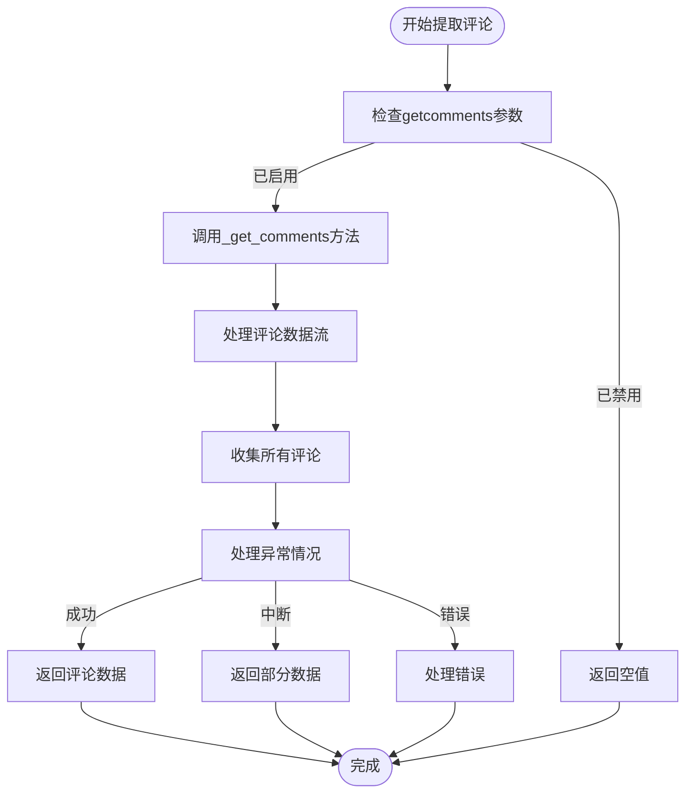
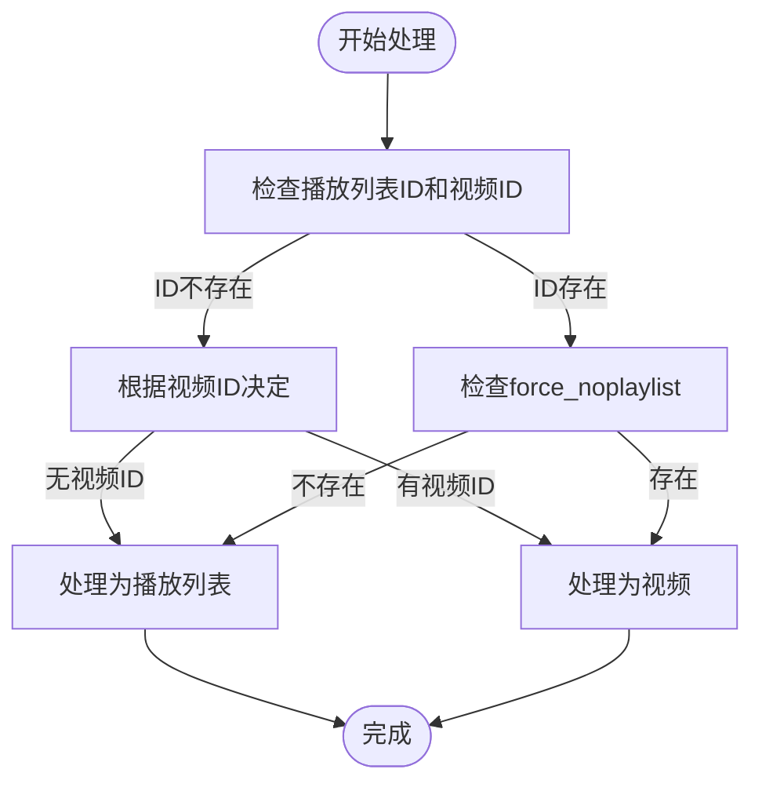
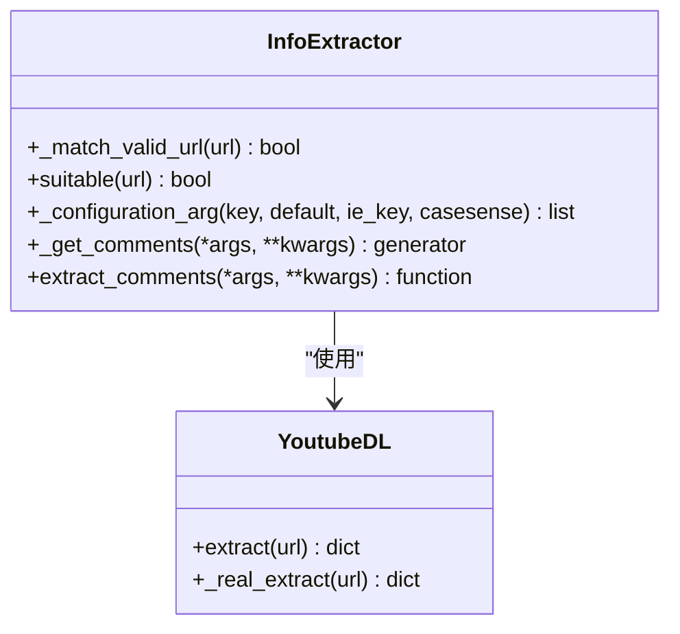
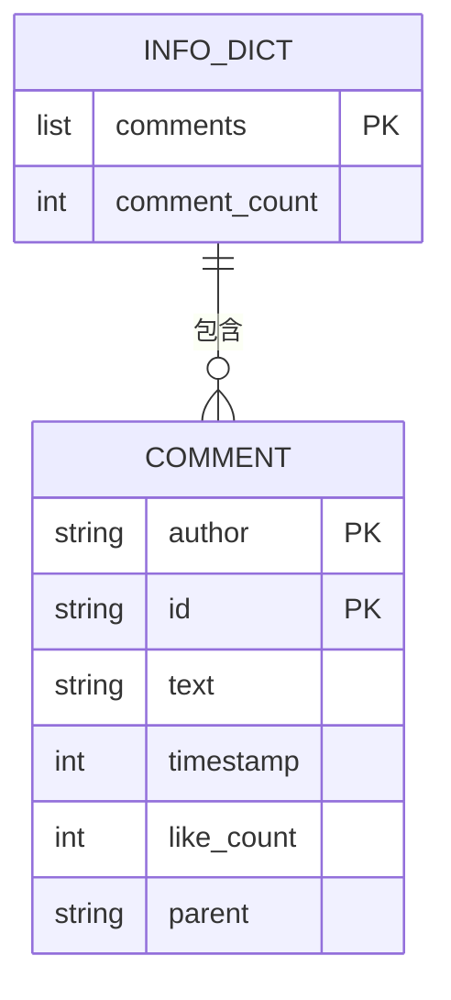

# 高级提取选项

<cite>
**本文档中引用的文件**  
- [common.py](file://yt_dlp/extractor/common.py)
- [options.py](file://yt_dlp/options.py)
- [YoutubeDL.py](file://yt_dlp/YoutubeDL.py)
</cite>

## 目录
1. [简介](#简介)
2. [getcomments配置详解](#getcomments配置详解)
3. [allow_playlist_files配置机制](#allow_playlist_files配置机制)
4. [提取器选择逻辑](#提取器选择逻辑)
5. [信息字典结构](#信息字典结构)
6. [综合分析](#综合分析)

## 简介
本文档深入解析yt-dlp中的高级信息提取选项，重点分析`getcomments`和`allow_playlist_files`配置的深层作用机制。文档将详细说明这些高级选项如何影响提取器的选择和执行流程，以及它们在信息提取过程中的具体实现方式。

## getcomments配置详解
`getcomments`配置选项控制着视频评论数据的提取行为。当启用此选项时，系统会触发额外的API请求来获取视频评论信息。该功能通过`extract_comments`方法实现，该方法首先检查`getcomments`参数的状态，仅在启用时才执行评论提取逻辑。

评论提取过程采用生成器模式，通过`_get_comments`方法获取评论数据流。在提取过程中，系统会捕获各种异常情况，包括用户中断、评论功能禁用以及提取错误等。成功提取的评论数据会被组织成特定结构并包含在最终的信息字典中。

**Diagram sources**
- [common.py](file://yt_dlp/extractor/common.py#L3881-L3917)

**Section sources**
- [common.py](file://yt_dlp/extractor/common.py#L3881-L3917)
- [options.py](file://yt_dlp/options.py#L1465-L1491)

## allow_playlist_files配置机制
`allow_playlist_files`配置影响播放列表文件（如m3u8）的处理行为。该配置决定了系统何时将播放列表文件视为普通文件而非播放列表进行处理。这一机制通过`_yes_playlist`方法实现，该方法根据播放列表ID和视频ID的存在情况来决定处理方式。

当播放列表ID或视频ID不存在时，系统会根据视频ID的存在与否来决定是否处理为播放列表。此外，该方法还考虑了"force_noplaylist"走私数据的存在，如果该数据存在，则会强制不处理为播放列表。这种灵活的决策机制确保了系统能够正确处理各种复杂的URL情况。

**Diagram sources**
- [common.py](file://yt_dlp/extractor/common.py#L4028-L4047)

**Section sources**
- [common.py](file://yt_dlp/extractor/common.py#L4028-L4047)

## 提取器选择逻辑
提取器的选择逻辑由`_extractor_key()`和`_suitable()`方法共同决定。`_suitable()`方法通过`_match_valid_url`函数检查URL是否与提取器的正则表达式匹配，从而确定提取器是否适用于给定的URL。

`_configuration_arg`方法用于获取提取器参数，它通过`traverse_obj`函数从下载器参数中提取指定键的值。该方法支持大小写敏感性控制，并允许为不存在的键提供默认值。这种灵活的参数获取机制使得提取器能够根据用户配置动态调整其行为。

**Diagram sources**
- [common.py](file://yt_dlp/extractor/common.py#L605-L634)
- [common.py](file://yt_dlp/extractor/common.py#L3827-L3848)

**Section sources**
- [common.py](file://yt_dlp/extractor/common.py#L605-L634)
- [common.py](file://yt_dlp/extractor/common.py#L3827-L3848)

## 信息字典结构
评论信息在info_dict中的组织结构遵循特定的格式规范。评论数据以列表形式存储在`comments`字段中，每条评论包含作者、ID、文本内容、时间戳等属性。同时，`comment_count`字段记录了成功提取的评论总数。

当提取过程被用户中断时，`comment_count`会被设置为None，以指示提取不完整。这种设计确保了信息字典能够准确反映提取状态，为后续处理提供可靠的数据基础。

**Diagram sources**
- [common.py](file://yt_dlp/extractor/common.py#L3881-L3917)

**Section sources**
- [common.py](file://yt_dlp/extractor/common.py#L3881-L3917)

## 综合分析
高级提取选项通过复杂的决策逻辑改变了提取器的选择和执行流程。`getcomments`选项触发了额外的API请求，增加了数据提取的深度，而`allow_playlist_files`配置则提供了对播放列表文件处理的精细控制。

这些选项的实现体现了模块化设计思想，通过分离关注点将配置解析、提取逻辑和数据组织等职责分配给不同的方法。这种设计不仅提高了代码的可维护性，还为用户提供了灵活的配置选项，满足了多样化的使用需求。

**Section sources**
- [common.py](file://yt_dlp/extractor/common.py)
- [options.py](file://yt_dlp/options.py)
- [YoutubeDL.py](file://yt_dlp/YoutubeDL.py)