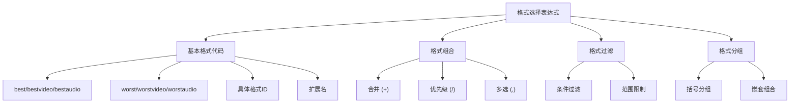
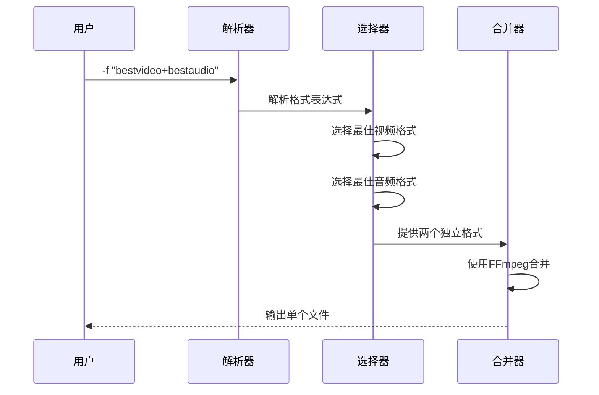
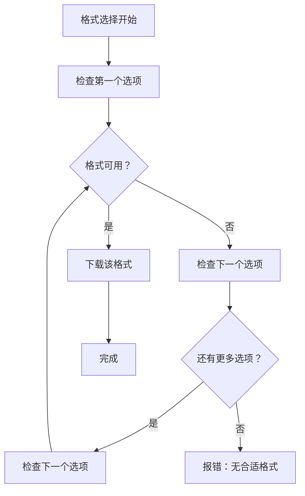
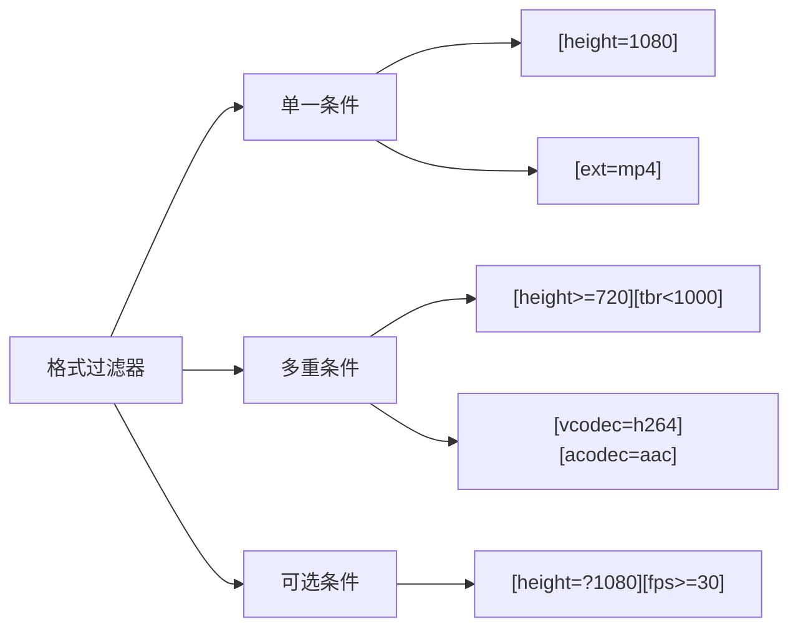
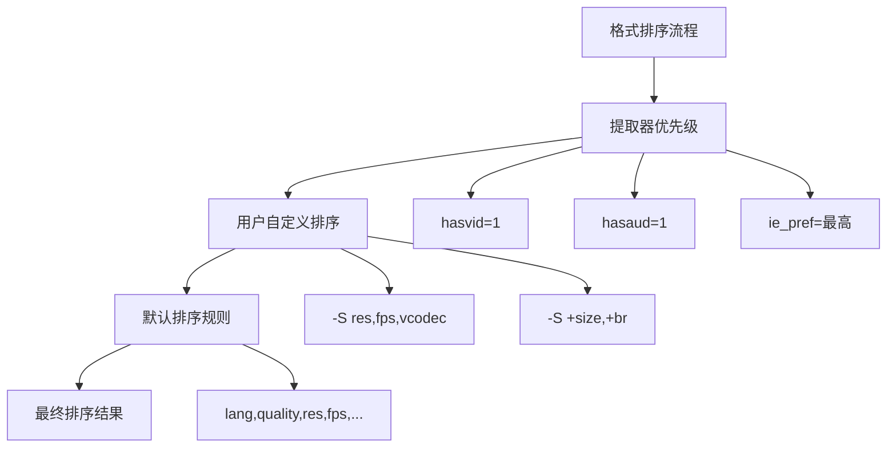
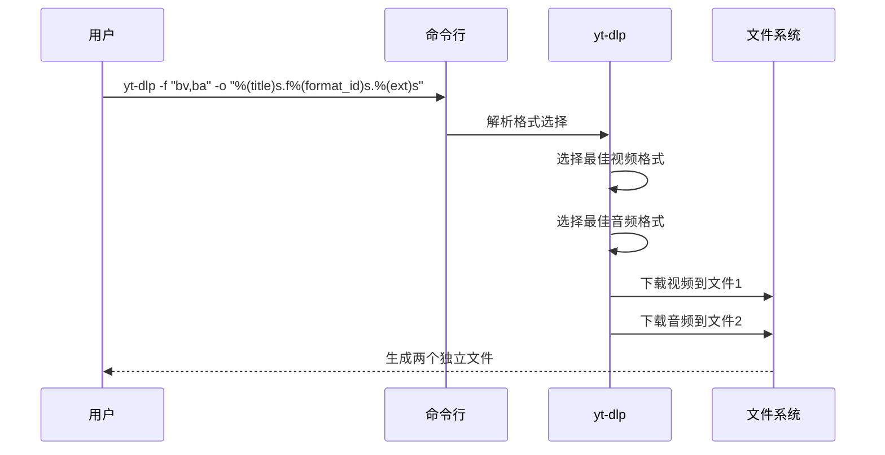
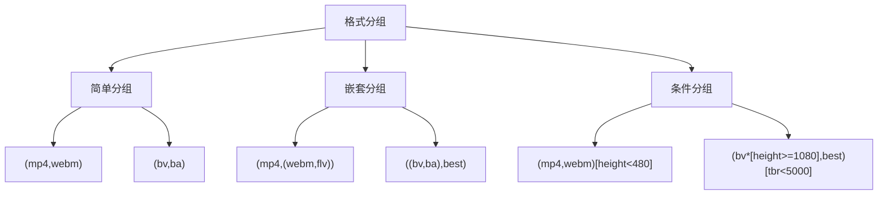
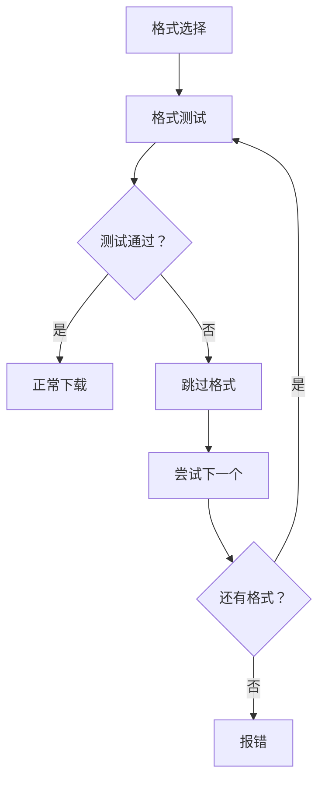
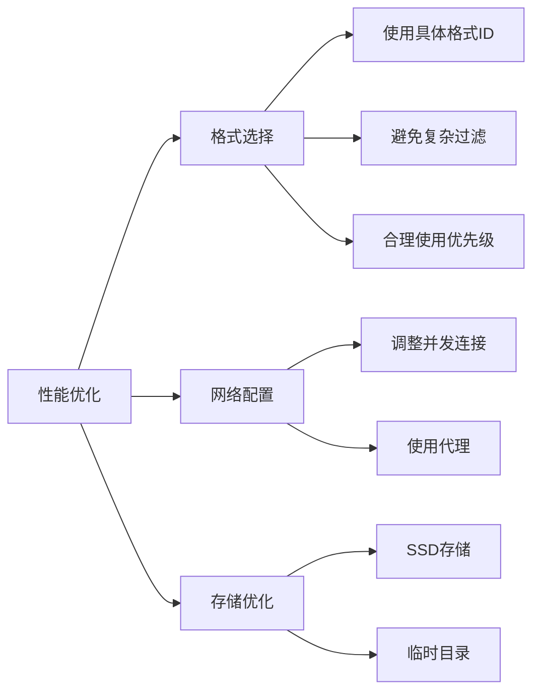

# 基础格式选择

<cite>
**本文档中引用的文件**
- [YoutubeDL.py](file://yt_dlp/YoutubeDL.py)
- [options.py](file://yt_dlp/options.py)
- [README.md](file://README.md)
- [_utils.py](file://yt_dlp/utils/_utils.py)
</cite>

## 目录
1. [简介](#简介)
2. [格式选择语法概述](#格式选择语法概述)
3. [基本格式代码](#基本格式代码)
4. [格式代码组合](#格式代码组合)
5. [格式过滤器](#格式过滤器)
6. [格式排序](#格式排序)
7. [常见使用场景](#常见使用场景)
8. [高级功能](#高级功能)
9. [故障排除](#故障排除)
10. [总结](#总结)

## 简介

yt-dlp 的格式选择系统是一个强大而灵活的机制，允许用户精确控制下载的视频和音频质量。通过格式参数（`-f`），用户可以：
- 选择特定的视频或音频流
- 合并多个格式以创建单个文件
- 根据各种属性过滤格式
- 自定义格式选择的优先级

本文档将详细介绍格式选择的各种语法和使用方法，帮助用户充分利用 yt-dlp 的格式选择功能。

## 格式选择语法概述

格式选择的基本语法是 `-f FORMAT`，其中 `FORMAT` 是一个描述所需格式的选择表达式。格式选择支持多种操作符和语法元素：

**图表来源**
- [YoutubeDL.py](file://yt_dlp/YoutubeDL.py#L2243-L2600)

## 基本格式代码

### 最佳质量格式

| 格式代码 | 描述 | 等价表达式 |
|---------|------|-----------|
| `best` | 最高质量的完整格式（包含视频和音频） | `best*[vcodec!=none][acodec!=none]` |
| `bestvideo` | 最高质量的视频格式 | `best*[acodec=none]` |
| `bestaudio` | 最高质量的音频格式 | `best*[vcodec=none]` |
| `best*` | 最高质量的任意格式（视频或音频） | `best*[vcodec!=none or acodec!=none]` |

### 最差质量格式

| 格式代码 | 描述 | 等价表达式 |
|---------|------|-----------|
| `worst` | 最差质量的完整格式 | `worst*[vcodec!=none][acodec!=none]` |
| `worstvideo` | 最差质量的视频格式 | `worst*[acodec=none]` |
| `worstaudio` | 最差质量的音频格式 | `worst*[vcodec=none]` |
| `worst*` | 最差质量的任意格式 | `worst*[vcodec!=none or acodec!=none]` |

### 具体格式选择

| 格式代码 | 描述 | 使用场景 |
|---------|------|----------|
| `格式ID` | 指定具体的格式代码 | 如 `-f 22` 下载格式ID为22的格式 |
| `扩展名` | 按文件扩展名选择最佳格式 | 如 `-f mp4` 选择最佳的MP4格式 |

**节来源**
- [README.md](file://README.md#L1493-L1506)

## 格式代码组合

### 合并操作符 (+)

合并操作符用于将不同的视频和音频格式组合成单个文件：

**图表来源**
- [YoutubeDL.py](file://yt_dlp/YoutubeDL.py#L2329-L2350)

#### 常见合并模式

| 表达式 | 效果 | 适用场景 |
|--------|------|----------|
| `bv+ba` | 视频+音频（自动选择最佳） | 默认行为，推荐使用 |
| `bestvideo+bestaudio` | 明确指定最佳视频和音频 | 清晰表达意图 |
| `bv*[height<=720]+ba` | 720p及以下视频+最佳音频 | 限制分辨率同时保持音质 |
| `bestvideo+bestaudio+subtitle` | 视频+音频+字幕 | 多媒体内容下载 |

### 优先级操作符 (/)

优先级操作符按顺序尝试不同的格式选项：

**图表来源**
- [YoutubeDL.py](file://yt_dlp/YoutubeDL.py#L2446-L2482)

#### 优先级使用示例

| 表达式 | 优先级顺序 | 推荐程度 |
|--------|------------|----------|
| `22/18/17` | MP4 > WebM > FLV | 高 |
| `mp4/bestvideo` | MP4 > 最佳视频 | 中 |
| `137/136/mp4/bestvideo` | 1080p > 720p > MP4 > 最佳视频 | 高 |

### 多选操作符 (,)

多选操作符用于同时下载多个格式：

| 表达式 | 效果 | 注意事项 |
|--------|------|----------|
| `22,18,17` | 下载所有指定格式 | 如果格式不可用则跳过 |
| `bestvideo,bestaudio` | 分别下载最佳视频和音频 | 需要自定义输出模板避免文件名冲突 |

**节来源**
- [README.md](file://README.md#L1512-L1516)

## 格式过滤器

格式过滤器允许基于特定属性筛选格式，语法为 `[属性=值]` 或 `[属性>数值]`。

### 数值属性过滤

| 属性 | 类型 | 示例 | 描述 |
|------|------|------|------|
| `filesize` | 字节数 | `[filesize>50M]` | 文件大小大于50MB |
| `width` | 像素数 | `[width>=1920]` | 宽度至少1920像素 |
| `height` | 像素数 | `[height<=1080]` | 高度不超过1080像素 |
| `fps` | 帧率 | `[fps>=30]` | 帧率至少30fps |
| `tbr` | kbps | `[tbr<1000]` | 总码率小于1000kbps |
| `vbr` | kbps | `[vbr>=500]` | 视频码率至少500kbps |
| `abr` | kbps | `[abr>=128]` | 音频码率至少128kbps |

### 字符串属性过滤

| 属性 | 过滤类型 | 示例 | 描述 |
|------|----------|------|------|
| `ext` | 精确匹配 | `[ext=mp4]` | 扩展名为mp4 |
| `vcodec` | 精确匹配 | `[vcodec=h264]` | 视频编码为H.264 |
| `acodec` | 精确匹配 | `[acodec=aac]` | 音频编码为AAC |
| `protocol` | 精确匹配 | `[protocol=https]` | 使用HTTPS协议 |
| `language` | 精确匹配 | `[language=en]` | 英语内容 |
| `format_id` | 精确匹配 | `[format_id=137]` | 格式ID为137 |

### 高级过滤语法

| 语法 | 含义 | 示例 |
|------|------|------|
| `^=` | 以...开头 | `[ext^=web]` 匹配webm、weba等 |
| `$=` | 以...结尾 | `[vcodec$=avc]` 匹配avc1、avc2等 |
| `*=` | 包含 | `[format_id*=720]` 匹配包含720的格式ID |
| `!=` | 不等于 | `[ext!=flv]` 排除FLV格式 |
| `?` | 可选值 | `[height=?1080]` 高度未知时也考虑 |

### 组合过滤示例

**图表来源**
- [YoutubeDL.py](file://yt_dlp/YoutubeDL.py#L2511-L2531)

**节来源**
- [README.md](file://README.md#L1524-L1562)

## 格式排序

格式排序系统决定了"最佳"和"最差"格式的选择逻辑。使用 `-S` 参数可以自定义排序规则。

### 排序字段

| 字段 | 类型 | 描述 | 默认顺序 |
|------|------|------|----------|
| `hasvid` | 优先级 | 是否有视频流 | 最高 |
| `hasaud` | 优先级 | 是否有音频流 | 最高 |
| `ie_pref` | 提取器偏好 | 提取器设置的偏好 | 最高 |
| `lang` | 浮点数 | 语言偏好 | 高 |
| `quality` | 浮点数 | 格式质量 | 高 |
| `res` | 数值 | 分辨率（小边） | 高 |
| `fps` | 数值 | 帧率 | 高 |
| `vcodec` | 有序 | 视频编解码器 | 中 |
| `acodec` | 有序 | 音频编解码器 | 中 |
| `size` | 数值 | 文件大小 | 中 |
| `br` | 数值 | 平均比特率 | 中 |
| `proto` | 有序 | 协议类型 | 中 |
| `ext` | 有序 | 文件扩展名 | 中 |

### 排序语法

| 语法 | 效果 | 示例 |
|------|------|------|
| `字段` | 降序排列 | `-S res` 按分辨率降序 |
| `+字段` | 升序排列 | `-S +res` 按分辨率升序 |
| `字段:值` | 限制范围 | `-S res:720` 优先720p但不高于此 |
| `字段~值` | 最接近值 | `-S size~100M` 选择最接近100MB的格式 |

### 编解码器优先级

#### 视频编解码器优先级（从高到低）
- `av01` > `vp9.2` > `vp9` > `h265` > `h264` > `vp8` > `h263` > `theora`

#### 音频编解码器优先级（从高到低）
- `flac`/`alac` > `wav`/`aiff` > `opus` > `vorbis` > `aac` > `mp4a` > `mp3` > `ac3` > `dts`

### 排序示例

**图表来源**
- [_utils.py](file://yt_dlp/utils/_utils.py#L5376-L5392)

**节来源**
- [README.md](file://README.md#L1570-L1604)

## 常见使用场景

### 选择特定分辨率的视频

| 场景 | 命令示例 | 说明 |
|------|----------|------|
| 720p及以下 | `-f "bv*[height<=720]+ba"` | 限制分辨率同时保持音质 |
| 1080p最佳 | `-f "bv*[height>=1080]+ba"` | 至少1080p的视频 |
| 移动设备优化 | `-f "bv*[height<=480]+ba"` | 适合手机观看的格式 |
| 高清存储 | `-f "bv*[height>=1080][tbr>=5000]+ba"` | 高质量高清内容 |

### 仅下载音频流

| 场景 | 命令示例 | 说明 |
|------|----------|------|
| 最佳音频 | `-f bestaudio` | 下载最佳音频质量 |
| MP3格式音频 | `-f "ba[acodec^=mp3]"` | 优先MP3格式的音频 |
| 无损音频 | `-f "ba[acodec=flac]"` | 下载FLAC无损音频 |
| 特定采样率 | `-f "ba[asr>=44100]"` | 至少44.1kHz采样的音频 |

### 音视频分离下载

**图表来源**
- [YoutubeDL.py](file://yt_dlp/YoutubeDL.py#L2218-L2244)

### 多格式下载策略

| 策略 | 命令 | 适用场景 |
|------|------|----------|
| 质量优先 | `-f "bestvideo+bestaudio"` | 追求最佳画质和音质 |
| 存储优化 | `-f "bv*[height<=720]+ba"` | 节省存储空间 |
| 兼容性优先 | `-f "mp4/bv+ba"` | 确保广泛兼容性 |
| 备份策略 | `-f "22,18,17"` | 多种质量备份 |

### 特殊需求场景

| 需求 | 命令 | 说明 |
|------|------|------|
| 无广告版本 | `-f "bv*[format_note!*=ad]"` | 排除带广告的格式 |
| 快速下载 | `-f "bv*[tbr<1000]+ba"` | 降低码率提高下载速度 |
| HDR内容 | `-f "bv*[hdr=dv]+ba"` | 专门下载杜比视界内容 |
| 多语言支持 | `-f "bv+ba[language=en]"` | 视频+英语音频 |

**节来源**
- [README.md](file://README.md#L1615-L1634)

## 高级功能

### 格式分组

使用括号可以创建复杂的格式选择逻辑：

**图表来源**
- [YoutubeDL.py](file://yt_dlp/YoutubeDL.py#L2329-L2350)

### 条件格式选择

| 语法 | 效果 | 示例 |
|------|------|------|
| `(条件1,条件2)` | 在条件间选择 | `(mp4,webm)` 优先MP4 |
| `(格式1,格式2)[过滤器]` | 带过滤的条件选择 | `(mp4,webm)[height<480]` |
| `格式1/格式2[过滤器]` | 优先级+过滤 | `mp4/bv[height<720]` |

### 多流支持

| 参数 | 功能 | 影响 |
|------|------|------|
| `--video-multistreams` | 允许多视频流 | 支持多分辨率视频 |
| `--audio-multistreams` | 允许多音频流 | 支持多语言音频 |
| `--merge-output-format` | 合并输出格式 | 控制合并后的容器格式 |

### 格式测试和验证

**图表来源**
- [YoutubeDL.py](file://yt_dlp/YoutubeDL.py#L2446-L2482)

**节来源**
- [README.md](file://README.md#L1520-L1524)

## 故障排除

### 常见问题和解决方案

| 问题 | 原因 | 解决方案 |
|------|------|----------|
| 无法找到合适格式 | 格式被过滤掉 | 检查过滤器条件，使用 `-F` 查看可用格式 |
| 合并失败 | FFmpeg未安装 | 安装FFmpeg或使用 `-f "bv,ba"` 分离下载 |
| 下载速度慢 | 码率过高 | 添加 `-S +size` 选择较小的格式 |
| 文件过大 | 分辨率过高 | 使用 `[height<=720]` 限制分辨率 |

### 调试技巧

| 方法 | 命令 | 用途 |
|------|------|------|
| 列出可用格式 | `yt-dlp -F URL` | 查看所有可用格式 |
| 详细格式信息 | `yt-dlp -v -F URL` | 查看格式详细信息和排序结果 |
| 格式测试 | `yt-dlp --check-formats URL` | 测试格式可用性 |
| 调试输出 | `yt-dlp -v -f "格式表达式" URL` | 查看详细的格式选择过程 |

### 性能优化建议

**节来源**
- [YoutubeDL.py](file://yt_dlp/YoutubeDL.py#L2218-L2244)

## 总结

yt-dlp 的格式选择系统提供了极其灵活和强大的功能，通过以下核心概念可以掌握其使用：

1. **基本语法**：理解格式选择表达式的结构和操作符
2. **格式代码**：掌握最佳、最差、具体格式的选择方法
3. **组合操作**：学会使用合并、优先级、多选等组合功能
4. **过滤器**：利用属性过滤精确控制格式选择
5. **排序规则**：了解格式排序的优先级和自定义方法

通过合理运用这些功能，用户可以根据自己的需求精确控制下载的质量、格式和数量，实现个性化的媒体下载体验。建议在实际使用中多参考 `-F` 命令查看可用格式，并根据具体需求调整格式选择策略。