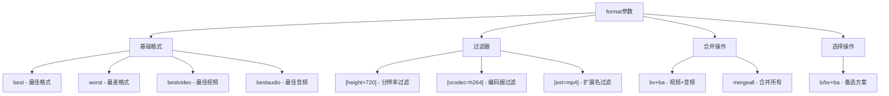
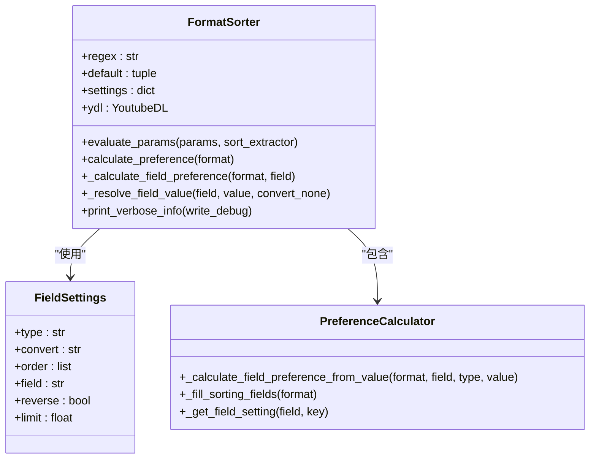
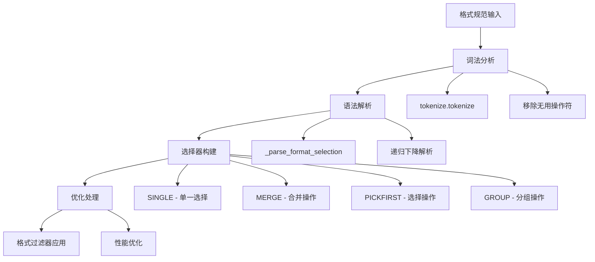
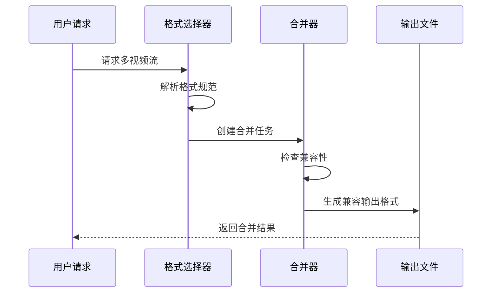
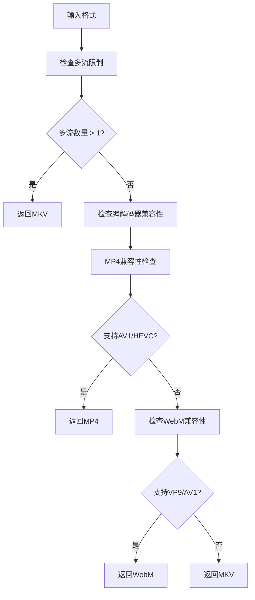
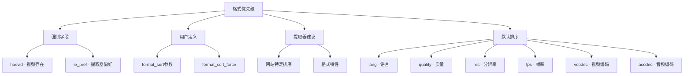

# 格式选择配置文档

<cite>
**本文档中引用的文件**
- [YoutubeDL.py](file://yt_dlp/YoutubeDL.py)
- [utils/_utils.py](file://yt_dlp/utils/_utils.py)
- [options.py](file://yt_dlp/options.py)
- [test_YoutubeDL.py](file://test/test_YoutubeDL.py)
- [test_utils.py](file://test/test_utils.py)
- [README.md](file://README.md)
</cite>

## 目录
1. [简介](#简介)
2. [核心概念](#核心概念)
3. [格式选择参数详解](#格式选择参数详解)
4. [FormatSorter类架构](#formatsorter类架构)
5. [build_format_selector函数](#build_format_selector函数)
6. [格式选择策略示例](#格式选择策略示例)
7. [多音轨/多视频流处理](#多音轨多视频流处理)
8. [优先级和排序规则](#优先级和排序规则)
9. [故障排除指南](#故障排除指南)
10. [最佳实践](#最佳实践)

## 简介

yt-dlp提供了强大而灵活的格式选择系统，允许用户精确控制下载的视频和音频质量。该系统基于两个核心组件：`FormatSorter`类负责格式排序和优先级计算，`build_format_selector`函数负责解析格式选择语法并构建选择器。

## 核心概念

### 格式选择语法

格式选择语法支持多种操作符和过滤器：
- **基础选择**：`best`、`worst`、`bestvideo`、`bestaudio`
- **过滤器**：`[filter]`语法用于条件筛选
- **合并**：`+`操作符合并多个格式
- **选择**：`/`操作符提供备选方案
- **分组**：`()`操作符组合复杂表达式

### 格式字段类型

格式排序系统支持以下字段类型：
- **布尔字段**：`hasvid`、`hasaud`、`ie_pref`
- **有序字段**：`vcodec`、`acodec`、`ext`、`proto`
- **数值字段**：`res`、`fps`、`br`、`filesize`
- **字符串字段**：`id`、`format_id`、`language`

## 格式选择参数详解

### format参数

`format`参数指定要下载的格式规范，支持复杂的表达式语法。



**段落来源**
- [YoutubeDL.py](file://yt_dlp/YoutubeDL.py#L2250-L2594)

### format_sort参数

`format_sort`参数定义格式排序规则，影响格式选择的优先级。

| 字段 | 描述 | 默认顺序 |
|------|------|----------|
| `lang` | 语言偏好 | 高优先级 |
| `quality` | 质量评分 | 高优先级 |
| `res` | 分辨率 | 高优先级 |
| `fps` | 帧率 | 中优先级 |
| `vcodec` | 视频编码器 | 中优先级 |
| `acodec` | 音频编码器 | 中优先级 |
| `br` | 总比特率 | 中优先级 |
| `size` | 文件大小 | 低优先级 |
| `ext` | 文件扩展名 | 低优先级 |

### prefer_free_formats参数

`prefer_free_formats`参数启用对自由容器格式的偏好，优先选择WebM、MKV等开放格式。

**段落来源**
- [options.py](file://yt_dlp/options.py#L839-L880)
- [utils/_utils.py](file://yt_dlp/utils/_utils.py#L5326-L5625)

## FormatSorter类架构

FormatSorter类是格式排序的核心引擎，实现了复杂的优先级计算逻辑。



**图表来源**
- [utils/_utils.py](file://yt_dlp/utils/_utils.py#L5326-L5625)

### 排序字段优先级

FormatSorter按以下优先级处理字段：

1. **强制字段**：`hasvid`、`ie_pref` - 永远最高优先级
2. **用户定义**：`format_sort`参数指定的字段
3. **提取器定义**：各网站提取器提供的排序建议
4. **默认字段**：系统默认排序字段列表

**段落来源**
- [utils/_utils.py](file://yt_dlp/utils/_utils.py#L5477-L5502)

## build_format_selector函数

build_format_selector函数解析格式选择语法并构建高效的格式选择器。



**图表来源**
- [YoutubeDL.py](file://yt_dlp/YoutubeDL.py#L2250-L2594)

### 选择器类型

| 类型 | 符号 | 描述 | 示例 |
|------|------|------|------|
| SINGLE | 基础格式 | 单一格式选择 | `best`, `bv`, `mp4` |
| MERGE | 合并 | 合并多个格式 | `bv+ba`, `(bestvideo+bestaudio)` |
| PICKFIRST | 选择 | 提供备选方案 | `best/bestvideo` |
| GROUP | 分组 | 组合复杂表达式 | `(bv*+ba)/(b)` |

**段落来源**
- [YoutubeDL.py](file://yt_dlp/YoutubeDL.py#L2260-L2270)

## 格式选择策略示例

### 基础策略

```bash
# 下载最佳视频和音频格式
yt-dlp -f "bv+ba/b"

# 下载最佳视频格式（带音频）
yt-dlp -f "bestvideo"

# 下载最佳音频格式
yt-dlp -f "bestaudio"
```

### 高级过滤策略

```bash
# 下载不超过720p的最佳视频
yt-dlp -f "bv*[height<=720]+ba/b"

# 下载最佳MP4格式
yt-dlp -f "bv*[ext=mp4]+ba/b[ext=m4a]"

# 下载最佳编码器格式
yt-dlp -f "best[vcodec=h264]/best[vcodec=vp9]"
```

### 排序策略

```bash
# 按质量、分辨率、比特率排序
yt-dlp -S "quality,res,br"

# 按文件大小降序排列
yt-dlp -S "+size"

# 按分辨率升序排列
yt-dlp -S "+res"

# 按文件大小最接近1GB排列
yt-dlp -S "filesize~1G"
```

**段落来源**
- [test_YoutubeDL.py](file://test/test_YoutubeDL.py#L177-L203)
- [README.md](file://README.md#L1620-L1789)

## 多音轨/多视频流处理

### 多音轨支持

yt-dlp支持同时下载多个音频轨道：

```bash
# 允许多音轨下载
yt-dlp --audio-multistreams -f "bv+ba,bv+ba.2"

# 下载所有可用音频格式
yt-dlp -f "bv+mergeall[vcodec=none]"
```

### 多视频流处理



**图表来源**
- [YoutubeDL.py](file://yt_dlp/YoutubeDL.py#L2350-L2450)

### 兼容性检查

get_compatible_ext函数确保合并格式的兼容性：



**图表来源**
- [utils/_utils.py](file://yt_dlp/utils/_utils.py#L3067-L3100)

**段落来源**
- [YoutubeDL.py](file://yt_dlp/YoutubeDL.py#L2392-L2412)

## 优先级和排序规则

### 优先级层次结构



**图表来源**
- [utils/_utils.py](file://yt_dlp/utils/_utils.py#L5326-L5337)

### 编码器优先级

视频编码器优先级（从高到低）：
1. AV1 (`av0?1`)
2. H.265/HEVC (`[hx]265|he?vc?`)
3. H.264/AVC (`[hx]264|avc`)
4. VP9 (`vp0?9`)
5. VP9.2 (`vp0?9\.0?2`)
6. VP8 (`vp0?8`)
7. H.263 (`mp4v|h263`)
8. Theora (`theora`)

音频编码器优先级：
1. AAC (`[af]lac`)
2. MP4a (`mp?4a?`)
3. Opus (`opus`)
4. Vorbis (`vorbis|ogg`)
5. MP3 (`mp3`)
6. AC3 (`ac-?4`)
7. DTS (`dts`)

**段落来源**
- [utils/_utils.py](file://yt_dlp/utils/_utils.py#L5340-L5360)

## 故障排除指南

### 常见问题

| 问题 | 原因 | 解决方案 |
|------|------|----------|
| 格式不可用 | 过滤器过于严格 | 放宽过滤条件或移除过滤器 |
| 合并失败 | 编解码器不兼容 | 使用兼容的输出格式 |
| 性能问题 | 排序规则复杂 | 简化format_sort规则 |
| 重复下载 | 格式选择不当 | 检查格式规范和过滤器 |

### 调试技巧

```bash
# 查看格式排序详情
yt-dlp -v -F <URL>

# 测试格式选择
yt-dlp -f "<SPEC>" --simulate <URL>

# 检查格式兼容性
yt-dlp --list-formats <URL>
```

**段落来源**
- [utils/_utils.py](file://yt_dlp/utils/_utils.py#L5524-L5544)

## 最佳实践

### 推荐配置

1. **平衡质量与兼容性**：
   ```bash
   yt-dlp -f "bestvideo[height<=1080]+bestaudio/best" -S "res:1080"
   ```

2. **优先自由格式**：
   ```bash
   yt-dlp -f "best" --prefer-free-formats -S "ext"
   ```

3. **高质量存储**：
   ```bash
   yt-dlp -f "bestvideo[height>=1080]+bestaudio" -S "br,res"
   ```

4. **网络友好**：
   ```bash
   yt-dlp -f "best" -S "+size,+br"
   ```

### 性能优化

- 使用具体格式规范而非通用选择器
- 避免过度复杂的过滤器
- 合理设置format_sort规则
- 利用预定义的格式选择器

### 兼容性考虑

- 考虑目标设备的播放能力
- 注意编解码器的普及程度
- 考虑文件大小限制
- 确保多音轨支持

通过合理配置这些参数和理解其工作机制，用户可以实现精确的格式选择，满足各种下载需求和设备兼容性要求。