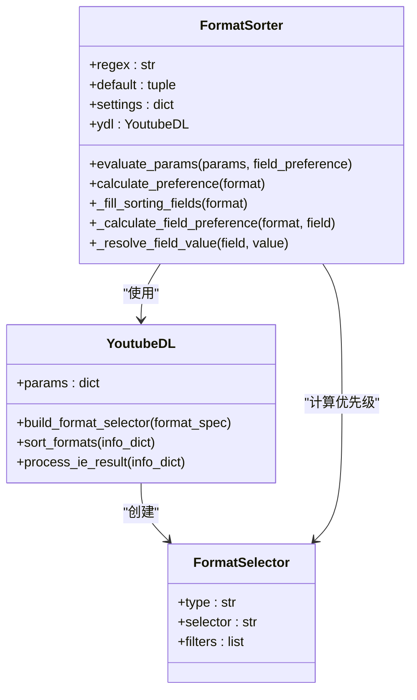
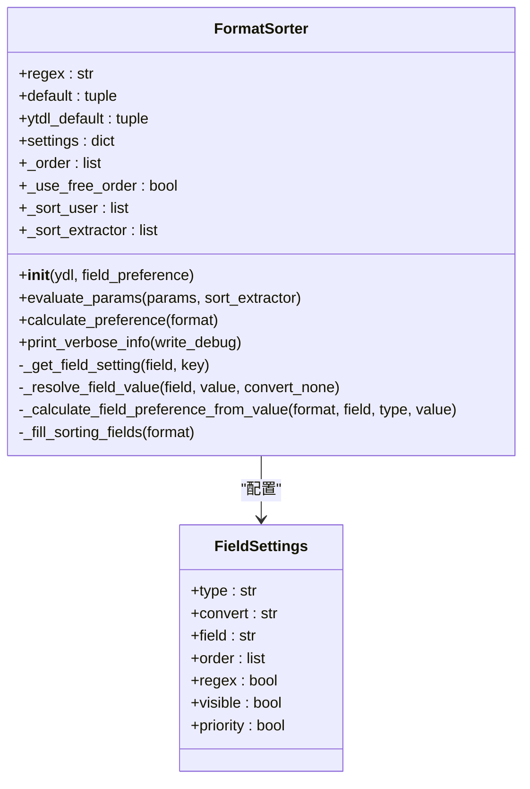
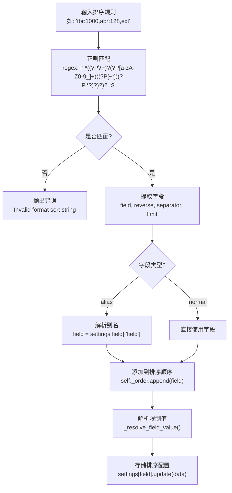
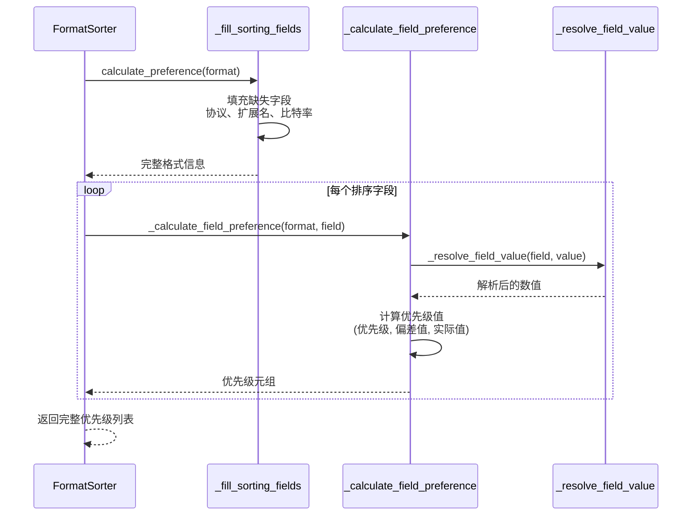
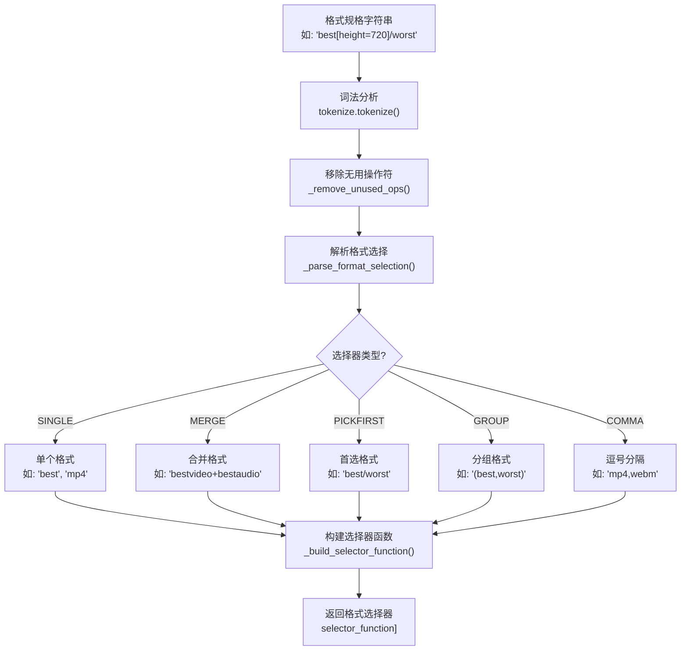
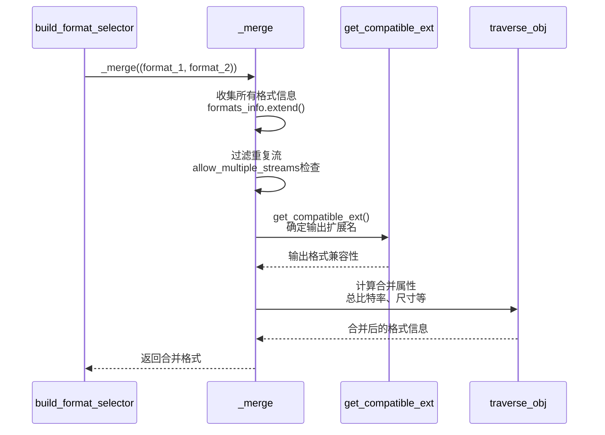
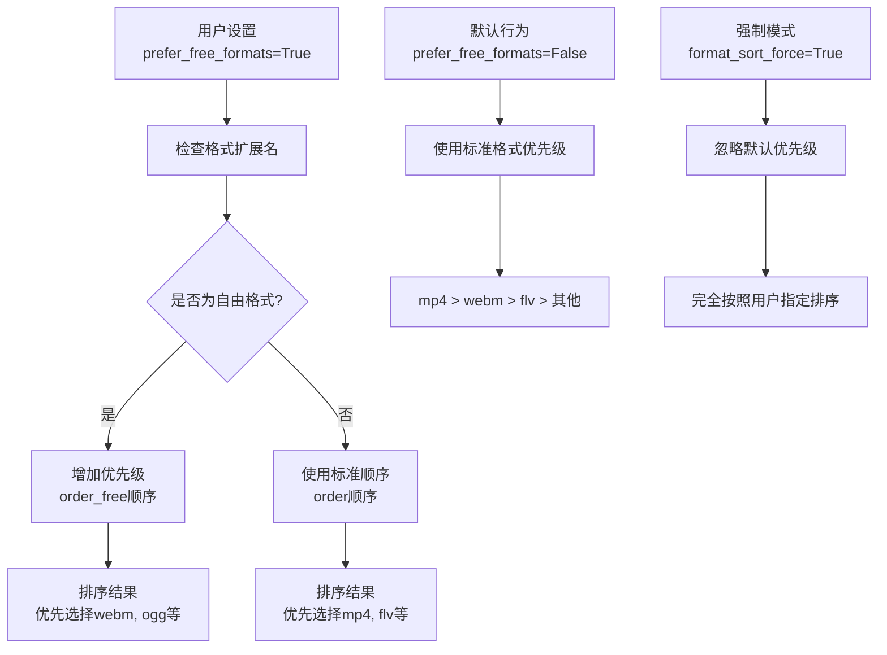
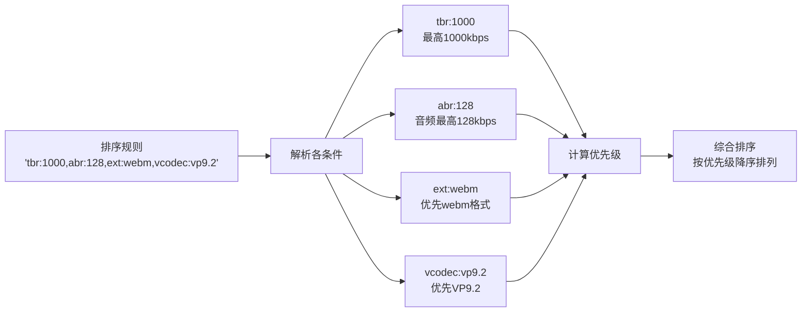
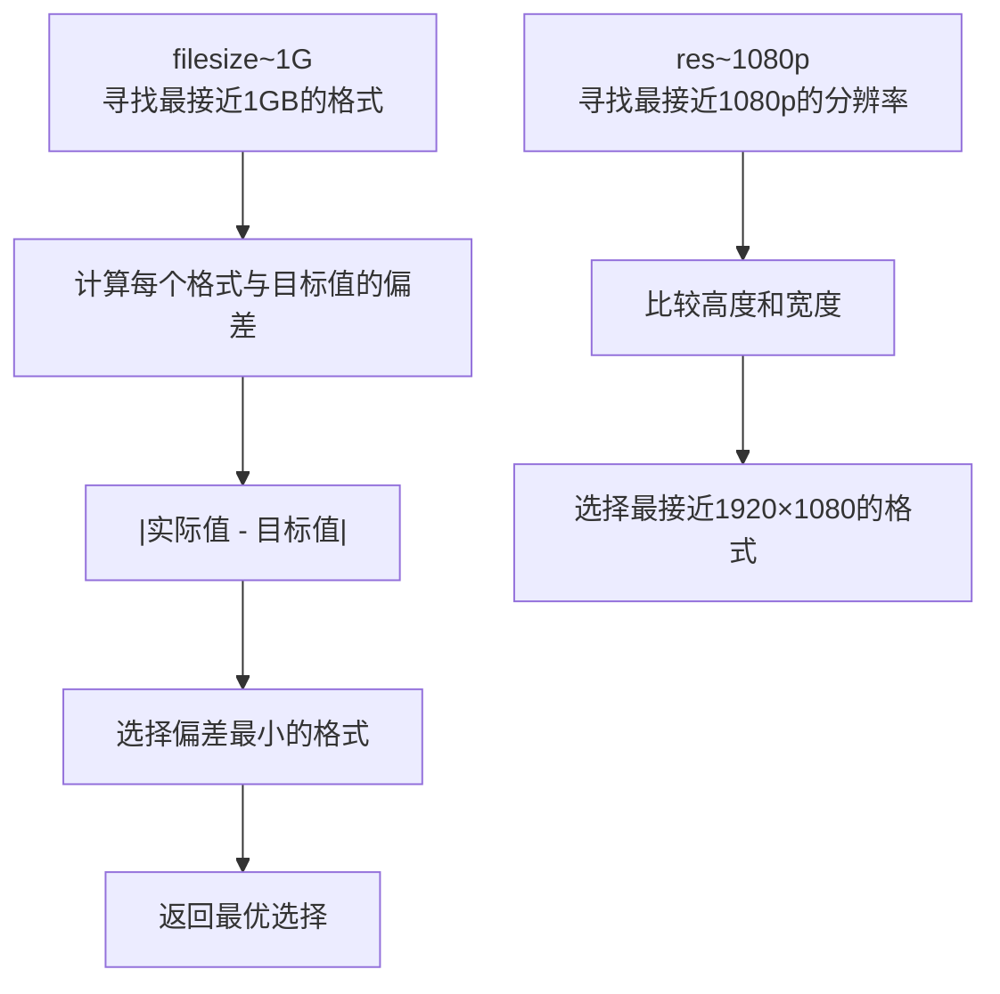
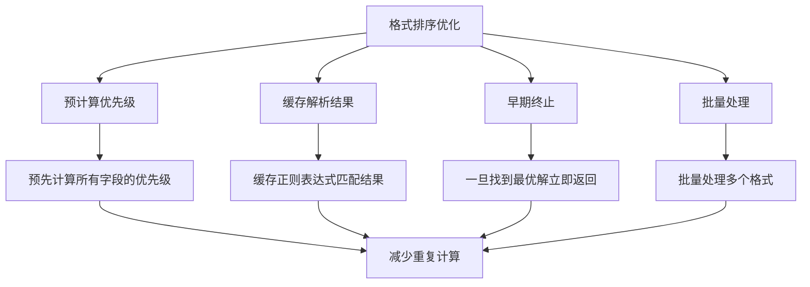

# 高级格式排序策略

<cite>
**本文档中引用的文件**
- [yt_dlp/utils/_utils.py](file://yt_dlp/utils/_utils.py)
- [yt_dlp/YoutubeDL.py](file://yt_dlp/YoutubeDL.py)
- [test/test_YoutubeDL.py](file://test/test_YoutubeDL.py)
- [README.md](file://README.md)
</cite>

## 目录
1. [简介](#简介)
2. [核心组件概述](#核心组件概述)
3. [FormatSorter类详解](#formatsorter类详解)
4. [排序规则解析机制](#排序规则解析机制)
5. [build_format_selector函数](#build_format_selector函数)
6. [prefer_free_formats参数](#prefer_free_formats参数)
7. [高级排序策略](#高级排序策略)
8. [实际应用示例](#实际应用示例)
9. [性能优化考虑](#性能优化考虑)
10. [故障排除指南](#故障排除指南)

## 简介

yt-dlp的高级格式排序策略是一个复杂而强大的系统，用于智能地选择和排序视频、音频格式。该系统通过`format_sort`和`prefer_free_formats`参数提供了灵活的格式选择能力，支持多种排序条件的组合使用，包括质量、文件大小、编解码器类型、语言偏好等多种因素。

## 核心组件概述

格式排序系统的核心由以下组件构成：



**图表来源**
- [yt_dlp/utils/_utils.py](file://yt_dlp/utils/_utils.py#L5326-L5625)
- [yt_dlp/YoutubeDL.py](file://yt_dlp/YoutubeDL.py#L2250-L2513)

## FormatSorter类详解

### 类结构和初始化

FormatSorter是格式排序的核心类，负责解析和执行排序规则：



**图表来源**
- [yt_dlp/utils/_utils.py](file://yt_dlp/utils/_utils.py#L5326-L5441)

### 排序字段配置

FormatSorter定义了丰富的排序字段配置，每个字段都有特定的类型和转换规则：

| 字段名 | 类型 | 转换方式 | 描述 |
|--------|------|----------|------|
| `vcodec` | ordered | regex | 视频编解码器优先级 |
| `acodec` | ordered | regex | 音频编解码器优先级 |
| `ext` | combined | - | 组合视频和音频扩展名 |
| `br` | multiple | float_none | 总比特率计算 |
| `size` | multiple | bytes | 文件大小处理 |
| `tbr` | float_none | - | 总体比特率 |
| `abr` | float_none | - | 音频比特率 |
| `vbr` | float_none | - | 视频比特率 |
| `filesize` | bytes | - | 文件大小字节值 |

**章节来源**
- [yt_dlp/utils/_utils.py](file://yt_dlp/utils/_utils.py#L5342-L5441)

## 排序规则解析机制

### 正则表达式解析

FormatSorter使用正则表达式来解析复杂的排序规则：



**图表来源**
- [yt_dlp/utils/_utils.py](file://yt_dlp/utils/_utils.py#L5504-L5544)

### 字段优先级计算

排序系统通过优先级计算函数确定格式的最终排序位置：



**图表来源**
- [yt_dlp/utils/_utils.py](file://yt_dlp/utils/_utils.py#L5611-L5636)

**章节来源**
- [yt_dlp/utils/_utils.py](file://yt_dlp/utils/_utils.py#L5504-L5636)

## build_format_selector函数

### 格式选择器构建流程

build_format_selector函数是格式选择的核心引擎，负责解析复杂的格式规格字符串：



**图表来源**
- [yt_dlp/YoutubeDL.py](file://yt_dlp/YoutubeDL.py#L2250-L2513)

### 多流合并机制

当需要合并多个音视频流时，系统会执行复杂的合并逻辑：



**图表来源**
- [yt_dlp/YoutubeDL.py](file://yt_dlp/YoutubeDL.py#L2363-L2430)

**章节来源**
- [yt_dlp/YoutubeDL.py](file://yt_dlp/YoutubeDL.py#L2250-L2513)

## prefer_free_formats参数

### 自由格式优先机制

`prefer_free_formats`参数控制是否优先选择自由/开放格式：



### 编解码器优先级表

| 视频编解码器 | 自由格式顺序 | 商业格式顺序 |
|-------------|-------------|-------------|
| AV1 | av0?1 | av0?1 |
| VP9.2 | vp0?9\.0?2 | vp0?9\.0?2 |
| VP9 | vp0?9 | vp0?9 |
| H.265/HEVC | [hx]265\|he?vc? | [hx]265\|he?vc? |
| H.264/AVC | [hx]264\|avc | [hx]264\|avc |
| VP8 | vp0?8 | vp0?8 |
| MP4V/H.263 | mp4v\|h263 | mp4v\|h263 |
| Theora | theora | theora |

**章节来源**
- [yt_dlp/utils/_utils.py](file://yt_dlp/utils/_utils.py#L5342-L5360)

## 高级排序策略

### 多条件组合排序

系统支持复杂的多条件组合排序，例如：



### 最近值匹配算法

使用`~`符号可以实现最近值匹配：



### 反向排序机制

使用`+`前缀可以实现反向排序：

| 排序规则 | 效果 | 示例 |
|---------|------|------|
| `+res` | 按分辨率升序 | 从最低分辨率开始选择 |
| `+abr` | 按音频比特率升序 | 选择最低音频质量 |
| `+tbr` | 按总体比特率升序 | 选择最小文件大小 |
| `+vcodec` | 按编解码器字母顺序 | 优先选择较早的编解码器 |

**章节来源**
- [yt_dlp/utils/_utils.py](file://yt_dlp/utils/_utils.py#L5544-L5610)

## 实际应用示例

### 示例1：高质量无损音频优先

```bash
# 选择最佳质量的无损音频格式
yt-dlp -f "best[acodec=alac]/best[acodec=flac]"
```

对应的格式排序规则：
- `abr:1000` - 音频比特率最高1000kbps
- `acodec:alac,flac` - 优先选择ALAC或FLAC
- `ext:webm,m4a` - 优先选择WebM或M4A

### 示例2：平衡质量和文件大小

```bash
# 平衡质量与文件大小
yt-dlp -f "best[tbr<2000][filesize<500M]"
```

排序策略：
- `tbr:2000` - 总比特率不超过2000kbps
- `filesize:500M` - 文件大小不超过500MB
- `vcodec:vp9.2` - 优先VP9.2编码
- `abr:128` - 音频比特率128kbps

### 示例3：多语言内容选择

```bash
# 优先选择指定语言的格式
yt-dlp -f "best[language=en]/best[language=zh]"
```

语言优先级设置：
- `lang:10` - 英语最高优先级
- `lang:5` - 中文次之
- `lang:-1` - 其他语言较低优先级

### 示例4：混合流处理

```bash
# 合并最佳视频和音频流
yt-dlp -f "bestvideo+bestaudio" --merge-output-format mkv
```

合并策略：
- `bestvideo` - 选择最佳视频质量
- `bestaudio` - 选择最佳音频质量
- `--merge-output-format mkv` - 输出为MKV容器

**章节来源**
- [test/test_YoutubeDL.py](file://test/test_YoutubeDL.py#L177-L203)

## 性能优化考虑

### 排序算法优化

格式排序系统采用了多种性能优化策略：



### 内存使用优化

系统在处理大量格式时采用内存优化策略：
- 使用生成器避免一次性加载所有格式
- 延迟计算非关键字段
- 及时释放不需要的格式信息

### 并行处理支持

对于大规模格式选择，系统支持并行处理：
- 多线程格式验证
- 异步网络请求处理
- 并行格式过滤

## 故障排除指南

### 常见问题诊断

| 问题症状 | 可能原因 | 解决方案 |
|---------|---------|---------|
| 格式选择不符合预期 | 排序规则语法错误 | 检查格式字符串语法 |
| 性能缓慢 | 排序规则过于复杂 | 简化排序条件 |
| 无法下载格式 | 格式不兼容 | 检查编解码器支持 |
| 合并失败 | FFmpeg不可用 | 安装FFmpeg并更新PATH |

### 调试技巧

启用详细日志记录来诊断格式选择问题：

```bash
# 启用详细调试信息
yt-dlp -v --format-sort-debug -f "best"
```

系统会输出详细的排序过程信息，帮助理解格式选择逻辑。

### 兼容性注意事项

不同版本间的兼容性问题：
- 新增的排序字段可能在旧版本中无效
- 某些编解码器名称可能发生变化
- 格式字符串语法可能有细微差异

**章节来源**
- [yt_dlp/utils/_utils.py](file://yt_dlp/utils/_utils.py#L5524-L5544)

## 结论

yt-dlp的高级格式排序策略提供了一个强大而灵活的框架，能够满足各种复杂的格式选择需求。通过合理配置`format_sort`和`prefer_free_formats`参数，用户可以实现从简单到复杂的各种格式选择策略。系统的模块化设计使得新功能的添加变得相对容易，同时保持了良好的性能和可维护性。

掌握这些高级排序策略不仅能够提高下载效率，还能确保获得最适合特定需求的格式组合。随着媒体格式的不断发展，这套系统也具备良好的扩展性，能够适应新的编解码器和格式标准。