# 网络配置

<cite>
**本文档中引用的文件**
- [options.py](file://yt_dlp/options.py)
- [networking/__init__.py](file://yt_dlp/networking/__init__.py)
- [networking/impersonate.py](file://yt_dlp/networking/impersonate.py)
- [_curlcffi.py](file://yt_dlp/networking/_curlcffi.py)
- [_helper.py](file://yt_dlp/networking/_helper.py)
- [YoutubeDL.py](file://yt_dlp/YoutubeDL.py)
- [socks.py](file://yt_dlp/socks.py)
- [test_networking.py](file://test/test_networking.py)
- [test_http_proxy.py](file://test/test_http_proxy.py)
- [test_socks.py](file://test/test_socks.py)
- [README.md](file://README.md)
</cite>

## 目录
1. [简介](#简介)
2. [项目结构](#项目结构)
3. [核心组件](#核心组件)
4. [架构概览](#架构概览)
5. [详细组件分析](#详细组件分析)
6. [依赖关系分析](#依赖关系分析)
7. [性能考虑](#性能考虑)
8. [故障排除指南](#故障排除指南)
9. [结论](#结论)

## 简介

yt-dlp的网络配置系统是一个高度模块化和可扩展的网络通信框架，专门设计用于处理各种网络请求场景，包括代理设置、超时控制、IP绑定、浏览器模拟等功能。该系统支持多种网络协议和传输方式，为视频下载提供了强大的网络层抽象。

## 项目结构

网络配置模块位于`yt_dlp/networking/`目录下，包含以下核心文件：

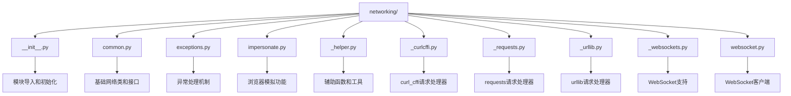

**图表来源**
- [networking/__init__.py](file://yt_dlp/networking/__init__.py#L1-L39)

**章节来源**
- [networking/__init__.py](file://yt_dlp/networking/__init__.py#L1-L39)

## 核心组件

### 网络请求处理器系统

网络配置的核心是请求处理器（Request Handler）系统，它提供了统一的网络请求接口，支持多种底层实现：

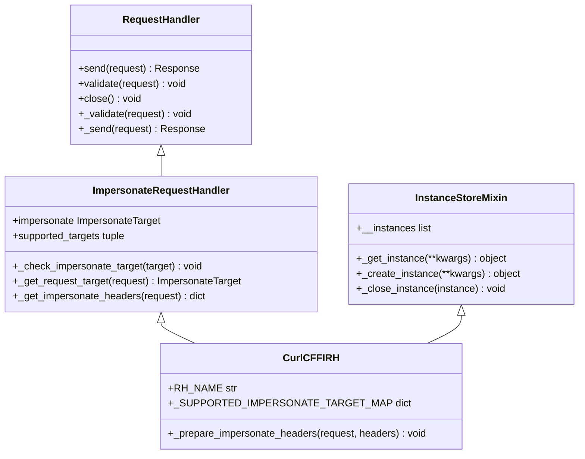

**图表来源**
- [networking/impersonate.py](file://yt_dlp/networking/impersonate.py#L68-L155)
- [_curlcffi.py](file://yt_dlp/networking/_curlcffi.py#L153-L200)

### 浏览器模拟目标系统

浏览器模拟功能通过`ImpersonateTarget`类实现，支持精确的浏览器行为模拟：

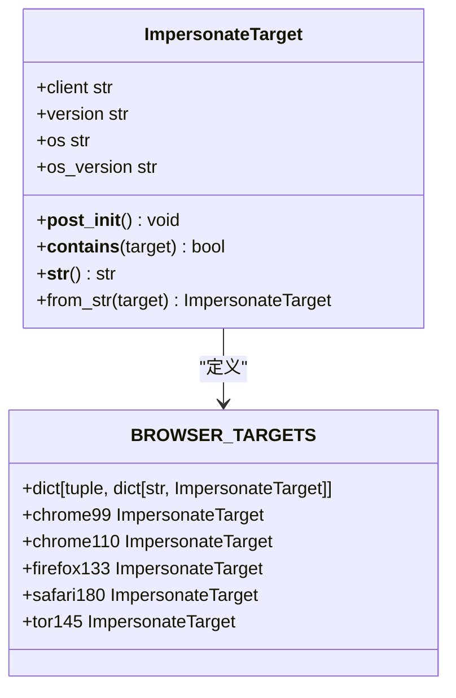

**图表来源**
- [networking/impersonate.py](file://yt_dlp/networking/impersonate.py#L13-L67)
- [_curlcffi.py](file://yt_dlp/networking/_curlcffi.py#L80-L151)

**章节来源**
- [networking/impersonate.py](file://yt_dlp/networking/impersonate.py#L1-L156)
- [_curlcffi.py](file://yt_dlp/networking/_curlcffi.py#L1-L200)

## 架构概览

网络配置系统采用分层架构设计，从高层的用户接口到底层的网络传输：

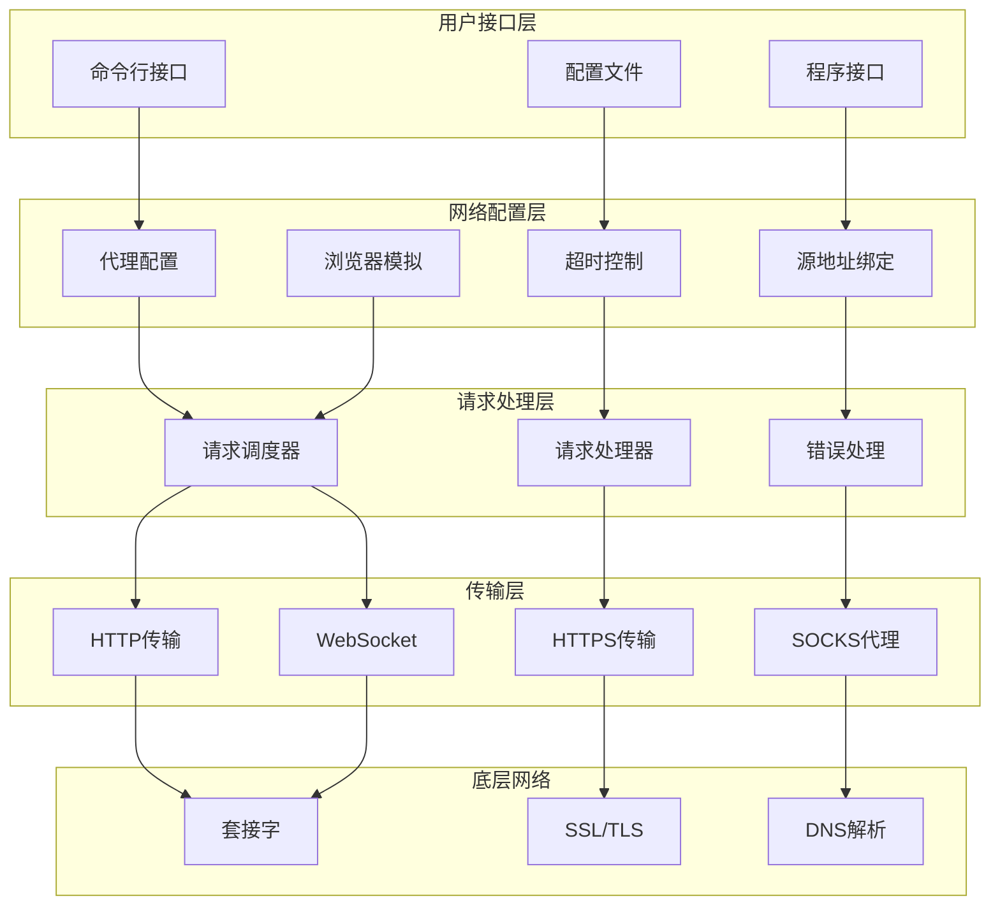

**图表来源**
- [YoutubeDL.py](file://yt_dlp/YoutubeDL.py#L4200-L4300)
- [options.py](file://yt_dlp/options.py#L580-L620)

## 详细组件分析

### 代理设置功能

#### HTTP/HTTPS代理

HTTP和HTTPS代理支持基本的身份验证和连接管理：

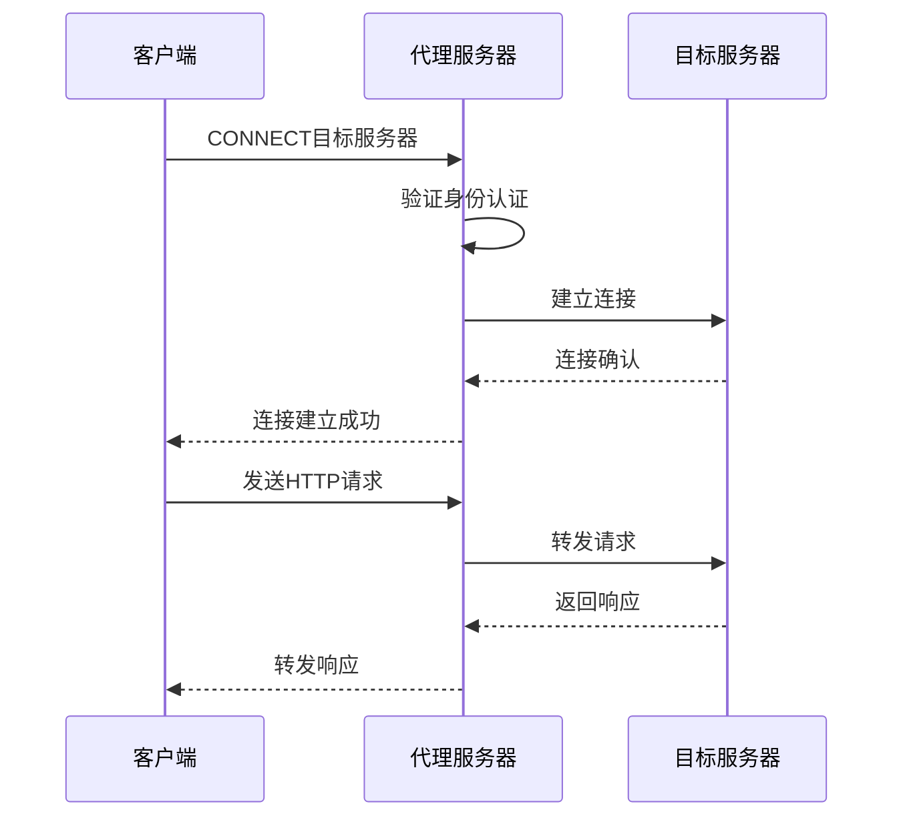

**图表来源**
- [test_http_proxy.py](file://test/test_http_proxy.py#L120-L180)

#### SOCKS代理支持

系统支持多种SOCKS协议版本，包括SOCKS4、SOCKS4A和SOCKS5：

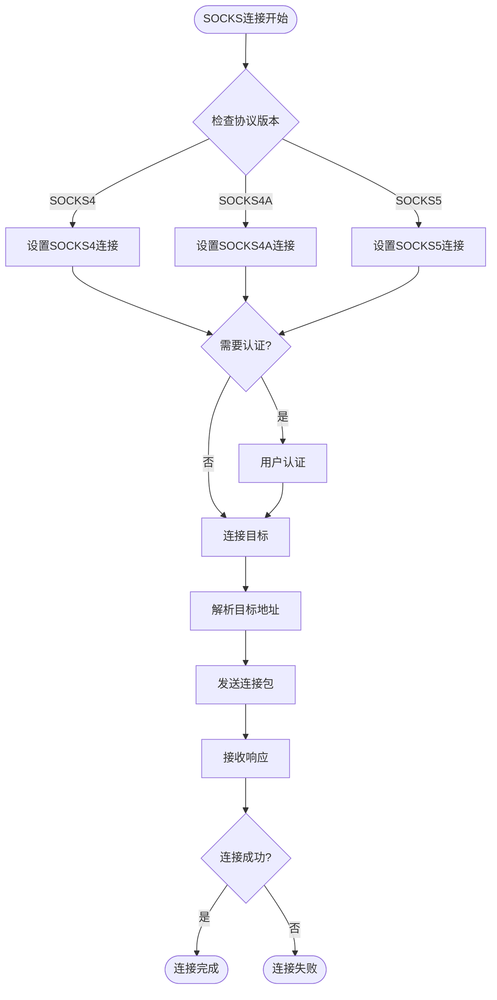

**图表来源**
- [socks.py](file://yt_dlp/socks.py#L136-L173)
- [test_socks.py](file://test/test_socks.py#L80-L150)

**章节来源**
- [test_http_proxy.py](file://test/test_http_proxy.py#L1-L200)
- [test_socks.py](file://test/test_socks.py#L1-L200)

### 超时控制机制

超时控制通过多个层次实现，确保网络请求的可靠性：

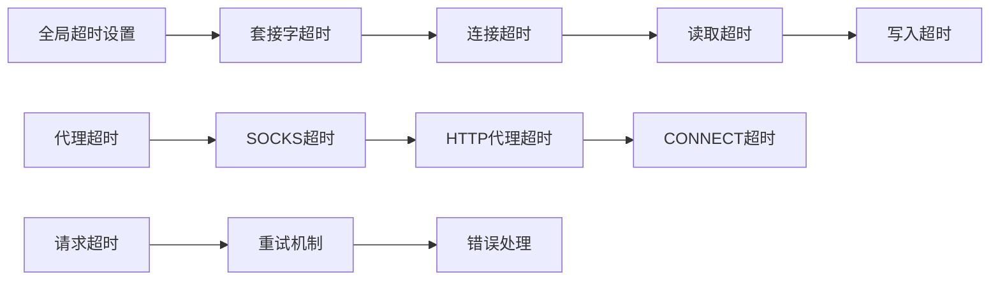

**图表来源**
- [_helper.py](file://yt_dlp/networking/_helper.py#L195-L231)

### IP绑定功能

源地址绑定允许指定客户端使用的本地IP地址：

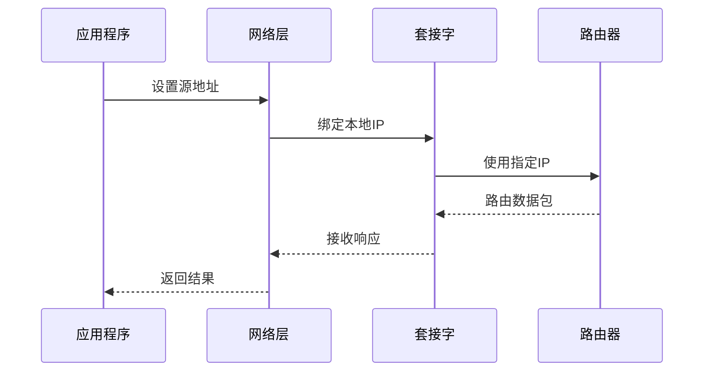

**图表来源**
- [_helper.py](file://yt_dlp/networking/_helper.py#L195-L231)

### IPv4/IPv6强制选项

系统提供强制使用IPv4或IPv6的功能：

| 选项 | 功能描述 | 实现方式 |
|------|----------|----------|
| `-4/--force-ipv4` | 强制使用IPv4 | 设置`source_address='0.0.0.0'` |
| `-6/--force-ipv6` | 强制使用IPv6 | 设置`source_address='::'` |
| 自动检测 | 智能选择协议版本 | 基于可用性和配置优先级 |

**章节来源**
- [options.py](file://yt_dlp/options.py#L589-L605)

### 浏览器模拟功能

#### 模拟目标配置

浏览器模拟功能支持多种浏览器和操作系统的组合：

| 浏览器 | 版本范围 | 操作系统 | 支持状态 |
|--------|----------|----------|----------|
| Chrome | 99-136+ | Windows, macOS, Android | ✅ 完全支持 |
| Firefox | 133-135 | macOS | ✅ 完全支持 |
| Safari | 15.3-26.0+ | macOS, iOS | ✅ 完全支持 |
| Edge | 99-101 | Windows | ✅ 完全支持 |
| Tor | 14.5 | macOS | ✅ 完全支持 |

#### 模拟工作流程

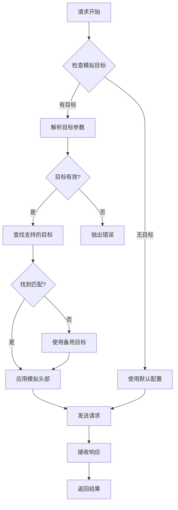

**图表来源**
- [networking/impersonate.py](file://yt_dlp/networking/impersonate.py#L95-L130)
- [_curlcffi.py](file://yt_dlp/networking/_curlcffi.py#L153-L200)

#### list-impersonate-targets选项

该选项列出所有可用的浏览器模拟目标：

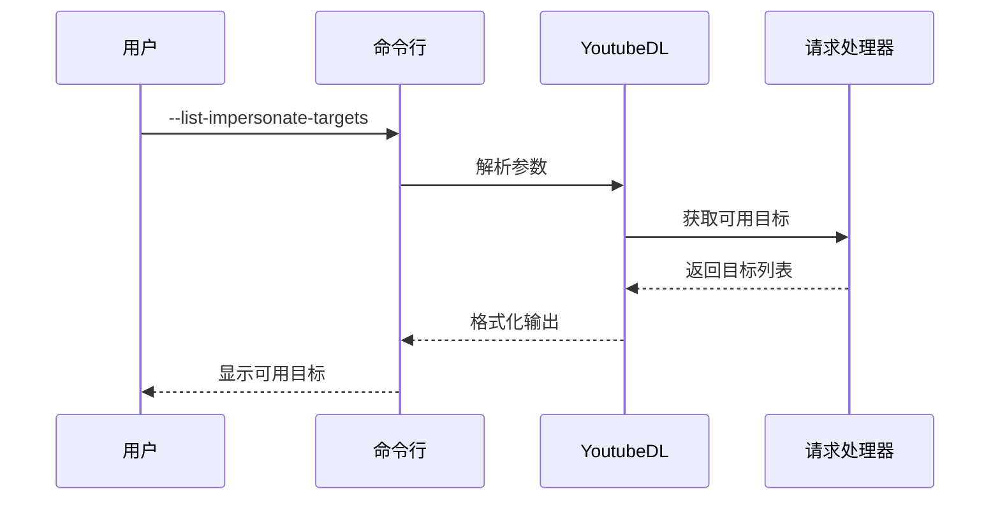

**图表来源**
- [YoutubeDL.py](file://yt_dlp/YoutubeDL.py#L4126-L4153)

**章节来源**
- [networking/impersonate.py](file://yt_dlp/networking/impersonate.py#L68-L156)
- [_curlcffi.py](file://yt_dlp/networking/_curlcffi.py#L80-L200)

### 地理限制绕过功能

#### geo_verification_proxy配置

地理验证代理用于验证IP地址，而实际下载使用主代理：

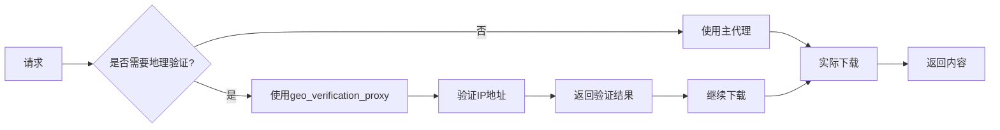

#### X-Forwarded-For头伪造

系统支持伪造X-Forwarded-For HTTP头来绕过地理限制：

| 参数值 | 功能描述 | 使用场景 |
|--------|----------|----------|
| `default` | 仅在已知有效时使用 | 默认行为 |
| `never` | 不伪造X-Forwarded-For | 禁用地理绕过 |
| `CIDR` | 使用IP块范围 | 大规模地理绕过 |
| `国家代码` | 使用特定国家IP | 精确地理绕过 |

**章节来源**
- [options.py](file://yt_dlp/options.py#L607-L634)
- [YoutubeDL.py](file://yt_dlp/YoutubeDL.py#L4126-L4153)

## 依赖关系分析

网络配置系统的依赖关系复杂但清晰：

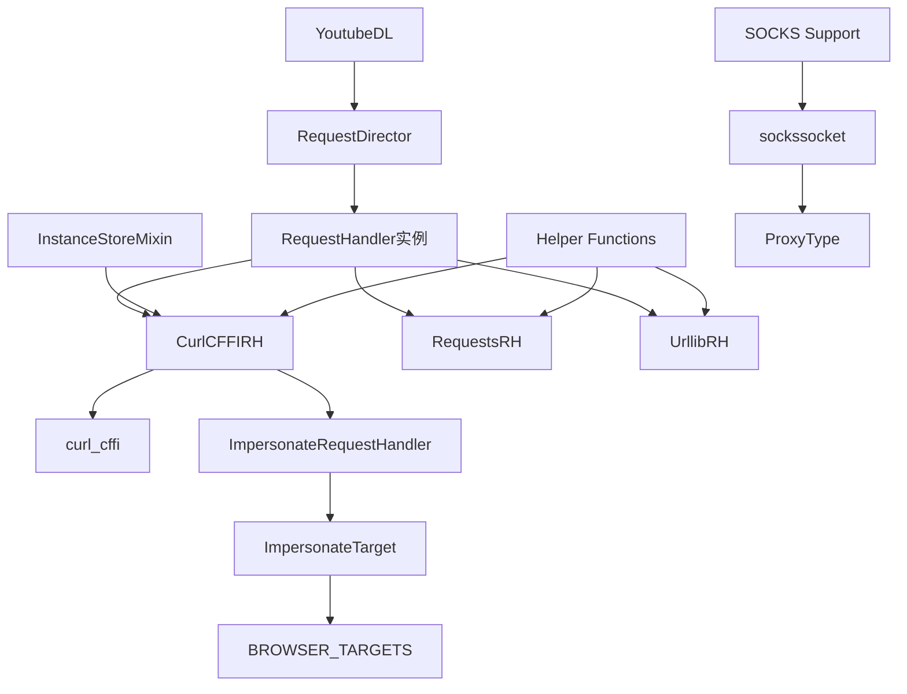

**图表来源**
- [YoutubeDL.py](file://yt_dlp/YoutubeDL.py#L4200-L4300)
- [networking/__init__.py](file://yt_dlp/networking/__init__.py#L1-L39)

**章节来源**
- [YoutubeDL.py](file://yt_dlp/YoutubeDL.py#L4200-L4300)
- [networking/__init__.py](file://yt_dlp/networking/__init__.py#L1-L39)

## 性能考虑

### 连接池管理

系统使用`InstanceStoreMixin`来管理连接实例，避免重复创建昂贵的网络连接：

- **缓存策略**：相同配置的连接会被复用
- **生命周期管理**：自动清理不再使用的连接
- **并发安全**：线程安全的实例管理

### 错误处理优化

网络请求的错误处理经过精心设计：

- **分层错误处理**：不同类型的错误有不同的处理策略
- **资源清理**：确保网络资源正确释放
- **重试机制**：智能的重试逻辑减少失败率

### 模拟目标优化

浏览器模拟功能的性能优化：

- **目标预选**：优先选择最匹配的目标
- **缓存头部**：避免重复计算相同的头部信息
- **版本兼容**：根据curl_cffi版本选择最优配置

## 故障排除指南

### 常见问题诊断

#### 代理连接问题

1. **SOCKS代理连接失败**
   - 检查代理服务器地址和端口
   - 验证认证凭据
   - 确认代理协议版本支持

2. **HTTP代理认证失败**
   - 验证用户名密码格式
   - 检查代理服务器配置
   - 确认代理支持的认证方法

#### 浏览器模拟问题

1. **模拟目标不可用**
   - 使用`--list-impersonate-targets`查看可用目标
   - 检查curl_cffi版本兼容性
   - 确认所需依赖已安装

2. **模拟效果不明显**
   - 验证目标浏览器版本
   - 检查自定义头部冲突
   - 确认请求处理器支持模拟

#### 网络连接问题

1. **超时错误**
   - 增加socket_timeout值
   - 检查网络连接质量
   - 考虑使用更快的代理

2. **IP绑定失败**
   - 验证本地IP地址有效性
   - 检查防火墙设置
   - 确认网络接口可用性

**章节来源**
- [test_networking.py](file://test/test_networking.py#L790-L989)
- [test_http_proxy.py](file://test/test_http_proxy.py#L266-L282)
- [test_socks.py](file://test/test_socks.py#L339-L362)

## 结论

yt-dlp的网络配置系统是一个功能强大且设计精良的网络通信框架。它通过模块化的架构设计，提供了全面的网络功能支持，包括代理设置、超时控制、IP绑定、浏览器模拟等高级特性。

### 主要优势

1. **模块化设计**：清晰的职责分离和可扩展的架构
2. **多协议支持**：全面的网络协议覆盖
3. **智能模拟**：精确的浏览器行为模拟
4. **错误处理**：健壮的错误处理和恢复机制
5. **性能优化**：高效的连接管理和资源利用

### 技术特色

- **浏览器模拟**：支持多种浏览器和操作系统的精确模拟
- **代理集成**：完整的代理协议支持和认证机制
- **地理绕过**：灵活的地理限制绕过方案
- **连接复用**：智能的连接池管理

该网络配置系统为yt-dlp提供了坚实的网络层基础，使其能够应对各种复杂的网络环境和下载需求。