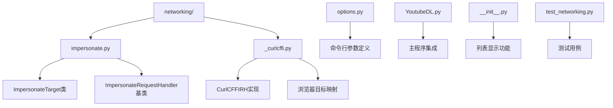
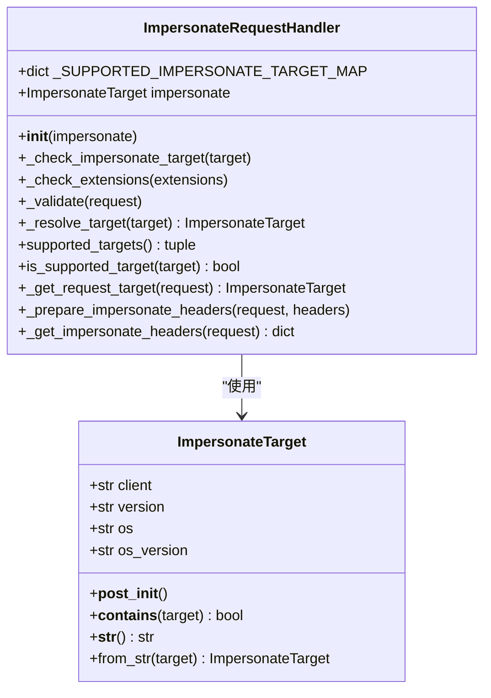
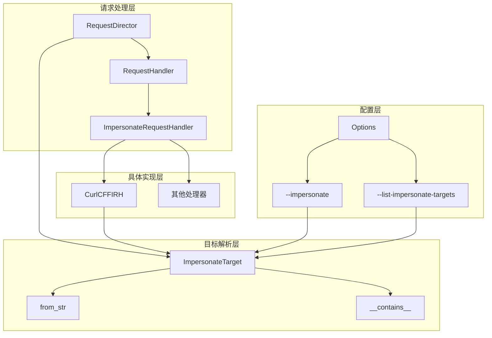
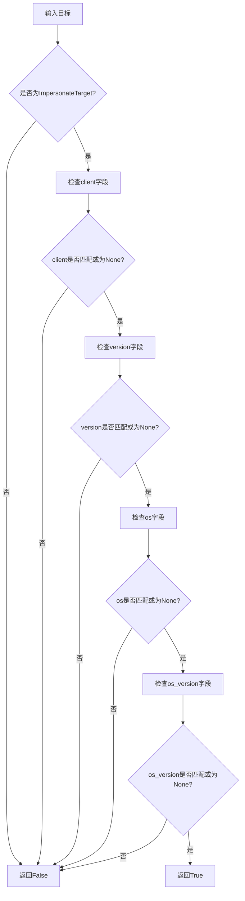
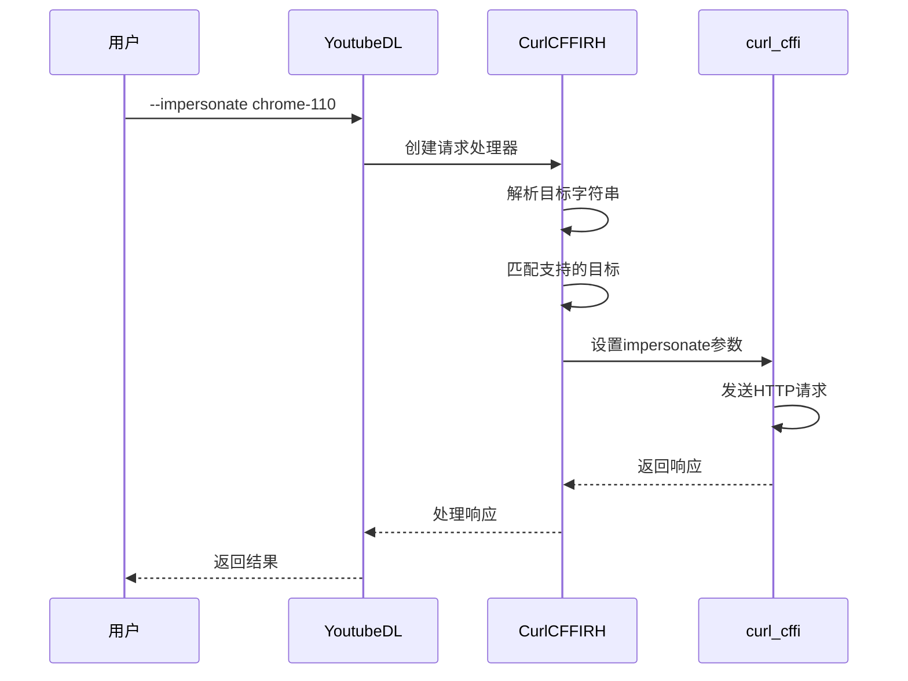
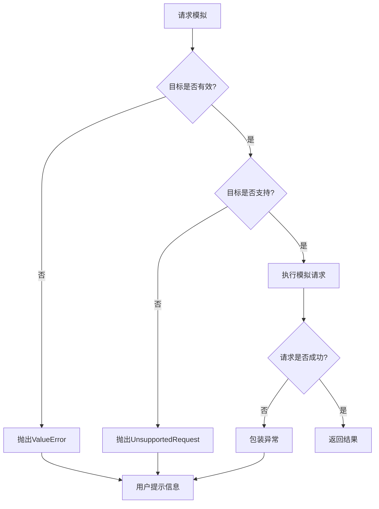
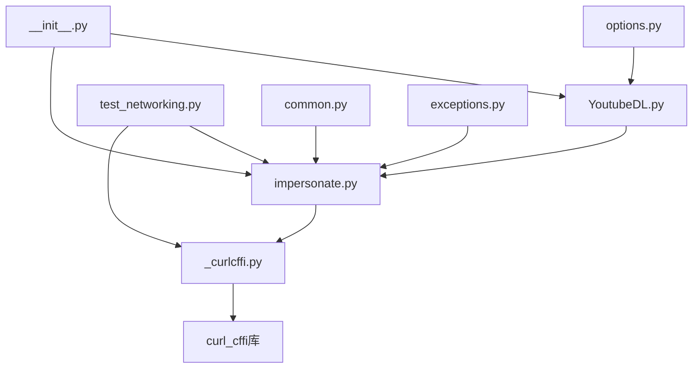

# 请求模拟

<cite>
**本文档中引用的文件**
- [impersonate.py](file://yt_dlp/networking/impersonate.py)
- [_curlcffi.py](file://yt_dlp/networking/_curlcffi.py)
- [options.py](file://yt_dlp/options.py)
- [YoutubeDL.py](file://yt_dlp/YoutubeDL.py)
- [__init__.py](file://yt_dlp/__init__.py)
- [test_networking.py](file://test/test_networking.py)
- [common.py](file://yt_dlp/networking/common.py)
</cite>

## 目录
1. [简介](#简介)
2. [项目结构](#项目结构)
3. [核心组件](#核心组件)
4. [架构概览](#架构概览)
5. [详细组件分析](#详细组件分析)
6. [依赖关系分析](#依赖关系分析)
7. [性能考虑](#性能考虑)
8. [故障排除指南](#故障排除指南)
9. [结论](#结论)

## 简介

请求模拟功能是yt-dlp项目中的一个重要特性，它允许用户模拟不同浏览器和操作系统的HTTP请求特征，从而绕过网站的反爬虫机制。该功能主要通过`--impersonate`选项和`--list-impersonate-targets`选项来实现，支持多种浏览器（如Chrome、Firefox、Safari等）和操作系统（如Windows、macOS、Linux等）的请求特征模拟。

## 项目结构

请求模拟功能的核心文件结构如下：



**图表来源**
- [impersonate.py](file://yt_dlp/networking/impersonate.py#L1-L156)
- [_curlcffi.py](file://yt_dlp/networking/_curlcffi.py#L1-L322)

**章节来源**
- [impersonate.py](file://yt_dlp/networking/impersonate.py#L1-L156)
- [_curlcffi.py](file://yt_dlp/networking/_curlcffi.py#L1-L322)

## 核心组件

### ImpersonateTarget类

`ImpersonateTarget`类是请求模拟功能的核心数据结构，用于定义要模拟的目标浏览器和操作系统特征。



**图表来源**
- [impersonate.py](file://yt_dlp/networking/impersonate.py#L15-L68)
- [impersonate.py](file://yt_dlp/networking/impersonate.py#L70-L156)

### 浏览器目标映射

系统维护了一个复杂的浏览器目标映射表，支持多个版本的浏览器和操作系统组合：

| 浏览器版本 | 操作系统 | 版本支持 |
|-----------|---------|---------|
| Chrome 99-136+ | Windows 10, macOS 14-26, Android 12-14 | 完整支持 |
| Firefox 133-135+ | macOS 14 | 部分支持 |
| Safari 15.3-26.0+ | macOS 11-26, iOS 17.2-18.4 | 广泛支持 |
| Edge 99-101 | Windows 10 | 基础支持 |
| Tor 14.5+ | macOS 14 | 最新支持 |

**章节来源**
- [_curlcffi.py](file://yt_dlp/networking/_curlcffi.py#L109-L172)

## 架构概览

请求模拟功能采用插件化架构，通过抽象基类和具体实现类的分离来支持不同的HTTP客户端：



**图表来源**
- [common.py](file://yt_dlp/networking/common.py#L60-L120)
- [impersonate.py](file://yt_dlp/networking/impersonate.py#L70-L156)

## 详细组件分析

### ImpersonateTarget类详解

`ImpersonateTarget`类提供了灵活的目标匹配机制：

#### 目标匹配逻辑



**图表来源**
- [impersonate.py](file://yt_dlp/networking/impersonate.py#L39-L48)

#### 字符串解析机制

目标字符串采用特定格式进行解析：
- `chrome` - 只指定浏览器
- `chrome-110` - 指定浏览器和版本
- `chrome:windows-10` - 指定浏览器和操作系统
- `chrome-110:windows-10` - 指定完整目标

**章节来源**
- [impersonate.py](file://yt_dlp/networking/impersonate.py#L50-L68)

### CurlCFFIRH实现类

`CurlCFFIRH`类是`curl_cffi`库的具体实现，负责将模拟目标转换为实际的HTTP请求：

#### 支持的目标优先级

系统根据以下规则确定目标优先级：
1. **移动设备优先级降低**：iOS和Android目标被降级
2. **浏览器优先级排序**：Tor < Edge < Firefox < Safari < Chrome
3. **版本号优先**：相同浏览器下选择最新版本
4. **操作系统分组**：按操作系统名称分组



**图表来源**
- [_curlcffi.py](file://yt_dlp/networking/_curlcffi.py#L175-L203)
- [_curlcffi.py](file://yt_dlp/networking/_curlcffi.py#L205-L321)

**章节来源**
- [_curlcffi.py](file://yt_dlp/networking/_curlcffi.py#L175-L321)

### 列表显示功能

`--list-impersonate-targets`选项提供了详细的可用目标列表：

#### 输出格式说明

```
Available impersonate targets
Client       OS          Source
------       --          ------
Chrome       Windows 10  curl_cffi
Chrome       macOS 14    curl_cffi
Safari       macOS 14    curl_cffi
Firefox      macOS 14    curl_cffi>=0.10
Edge         Windows 10  curl_cffi
Tor          macOS 14    curl_cffi>=0.11
```

#### 解读方法

- **Client列**：支持的浏览器类型
- **OS列**：对应的操作系统和版本
- **Source列**：支持该目标的HTTP客户端版本要求

**章节来源**
- [__init__.py](file://yt_dlp/__init__.py#L982-L1013)

### 错误处理机制

系统实现了完善的错误处理机制：



**图表来源**
- [impersonate.py](file://yt_dlp/networking/impersonate.py#L85-L96)
- [YoutubeDL.py](file://yt_dlp/YoutubeDL.py#L740-L750)

**章节来源**
- [impersonate.py](file://yt_dlp/networking/impersonate.py#L85-L129)
- [YoutubeDL.py](file://yt_dlp/YoutubeDL.py#L740-L750)

## 依赖关系分析

请求模拟功能的依赖关系图展示了各组件之间的交互：



**图表来源**
- [options.py](file://yt_dlp/options.py#L575-L587)
- [YoutubeDL.py](file://yt_dlp/YoutubeDL.py#L4126-L4153)
- [impersonate.py](file://yt_dlp/networking/impersonate.py#L1-L15)

**章节来源**
- [options.py](file://yt_dlp/options.py#L575-L587)
- [YoutubeDL.py](file://yt_dlp/YoutubeDL.py#L4126-L4153)

## 性能考虑

### 内存使用优化

- **目标缓存**：支持的目标列表在初始化时计算并缓存
- **延迟加载**：只有在需要时才创建具体的HTTP客户端实例
- **连接复用**：通过`InstanceStoreMixin`实现连接池管理

### 网络性能影响

- **代理支持**：完全支持HTTP/HTTPS/SOCKS代理
- **超时控制**：可配置的请求超时时间
- **重试机制**：自动重试失败的请求

### 兼容性考虑

- **版本兼容**：支持curl_cffi 0.5.10、0.10.x、0.11.x、0.12.x、0.13.x等多个版本
- **平台兼容**：跨平台支持Windows、macOS、Linux等操作系统
- **浏览器兼容**：支持主流浏览器的多个版本

## 故障排除指南

### 常见问题及解决方案

#### 1. 目标不可用错误

**错误信息**：`Impersonate target "xxx" is not available`

**原因分析**：
- curl_cffi版本不兼容
- 目标浏览器版本不存在
- 缺少必要的依赖

**解决方法**：
- 使用`--list-impersonate-targets`查看可用目标
- 更新curl_cffi到支持的版本
- 检查目标格式是否正确

#### 2. 代理配置问题

**错误信息**：`ProxyError`或`ConnectionError`

**解决方法**：
- 验证代理服务器地址和端口
- 检查代理认证设置
- 确认代理协议支持（HTTP/HTTPS/SOCKS）

#### 3. SSL证书验证失败

**错误信息**：`CertificateVerifyError`

**解决方法**：
- 使用`--no-check-certificates`跳过证书验证
- 更新系统证书存储
- 检查客户端证书配置

**章节来源**
- [test_networking.py](file://test/test_networking.py#L1660-L1689)
- [YoutubeDL.py](file://yt_dlp/YoutubeDL.py#L4218-L4220)

### 调试技巧

#### 启用详细日志

```bash
yt-dlp --verbose --impersonate chrome-110 URL
```

#### 检查可用目标

```bash
yt-dlp --list-impersonate-targets
```

#### 测试特定目标

```bash
yt-dlp --impersonate chrome-110 --dump-headers URL
```

## 结论

请求模拟功能为yt-dlp提供了强大的反爬虫绕过能力，通过模拟真实浏览器的请求特征，可以有效避免网站的检测和限制。该功能具有以下特点：

### 主要优势

1. **灵活性**：支持多种浏览器和操作系统组合
2. **易用性**：简洁的命令行接口和智能的目标解析
3. **扩展性**：插件化架构便于添加新的HTTP客户端支持
4. **稳定性**：完善的错误处理和兼容性保证

### 技术创新

- **智能目标匹配**：支持部分匹配和通配符模式
- **版本兼容性**：自动处理不同curl_cffi版本的差异
- **性能优化**：连接池管理和资源复用

### 应用场景

- **视频下载**：绕过网站的访问限制
- **数据采集**：模拟真实用户行为
- **自动化测试**：模拟不同环境下的请求

### 局限性和注意事项

- **性能开销**：模拟请求可能增加网络延迟
- **法律合规**：使用时需遵守相关法律法规
- **反检测机制**：某些高级反爬虫系统可能识别模拟特征

通过合理使用请求模拟功能，用户可以更有效地获取所需的内容，同时保持良好的用户体验和系统稳定性。