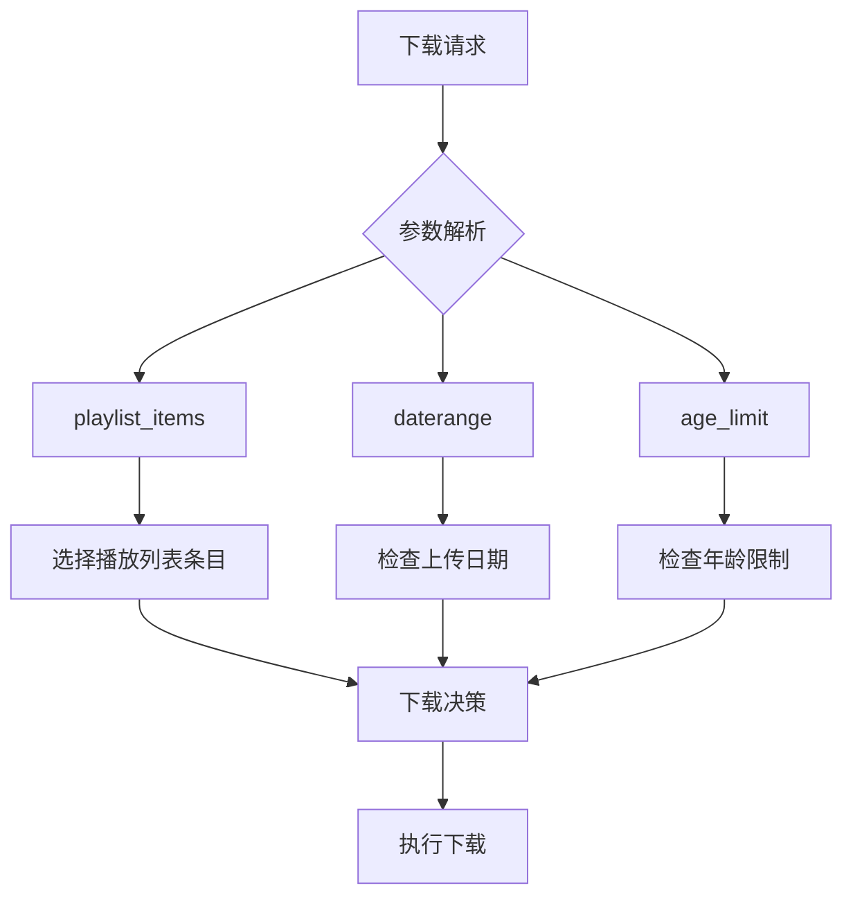
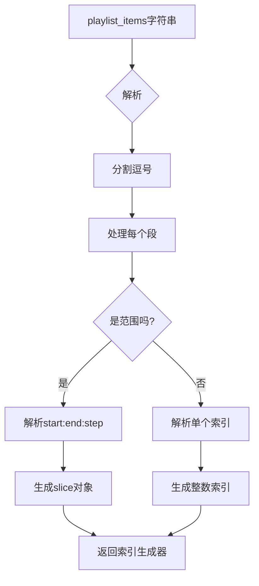
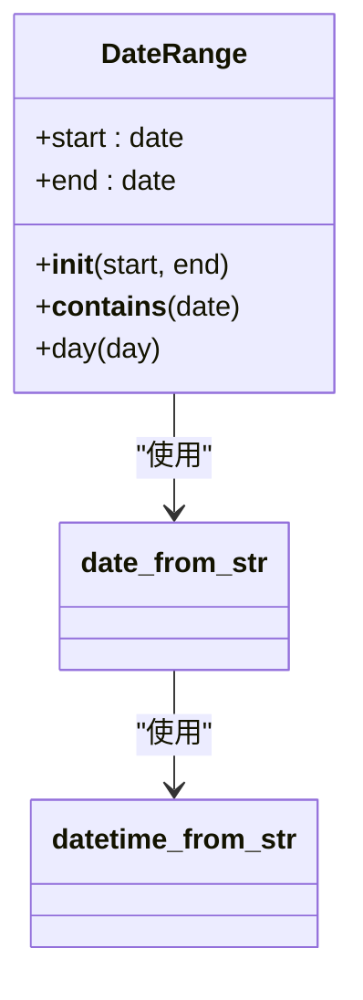
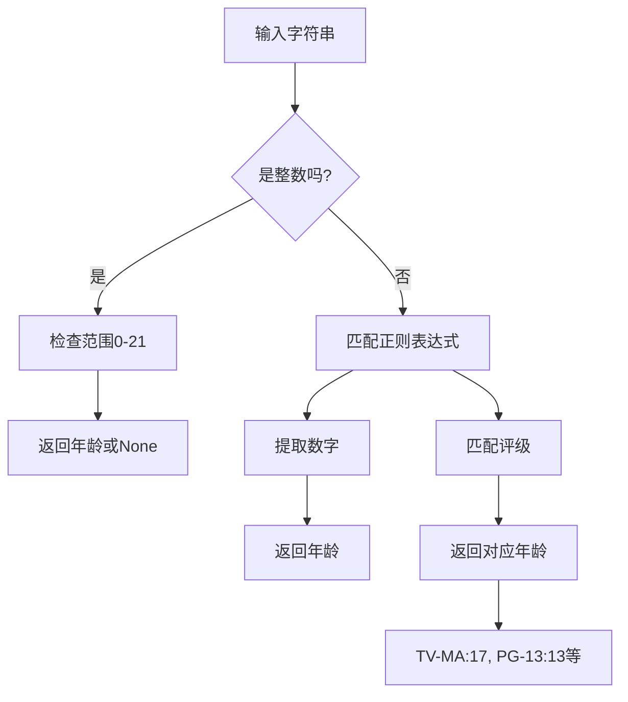

# 基础选择

<cite>
**本文档中引用的文件**  
- [YoutubeDL.py](file://yt_dlp/YoutubeDL.py)
- [options.py](file://yt_dlp/options.py)
- [utils/_utils.py](file://yt_dlp/utils/_utils.py)
</cite>

## 目录
1. [简介](#简介)
2. [核心参数详解](#核心参数详解)
3. [playlist_items 参数](#playlist_items-参数)
4. [daterange 参数](#daterange-参数)
5. [age_limit 参数](#age_limit-参数)
6. [综合使用场景](#综合使用场景)

## 简介
本文档详细解释 yt-dlp 中 `playlist_items`、`daterange` 和 `age_limit` 三个核心选择配置参数的使用方法和实现机制。这些参数允许用户精确控制下载内容，包括从播放列表中选择特定条目、根据上传日期范围筛选视频以及过滤年龄限制内容。文档结合源代码分析这些参数在下载流程中的作用机制，并提供实际使用示例。

**Section sources**
- [YoutubeDL.py](file://yt_dlp/YoutubeDL.py#L1-L100)
- [options.py](file://yt_dlp/options.py#L1-L50)

## 核心参数详解
yt-dlp 提供了多种参数来精确控制下载行为。其中 `playlist_items`、`daterange` 和 `age_limit` 是三个基础且重要的选择参数，它们在 `YoutubeDL` 类的参数字典中定义，并在下载流程中被相应处理。



**Diagram sources**
- [YoutubeDL.py](file://yt_dlp/YoutubeDL.py#L1518-L1536)
- [utils/_utils.py](file://yt_dlp/utils/_utils.py#L1391-L1432)

## playlist_items 参数
`playlist_items` 参数用于指定从播放列表中下载哪些特定条目。用户可以通过逗号分隔的索引或范围来精确选择需要下载的视频。

### 参数语法
该参数支持多种格式：
- 单个索引：`-I 1` 下载第一个视频
- 多个索引：`-I 1,3,5` 下载第1、3、5个视频
- 范围：`-I 1:3` 下载第1到第3个视频
- 带步长的范围：`-I 1:5:2` 下载第1、3、5个视频
- 负索引：`-I -1` 下载最后一个视频

### 实现机制
在 `utils/_utils.py` 中，`PlaylistEntries` 类负责处理播放列表项的选择。它使用正则表达式解析 `playlist_items` 字符串，并生成相应的切片对象。



**Diagram sources**
- [utils/_utils.py](file://yt_dlp/utils/_utils.py#L2412-L2442)
- [YoutubeDL.py](file://yt_dlp/YoutubeDL.py#L1500-L1520)

### 使用示例
```bash
# 下载播放列表中的第1、3、5个视频
yt-dlp -I 1,3,5 "https://www.youtube.com/playlist?list=PL..."

# 下载播放列表中的前5个视频
yt-dlp -I 1:5 "https://www.youtube.com/playlist?list=PL..."

# 下载播放列表中的奇数位置视频
yt-dlp -I 1::2 "https://www.youtube.com/playlist?list=PL..."
```

**Section sources**
- [utils/_utils.py](file://yt_dlp/utils/_utils.py#L2412-L2442)
- [options.py](file://yt_dlp/options.py#L300-L310)

## daterange 参数
`daterange` 参数用于限制只下载在特定日期范围内上传的视频。这对于获取特定时间段的内容非常有用。

### 参数实现
`DateRange` 类在 `utils/_utils.py` 中定义，它表示两个日期之间的时间间隔。该类支持多种日期格式，包括 `YYYYMMDD` 和相对日期表达式如 `today-2weeks`。



**Diagram sources**
- [utils/_utils.py](file://yt_dlp/utils/_utils.py#L1391-L1432)
- [utils/_utils.py](file://yt_dlp/utils/_utils.py#L1300-L1350)

### 使用方法
在 `YoutubeDL` 类中，`daterange` 参数在匹配条目时被检查。如果视频的上传日期不在指定范围内，则会被跳过。

```python
date = info_dict.get('upload_date')
if date is not None:
    date_range = self.params.get('daterange', DateRange())
    if date not in date_range:
        return f'{date_from_str(date).isoformat()} upload date is not in range {date_range}'
```

### 使用示例
```bash
# 下载2023年上传的视频
yt-dlp --dateafter 20230101 --datebefore 20231231 "https://www.youtube.com/user/..."

# 下载过去一个月上传的视频
yt-dlp --dateafter today-1month "https://www.youtube.com/channel/..."

# 下载特定日期上传的视频
yt-dlp --date 20240115 "https://www.youtube.com/playlist?list=PL..."
```

**Section sources**
- [utils/_utils.py](file://yt_dlp/utils/_utils.py#L1391-L1432)
- [YoutubeDL.py](file://yt_dlp/YoutubeDL.py#L1518-L1522)

## age_limit 参数
`age_limit` 参数用于过滤不适合特定年龄用户观看的内容。这是保护未成年人的重要功能。

### 参数解析
`parse_age_limit` 函数在 `utils/_utils.py` 中定义，它将各种格式的年龄限制字符串转换为整数年龄值。



**Diagram sources**
- [utils/_utils.py](file://yt_dlp/utils/_utils.py#L2720-L2750)
- [utils/_utils.py](file://yt_dlp/utils/_utils.py#L3126-L3135)

### 年龄检查机制
`age_restricted` 函数检查内容是否对指定年龄用户受限。如果内容的年龄限制高于用户的年龄限制，则该内容将被跳过。

```python
if age_restricted(info_dict.get('age_limit'), self.params.get('age_limit')):
    return f'Skipping "{video_title}" because it is age restricted'
```

### 支持的评级系统
该参数支持多种评级系统：
- 数字年龄：`18` 表示18岁以上
- MPAA 评级：`PG-13` 对应13岁
- TV 评级：`TV-MA` 对应17岁
- 简化形式：`TV14` 对应14岁

### 使用示例
```bash
# 只下载适合16岁以下用户的内容
yt-dlp --age-limit 16 "https://www.youtube.com/channel/..."

# 下载适合成人的内容
yt-dlp --age-limit 18 "https://www.youtube.com/playlist?list=PL..."

# 使用评级字符串
yt-dlp --age-limit "TV-MA" "https://www.youtube.com/user/..."
```

**Section sources**
- [utils/_utils.py](file://yt_dlp/utils/_utils.py#L2720-L2750)
- [YoutubeDL.py](file://yt_dlp/YoutubeDL.py#L1534-L1536)

## 综合使用场景
这些参数可以组合使用，以实现更精确的内容筛选。

### 教育内容下载
```bash
# 下载适合青少年的教育视频，仅限过去一年内上传
yt-dlp --age-limit 16 --dateafter today-1year \
       -o "%(title)s.%(ext)s" \
       "https://www.youtube.com/playlist?list=EDUCATION_PLAYLIST"
```

### 播放列表精选下载
```bash
# 从大型播放列表中下载特定条目，且仅限近期上传的内容
yt-dlp -I 1:10,15:20 --dateafter 20230101 \
       --max-downloads 15 \
       "https://www.youtube.com/playlist?list=LARGE_PLAYLIST"
```

### 安全内容筛选
```bash
# 为儿童下载完全安全的内容，排除所有年龄限制内容
yt-dlp --age-limit 0 --no-playlist \
       --match-filter "!is_live & duration < 600" \
       "https://www.youtube.com/user/KIDS_CONTENT"
```

这些参数的组合使用使得 yt-dlp 成为一个强大而灵活的下载工具，能够满足各种复杂的下载需求。

**Section sources**
- [YoutubeDL.py](file://yt_dlp/YoutubeDL.py#L1518-L1536)
- [options.py](file://yt_dlp/options.py#L300-L350)