# 视频选择与过滤配置文档

<cite>
**本文档中引用的文件**
- [test/test_config.py](file://test/test_config.py)
- [yt_dlp/options.py](file://yt_dlp/options.py)
- [yt_dlp/YoutubeDL.py](file://yt_dlp/YoutubeDL.py)
- [yt_dlp/utils/_utils.py](file://yt_dlp/utils/_utils.py)
- [test/test_YoutubeDL.py](file://test/test_YoutubeDL.py)
- [test/test_utils.py](file://test/test_utils.py)
- [README.md](file://README.md)
</cite>

## 目录
1. [简介](#简介)
2. [项目结构概览](#项目结构概览)
3. [核心组件分析](#核心组件分析)
4. [架构概览](#架构概览)
5. [详细组件分析](#详细组件分析)
6. [依赖关系分析](#依赖关系分析)
7. [性能考虑](#性能考虑)
8. [故障排除指南](#故障排除指南)
9. [结论](#结论)

## 简介

yt-dlp 是一个功能强大的视频下载工具，提供了丰富的视频选择与过滤功能。本文档详细解释了 playlist_items、matchtitle、rejecttitle、daterange、age_limit 等选择性下载参数，以及 match_filters 和 break_match_filters 的高级过滤功能。通过 test_config.py 中的测试用例，验证各种过滤条件的行为，并提供实用的过滤策略示例。

## 项目结构概览

yt-dlp 项目采用模块化架构，主要包含以下核心模块：

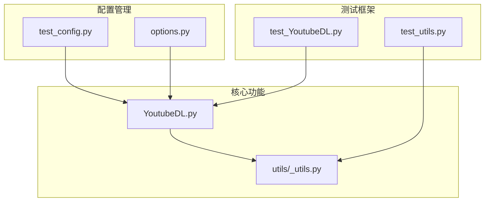

**图表来源**
- [test/test_config.py](file://test/test_config.py#L1-L50)
- [yt_dlp/options.py](file://yt_dlp/options.py#L1-L100)
- [yt_dlp/YoutubeDL.py](file://yt_dlp/YoutubeDL.py#L1-L100)

**章节来源**
- [test/test_config.py](file://test/test_config.py#L1-L228)
- [yt_dlp/options.py](file://yt_dlp/options.py#L1-L799)

## 核心组件分析

### 配置系统

yt-dlp 的配置系统支持多种配置文件位置和优先级：

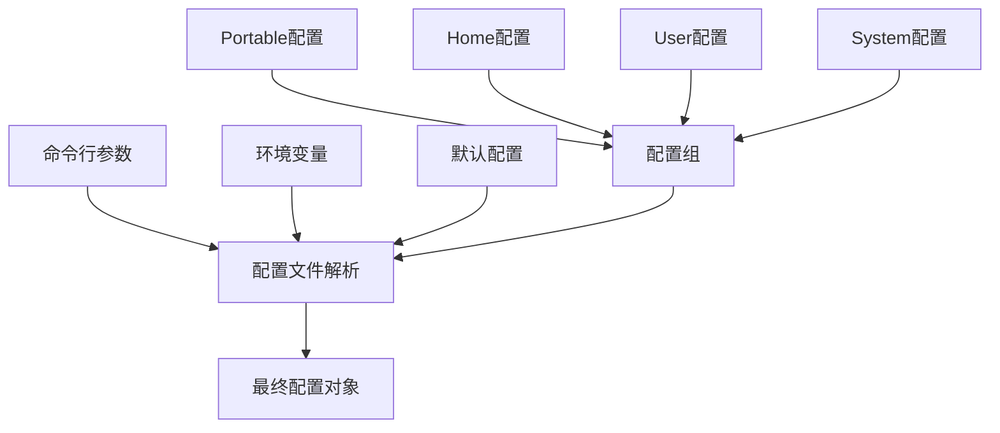

**图表来源**
- [test/test_config.py](file://test/test_config.py#L40-L80)
- [yt_dlp/options.py](file://yt_dlp/options.py#L50-L150)

### 过滤器引擎

过滤器引擎是 yt-dlp 的核心功能之一，支持复杂的条件判断：

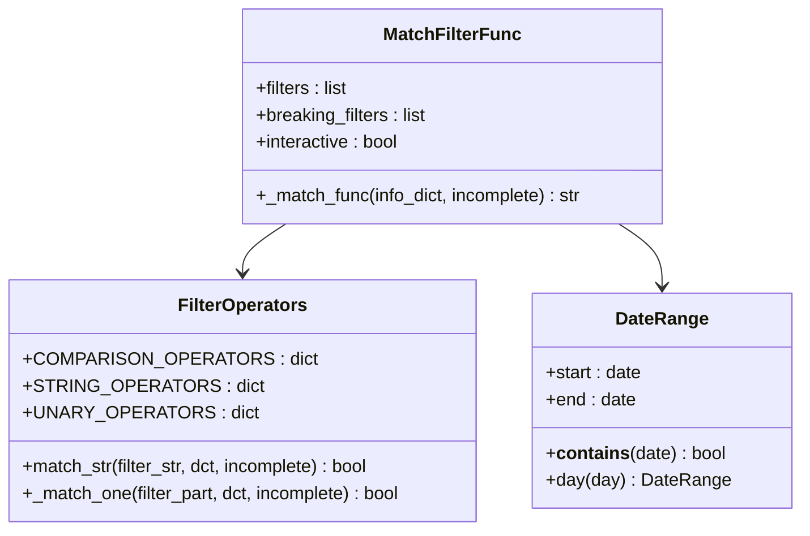

**图表来源**
- [yt_dlp/utils/_utils.py](file://yt_dlp/utils/_utils.py#L3307-L3333)
- [yt_dlp/utils/_utils.py](file://yt_dlp/utils/_utils.py#L3210-L3262)
- [yt_dlp/utils/_utils.py](file://yt_dlp/utils/_utils.py#L1391-L1432)

**章节来源**
- [yt_dlp/utils/_utils.py](file://yt_dlp/utils/_utils.py#L3307-L3333)
- [yt_dlp/utils/_utils.py](file://yt_dlp/utils/_utils.py#L3210-L3305)

## 架构概览

yt-dlp 的视频选择与过滤架构采用分层设计：

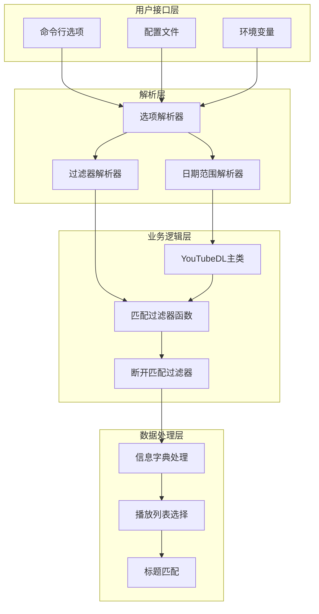

**图表来源**
- [yt_dlp/options.py](file://yt_dlp/options.py#L40-L200)
- [yt_dlp/YoutubeDL.py](file://yt_dlp/YoutubeDL.py#L1500-L1550)

## 详细组件分析

### playlist_items 选择机制

playlist_items 参数允许用户精确控制要下载的播放列表项目：

#### 基本语法
- 单个项目：`-I 1`
- 范围指定：`-I 1:5`（下载第1到第5项）
- 步长指定：`-I 1:10:2`（从第1项开始，每隔2项下载）
- 负索引：`-I -3:`（下载最后3项）
- 反向下载：`-I ::-1`（反向下载整个播放列表）

#### 高级特性
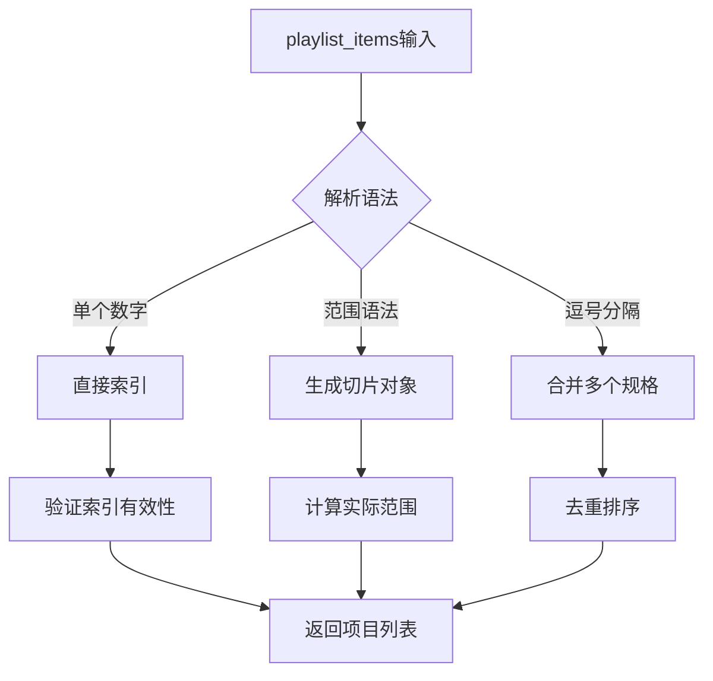

**图表来源**
- [yt_dlp/utils/_utils.py](file://yt_dlp/utils/_utils.py#L2412-L2442)

**章节来源**
- [yt_dlp/utils/_utils.py](file://yt_dlp/utils/_utils.py#L2412-L2506)
- [test/test_YoutubeDL.py](file://test/test_YoutubeDL.py#L1045-L1086)

### matchtitle 和 rejecttitle 标题过滤

这两个参数提供基于正则表达式的标题匹配功能：

#### 匹配逻辑
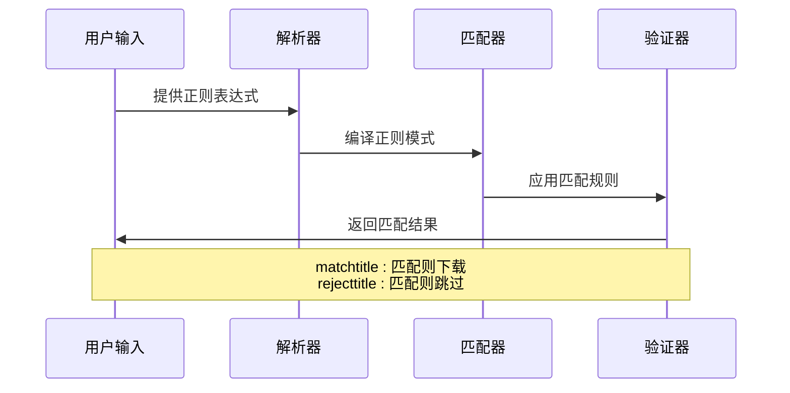

**图表来源**
- [yt_dlp/YoutubeDL.py](file://yt_dlp/YoutubeDL.py#L1506-L1516)

**章节来源**
- [yt_dlp/YoutubeDL.py](file://yt_dlp/YoutubeDL.py#L1506-L1516)

### daterange 日期范围过滤

日期范围过滤器支持灵活的时间段选择：

#### 日期格式支持
- 固定日期：`--date 20231201`
- 相对日期：`--date today-2weeks`
- 日期范围：`--dateafter 20230101 --datebefore 20231231`

#### DateRange 类实现
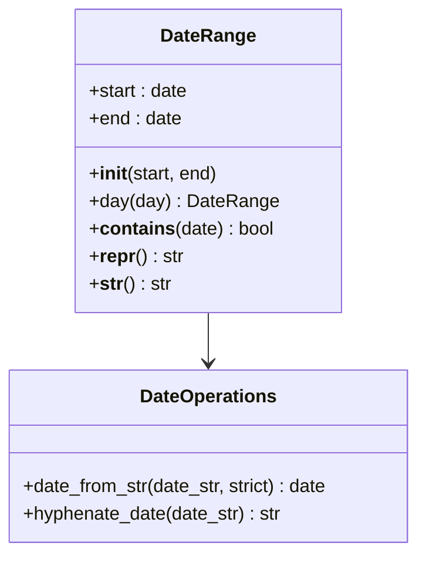

**图表来源**
- [yt_dlp/utils/_utils.py](file://yt_dlp/utils/_utils.py#L1391-L1432)

**章节来源**
- [yt_dlp/utils/_utils.py](file://yt_dlp/utils/_utils.py#L1391-L1432)
- [yt_dlp/YoutubeDL.py](file://yt_dlp/YoutubeDL.py#L1518-L1525)

### age_limit 年龄限制

年龄限制功能确保只下载适合特定年龄段的内容：

#### 年龄限制检查流程
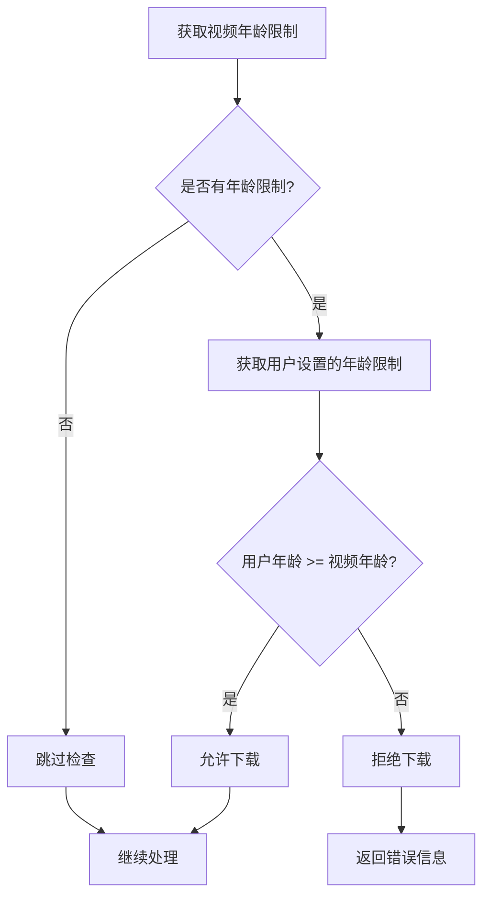

**图表来源**
- [yt_dlp/YoutubeDL.py](file://yt_dlp/YoutubeDL.py#L1530-L1532)

**章节来源**
- [yt_dlp/YoutubeDL.py](file://yt_dlp/YoutubeDL.py#L1530-L1532)

### match_filters 高级过滤功能

match_filters 是 yt-dlp 最强大的功能之一，支持复杂的条件组合：

#### 操作符支持表

| 操作符 | 描述 | 示例 | 用途 |
|--------|------|------|------|
| `=` | 等于 | `like_count=100` | 精确匹配数值或字符串 |
| `!=` | 不等于 | `uploader!="John"` | 排除特定上传者 |
| `>` | 大于 | `duration>300` | 时长大于300秒 |
| `<` | 小于 | `views<1000` | 观看次数少于1000 |
| `>=` | 大于等于 | `rating>=4.5` | 评分不低于4.5 |
| `<=` | 小于等于 | `filesize<=100MB` | 文件大小不超过100MB |
| `^=` | 开始于 | `title^="Tutorial"` | 标题以"Tutorial"开头 |
| `$=` | 结束于 | `ext$=".mp4"` | 扩展名以".mp4"结尾 |
| `*=` | 包含 | `tags*=technology` | 包含"technology"标签 |
| `~=` | 正则匹配 | `title~="(?i)video"` | 标题包含"video"（不区分大小写） |

#### 逻辑运算符

```mermaid
flowchart LR
A[条件1] --> B[&]
B --> C[条件2]
C --> D[&]
D --> E[条件N]
F[条件1] --> G[|]
G --> H[条件2]
H --> I[|]
I --> J[条件N]
E --> K[AND组合]
J --> L[OR组合]
```

**图表来源**
- [yt_dlp/utils/_utils.py](file://yt_dlp/utils/_utils.py#L3210-L3230)

#### 字段比较示例

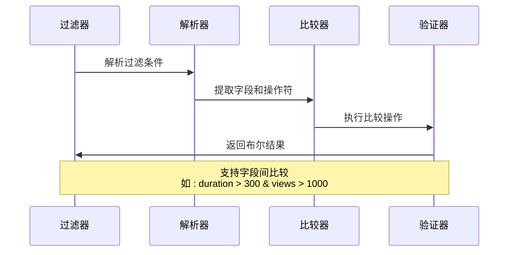

**图表来源**
- [yt_dlp/utils/_utils.py](file://yt_dlp/utils/_utils.py#L3232-L3262)

**章节来源**
- [yt_dlp/utils/_utils.py](file://yt_dlp/utils/_utils.py#L3210-L3305)
- [test/test_utils.py](file://test/test_utils.py#L1506-L1583)

### break_match_filters 断开式过滤

break_match_filters 与 match_filters 类似，但会在第一个不匹配的项目上停止下载：

#### 工作流程对比
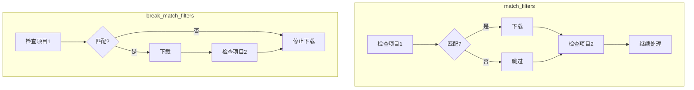

**图表来源**
- [yt_dlp/utils/_utils.py](file://yt_dlp/utils/_utils.py#L3307-L3333)

**章节来源**
- [yt_dlp/utils/_utils.py](file://yt_dlp/utils/_utils.py#L3307-L3333)

### 视频数量和文件大小过滤

#### view_count 过滤
- `--min-views 1000`：最少观看1000次
- `--max-views 10000`：最多观看10000次

#### filesize 过滤
- `--min-filesize 50k`：最小50KB
- `--max-filesize 100M`：最大100MB

**章节来源**
- [yt_dlp/YoutubeDL.py](file://yt_dlp/YoutubeDL.py#L1518-L1525)

## 依赖关系分析

### 核心依赖图

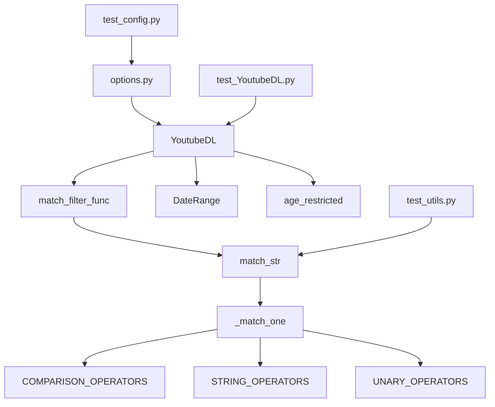

**图表来源**
- [yt_dlp/YoutubeDL.py](file://yt_dlp/YoutubeDL.py#L1-L100)
- [yt_dlp/utils/_utils.py](file://yt_dlp/utils/_utils.py#L3307-L3333)

### 模块间通信

各个模块通过清晰的接口进行通信：

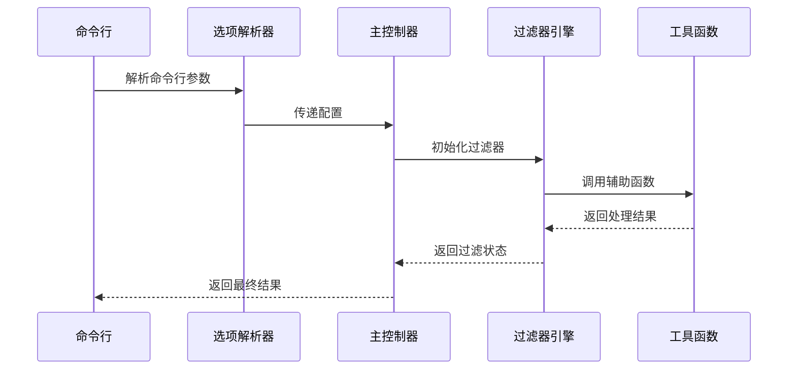

**图表来源**
- [yt_dlp/options.py](file://yt_dlp/options.py#L40-L200)
- [yt_dlp/YoutubeDL.py](file://yt_dlp/YoutubeDL.py#L1500-L1550)

**章节来源**
- [yt_dlp/options.py](file://yt_dlp/options.py#L40-L200)
- [yt_dlp/YoutubeDL.py](file://yt_dlp/YoutubeDL.py#L1500-L1550)

## 性能考虑

### 过滤器优化策略

1. **早期短路**：match_filters 支持早期退出，提高效率
2. **缓存机制**：DateRange 对象使用缓存避免重复计算
3. **正则编译**：字符串操作符预编译正则表达式
4. **惰性求值**：播放列表使用惰性加载减少内存占用

### 内存使用优化

- 使用生成器处理大型播放列表
- 条件检查采用流式处理
- 避免不必要的数据复制

## 故障排除指南

### 常见问题及解决方案

#### 过滤器语法错误
**问题**：过滤器表达式无法解析
**解决方案**：
- 检查操作符拼写
- 验证字段名称正确性
- 确认引号配对正确

#### 性能问题
**问题**：大量视频时过滤速度慢
**解决方案**：
- 使用更具体的过滤条件
- 考虑使用 break_match_filters
- 限制处理的视频数量

#### 兼容性问题
**问题**：某些字段在不同提取器间不一致
**解决方案**：
- 查阅文档确认字段可用性
- 使用通配符或可选字段
- 实现降级策略

**章节来源**
- [test/test_utils.py](file://test/test_utils.py#L1506-L1583)
- [test/test_YoutubeDL.py](file://test/test_YoutubeDL.py#L934-L977)

## 结论

yt-dlp 的视频选择与过滤系统提供了强大而灵活的功能，支持从简单的标题匹配到复杂的多条件组合过滤。通过合理使用 playlist_items、matchtitle、rejecttitle、daterange、age_limit 等参数，以及 match_filters 和 break_match_filters 的高级功能，用户可以精确控制下载行为。

关键优势：
- **灵活性**：支持多种过滤方式和组合
- **性能**：优化的算法确保高效处理
- **易用性**：直观的语法和丰富的示例
- **扩展性**：模块化设计便于功能扩展

建议的最佳实践：
- 使用交互式过滤（`-`）进行手动确认
- 合理设置断开式过滤以节省时间
- 利用字段比较实现复杂逻辑
- 定期更新过滤条件以适应变化

通过深入理解和正确使用这些功能，用户可以构建高效的视频下载工作流程，满足各种复杂的下载需求。