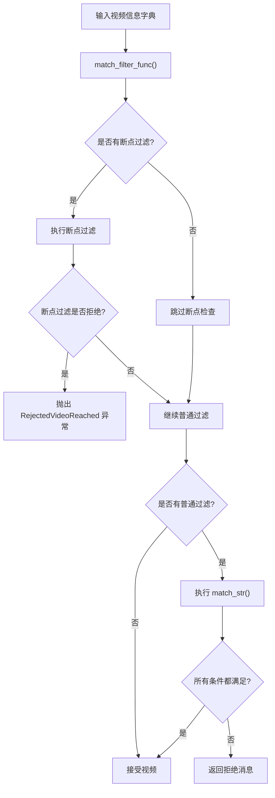
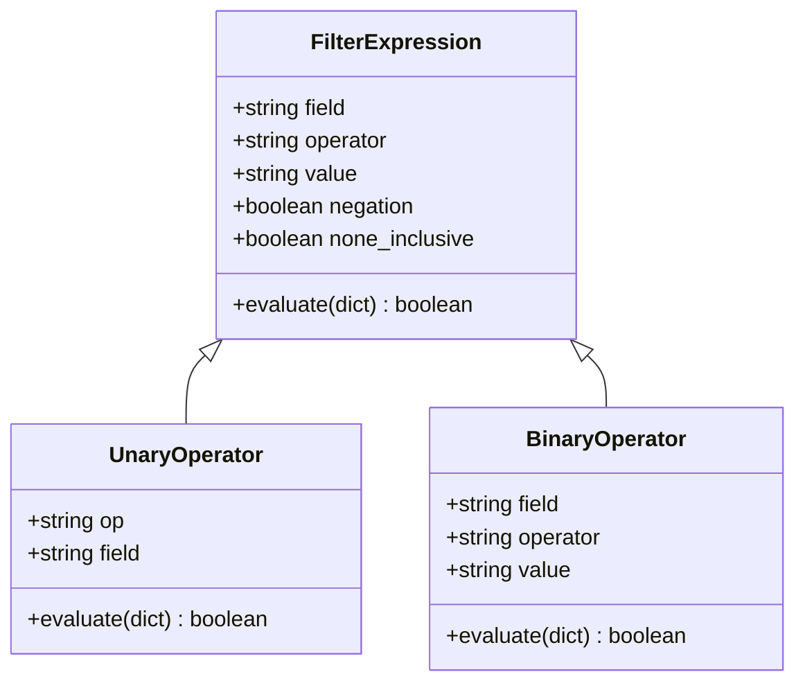
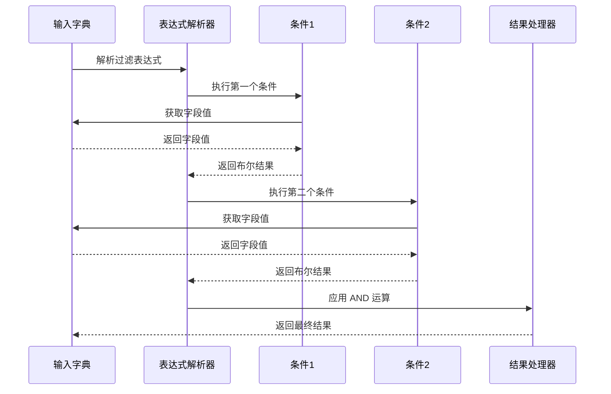
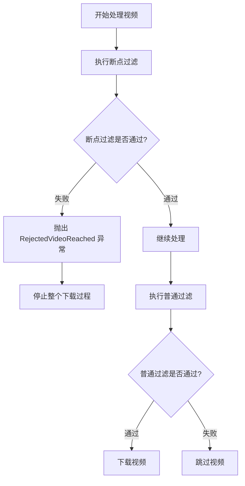
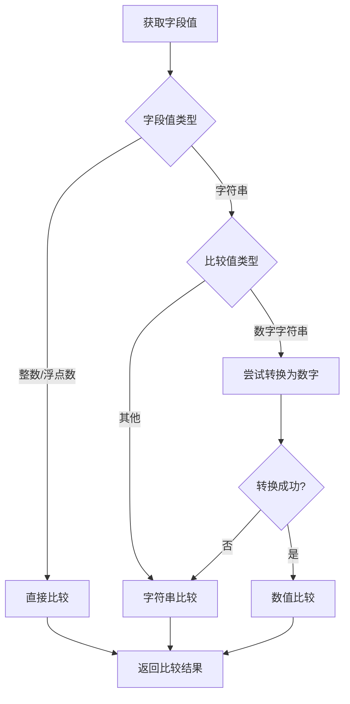
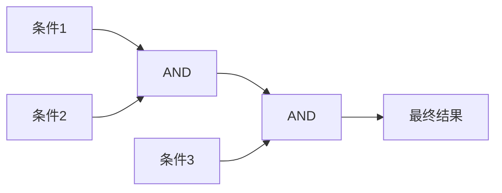
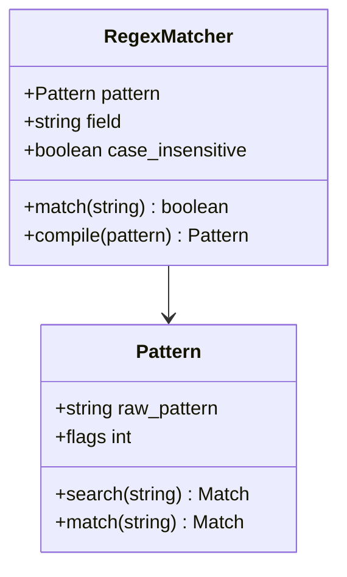
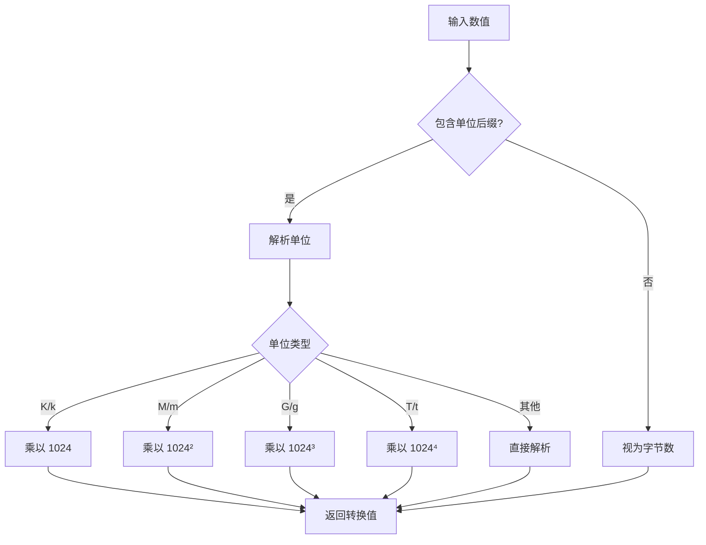
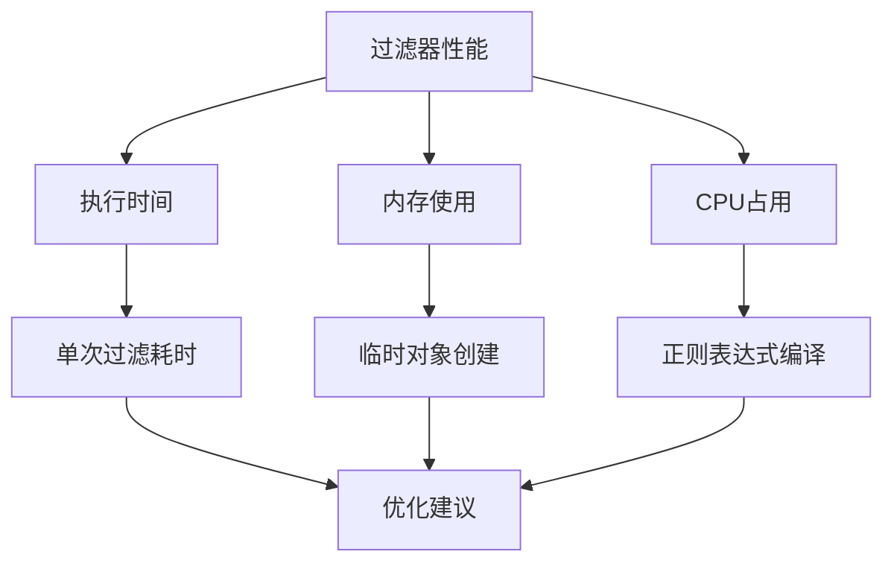

# 高级过滤功能文档

<cite>
**本文档中引用的文件**
- [yt_dlp/utils/_utils.py](file://yt_dlp/utils/_utils.py)
- [yt_dlp/YoutubeDL.py](file://yt_dlp/YoutubeDL.py)
- [yt_dlp/options.py](file://yt_dlp/options.py)
- [test/test_utils.py](file://test/test_utils.py)
- [test/test_YoutubeDL.py](file://test/test_YoutubeDL.py)
- [README.md](file://README.md)
</cite>

## 目录
1. [简介](#简介)
2. [核心过滤机制](#核心过滤机制)
3. [match_filters 过滤器详解](#match_filters-过滤器详解)
4. [break_match_filters 断点过滤器](#break_match_filters-断点过滤器)
5. [过滤表达式语法](#过滤表达式语法)
6. [字段比较操作符](#字段比较操作符)
7. [字符串匹配操作符](#字符串匹配操作符)
8. [逻辑运算符](#逻辑运算符)
9. [正则表达式匹配](#正则表达式匹配)
10. [数值处理与单位转换](#数值处理与单位转换)
11. [实际应用示例](#实际应用示例)
12. [性能优化建议](#性能优化建议)
13. [故障排除指南](#故障排除指南)

## 简介

yt-dlp 的高级过滤功能提供了强大的视频内容筛选能力，支持基于多种条件的精确匹配和复杂逻辑组合。该系统通过 `match_filters` 和 `break_match_filters` 两个核心组件，实现了灵活而高效的过滤机制。

### 核心特性

- **多条件组合**：支持复杂的逻辑运算和条件组合
- **类型安全**：自动处理数值、字符串和布尔值比较
- **正则表达式支持**：强大的模式匹配能力
- **交互式过滤**：支持用户确认下载决策
- **断点控制**：可中断下载过程以处理不符合条件的内容

## 核心过滤机制

### 过滤函数架构



**图表来源**
- [yt_dlp/utils/_utils.py](file://yt_dlp/utils/_utils.py#L3302-L3333)

### 过滤器类型

系统支持两种主要的过滤器类型：

1. **match_filters**：用于常规过滤，不符合条件的视频会被跳过
2. **break_match_filters**：用于断点过滤，不符合条件的视频会终止整个下载过程

**章节来源**
- [yt_dlp/utils/_utils.py](file://yt_dlp/utils/_utils.py#L3302-L3333)
- [yt_dlp/options.py](file://yt_dlp/options.py#L692-L714)

## match_filters 过滤器详解

### 基本语法结构

`match_filters` 支持以下基本语法模式：



**图表来源**
- [yt_dlp/utils/_utils.py](file://yt_dlp/utils/_utils.py#L3210-L3287)

### 字段存在性检查

系统支持直接检查字段是否存在：

- `field`：检查字段是否存在且非空
- `!field`：检查字段是否不存在或为空

### 条件组合

多个条件可以通过 `&` 运算符合并：



**图表来源**
- [yt_dlp/utils/_utils.py](file://yt_dlp/utils/_utils.py#L3290-L3299)

**章节来源**
- [yt_dlp/utils/_utils.py](file://yt_dlp/utils/_utils.py#L3290-L3299)

## break_match_filters 断点过滤器

### 断点过滤机制

断点过滤器在检测到不符合条件的视频时会立即终止下载过程，而不是简单地跳过该视频。



**图表来源**
- [yt_dlp/utils/_utils.py](file://yt_dlp/utils/_utils.py#L3307-L3320)

### 使用场景

断点过滤器适用于以下场景：
- **质量控制**：确保所有下载的视频都符合严格的质量标准
- **存储空间管理**：在磁盘空间不足时提前终止
- **网络带宽限制**：在网络条件不佳时停止下载
- **内容审核**：在发现不适当内容时立即停止

**章节来源**
- [yt_dlp/utils/_utils.py](file://yt_dlp/utils/_utils.py#L3307-L3320)

## 过滤表达式语法

### 基本语法模式

过滤表达式遵循以下通用模式：

```
[!]field[operator]value[?]
```

### 语法元素说明

| 元素 | 描述 | 示例 |
|------|------|------|
| `field` | 要检查的字段名称 | `duration`, `filesize`, `uploader` |
| `operator` | 比较操作符 | `>`, `>=`, `<`, `<=`, `=`, `!=`, `^=`, `$=`, `*=` |
| `value` | 比较值 | `300`, `"youtube"`, `5MiB` |
| `!` | 否定前缀 | `!is_live` |
| `?` | 可选字段标志 | `like_count>?100` |

### 字段引用规则

- 字段名只能包含字母、数字、下划线和点号
- 不支持特殊字符作为字段名
- 支持嵌套字段访问（如果数据结构允许）

**章节来源**
- [yt_dlp/utils/_utils.py](file://yt_dlp/utils/_utils.py#L3210-L3287)

## 字段比较操作符

### 数值比较操作符

| 操作符 | 名称 | 描述 | 示例 |
|--------|------|------|------|
| `>` | 大于 | 检查字段值是否大于指定值 | `duration > 300` |
| `>=` | 大于等于 | 检查字段值是否大于或等于指定值 | `filesize >= 5MiB` |
| `<` | 小于 | 检查字段值是否小于指定值 | `view_count < 1000` |
| `<=` | 小于等于 | 检查字段值是否小于或等于指定值 | `like_count <= 500` |
| `=` | 等于 | 检查字段值是否等于指定值 | `status = "completed"` |
| `!=` | 不等于 | 检查字段值是否不等于指定值 | `ext != "mp4"` |

### 自动类型转换

系统会根据字段的实际类型自动进行类型转换：



**图表来源**
- [yt_dlp/utils/_utils.py](file://yt_dlp/utils/_utils.py#L3240-L3260)

**章节来源**
- [yt_dlp/utils/_utils.py](file://yt_dlp/utils/_utils.py#L3210-L3287)

## 字符串匹配操作符

### 字符串比较操作符

| 操作符 | 名称 | 描述 | 示例 |
|--------|------|------|------|
| `=` | 完全相等 | 字符串完全匹配 | `uploader = "John Doe"` |
| `!=` | 不相等 | 字符串不匹配 | `ext != "avi"` |
| `^=` | 开头匹配 | 字符串以指定值开头 | `url ^= "https://"` |
| `$=` | 结尾匹配 | 字符串以指定值结尾 | `filename $= ".mp4"` |
| `*=` | 包含匹配 | 字符串包含指定子串 | `title *= "tutorial"` |

### 正则表达式匹配

| 操作符 | 名称 | 描述 | 示例 |
|--------|------|------|------|
| `~=` | 正则匹配 | 使用正则表达式匹配 | `title ~= "(?i)\\bcats\\b"` |

### 字符串处理规则

- **引号处理**：支持单引号和双引号，内部转义字符需要双重转义
- **大小写敏感**：默认情况下正则表达式区分大小写
- **特殊字符**：特殊字符需要正确转义

**章节来源**
- [yt_dlp/utils/_utils.py](file://yt_dlp/utils/_utils.py#L3210-L3230)

## 逻辑运算符

### AND 运算符

AND 运算符使用 `&` 符号连接多个条件：



**图表来源**
- [yt_dlp/utils/_utils.py](file://yt_dlp/utils/_utils.py#L3290-L3299)

### 条件求值顺序

1. **优先级**：AND 运算符具有最高优先级
2. **短路求值**：如果第一个条件为假，则后续条件不再计算
3. **组合规则**：所有条件必须同时满足才能通过过滤

### 复杂条件示例

```
duration > 300 & resolution >= "720p" & !is_live
like_count > 1000 & dislike_count < 100 & description *= "tutorial"
uploader = "TechChannel" & (filesize < 100MiB | duration < 600)
```

**章节来源**
- [yt_dlp/utils/_utils.py](file://yt_dlp/utils/_utils.py#L3290-L3299)

## 正则表达式匹配

### 正则表达式语法

正则表达式匹配使用 `~=` 操作符，支持完整的 Python 正则表达式语法：



**图表来源**
- [yt_dlp/utils/_utils.py](file://yt_dlp/utils/_utils.py#L3210-L3230)

### 常用正则表达式模式

| 模式 | 描述 | 示例 |
|------|------|------|
| `\bword\b` | 单词边界匹配 | `\bcats\b` 匹配 "cats" 不匹配 "category" |
| `(?i)pattern` | 忽略大小写 | `(?i)\\bcats\\b` 匹配 "Cats"、"CATS" 等 |
| `pattern.*pattern` | 多行匹配 | `(?i).*cats.*dogs.*` |
| `[0-9]+` | 数字匹配 | 匹配任何数字序列 |
| `^[A-Z].*` | 以大写字母开头 | 匹配以大写字母开头的标题 |

### 性能优化建议

- **避免过度复杂的正则表达式**：简单的模式比复杂的正则表达式更快
- **使用锚点**：`^` 和 `$` 可以提高匹配效率
- **预编译模式**：对于重复使用的模式，考虑预编译

**章节来源**
- [yt_dlp/utils/_utils.py](file://yt_dlp/utils/_utils.py#L3210-L3230)

## 数值处理与单位转换

### 支持的数值格式

系统支持多种数值格式和单位：

| 格式 | 示例 | 描述 |
|------|------|------|
| 整数 | `100`, `1000` | 基本整数值 |
| 浮点数 | `1.5`, `10.75` | 带小数点的数值 |
| 单位后缀 | `5K`, `2.5M`, `1GiB` | 自动单位转换 |
| 文件大小 | `500KB`, `2.5MB`, `1GB` | 存储空间表示法 |

### 单位转换规则



**图表来源**
- [yt_dlp/utils/_utils.py](file://yt_dlp/utils/_utils.py#L3240-L3260)

### 时间格式支持

对于时间相关的字段，支持以下格式：

- **秒数**：`300` 表示 300 秒
- **时间格式**：`1:30:00` 表示 1 小时 30 分钟
- **混合格式**：`1:30:00.5` 表示 1 小时 30 分钟 0.5 秒

**章节来源**
- [yt_dlp/utils/_utils.py](file://yt_dlp/utils/_utils.py#L3240-L3260)

## 实际应用示例

### 视频质量过滤

#### 基础质量过滤
```
# 过滤时长超过 5 分钟的视频
duration > 300

# 过滤分辨率低于 720p 的视频
resolution >= "720p"

# 过滤文件大小超过 100MB 的视频
filesize > 100MiB
```

#### 复合质量过滤
```
# 高质量视频过滤
duration > 300 & resolution >= "1080p" & filesize > 50MiB

# 中等质量视频过滤
resolution >= "480p" & resolution < "720p" & filesize > 10MiB

# 短视频过滤
duration < 300 & filesize < 50MiB
```

### 内容分类过滤

#### 主题过滤
```
# 技术教程视频
description *= "tutorial" & uploader = "TechChannel"

# 游戏视频
tags *= "game" & category = "Gaming"

# 音乐视频
tags *= "music" & duration > 180

# 新闻视频
category = "News" & description *= "news"
```

#### 内容评级过滤
```
# 适合儿童的内容
age_limit <= 12 & title *= "kid"

# 成人内容过滤
age_limit >= 18 & !(title *= "adult")

# PG-13 内容
age_limit >= 13 & age_limit < 18
```

### 下载策略过滤

#### 存储空间管理
```
# 小文件优先下载
filesize < 50MiB & !is_live

# 大文件分批下载
filesize > 100MiB & duration > 600

# 临时下载（无存储要求）
filesize <? 1GiB & duration > 300
```

#### 网络条件适应
```
# 低带宽环境
filesize < 20MiB & duration < 600

# 高带宽环境
filesize > 100MiB & resolution >= "1080p"

# 移动网络优化
duration < 300 & resolution <= "720p"
```

### 特殊场景过滤

#### 直播流过滤
```
# 过滤直播内容
!is_live

# 仅保留直播
is_live & duration > 300

# 过滤即将开始的直播
is_live & scheduled_start_time < now
```

#### 订阅者数量过滤
```
# 高关注度内容
subscriber_count > 100000 & like_count > 10000

# 新兴创作者
subscriber_count < 10000 & like_count > 1000

# 热门内容
view_count > 1000000 | like_count > 100000
```

**章节来源**
- [test/test_utils.py](file://test/test_utils.py#L1506-L1583)
- [test/test_YoutubeDL.py](file://test/test_YoutubeDL.py#L950-L990)

## 性能优化建议

### 过滤器设计原则

1. **简单优先**：从最简单的条件开始，逐步增加复杂度
2. **索引友好**：优先使用可以直接访问的字段
3. **短路优化**：将最可能失败的条件放在前面
4. **避免重复计算**：对同一字段的多次比较使用缓存

### 性能监控指标



### 最佳实践

#### 条件排序
```
# 推荐：简单条件在前
duration > 300 & resolution >= "720p" & filesize > 50MiB

# 不推荐：复杂条件在前
resolution >= "720p" & duration > 300 & filesize > 50MiB
```

#### 字段选择
```
# 推荐：使用索引友好的字段
uploader = "TechChannel" & duration > 300

# 避免：使用计算字段
duration > 300 & (end_time - start_time) > 300
```

#### 正则表达式优化
```
# 推荐：使用锚点
title ^= "Tutorial:" & description *= "\\bpython\\b"

# 避免：过于宽泛的正则
description ~= ".*"
```

## 故障排除指南

### 常见错误类型

#### 语法错误
```
# 错误：缺少字段名
> 300

# 错误：操作符拼写错误
duration => 300

# 错误：引号不匹配
title = "Hello world
```

#### 类型错误
```
# 错误：字符串比较数字
duration = "300"

# 错误：布尔值比较字符串
is_live = "true"
```

#### 逻辑错误
```
# 错误：条件永远为假
duration > 300 & duration < 100

# 错误：条件永远为真
duration > 100 | duration < 500
```

### 调试技巧

#### 启用调试输出
```bash
# 启用详细日志
yt-dlp --verbose --match-filters "duration > 300"
```

#### 条件测试
```bash
# 测试单个条件
yt-dlp --match-filters "duration > 300" --simulate

# 测试复合条件
yt-dlp --match-filters "duration > 300 & resolution >= '720p'" --simulate
```

#### 数据验证
```bash
# 查看可用字段
yt-dlp --dump-json --match-filters "title" URL

# 检查字段类型
yt-dlp --print "%(duration)s %(resolution)s %(filesize)s" URL
```

### 性能问题诊断

#### 过慢的过滤器
1. **检查正则表达式复杂度**
2. **优化条件顺序**
3. **减少不必要的字段访问**

#### 内存使用过高
1. **避免大型正则表达式**
2. **减少临时对象创建**
3. **使用更具体的条件**

#### CPU 占用过高
1. **简化正则表达式**
2. **减少嵌套条件**
3. **使用更高效的比较操作符

**章节来源**
- [yt_dlp/utils/_utils.py](file://yt_dlp/utils/_utils.py#L3280-L3287)

## 结论

yt-dlp 的高级过滤功能提供了强大而灵活的内容筛选能力，通过合理使用 `match_filters` 和 `break_match_filters`，可以实现精确的视频内容管理和下载控制。掌握这些过滤器的语法和最佳实践，能够显著提高下载效率和内容质量。

关键要点：
- 理解过滤器的执行顺序和逻辑运算规则
- 合理设计过滤条件的组合和优先级
- 利用正则表达式进行复杂的模式匹配
- 根据具体需求选择合适的过滤策略
- 注意性能优化和错误处理

通过本文档的指导，用户可以根据自己的具体需求，构建高效、准确的视频过滤系统，实现个性化的下载体验。