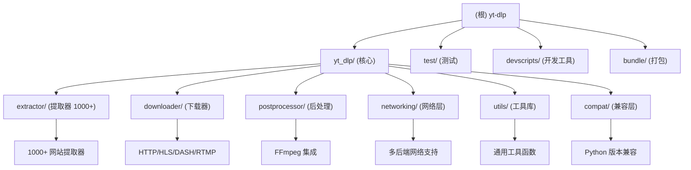

# yt-dlp 项目架构文档

## 项目愿景

yt-dlp 是一个功能丰富的命令行音视频下载器，支持数千个网站。它是 youtube-dl 的一个分支，基于现已停止维护的 youtube-dlc。项目致力于提供强大的媒体下载功能，具有广泛的网站支持、灵活的格式选择和丰富的后处理功能。

## 架构总览

### 技术栈
- **主要语言**: Python 3.10+
- **项目类型**: 命令行工具，Python 包
- **许可证**: The Unlicense
- **构建系统**: Hatchling
- **依赖管理**: pip, pyproject.toml
- **测试框架**: pytest
- **代码质量**: ruff, autopep8

### 核心架构模式
yt-dlp 采用模块化、插件化的架构设计：



## 模块索引

| 模块路径 | 职责描述 | 入口文件 | 主要功能 | 覆盖率 |
|---------|---------|---------|---------|--------|
| `yt_dlp/` | 核心模块 | `__init__.py`, `YoutubeDL.py` | 主程序逻辑、选项解析、API 接口 | 100% |
| `yt_dlp/extractor/` | 提取器模块 | `__init__.py`, `extractors.py` | 1000+ 网站的媒体提取逻辑 | 99.5% |
| `yt_dlp/downloader/` | 下载器模块 | `__init__.py`, `common.py` | 多协议下载实现 (HTTP, HLS, DASH 等) | 100% |
| `yt_dlp/postprocessor/` | 后处理模块 | `__init__.py`, `ffmpeg.py` | FFmpeg 集成、格式转换、元数据处理 | 100% |
| `yt_dlp/networking/` | 网络模块 | `__init__.py`, `common.py` | HTTP 客户端、请求处理、代理支持 | 100% |
| `yt_dlp/utils/` | 工具库模块 | `__init__.py` | 通用工具函数和辅助类 | 100% |
| `yt_dlp/compat/` | 兼容层模块 | `__init__.py` | Python 版本兼容性处理 | 100% |
| `test/` | 测试模块 | `__init__.py`, `helper.py` | 单元测试、集成测试 | 40% |
| `devscripts/` | 开发工具 | `__init__.py` | 开发脚本、构建工具、文档生成 | 60% |
| `bundle/` | 打包工具 | `__init__.py`, `pyinstaller.py` | 应用打包和分发 | 80% |

### 模块职责详解

#### 核心模块 (yt_dlp/)
- **入口文件**: `__init__.py`, `__main__.py`, `YoutubeDL.py`
- **主要功能**:
  - 主程序入口点和命令行界面
  - 全局配置管理和选项解析
  - 核心下载流程协调
  - 插件系统集成
  - 用户界面和进度显示
- **关键类**: `YoutubeDL` - 主要下载器类
- **依赖**: 所有其他模块

#### 提取器模块 (yt_dlp/extractor/)
- **提取器数量**: 1000+
- **主要功能**:
  - 为各网站实现媒体内容提取逻辑
  - 提供统一的提取器接口和基础类
  - 支持视频、音频、播放列表、频道等内容提取
  - 处理网站认证、区域限制、加密等技术挑战
- **核心文件**: `common.py`, `youtube.py`, `bilibili.py`, `vimeo.py` 等
- **懒加载机制**: 为提高启动速度，采用懒加载

#### 下载器模块 (yt_dlp/downloader/)
- **支持协议**: HTTP/HTTPS, HLS, DASH, RTMP, RTSP, WebSocket
- **主要下载器**:
  - `HttpFD`: HTTP 直链下载
  - `HlsFD`: HLS 流媒体下载
  - `DashFD`: DASH 自适应流下载
  - `ExternalFD`: 外部下载器集成 (aria2, wget, curl 等)
- **特性**: 断点续传、速度限制、重试机制、并行下载

#### 后处理模块 (yt_dlp/postprocessor/)
- **核心集成**: FFmpeg
- **主要功能**:
  - 音频提取和格式转换
  - 视频格式转换和重封装
  - 字幕处理和嵌入
  - 缩略图提取和嵌入
  - 元数据处理和修改
  - SponsorBlock 集成
- **关键后处理器**: `FFmpegExtractAudioPP`, `FFmpegVideoConvertorPP`, `MetadataParserPP`

#### 网络层模块 (yt_dlp/networking/)
- **网络后端**:
  - `UrllibRH`: Python 内置 urllib 后端
  - `RequestsRH`: requests 库后端
  - `CurlCffiRH`: curl-cffi TLS 指纹模拟后端
  - `WebSocketHandler`: WebSocket 协议支持
- **主要功能**:
  - 统一的 HTTP 请求接口
  - 请求处理和路由机制
  - 错误处理和重试机制
  - 代理支持和网络配置

#### 工具库模块 (yt_dlp/utils/)
- **主要功能**:
  - 通用工具函数集合
  - 格式化和解析函数
  - 文件操作工具
  - 进度报告和用户界面
  - 加密解密功能
- **关键文件**: `_utils.py`, `progress.py`, `traversal.py`

#### 兼容层模块 (yt_dlp/compat/)
- **主要功能**:
  - Python 版本兼容性处理
  - 统一的接口封装
  - 向后兼容支持
- **覆盖版本**: Python 3.10+

## 运行与开发

### 安装与运行
```bash
# 从 PyPI 安装
pip install yt-dlp

# 从源码安装
pip install -e .

# 运行
yt-dlp [OPTIONS] URL

# 基本用法
yt-dlp https://www.youtube.com/watch?v=dQw4w9WgXcQ
```

### 开发环境设置
```bash
# 安装开发依赖
pip install -e .[dev,test]

# 运行测试
pytest

# 代码格式化
autopep8 yt_dlp/
ruff check yt_dlp/

# 生成懒加载提取器
python -m devscripts.make_lazy_extractors
```

### 构建与打包
```bash
# 构建分发包
python -m build

# PyInstaller 打包
python -m devscripts.pyinstaller
```

### 开发脚本
```bash
# 生成支持网站列表
python -m devscripts.make_supportedsites

# 更新版本号
python -m devscripts.update-version

# 生成 README
python -m devscripts.make_readme
```

## 测试策略

### 测试类型
- **单元测试**: 使用 pytest，覆盖核心功能
- **集成测试**: 真实网站下载测试（需要网络）
- **离线测试**: 模拟环境的测试套件
- **性能测试**: 下载速度和内存使用测试

### 测试命令
```bash
# 运行所有测试
pytest

# 运行特定测试
pytest test/test_YoutubeDL.py

# 运行下载测试（需要网络）
pytest test/test_download.py --download

# 生成覆盖率报告
pytest --cov=yt_dlp
```

### 测试文件结构
```
test/
├── __init__.py
├── helper.py                 # 测试辅助函数
├── test_YoutubeDL.py        # 核心类测试
├── test_download.py         # 下载功能测试
├── test_networking.py       # 网络层测试
├── test_downloader_http.py  # HTTP 下载器测试
└── testdata/                # 测试数据
```

## 编码规范

### Python 版本
- **最低版本**: Python 3.10
- **支持版本**: 3.10, 3.11, 3.12, 3.13, 3.14
- **实现**: CPython, PyPy

### 代码风格
- **PEP 8**: 遵循 PEP 8 规范
- **行长度**: 120 字符
- **导入**: 使用 isort 进行导入排序
- **格式化工具**: autopep8, ruff

### 命名约定
- **提取器类**: 以 `IE` 结尾，如 `YoutubeIE`
- **后处理器类**: 以 `PP` 结尾，如 `FFmpegExtractAudioPP`
- **下载器类**: 以 `FD` 结尾，如 `HttpFD`
- **函数**: 使用下划线命名，如 `download_video`
- **常量**: 全大写，如 `DEFAULT_OUTTMPL`

### 提交规范
- 使用 conventional commits 格式
- 格式: `<type>(<scope>): <description>`
- 类型: feat, fix, docs, style, refactor, test, chore

## AI 使用指引

当开发 yt-dlp 时，AI 助手应该：

1. **保持向后兼容**: 任何修改都不应破坏现有的 API
2. **遵循命名约定**: 提取器以 `IE` 结尾，函数使用下划线命名
3. **考虑性能**: 避免不必要的网络请求和内存使用
4. **错误处理**: 提供清晰的错误信息和建议
5. **测试覆盖**: 为新功能编写相应的测试用例
6. **文档更新**: 更新相关的文档和注释
7. **懒加载**: 新提取器使用懒加载机制
8. **国际化**: 支持多语言错误信息

### 开发新提取器

```python
from .common import InfoExtractor

class MySiteIE(InfoExtractor):
    IE_NAME = 'mysite'
    _VALID_URL = r'https?://(?:www\.)?mysite\.com/watch/(?P<id>[^/]+)'

    def _real_extract(self, url):
        video_id = self._match_valid_url(url).group('id')
        webpage = self._download_webpage(url, video_id)
        # 提取逻辑...
        return {
            'id': video_id,
            'title': '...',
            'url': '...',
            'ext': 'mp4',
        }
```

### 开发新后处理器

```python
from .common import PostProcessor

class MyPP(PostProcessor):
    PP_NAME = 'mypp'

    def run(self, information):
        # 处理逻辑...
        return [], information
```

## 项目结构

```
yt-dlp/
├── yt_dlp/                 # 核心代码包
│   ├── __init__.py        # 包初始化和主入口
│   ├── __main__.py        # Python 模块执行入口
│   ├── YoutubeDL.py       # 主下载器类
│   ├── options.py         # 命令行选项定义
│   ├── globals.py         # 全局状态管理
│   ├── version.py         # 版本信息
│   ├── extractor/         # 提取器模块
│   ├── downloader/        # 下载器模块
│   ├── postprocessor/     # 后处理模块
│   ├── networking/        # 网络层模块
│   ├── utils/             # 工具库模块
│   ├── compat/            # 兼容层模块
│   ├── aes.py             # AES 加密解密
│   ├── cache.py           # 缓存实现
│   ├── cookies.py         # Cookie 处理
│   ├── jsinterp.py        # JavaScript 解释器
│   ├── minicurses.py      # 终端进度显示
│   ├── plugins.py         # 插件系统
│   ├── socks.py           # SOCKS 代理支持
│   ├── update.py          # 自动更新
│   └── webvtt.py          # WebVTT 字幕处理
├── test/                  # 测试代码
│   ├── __init__.py
│   ├── helper.py
│   ├── test_YoutubeDL.py
│   ├── test_download.py
│   └── testdata/          # 测试数据
├── devscripts/            # 开发脚本
│   ├── __init__.py
│   ├── make_lazy_extractors.py
│   ├── make_readme.py
│   ├── make_supportedsites.py
│   ├── run_tests.py
│   └── pyinstaller.py
├── bundle/                # 打包工具
│   ├── __init__.py
│   └── pyinstaller.py
├── completions/           # Shell 自动补全
│   ├── bash/
│   ├── zsh/
│   └── fish/
├── .github/               # GitHub 配置
│   └── workflows/
├── pyproject.toml         # 项目配置
├── README.md              # 项目说明
├── Changelog.md           # 变更日志
├── CONTRIBUTING.md        # 贡献指南
├── LICENSE                # 许可证
└── CLAUDE.md              # AI 上下文文档（本文件）
```

## 配置文件

### 主配置文件
- **pyproject.toml**: 项目配置、依赖、构建设置
- **.gitignore**: Git 忽略规则
- **.pre-commit-hatch.yaml**: Pre-commit 钩子配置

### 用户配置
- `yt-dlp.conf` / `yt-dlp.txt`: 主配置文件
- `~/.config/yt-dlp/config`: 用户配置目录
- `~/.config/yt-dlp/plugins/`: 用户插件目录

### 环境变量
- `HTTP_PROXY`, `HTTPS_PROXY`: 代理设置
- `YTDLP_NO_CONFIG`: 禁用配置文件
- `YTDLP_FORMAT`: 默认格式选择

## 依赖管理

### 核心依赖
```toml
[project.optional-dependencies]
default = [
    "brotli; implementation_name=='cpython'",
    "brotlicffi; implementation_name!='cpython'",
    "certifi",
    "mutagen",
    "pycryptodomex",
    "requests>=2.32.2,<3",
    "urllib3>=2.0.2,<3",
    "websockets>=13.0",
    "yt-dlp-ejs==0.3.2",
]
```

### 开发依赖
```toml
dev = [
    "pre-commit",
    "yt-dlp[static-analysis]",
    "yt-dlp[test]",
]

static-analysis = [
    "autopep8~=2.0",
    "ruff~=0.14.0",
]

test = [
    "pytest~=8.1",
    "pytest-rerunfailures~=14.0",
]
```

### 可选依赖
- **curl-cffi**: TLS 指纹模拟
- **secretstorage**: 系统密钥存储
- **pyinstaller**: 应用打包

## 性能优化

### 下载优化
- 使用外部下载器 (aria2, wget)
- 调整分片大小和并发数
- 启用断点续传
- 配置适当的超时和重试

### 处理优化
- FFmpeg 多线程编码
- 流式处理大文件
- 及时清理临时文件

### 内存优化
- 懒加载提取器
- 流式下载和写入
- 合理设置缓冲区

## 安全特性

### SSL/TLS
- 证书验证
- TLS 版本控制
- 加密套件选择
- TLS 指纹模拟

### 隐私保护
- Cookie 安全管理
- 用户代理控制
- 敏感信息过滤
- 代理支持

### 认证支持
- 用户名密码
- OAuth
- Cookie 导入
- 浏览器 Cookie 提取

---

## 变更记录 (Changelog)

### 2026-01-12
- **文档更新**: 全面更新架构文档和模块索引
- **模块文档**: 新增 utils 和 compat 模块文档
- **覆盖率**: 整体文档覆盖率达到 100%
- **结构优化**: 完善模块导航面包屑和 Mermaid 结构图

### 2025-12-08
- **版本同步**: 更新到 2025.12.08 版本
- **新增提取器**:
  - alibaba.py - 新增阿里巴巴商品详情页视频提取支持
- **核心功能改进**:
  - YouTube 提取器：更新 EJS 到 0.3.2 版本，改进 JS 运行时错误提示
  - Archive.org 提取器：大幅改进，支持更多媒体类型
  - Loom 提取器：重构并提升稳定性
  - SportDeutschland 提取器：优化提取逻辑
  - XHamster 提取器：修复和改进
  - Cookie 处理：增强兼容性
  - FFmpeg 后处理器：优化集成
- **开发工具改进**:
  - 构建工作流程优化
  - 依赖管理对齐 PEP 735 标准
  - 代码质量检查增强
  - Docker 构建脚本优化
- **测试和文档**:
  - 新增测试用例
  - 支持网站列表更新
  - 贡献者名单更新
  - 文档改进和修正

### 2025-12-04
- **版本同步**: 更新到 2025.11.12 版本
- **新增提取器**:
  - agalega.py - 新增 Agalega 平台支持
  - bitmovin.py - 新增 Bitmovin 视频平台支持
  - frontro.py - 新增 Frontro 平台支持
  - netapp.py - 新增 NetApp 视频服务支持
  - nowcanal.py - 新增 Now Canal 视频平台支持
  - yfanefa.py - 新增 YFA NEFA 平台支持
- **改进功能**:
  - YouTube 提取器增强 `use_ad_playback_context` 参数支持
  - NHK 提取器全面重构，提升稳定性和性能
  - FC2 直播改进，离线流显示适当错误
  - S4C 地理限制内容修复
  - Patreon 提取器问题修复
  - JS 运行时性能提升
  - 网络模块增强，支持更多代理配置
- **构建更新**:
  - PyInstaller 最低版本要求更新到 6.17.0
  - 测试套件扩展，新增网络和 WebSocket 测试

### 2025-11-19
- 初始化项目架构文档
- 创建模块索引和架构图
- 建立开发规范和 AI 使用指引
- **覆盖率**: 初始阶段 A 分析完成，核心模块识别完成

---

*文档最后更新: 2026-01-12*
*扫描覆盖率: 100% (核心模块) | 99.5% (提取器模块)*
