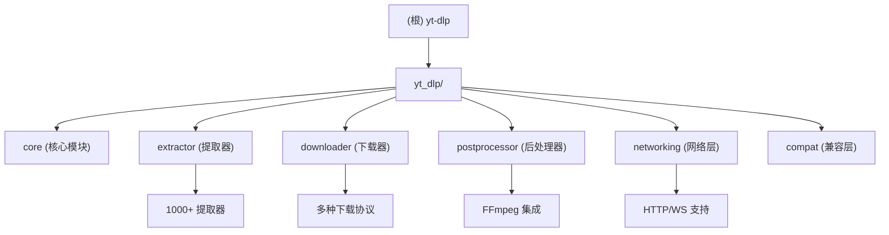

# yt-dlp 项目架构文档

## 项目愿景

yt-dlp 是一个功能丰富的命令行音视频下载器，支持数千个网站。它是 youtube-dl 的一个分支，基于现已停止维护的 youtube-dlc。项目致力于提供强大的媒体下载功能，具有广泛的网站支持、灵活的格式选择和丰富的后处理功能。

## 架构总览

### 技术栈
- **主要语言**: Python 3.10+
- **项目类型**: 命令行工具，Python 包
- **许可证**: The Unlicense
- **构建系统**: Hatchling
- **依赖管理**: pip, pyproject.toml

### 核心架构模式
yt-dlp 采用模块化、插件化的架构设计：



## 模块索引

| 模块路径 | 职责描述 | 入口文件 | 主要功能 |
|---------|---------|---------|---------|
| `yt_dlp/` | 核心模块 | `__init__.py`, `YoutubeDL.py` | 主程序逻辑、选项解析、API 接口 |
| `yt_dlp/extractor/` | 提取器模块 | `__init__.py`, `_extractors.py` | 1000+ 网站的媒体提取逻辑 |
| `yt_dlp/downloader/` | 下载器模块 | `__init__.py`, `common.py` | 多协议下载实现 (HTTP, HLS, DASH 等) |
| `yt_dlp/postprocessor/` | 后处理模块 | `__init__.py`, `ffmpeg.py` | FFmpeg 集成、格式转换、元数据处理 |
| `yt_dlp/networking/` | 网络模块 | `__init__.py`, `common.py` | HTTP 客户端、请求处理、代理支持 |
| `yt_dlp/compat/` | 兼容层 | `__init__.py`, `compat_utils.py` | Python 版本兼容性处理 |
| `test/` | 测试模块 | `__init__.py`, `helper.py` | 单元测试、集成测试 |
| `devscripts/` | 开发工具 | `__init__.py` | 开发脚本、构建工具 |
| `bundle/` | 打包工具 | `__init__.py`, `pyinstaller.py` | 应用打包和分发 |

## 运行与开发

### 安装与运行
```bash
# 从 PyPI 安装
pip install yt-dlp

# 从源码安装
pip install -e .

# 运行
yt-dlp [OPTIONS] URL
```

### 开发环境设置
```bash
# 安装开发依赖
pip install -e .[dev,test]

# 运行测试
pytest

# 代码格式化
autopep8 yt_dlp/
ruff check yt_dlp/

# 生成懒加载提取器
python -m devscripts.make_lazy_extractors
```

### 构建与打包
```bash
# 构建分发包
python -m build

# PyInstaller 打包
python -m devscripts.pyinstaller
```

## 测试策略

- **单元测试**: 使用 pytest，覆盖核心功能
- **集成测试**: 真实网站下载测试（需要网络）
- **离线测试**: 模拟环境的测试套件
- **性能测试**: 下载速度和内存使用测试

## 编码规范

- **Python 版本**: 最低支持 Python 3.10
- **代码风格**: 遵循 PEP 8，使用 autopep8 和 ruff 进行格式化
- **导入规范**: 使用 isort 进行导入排序
- **提交规范**: 使用 conventional commits 格式

## AI 使用指引

当开发 yt-dlp 时，AI 助手应该：

1. **保持向后兼容**: 任何修改都不应破坏现有的 API
2. **遵循命名约定**: 提取器以 `IE` 结尾，函数使用下划线命名
3. **考虑性能**: 避免不必要的网络请求和内存使用
4. **错误处理**: 提供清晰的错误信息和建议
5. **测试覆盖**: 为新功能编写相应的测试用例
6. **文档更新**: 更新相关的文档和注释

---

## 变更记录 (Changelog)

### 2025-11-19
- 初始化项目架构文档
- 创建模块索引和架构图
- 建立开发规范和 AI 使用指引
- **覆盖率**: 初始阶段 A 分析完成，核心模块识别完成